---
# Front matter
# Metainformació del document
title: "CERTIFICADO OFICIAL DE FORMACIÓN PEDAGÓGICA Y DIDÁCTICA PARA PROFESORADO TÉCNICO"
# author:
titlepage: true

# portada
titlepage-rule-height: 2
titlepage-rule-color: AA0000
titlepage-text-color: AA0000
titlepage-background: ../portades/U1.png

date: "21-10-2025"
subject: "Proxmox"
keywords: [Xarxa, Instal·lació]
subtitle: "Aprendizaje y enseñanza en la Formación Profesional"
lang: es
page-background: img/bg.png

colorlinks: true
linkcolor: "blue"

# configuració de l'índex
toc-own-page: true
toc-title: Continguts
toc-depth: 2

# capçalera i peu \thetitle
header-left: Aprendizaje y enseñanza en la Formación Profesional
header-right: Curso 2025-2026
footer-left: CEFIRE FP
footer-right: \thepage/\pageref{LastPage}

# Les figures que apareguen on les definim i centrades
float-placement-figure: H
caption-justification: centering 

# No volem numerar les linies de codi
listings-disable-line-numbers: true

# Configuracions dels paquets de latex
header-includes:

  #  imatges i subfigures
  - \usepackage{graphicx}
  - \usepackage{subfigure}
  - \usepackage{lastpage}

  #  - \usepackage{adjustbox}
  # marca d'aigua
  #- \usepackage{draftwatermark}
 # - \SetWatermarkText{\includegraphics{./img/Markdown.png}}
  #- \SetWatermarkText{Per revisar}
  #- \SetWatermarkScale{.5}
  #- \SetWatermarkAngle{20}
   
  # caixes d'avisos 
  - \usepackage{awesomebox}

  # text en columnes
  - \usepackage{multicol}
  - \setlength{\columnseprule}{1pt}
  - \setlength{\columnsep}{1em}

  # pàgines apaïsades
  - \usepackage{pdflscape}
  # caixes mdframed
  - \usepackage{mdframed}
  
  # per a permetre pandoc dins de blocs Latex
  - \newcommand{\hideFromPandoc}[1]{#1}
  - \hideFromPandoc {
      \let\Begin\begin
      \let\End\end
    }
 
# definició de les caixes d'avis
pandoc-latex-environment:
  noteblock: [note]
  tipblock: [tip]
  warningblock: [warning]
  cautionblock: [caution]
  importantblock: [important]
...

\vspace*{\fill}

\begin{mdframed}[linecolor=gray, linewidth=0.5pt, leftline=true, rightline=false, topline=false, bottomline=false]
{\scriptsize
\textbf{EDITA:} \\
Generalitat Valenciana \\
Conselleria d’Educació, Investigació, Cultura i Esport \\
Servei de Formació del Professorat \\
CEFIRE de Formació Professional \\[1em]
\textbf{COORDINACIÓN:} \\
Eva Ciscar Rovira \\
Pablo Moreno Meseguer \\
Fran Navarro García \\[1em]
\textbf{AUTORES VERSIÓN ORIGINAL:} \\
Francisco José de Juan Company \\
Manuela López Paco \\
Encarna Montesa Boix \\[1em]
\textbf{AUTORES REVISIÓN 22-23:} \\
Paula Jardón Giner \\
Almudena Adelaida Navas Saurin \\
Alicia Ros Garrido \\[1em]
\textbf{AUTORES REVISIÓN 25-26:} \\
Gemma Cerezo Gil\\
Alfredo Rafael Vicente Boix \\[1em]
\textbf{MAQUETACIÓN:} \\
Alfredo Rafael Vicente Boix \\[1em]
Este material ha sido elaborado bajo una licencia de \\
Reconocimiento-NoComercial-CompartirIgual 3.0 de Creative Commons. \\[0.5em]

\includegraphics[height=8mm,keepaspectratio]{img/cc.png} \\
El código fuente del documento se encuentra disponible en:
\url{https://github.com/arvicenteboix/mastercillo_fp}
}
\end{mdframed}

\newpage

# EL CURRÍCULO 

## PERSONAS COMPETENTES  

El término “competencia profesional” ha supuesto un cambio de paradigma en la formación profesional. Su éxito se basa en que las personas, en la medida en que somos proveedoras de servicios, trabajadoras o consumidoras, facilitamos o requerimos de servicios y profesionales competentes. También las empresas utilizan, comparten y entienden este concepto, porque es allí donde nació.  

¿Qué es la competencia profesional? ¿Cómo identificamos a una persona competente?  

A la hora de definir la competencia profesional hemos de ser conscientes de que se trata de un constructo social, y que por lo tanto no encontraremos una definición científica, sino que tendremos que obtenerla a partir de acuerdos. A continuación, se muestran algunas propuestas que, a lo largo de los últimos años, han buscado ese consenso: 

 Competencia es: 

 * Capacidad de usar el conocimiento y las destrezas relacionadas con productos y procesos y, por consiguiente, de actuar eficazmente para alcanzar un objetivo (Hates, 1985). 

 * Capacidad de actuar en papeles profesionales o en trabajos conforme el nivel requerido en el empleo (NVCQ, 1985). 

 * Conjunto de conocimientos, destrezas y actitudes necesarias para ejercer una profesión, resolver problemas profesionales de forma autónoma y flexible, y ser capaz de colaborar en el entorno profesional y la organización del trabajo (Bunk, 1994). 

 * Una persona es competente si posee los conocimientos, valores, habilidades y actitudes necesarios para el desempeño del trabajo de acuerdo con la norma apropiada (Mertens, 1998).  

* Aplicación de los conocimientos, capacidades y actitudes, que permite realizar las actividades y roles de trabajo a los niveles requeridos en la producción y el empleo, y solucionar los problemas derivados del cambio en las situaciones de trabajo (Rueda, 2002).  

* Capacidad efectiva para llevar a cabo exitosamente una actividad laboral plenamente identificada (OIT, 2004). 

En general, se pueden distinguir tres perspectivas principales: una primera que entiende la competencia como la capacidad de realizar tareas concretas de forma eficaz; una segunda centrada en los rasgos personales, como actitudes, valores o motivaciones; y una tercera, más integradora, que combina ambas visiones, entendiendo la competencia como la interacción entre saber, saber hacer y saber ser. 

Este predominio del enfoque técnico ha sido especialmente visible en el ámbito de la Formación Profesional en España. Desde la reforma de 1970, la terminología utilizada en los títulos oficiales ha recurrido sistemáticamente al término “Técnico”, como forma de destacar el carácter especializado y profesionalizador de esta formación (Técnico Auxiliar, Técnico Especialista, Técnico Superior…). Esta elección no solo reflejaba una orientación hacia las capacidades operativas, sino también un intento de dotar a la FP de mayor reconocimiento y prestigio. 

En este contexto histórico y formativo, la Ley Orgánica 3/2022, de 31 de marzo, que ordena e integra el sistema de Formación Profesional — derogando la Ley Orgánica 5/2002, de 19 de junio, de las Cualificaciones y de la Formación Profesional — introduce una definición más precisa y actualizada de las competencias. En su artículo 2, la ley distingue entre dos tipos fundamentales: la competencia básica y la competencia profesional, sentando así las bases conceptuales para el nuevo modelo formativo. 

Las competencias básicas son aquellas que son consideradas necesarias para la realización y desarrollo personal, para participar activamente en la sociedad o mejorar la empleabilidad. El desarrollo de estas competencias se realiza por múltiples vías, y queda incorporado en cualquier oferta de formación profesional en tanto que promueve el desarrollo integral de la persona. 

La Unión Europea ha definido 8 competencias básicas para la formación permanente, que toda persona tendría que dominar y que garantizan una mayor flexibilidad de la mano de obra para adaptarse más rápidamente a la evolución constante del mundo: 

* Comunicación en la lengua materna. 

* Comunicación en lenguas extranjeras. 

* Competencia matemática y competencias básicas en ciencia y tecnología. 

* Competencia digital. 

* Aprender a aprender. 

* Competencias interpersonales, interculturales y sociales, y competencia cívica. 

* Espíritu emprendedor. 

* Expresión cultural. 

Estas competencias básicas tienen las siguientes características: son conocimientos, capacidades, actitudes, valores y emociones que no pueden entenderse de manera separada; se concretan y desarrollan asociadas a los diferentes contextos de acción; se nutren de las actitudes, valores y compromisos que los sujetos van adoptando a lo largo de la vida; suponen un proceso permanente de reflexión para coordinar los objetivos con las posibilidades que ofrece cada situación; y se desarrollan, perfeccionan, amplían, o se deterioran y restringen a lo largo de la vida. 

Estas ocho competencias básicas se entrelazan entre sí, porque determinados aspectos esenciales en un ámbito apoyan la competencia en otro. Así, la competencia en las capacidades básicas fundamentales de la lengua, la lectura, la escritura, el cálculo y las tecnologías de la información y la comunicación constituyen el fundamento esencial para el aprendizaje, mientras que todas las actividades de aprendizaje se sustentan en la capacidad de aprender a aprender. A su vez, hay una serie de temas que intervienen en las ocho competencias básicas: el pensamiento crítico, la creatividad, la capacidad de iniciativa, la resolución de problemas, la evaluación del riesgo, la toma de decisiones y la gestión constructiva de los sentimientos. 

Constatamos, por lo tanto, que estas competencias básicas son la base del aprendizaje a lo largo de la vida, y están compartidas por todos los sistemas de formación en todas las etapas. Sin embargo, además de éstas, la Formación Profesional presenta una característica fundamental que lo hace diferente a las demás: tiene que preparar a las personas para ser profesionalmente competentes, y hacer que la puesta en práctica de estas competencias le permita ganarse la vida. 

Y en cuanto a la Competencia profesional, viene definida en Ley Orgánica 3/2022, de 31 de marzo, de ordenación e integración de la Formación Profesional, como el conjunto de conocimientos y destrezas que permiten el ejercicio de la actividad profesional conforme a las exigencias de la producción y el empleo. Las competencias profesionales se recogen en los estándares de competencia profesional, que servirán para el diseño de cualquier oferta de formación profesional. 

En la misma Ley Orgánica 3/2022, de 31 de marzo, de ordenación e integración de la Formación Profesional, se define Cualificación como: la competencia para el desempeño de una actividad profesional acreditada oficialmente por títulos, certificados o acreditaciones. Exclusivamente en su uso en lo referido al Marco Español de las Cualificaciones (MECU), cualquier título o certificado emitido por una institución educativa que acredita haber adquirido un conjunto de resultados del aprendizaje, después de haber superado satisfactoriamente un programa de formación en una institución legalmente reconocida en el ámbito del Sistema de Formación Profesional. 

Sobre esta base, la Ley Orgánica 3/2022, de 31 de marzo, marca un cambio estructural importante. Su objetivo es crear un sistema unificado de Formación Profesional, superando la tradicional división entre la formación del sistema educativo y la formación para el empleo. La ley propone un modelo único, más flexible, dinámico y centrado en las competencias profesionales reales, que responda a las demandas de los sectores productivos y al desarrollo personal y profesional de las personas a lo largo de toda su vida. 

Dentro de este nuevo modelo de Formación Profesional, adquiere una relevancia especial el reconocimiento de las competencias adquiridas a través de la experiencia laboral o de procesos formativos no formales e informales. Este reconocimiento permite validar los aprendizajes obtenidos fuera del sistema educativo reglado, ampliando las oportunidades de cualificación y favoreciendo una visión más abierta e inclusiva del aprendizaje a lo largo de la vida. 

Este principio se desarrolla con mayor claridad en el Real Decreto 69/2025, de 4 de febrero, que regula los elementos estructurales y los instrumentos de gestión del Sistema Nacional de Formación Profesional. Entre ellos, se destaca la incorporación de los estándares de competencia profesional, definidos por el Instituto Nacional de las Cualificaciones (INCUAL). Estos estándares actúan como referentes comunes para la formación y la evaluación, ya que establecen, de forma precisa y objetiva, los conocimientos, habilidades y desempeños requeridos para ejercer con eficacia una determinada actividad profesional, conforme a las exigencias de calidad del entorno productivo y sirven como referencia para: 

Diseñar los títulos y certificados profesionales. 

Evaluar y reconocer oficialmente las competencias adquiridas por experiencia laboral. 

Alinear la formación con las necesidades reales del tejido productivo. 

Así pues, la Formación Profesional se convierte en un sistema más coherente, orientado a resultados concretos, y capaz de responder con rapidez a las transformaciones del mundo laboral. 

## EL CATÁLOGO NACIONAL DE ESTÁNDARES DE COMPETENCIAS PROFESIONALES  

El Catálogo Nacional de Estándares de Competencias Profesionales, nueva denominación que recibe el Catálogo Nacional de Cualificaciones Profesionales (CNCP), es el instrumento del Sistema Nacional de Formación Profesional que ordena los estándares de competencias profesionales identificados en el sistema productivo, en función de las competencias apropiadas y el estándar de calidad requerido para el ejercicio profesional, susceptibles de reconocimiento y acreditación. 

A este catálogo se le atribuyen las siguientes funciones:  

a) Identificará, clasificará y ordenará las competencias propias del mercado laboral significativas para la economía productiva con validez en todo el territorio nacional. El catálogo podrá, asimismo, recoger aquellos perfiles profesionales que, por su específico valor cultural o patrimonial, requieran una especial protección. 

b) Operará como referencia obligada para la acreditación de competencias profesionales adquiridas por experiencia laboral u otras vías no formales o informales. 

c) Proporcionará la base para el diseño de los módulos profesionales y la creación de ofertas de formación profesional, basadas en itinerarios, acumulables y acreditables a lo largo de la vida, así como para la movilidad en un mercado de trabajo internacional sobre la base de transparencia y, en su caso, equivalencia de marcos comunes entre los diferentes sistemas nacionales de formación profesional de la Unión Europea. 

El Catálogo comprende las Cualificaciones profesionales más significativas del sistema productivo español, organizadas en familias profesionales y niveles. Constituye la base para elaborar la oferta formativa de los Títulos y los Certificados de Profesionalidad. El Catálogo incluye el contenido de la formación profesional asociada a cada cualificación, de acuerdo con una estructura de módulos formativos articulados. Tiene validez en todo el territorio nacional y ordena las cualificaciones profesionales susceptibles de reconocimiento y evaluación en el sistema productivo. 

El contenido del Catálogo Nacional de Estándares de Competencias Profesionales se organizará en estándares de competencia, por niveles y familias profesionales con sus respectivos indicadores de calidad en el desempeño, con arreglo a las siguientes reglas: 

a) Los niveles 1, 2 y 3 asignados a cada estándar de competencia seguirán según criterios acordes con los comúnmente establecidos a escala europea, relativos a conocimientos, iniciativa, autonomía, responsabilidad y complejidad de las tareas. 

b) Las familias profesionales se definirán, a efectos orientativos y de organización del sistema, atendiendo a criterios de afinidad de la competencia profesional, pudiendo un estándar de competencia vincularse a más de una familia profesional. 

c) Los estándares de competencia constituyen la unidad básica para el diseño de la formación y para la acreditación de competencias profesionales adquiridas por experiencia laboral u otras vías no formales o informales. 

d) Los estándares de competencia se componen de elementos de competencia, que identifican las realizaciones profesionales incluidas en ellos. 

e) Los estándares de competencia podrán tener, excepcionalmente, carácter transversal, cuando se refieran a competencias no asociadas a una o varias familias profesionales específicas, sino a múltiples desempeños profesionales. 

 

Junto al Catálogo Nacional de Estándares de Competencias Profesionales, el Catálogo Modular de Formación Profesional es otro de los instrumentos del Sistema Nacional de Formación Profesional que ordena los módulos profesionales de formación profesional asociados a cada uno de los estándares de competencias profesionales. Se le atribuyen las siguientes funciones: 

a) Determinará los módulos profesionales vinculados a cada uno de los estándares de competencias profesionales recogidos en el Catálogo Nacional de Estándares de Competencias Profesionales. 

b) Operará como referencia obligada para el diseño de las ofertas del Catálogo Nacional de Ofertas de Formación Profesional. 

Estructura básica de un Estándar de Competencia Profesional (ECP): 

1. Datos de identificación 

    * Incluye: 
    * Nombre oficial del estándar 
    * Familia profesional a la que pertenece 
    * Nivel de cualificación (1, 2 o 3) 
    * Código alfanumérico único 

2. Competencia profesional 
 Es una descripción general del conjunto de conocimientos, destrezas y actitudes necesarias para ejercer una actividad profesional de manera eficaz y conforme a las exigencias del mercado laboral. 

3. Elementos de la competencia (EC) 
 Son las realizaciones profesionales específicas que debe llevar a cabo una persona en su puesto de trabajo. 

Cada elemento va acompañado de indicadores de calidad (IC), que establecen el nivel de ejecución esperado. 

4. Contexto profesional 
 Describe el entorno en el que se aplica la competencia, incluyendo: 
    
    * Sectores productivos y ocupaciones relacionadas 
    * Equipos, herramientas, materiales, procedimientos y documentación usados 
    * Condiciones y características del entorno de trabajo 

El nuevo Catálogo Nacional de Estándares de Competencias Profesionales (denominado anteriormente Catálogo Nacional de Cualificaciones Profesionales), se estructura en 26 Familias Profesionales. 

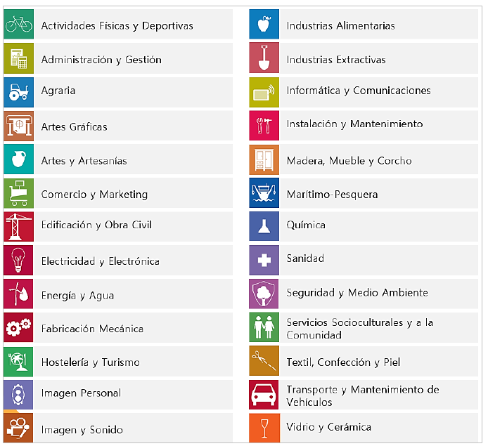{width="300px"}

Una familia profesional es un grupo que reúne varias cualificaciones o especialidades profesionales que tienen competencias parecidas o están relacionadas. 

Características que diferencian a una familia profesional: 
Competencias similares: 

- Las profesiones que forman parte de una misma familia tienen habilidades y conocimientos parecidos que se usan en trabajos relacionados. 

Sector o tipo de trabajo: 

- Cada familia está asociada a un área o sector concreto. Por ejemplo, la familia de Informática y Comunicaciones incluye trabajos relacionados con ordenadores, software y redes, mientras que la familia de Servicios Socioculturales agrupa profesiones relacionadas con la atención social o la educación. 

Organización de la formación: 

- Las familias profesionales ayudan a organizar la formación y los títulos oficiales, así como a definir qué competencias debe tener cada persona para su trabajo. 

Facilita la movilidad y el reconocimiento: 

- Al agrupar trabajos parecidos, las personas pueden cambiar de especialidad o mejorar sus competencias dentro de la misma familia. También facilita que se reconozcan oficialmente las habilidades adquiridas en el trabajo o por otras vías. 

Diversidad de niveles: 

- Dentro de una familia profesional hay cualificaciones con distintos grados de dificultad o responsabilidad, desde niveles básicos hasta avanzados que se corresponden con niveles asignados a cada estándar de competencia. 

Las familias profesionales son comunes a la ordenación del Sistema Educativo y del Sistema de Formación de la Administración Laboral, y se relacionan con la Clasificación Nacional de Ocupaciones (CNO) y con la Clasificación Nacional de Actividades Económicas (CNAE). 

Junto al Catálogo Nacional de Estándares de Competencias, el Catálogo Modular de Formación Profesional es otro de los instrumentos del Sistema Nacional de Formación Profesional que ordena los módulos profesionales de formación profesional asociados a cada uno de los estándares de competencias profesionales. Se le atribuyen las siguientes funciones: 

a) Determinará los módulos profesionales vinculados a cada uno de los estándares de competencias profesionales recogidos en el Catálogo Nacional de Estándares de Competencias Profesionales. 

b) Operará como referencia obligada para el diseño de las ofertas del Catálogo Nacional de Ofertas de Formación Profesional. 

El contenido del Catálogo Modular de Formación Profesional se organizará respetando los niveles y las familias profesionales de los estándares de competencia profesional con sus respectivos indicadores de calidad en el desempeño y favoreciendo la transparencia de la vinculación directa entre cada estándar de competencia profesional y la formación asociada, agregada en un módulo profesional. 

Los módulos profesionales permitirán, por su diseño, identificar la formación vinculada a cada elemento del estándar de competencia y deberán detallar, al menos: 

a) Los resultados de aprendizaje vinculados a los elementos de cada estándar de competencia profesional. 

b) Los criterios de evaluación 

Un módulo profesional es una unidad formativa que forma parte de un título de Formación Profesional. Está vinculado a uno o varios estándares de competencia profesional y su finalidad es que el alumnado adquiera las competencias necesarias para desarrollar una actividad profesional de forma eficaz. 

Relacionar un módulo profesional de un título de Formación Profesional con un módulo de un certificado profesional es totalmente posible, ya que ambos se articulan sobre la misma base: los estándares de competencia profesional, definidos en el Catálogo Nacional de Estándares de Competencia Profesional (que sustituye al antiguo CNCP). 

Tabla comparativa: Módulo de título vs. módulo de certificado 

| Elemento      | Módulo de un título de FP                                      | Módulo de un certificado profesional                                  |
|---------------|-----------------------------------------------------------------|------------------------------------------------------------------------|
| Finalidad     | Formación integral (educativa y profesional)                   | Cualificación laboral específica                                      |
| Marco normativo | Título de FP (RD correspondiente)                             | Certificado profesional (RD o resolución correspondiente)             |
| Vinculación   | Uno o varios estándares de competencia profesional             | Uno o varios estándares de competencia profesional                    |
| Duración      | Variable, suele ser más extensa                                | Adaptada a la unidad de competencia asociada (más breve)              |
| Contexto      | Centros de FP, con formación académica estructurada            | Formación para el empleo (servicios públicos o centros acreditados)   |
| Evaluación    | Continua, académica y basada en resultados de aprendizaje      | Basada en criterios de evaluación del estándar de competencia         |

## DE LA CUALIFICACIÓN PROFESIONAL A LA OFERTA FORMATIVA 

Según lo establecido en la Ley Orgánica 3/2022, de 31 de marzo, y desarrollado en el Real Decreto 659/2023, de 18 de julio, que regula la ordenación del nuevo Sistema Unificado de Formación Profesional en España, la oferta formativa se estructura en cinco grados, según el nivel de complejidad y especialización de las competencias adquiridas: 

* Grado A: Acreditación parcial de competencia 
* Grado B: Certificado de competencia 
* Grado C: Certificado profesional 
* Grado D: Ciclos formativos de grado básico, medio o superior 
* Grado E: Cursos de especialización (de grado medio o superior) 

La organización de los contenidos formativos varía en función del grado: 

* Las formaciones de Grado A se componen de bloques formativos más pequeños que un módulo profesional, diseñados para adquirir o acreditar partes concretas de un estándar de competencia profesional. 
* En los Grados B, C, D y E, la formación se estructura en módulos profesionales de duración variable, basados en estándares completos de competencia profesional, de acuerdo con el marco común establecido por el Sistema de Formación Profesional, que unifica la formación del sistema educativo y la formación para el empleo. 

:::note
Pudéis encontrar más información sobre la Formación Profesional en la web oficial:

[Inicio - TodoFP | Ministerio de Educación, Formación Profesional y Deportes](https://www.todofp.es/inicio.html) 
:::

## ACREDITACIÓN PARCIAL ACUMULABLE

La evaluación y acreditación de competencias profesionales es un proceso mediante el cual se otorga una acreditación oficial, a la persona candidata, previa evaluación de las competencias profesionales adquiridas por la experiencia laboral y vías no formales de formación. 

El Real Decreto 1224/2009, de 17 de julio, de reconocimiento de las competencias profesionales adquiridas por experiencia laboral, determina el procedimiento único, tanto para el ámbito educativo como para el laboral, para la evaluación y acreditación de las competencias profesionales adquiridas a través de la experiencia laboral o de vías no formales de formación, del que trata el artículo 8.2 de la Ley Orgánica 5/2002, de 19 de junio, de las Cualificaciones y de la Formación Profesional. Este Real Decreto conlleva la realización de convocatorias por las Administraciones competentes para evaluar y en su caso, acreditar la competencia profesional de los candidatos que deseen verla reconocida. 

Las personas que participen en las convocatorias podrán ver acreditadas unidades de competencia que constituyen una parte de un título de Formación Profesional o de un Certificado de Profesionalidad. Al finalizar el procedimiento, la comisión de evaluación pertinente les indicará la formación complementaria que el participante tiene que cursar, si desea continuar con su formación, para poder obtener el título de Formación Profesional o el Certificado de Profesionalidad. 

Una Acreditación Parcial Acumulable es la certificación oficial de una Unidad de Competencia. Puede obtenerse al superar los módulos formativos (de los Certificados de Profesionalidad), los módulos profesionales (de los Títulos), o al finalizar de forma positiva el Procedimiento de evaluación y acreditación de la competencia adquirida a través de la experiencia laboral y del aprendizaje informal (EVA). 

La unidad de medida del “tamaño” de una cualificación es el “crédito europeo”, que representa la cantidad de trabajo que tiene que realizar un aprendiz, para conseguir los resultados de aprendizaje. Forma parte del lenguaje académico, especialmente el universitario, y en él se integran las enseñanzas teóricas y prácticas, actividades académicas dirigidas, horas de estudio, de trabajo y de evaluación. 

En el Espacio Europeo de Enseñanza Superior, que regula el llamado proceso de Bolonia, esta unidad de medida es la que utilizan todas las instituciones de enseñanza Superior, formando parte del European Credit Transfer System (ECTS). En la Formación Profesional, que sigue con cierto retraso a la superior, a través del Proceso de Copenhague, se denomina European Credit System for Vocational Education and Training (ECVET). 

# NIVELES DE CONCRECIÓN EN LA FORMACIÓN PROFESIONAL: DEL MARCO NORMATIVO A LA PROGRAMACIÓN DE AULA  

Para elaborar una programación de aula coherente y ajustada al marco legal, es fundamental que el docente consulte toda la normativa vinculada al módulo profesional que va a impartir. Esta normativa se organiza en diferentes niveles de concreción —desde el marco legal general hasta los documentos específicos del centro educativo— y está elaborada por distintos organismos: el Estado, las comunidades autónomas y el propio centro. Conocer y manejar adecuadamente estos documentos garantiza que la programación responda a los principios del sistema de Formación Profesional, a las necesidades del alumnado y a las exigencias del entorno profesional. 

Este proceso de concreción normativa puede parecer complejo, pero sigue una lógica clara: parte de los principios y objetivos establecidos en la ley, y va descendiendo por distintos niveles hasta llegar a la realidad del aula, donde el profesorado da forma a las enseñanzas mediante su programación. 

1. **Elaboración del marco legal **

Responsable: Gobierno del Estado (Cortes Generales) 

El punto de partida es la Ley Orgánica 3/2022, de 31 de marzo, que establece los principios, objetivos y estructura del nuevo sistema de Formación Profesional. Define elementos clave como los grados de formación, los estándares de competencia profesional, la colaboración con los sectores productivos y el enfoque de aprendizaje a lo largo de la vida. 

2. **Desarrollo normativo y regulación técnica **

Responsable: Ministerio de Educación y Formación Profesional 

Tras la aprobación de la ley, el Ministerio desarrolla su contenido mediante reales decretos y órdenes ministeriales. Destacan especialmente: 

* Real Decreto 659/2023, que regula la ordenación general del sistema de FP. 

* Real Decreto 69/2025, que define los instrumentos de gestión, como los estándares de competencia, la acreditación de competencias y los procedimientos de evaluación. 

En esta fase también interviene el Instituto Nacional de las Cualificaciones (INCUAL), encargado de elaborar los estándares de competencia profesional que servirán de base para los títulos y certificados. 

3. **Diseño del catálogo de títulos y certificados **

Responsable: Ministerio de Educación y FP, en colaboración con las CCAA y agentes sectoriales 

A partir de los estándares de competencia definidos por el INCUAL, el Ministerio diseña y aprueba los títulos de Formación Profesional y los certificados profesionales. Este proceso se realiza en diálogo con las comunidades autónomas y los sectores productivos. 

Cada título recoge: 

* Los módulos profesionales que lo componen 

* Los resultados de aprendizaje y los criterios de evaluación 

* La duración y estructura formativa del ciclo 

4. **Desarrollo del currículo oficial **

Responsable: Comunidades Autónomas 

Con el título aprobado, cada comunidad autónoma desarrolla su propio currículo oficial, adaptado a su contexto territorial. Este documento concreto: 

* Los resultados de aprendizaje por módulo 

* Los contenidos y criterios de evaluación 

* Las orientaciones metodológicas 

* La organización temporal y horaria 

5. **Concreción en el centro educativo **

Responsable: Equipo directivo y profesorado del centro 

Cada centro adapta el currículo oficial a su realidad concreta mediante: 

* El proyecto educativo de centro (PEC) 

* El proyecto curricular del ciclo formativo 

* La organización y planificación de espacios, módulos y recursos 

Este trabajo es coordinado por el equipo directivo junto con los departamentos didácticos o equipos de ciclo, teniendo en cuenta las características del alumnado, el entorno socioeconómico y las posibilidades de colaboración con empresas. 

6. **Programación de aula **

Responsable: Docente del módulo profesional 

En el último nivel, cada docente es responsable de elaborar su programación didáctica de aula, que traduce el currículo en actividades concretas de enseñanza y aprendizaje. Esta programación debe alinearse con las decisiones tomadas en el centro y reflejar: 

- Las situaciones de aprendizaje 
- La secuenciación de contenidos 
- Las metodologías activas y estrategias didácticas 
- Los instrumentos de evaluación y criterios de calificación 
- Las medidas de atención a la diversidad 
- La incorporación de la digitalización, la sostenibilidad y el trabajo colaborativo con el entorno productivo 

 
| NIVEL | DOCUMENTO / FASE                                                                                     | RESPONSABLE                                                   |
|-------|------------------------------------------------------------------------------------------------------|--------------------------------------------------------------|
| 1     | Ley Orgánica 3/2022, de 31 de marzo                                                                 | Gobierno del Estado / Cortes Generales                      |
| 2     | Desarrollo normativo y técnico (RD 659/2023, RD 69/2025, etc.)                                      | Ministerio de Educación y FP + INCUAL                       |
| 3     | Catálogo de títulos y certificados                                                                  | Ministerio + Comunidades Autónomas + agentes sectoriales    |
| 4     | Currículo oficial autonómico Orden de Evaluación Resoluciones anuales con instrucciones de inicio de curso | Comunidades Autónomas                                       |
| 5     | PEC Proyecto curricular de ciclo formativo                                                      | Equipo directivo + Equipos docentes del centro              |
| 6     | Programación didáctica Unidades de programación                                                 | Docente del módulo profesional                               |

 
La Formación Profesional es un sistema complejo que requiere ordenar y adaptar la normativa y el currículo para que sean útiles y aplicables en la práctica educativa. Para ello, resulta fundamental agrupar todo el proceso en tres niveles de concreción curricular que reflejan el grado de detalle y la responsabilidad de quienes intervienen: 

Currículo base: Este primer nivel recoge la normativa general y oficial, elaborada por las administraciones educativas a nivel estatal y autonómico. Aquí se definen los objetivos, contenidos, resultados de aprendizaje y criterios de evaluación mínimos que garantizan una formación común y de calidad en todo el país. Esta base ofrece un marco claro y homogéneo que orienta el diseño y desarrollo de los títulos y certificados de FP. 

Currículo de centro: El segundo nivel responde a la necesidad de adaptar el currículo base a las características específicas del centro educativo y su contexto. En este nivel, el equipo directivo y los docentes ajustan la organización, los tiempos y recursos disponibles, así como las características del alumnado, para hacer viable y pertinente la formación. Esta adaptación permite responder a la diversidad y singularidades de cada centro y su entorno. 

Programación de aula: Finalmente, el tercer nivel es donde la docente concreta, de manera personalizada, el desarrollo diario de su módulo profesional. Aquí se planifican las actividades, metodologías, criterios de evaluación y recursos específicos para el grupo de estudiantes que tiene asignado. Es el nivel más cercano a la práctica educativa y a las necesidades reales de los alumnos, y donde se materializa el aprendizaje. 

 
# NIVELES DE CONCRECIÓN CURRICULAR

| Nivel de Concreción | Ámbito       | Documentos                                                                 |
|----------------------|-------------|----------------------------------------------------------------------------|
| **1º Nivel**        | **Estatal** | Ley Orgánica 3/2020, de 29 de septiembre Ley Orgánica 3/2022, de 31 de marzo Real Decreto 659/2023, de 18 de julio Real Decreto de Título |
|                      | **Autonómico** | Decreto 114/2025, de 29 de julio Decreto 117/2025, de 5 de agosto Orden 8/2025, de 22 de abril Instrucciones anuales de inicio de curso |
| **2º Nivel**        | **Centro**  | Instituto de Educación Secundaria: Proyecto Educativo de Centro Centro Integrado de Formación Profesional: Proyecto Funcional de Centro, Plan de Actuación |
| **3º Nivel**        | **Profesorado** | Proyecto Curricular de ciclo formativo Programación didáctica Programación de aula |
 

:::note
Podéis encontrar más información sobre la Formación Profesional en la web oficial de la Generalitat Valenciana:

[Ordenación académica y Planificación - Formación Profesional - Generalitat](https://ceice.gva.es/es/web/formacion-profesional/ordenacio-academica-i-planificacio)
:::
 
## SEGUNDO NIVEL DE CONCRECIÓN CURRICULAR 

En este apartado se desarrollan brevemente los documentos básicos correspondientes al segundo nivel de concreción curricular: el centro que imparte la formación. Así, diferenciaremos entre los centros que imparten formación profesional, por una parte, los centros de secundaria y, por otra, los centros integrados de formación profesional. 

* Institutos de Secundaria, en los que convive con las etapas de Educación Secundaria Obligatoria y Bachillerato. 

* Centros Integrados de Formación Profesional, con una organización particular, en los cuales se imparten las distintas ofertas de formación para el Empleo: inicial, ocupacional o continua. Las ofertas propias de cada una son los Títulos (de formación básica, Ciclos Formativos de grado medio o superior), Certificados de Profesionalidad, y otras especialidades vinculadas o no al Catálogo Nacional de Cualificaciones. 

En el caso de impartirse en un Centro de Secundaria, este nivel de concreción curricular tiene la forma de Proyecto Educativo de Centro. 

Este documento estratégico es elaborado por el Equipo Directivo y aprobado por el Consejo Escolar. Tiene una vocación de estabilidad, para varios años, e incluye todos los elementos que permiten caracterizar el contexto escolar, y elaborar un proyecto curricular de etapa. Incluye, entre otros aspectos: 

a) Los objetivos y las prioridades de actuación del centro. 

b) Las características del entorno social y cultural del centro. 

c) Las líneas y los criterios básicos que tienen que orientar el establecimiento de medidas a medio y largo plazo para: 

    1. La organización y el funcionamiento del centro. 

    2. La participación de los diferentes estamentos de la comunidad educativa y las formas de colaboración entre estos. 

    3. La cooperación entre las familias o los representantes legales del alumnado y el centro. 

    4. La coordinación con los servicios del municipio, las relaciones con instituciones públicas y privadas para la mejor consecución de las finalidades establecidas, así como la posible utilización de las instalaciones del centro por parte de otras entidades para realizar actividades educativas, culturales, deportivas u otras de carácter social. 

    5. La coordinación y la transición entre niveles y etapas. 

    6. La atención a la diversidad del alumnado. 

    7. La acción tutorial y la orientación académica y profesional. 

    8. La promoción de la equidad y la inclusión educativa del alumnado. 

    9. La promoción de la igualdad y la convivencia. 

    10. La promoción y el buen uso de las tecnologías de la información y las comunicaciones. 

d) La concreción de los currículos establecidos por la Administración educativa para las diferentes enseñanzas impartidas en el centro. 

e) El proyecto lingüístico de centro. 

f) Los diferentes planes y programas establecidos por la Administración educativa. 

g) Otros aspectos que determine la Administración educativa en el ámbito de sus competencias. 

En el caso de Centros Integrados, el Proyecto Funcional del Centro recoge las directrices que emanan de estos dos documentos, describe las condiciones del contexto, tanto de forma territorial como sectorial, y fija los elementos esenciales que deben orientar la actuación estratégica del Centro en los próximos años. Especificará, entre otros, los siguientes elementos8: 

a) Las directrices del consejo social en las que se basa. 

b) Los objetivos, procedimientos e indicadores de evaluación del proyecto. 

c) El plan de actuación del centro integrado. 

d) El plan de acción tutorial. 

e) El plan de información y orientación educativa y profesional. 

f) El reglamento de régimen interno. 

g) El plan de igualdad y convivencia. 

h) El plan de autoprotección y medidas de emergencia. 

i) Cualesquiera otros planes y proyectos, procedimientos de gestión basados en procesos de mejora continua y criterios organizativos y de participación que deban regir la vida del centro. 

Al igual que el Proyecto Educativo, el Proyecto Funcional es habitualmente elaborado por el Equipo Directivo o por algún grupo representativo del Consejo Social, y es aprobado por este último. 

Junto a los dos documentos anteriormente mencionados, existen dos documentos más relacionados directamente con el desarrollo curricular: la Programación General Anual (PGA) en el caso de los Institutos de secundaria; y el Plan de Actuación en el caso de los Centros Integrados de Formación Profesional. 

En el caso de la Programación General Anual (PGA) incluirá, por lo menos, los aspectos siguientes: 

a) Información de carácter administrativo, a través de la aplicación que determine la Conselleria competente en materia de educación. 

b) Plan de actuación para la mejora. 

Así, el Plan de actuación para la mejora es considerado como la parte pedagógica de la PGA, es el documento en el que se concreta la intervención educativa que se llevará a cabo en el centro educativo y en su entorno durante un curso escolar. 

El PAM tiene las finalidades siguientes: incrementar el porcentaje de alumnado que consigue los objetivos y las competencias educativas correspondientes, reducir el absentismo escolar, mejorar la competencia emocional y las habilidades de interacción social del alumnado para conseguir una integración socioeducativa más elevada y desarrollar acciones para prevenir y compensar las desigualdades en educación desde una perspectiva inclusiva. 

El PAM deberá contener, por lo menos, los elementos siguientes: 

a) Descripción de las intervenciones educativas que se desarrollarán para atender a la diversidad del alumnado desde una perspectiva inclusiva. 

b) La actualización de los diferentes planes y programas desarrollados por el centro, con una mención especial al plan de igualdad y convivencia. 

c) Criterios y procedimientos previstos para el seguimiento y la evaluación del propio PAM. 

Por su parte, el Plan de Actuación de los Centros Integrados de Formación profesional, deberá incorporar: 

a) Las actividades y servicios que prestará el centro, los objetivos que se persiguen, las directrices para lograr los objetivos propuestos y los procedimientos a desarrollar, así como los indicadores para valorar el cumplimiento de objetivos en los diferentes procedimientos. 

b) Los planes de cada uno de los órganos de coordinación constituidos en el centro, en los que se registrarán, asimismo, los objetivos perseguidos, las actividades a desarrollar, los recursos humanos y materiales previstos para ello, el presupuesto y los procedimientos de gestión, así como los mecanismos de evaluación y demás aspectos requeridos en proceso de mejora continua. 

c) La concreción curricular dentro de los proyectos educativos de cada ciclo, el proyecto socioeducativo de cada programa formativo de cualificación básica y el proyecto de cada acción formativa de Formación Profesional para el empleo. 

d) Las programaciones didácticas de cada uno de los módulos profesionales del conjunto de la oferta formativa. 

e) Las estrategias de información y orientación profesional que vinculen la formación recibida con la inserción laboral y con los mecanismos de acreditación de las acciones formativas. 

f) La memoria económica y el presupuesto anual del centro. 

g) El calendario de actividades formativas para cada una de las enseñanzas. 

h) El horario de actividades lectivas y no lectivas organizadas en el centro. 

i) Cuantos otros proyectos y planes pretendan desarrollar el centro.  

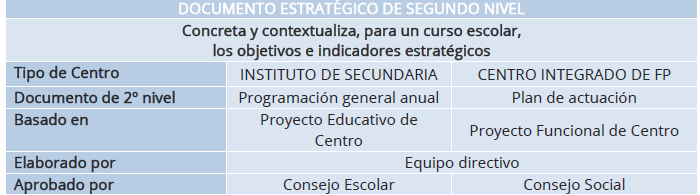{width="300px"}
 
El punto de partida del Plan de actuación es el Proyecto Funcional, donde se definen las características fundamentales del contexto y las principales líneas estratégicas. Dentro de los elementos del contexto, en el caso de Formación Profesional no sólo deben contemplarse los relacionados particulares de esta oferta, el Centro no sólo acoge alumnado del barrio o del contexto próximo, sino que se inscriben en él personas jóvenes o adultas con interés particular en una determinada familia profesional o ciclo formativo. La incorporación de la oferta en horario nocturno o en modalidad semipresencial acentúan esta visión amplia de la territorialidad, y la de unos usuarios que no sólo provienen del sistema educativo y están en formación inicial, sino que son cada vez más adultos, con experiencia laboral previa, y con intereses diversos. 

El segundo elemento del contexto que diferencia esta formación del resto es el componente sectorial, y de vinculación con la empresa. Como hemos visto anteriormente, las competencias evolucionan con rapidez, y es preciso atender a las tendencias comunes a todas las familias profesionales, y las propias del campo ocupacional, para adaptar el currículo anual de forma de que se incremente la empleabilidad del alumnado y sus posibilidades de inserción.  

## DE LOS DOCUMENTOS DEL CENTRO A LA PROGRAMACIÓN DE MÓDULO 

Una vez ubicados en el centro donde se impartirá la formación, ya sea un Instituto de Educación Secundaria (IES) o un Centro Integrado de Formación Profesional (CIPFP), es imprescindible elaborar el Proyecto Curricular del Ciclo Formativo. Para elaborar este documento la Dirección General de Formación Profesional ha publicado una guía que proporciona pautas claras para la elaboración del PCCF y la programación didáctica por competencias, tal y como establece la nueva Ley de Formación Profesional.  

La guía publicada por la Dirección General de Formación Profesional es una referencia esencial para la elaboración del Proyecto Curricular del Ciclo Formativo (PCCF) y la programación didáctica por competencias, conforme a lo establecido en la nueva Ley de Formación Profesional. Este documento proporciona pautas claras y detalladas que facilitan la adaptación del currículo oficial a las características específicas del centro, del alumnado y del entorno socio-productivo. 

Su elaboración implica un trabajo conjunto del equipo docente, que permite consensuar decisiones metodológicas, organizativas y evaluativas. A través de este proceso, se establece un marco común que orienta la programación docente y garantiza la adquisición de las competencias profesionales previstas, en coherencia con las finalidades educativas y el Proyecto Educativo del Centro (PEC). 

El Proyecto Curricular del Ciclo Formativo (PCCF) es un documento clave que se elabora por cada ciclo y centro, con independencia de la modalidad u horario en que se imparta. Su finalidad es concretar y contextualizar el currículo oficial, ajustándolo a las características del entorno socioeconómico, cultural y productivo del centro. Para ello, incluye la identificación del ciclo formativo y el marco normativo que lo regula, así como una adaptación de las competencias profesionales del título al contexto en el que se desarrolla la formación. 

El PCCF define de forma coordinada la contribución de cada módulo al desarrollo de las competencias profesionales del ciclo y a las competencias clave para la empleabilidad, promoviendo un enfoque integrador e intermodular. También recoge los enfoques didácticos y metodológicos acordados por el equipo docente, junto con la organización y distribución de los módulos profesionales a lo largo del curso. 

En lo relativo a la evaluación, establece criterios comunes para su organización, comunicación y desarrollo, así como los procedimientos para evaluar tanto al alumnado como al profesorado y al propio PCCF. Además, contempla orientaciones para la atención a la diversidad y la inclusión educativa. 

El documento incorpora una base de datos con las empresas u organismos que colaboran con el centro en la formación en empresa, y define los criterios de asignación del alumnado. También establece los criterios para la elaboración de los Planes Formativos Individuales, esenciales en la FE y en el módulo de proyecto. Este último cuenta además con criterios específicos para su organización, recogidos dentro del PCCF. 

Se incluyen, igualmente, orientaciones para adaptar los módulos de Digitalización Aplicada y Sostenibilidad a las particularidades del perfil profesional del ciclo, garantizando así su contextualización. Junto a ello, el PCCF contempla el plan de tutoría y orientación profesional, la concreción de los planes y programas institucionales vinculados al currículo, y orientaciones para el uso pedagógico de los espacios, medios y equipamientos disponibles en el centro. 

Finalmente, se recogen los criterios para la planificación de actividades complementarias y extraescolares, con el fin de enriquecer el proceso formativo más allá del aula.  

En su conjunto, el PCCF se convierte en un marco compartido de referencia para el trabajo docente, asegurando coherencia pedagógica, coordinación y adaptación a la realidad del entorno educativo y productivo. 

Una vez definido el PCCF, el siguiente paso corresponde a la elaboración de las programaciones didácticas. Estas constituyen el documento pedagógico en el que se planifica el desarrollo de cada módulo profesional, a partir del marco establecido en el PCCF. Deben ser elaboradas por el docente o el equipo docente responsable de impartir el módulo, y serán comunes y consensuadas para todos los grupos, independientemente de la modalidad u horario en que se impartan. 

En la programación didáctica se detallan los contenidos del módulo, la secuencia temporal de los mismos, los resultados de aprendizaje, los criterios de evaluación, los enfoques metodológicos, las actividades formativas, así como las evidencias de aprendizaje que deberá generar el alumnado para demostrar su progreso. Asimismo, se concretan los instrumentos de evaluación que se utilizarán para valorar dichas evidencias, garantizando la objetividad, coherencia y transparencia del proceso evaluador. 

De esta manera, la programación didáctica establece una base común para todo el profesorado que imparte el módulo, asegurando una intervención docente coordinada. A partir de ella, cada docente elaborará su programación de aula, en la que se adaptarán los elementos de la programación común a las características concretas del grupo: nivel del alumnado, necesidades específicas, horarios u otras condiciones particulares. Esta adaptación permite ajustar la intervención educativa a la realidad del aula, manteniendo la coherencia con el currículo y con las decisiones acordadas a nivel de equipo docente. 

La misma guía indica los puntos esenciales que debe contener esta programación por competencias, asegurando una planificación integral y coherente de cada módulo formativo. 

Los puntos principales de la programación del módulo son: 

1. Datos identificativos y contextualización 

2. Relación entre las Unidades de Competencia y módulos del Ciclo Formativo 

3. Contribución de los RA a las competencias profesionales 

4. Esquema general y secuenciación de las UP 

5. Metodología 

6. Recursos 

7. Planificación del uso de espacios y equipamientos 

8. Las medidas de atención a la diversidad e inclusión. 

9. Evaluación del aprendizaje. 

10. Las actividades complementarias y extraescolares que se pretendan realizar. 

11. Procedimientos para la evaluación de la programación y la práctica docente. 

<!-- A PARTIR DE AQUÍ SE DEJA COMO ESTÁ -->

# DESARROLLO DE UNIDADES DIDÁCTICAS
## DEFINICIONES ¿QUÉ SON LAS UNIDADES DIDÁCTICAS?

A continuación, se exponen algunas de las definiciones de unidad didáctica:
«La unidad didáctica o unidad de programación será la intervención de todos los
elementos que intervienen en el proceso de enseñanza-aprendizaje con una coherencia
metodológica interna y por un período de tiempo determinado» (Antúnez y otros, 1992,
104).

«La unidad didáctica es la interrelación de todos los elementos que intervienen en el
proceso de enseñanza-aprendizaje con una coherencia interna metodológica y por un
periodo de tiempo determinado» (Ibáñez, 1992, 13).
«Unidad de programación y actuación docente configurada por un conjunto de
actividades que se desarrollan en un tiempo determinado, para la consecución de unos
objetivos didácticos. Una unidad didáctica da respuesta a todas las cuestiones
curriculares al qué enseñar (objetivos y contenidos), cuándo enseñar (secuencia
ordenada de actividades y contenidos), cómo enseñar (actividades, organización del
espacio y del tiempo, materiales y recursos didácticos) y a la evaluación (criterios e
instrumentos para la evaluación), todo ello en un tiempo claramente delimitados (MEC,
1992, 87 o 91 –en Cajas Rojas de Infantil o Primaria respectivamente-).
«La unidad didáctica es una forma de planificar el proceso de enseñanza-aprendizaje
alrededor de un elemento de contenido que se convierte en eje integrador del proceso,
aportándole consistencia y significatividad. Esta forma de organizar conocimientos y
experiencias debe considerar la diversidad de elementos que contextualizan el proceso
(nivel de desarrollo del alumnado, medio sociocultural y familiar, Proyecto Curricular,
recursos disponibles) para regular la práctica de los contenidos, seleccionar los objetivos
básicos que pretende conseguir, las pautas metodológicas con las que trabajará, las
experiencias de enseñanza-aprendizaje necesarios para perfeccionar dicho proceso»
(Escamilla, 1993, 39).

Por tanto, se puede decir que se entiende por unidad didáctica toda unidad de trabajo de
duración variable, que organiza un conjunto de actividades de enseñanza y aprendizaje y
que responde, en su máximo nivel de concreción, a todos los elementos del currículo: 
qué, cómo y cuándo enseñar y evaluar. Por ello la unidad didáctica supone una unidad
de trabajo articulado y completa en la que se deben precisar los objetivos y contenidos,
las actividades de enseñanza y aprendizaje y evaluación, los recursos materiales y la
organización del espacio y el tiempo, así como todas aquellas decisiones encaminadas a
ofrecer una más adecuada atención a la diversidad del alumnado.

En esta amplia definición se pueden incluir organizaciones de contenidos de muy diversa
naturaleza que, aun precisando todos de una planificación que contemple los elementos
que aquí se han citado se alejan, en ocasiones, de la configuración de unidades didácticas
que habitualmente se ha manejado.

## ELEMENTOS QUE COMPONEN LAS UNIDADES DIDÁCTICAS

El siguiente gráfico nos muestra la idea de la mutua implicación entre elementos y su
interrelación y la necesidad de un proceso de «ir y venir».

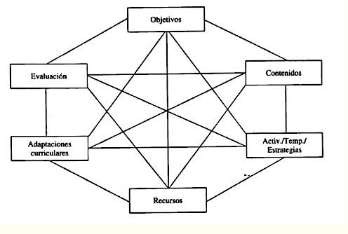{width="300px"}

Las unidades didácticas, cualquiera que sea la organización, deben tener en cuenta los
siguientes aspectos: descripción, objetivos didácticos, contenidos, actividades, recursos
materiales, organización del espacio y el tiempo, evaluación.
Es importante considerar que todos los aprendizajes necesitan ser programados, ya que
es necesario para poder abordarlos, marcarse objetivos y contenidos, diseñar actividades
de desarrollo y evaluación y prever los recursos necesarios.
En el cuadro que se ofrece a continuación, aparece un breve resumen de los elementos
fundamentales que una unidad didáctica puede recoger:

# ELEMENTOS DE LA UNIDAD DIDÁCTICA

| Nº | Elemento                                      | Descripción                                                                                                                                                                                                 |
|--------------------------------------------------|-------------------------------------------------------------------------------------------------------------------------------------------------------------------------------------------------------------|
| **Descripción de la unidad didáctica**       | Indicar el tema específico o nombre de la unidad, conocimientos previos, actividades de motivación, número de sesiones, situación en el curso/ciclo y momento de aplicación.                              |
| **Objetivos didácticos**                     | Lo que se pretende que adquiera el alumnado durante la unidad. Tener en cuenta temas transversales y estrategias para la participación del alumnado.                                                      |
| **Contenidos de aprendizaje**                | Conceptos, procedimientos y actitudes sobre los que se va a trabajar.                                                                                                                                      |
| **Secuencia de actividades**                 | Establecer una secuencia interconectada de actividades, considerando la diversidad del aula y ajustando a las diferentes necesidades educativas.                                                          |
| **Recursos materiales**                      | Señalar los recursos específicos para el desarrollo de la unidad.                                                                                                                                          |
| **Organización del espacio y el tiempo**     | Indicar aspectos específicos sobre la organización del espacio y del tiempo requeridos por la unidad.                                                                                                     |
| **Evaluación**                                | Actividades para valorar el aprendizaje del alumnado y la práctica docente, instrumentos utilizados, criterios e indicadores de valoración en el contexto general de la unidad.                           |

 

También es importante que se incluyan actividades de
autoevaluación en las que los alumnos y alumnas puedan
reflexionar sobre el propio aprendizaje.

## DISEÑO ¿CÓMO ELABORAR LAS UNIDADES DIDÁCTICAS?

### DESCRIPCIÓN DE LA UNIDAD DIDÁCTICA

Breve descripción
Elección del tema: eje en torno al cual se va a organizar.
Opciones: contenido, rutina, actividad puntual, identificación de las áreas implicadas.
Título, que deberá ser claro, corto y sugerente. Y nivel al que se dirige. Características
“generales”, “espaciales”, duración, etc.
Justificación
En este apartado se incluirán aspectos como el motivo de su elección, finalidad y relación
con otras unidades didácticas que conforman la programación, también, se pueden
incluir los conocimientos previos que los/as alumnos/as necesitan para abordarla, las
ideas previas más comunes u otras opciones didácticas necesarias para el desarrollo de
dicha unidad. Coherencia con PEC y PCC. Secuencias con las unidades previas y las
posteriores.

### ELEMENTOS QUE COMPONEN LA UNIDAD DIDÁCTICA

**Objetivos**

El principal aspecto de los objetivos es que estén expresados en términos de capacidades
y no de comportamientos. Es decir, la escuela debe ayudar a desarrollar no tanto
comportamientos específicos iguales para todo el alumnado, sino capacidades generales,
competencias globales que después se ponen de manifiesto en actuaciones concretas
que pueden ser distintas en cada alumno/a, aunque respondan a la misma capacidad.
Cada objetivo didáctico hace referencia generalmente a más de un contenido y se
desarrolla en varias actividades.
Las funciones básicas de los objetivos didácticos son: servir de guía a los contenidos y a
las actividades de aprendizaje, y proporcionar criterios para el control de estas
actividades.

Es importante hacer partícipes a los alumnos y alumnas del proceso de enseñanza
aprendizaje compartiendo con ellos los objetivos didácticos, buscando que sepan qué se
espera de ellos/as, qué van a aprender, por qué y cómo.

Otro aspecto a tener en cuenta en el establecimiento de los objetivos didácticos es su
adecuación a la diversidad del alumnado. Ya que las unidades didácticas deben permitir
distintos grados de adquisición de un contenido y la participación de todo el alumnado
en una tarea común, para atender al conjunto del alumnado, en la medida de lo posible.

Por tanto, al establecer los objetivos, es necesario establecer algunos que se
denominarían básicos y, por tanto, comunes para todos, juntos a otros de profundización,
ampliación y de refuerzo, para que todos/as encuentren actividades en las que se
desarrollen sus capacidades. Para de esta forma no tener que estar constantemente
estableciendo actividades complementarias paralelas al desarrollo ordinario de la unidad
didáctica.

Los objetivos didácticos que tienen un mayor predominio en su referencia a conceptos,
suelen formularse con verbos como: definir, explicar, señalar, identificar, ….
Los objetivos didácticos que hacen referencia a procedimientos suelen formularse con
verbos como: simular, construir, aplicar, debatir, ….
Los objetivos didácticos que en mayor medida se refieren a actitudes suelen formularse
con verbos del tipo: aceptar, valorar, apreciar, colaborar, disfrutar, ….
Dependiendo de la unidad didáctica predominarán más un tipo de objetivos u otros.

**Contenidos**

Este elemento de la unidad didáctica comprende los contenidos concretos que van a ser
objeto de aprendizaje.

Al igual que se ha indicado con los objetivos, los contenidos que se seleccionen para ser
trabajados en cada unidad deben tener en cuenta las diferencias individuales entre el
alumnado.

Es conveniente organizar y distribuir los contenidos de forma que se interrelacionen
contenidos de distintas áreas y que éstos, además, giren alrededor de temas o proyectos
cercanos al alumnado, ya que le ayudarán mejor a comprender las situaciones reales en
las que pueden encontrarse el alumnado.

Tendremos en cuenta en la secuenciación de contenidos en el proyecto curricular de
centro y trataremos de poner en relación los contenidos de las diferentes unidades
didácticas para que a lo largo de todo el curso hayamos trabajados todos los contenidos
necesarios.

**Actividades, estrategias y temporalización**

Teniendo en cuenta los elementos anteriores, se deben identificar aquellas actividades
que consideremos relevantes para el desarrollo de la unidad didáctica.

Diseñar actividades coherentes con los objetivos y contenidos de la unidad. Serán
necesarias actividades que trabajen los tres tipos de contenidos (conceptuales,
procedimentales y actitudinales) y además que estas actividades sean acordes al proceso
de motivación, diagnóstico, síntesis, refuerzo…

Una vez establecido en marco en el que se van a desarrollar las actividades, se establecerá
la secuencia de desarrollo y se prevé el tiempo que se va a emplear en cada una de ellas.
Ya que sea cual sea la selección de actividades, es importante que todas ellas estén
organizadas de acuerdo con una secuencia de aprendizaje. Una unidad didáctica no debe
entenderse como una mera suma de actividades.

Al elaborar las actividades debemos tener en cuenta:

* Ofrezcan contextos relevantes e interesantes.

* Promuevan una actividad mental en el alumnado.

* Presenten grados de dificultad ajustados y progresivos.

* Estimulen la participación, solidaridad y no discriminación.

* Integren contenidos de distinto tipo.

* Puedan resolverse utilizando distintos enfoques.

* Admitan niveles de respuesta y tipos de expresión diversos que promuevan la participación de todos.

* Admitan niveles diferentes de intervención del profesorado y los iguales.

* Admitan niveles diferentes de intervención del profesorado y de interacción en el aula.

**Recursos**

A la hora de seleccionar los recursos debemos tener en cuenta la gran diversidad de
intereses y capacidades que siempre hay en el aula.
Es importante organizar los recursos materiales para que puedan ser utilizados por el
alumnado de forma autónoma.

Los recursos pueden ser distinta naturaleza: bibliográficos (bien para el profesorado o
para el alumnado), audiovisuales, informáticos, vistas de diferentes personas al aula,
salidas del centro, etc.
Los recursos se pueden clasificar en:

* Espacios: el aula habitual y el apropiado diseño espacial, otros espacios del centro o cualquier otro tipo de espacios.

* Materiales: distinguimos entre didácticos, tanto de uso del profesorado como de los alumnos/as, como humanos, posibilidad de colaboración de otras personas como, especialistas, padres, madres, …

En la programación de la unidad didáctica, tendremos que prever los recursos, tanto los
habituales como aquellos otros que puedan ser más extraordinarias, que necesitaremos
para las distintas sesiones.

**Adaptaciones curriculares**

Según Fuentes (1990), para atender a las diferentes necesidades que los alumnos y
alumnas presentan, dentro de un mismo grupo, la unidad didáctica debe ser lo
suficientemente flexible para permitir que los mismos objetivos se consigan a través de
actividades distintas. Esto quiere decir que, tanto para un grupo de alumnado o como
para un/a alumno/a individualmente se planifique las actividades que resulten más
adecuadas para ellos. Si la modificación de las actividades no fuera suficiente será
necesario modificar los objetivos didácticos mediante la selección de otros contenidos o,
por último, en este recorrido “hacia arriba” de los elementos desarrollar los objetivos
generales de área, e incluso de etapa, mediante unos objetivos didácticos elaborados
especialmente para un alumno/a o grupo de alumnos/as.

Por otro lado, la especificidad, importancia o permanencia en el tiempo de determinadas
necesidades educativas especiales, llevará a considerarlas no solamente en el ámbito de
las unidades didácticas, sino buscarles una respuesta más general dentro del Proyecto
curricular.

Organización del espacio y del tiempo en el aula
La organización espacio-temporal la decide cada equipo educativo en su Proyecto
Curricular. Teniendo como referencia esta organización, debemos tener en cuenta que el
desarrollo de cada unidad didáctica concreta implica, en muchos casos, modificaciones
que comportan acudir a espacios diferentes de los habituales, modificar los tiempos
establecidos o prever agrupamientos distintos.

**Evaluación**

La evaluación se entiende como parte del proceso de enseñanza-aprendizaje y tiene
como función obtener información para tomar decisiones, reflexionar, planificar y
reajustar la práctica educativa para mejorar el proceso de aprendizaje. En este sentido, la
evaluación no se centra en la medición de rendimientos, ni puede entenderse como
responsabilidad exclusiva de cada profesor/a.

El diseño de las actividades de evaluación debe ser coherente con el proceso de
enseñanza-aprendizaje y permitir informar al alumnado sobre su propio progreso.
También se podrán establecer actividades específicas, cuando sea necesario obtener
información que no esté suficientemente explicita, en el resto de las actividades
diseñadas.

En el diseño de la evaluación de las unidades didácticas es importante tener en cuenta
algunas consideraciones:

* Planificar actividades de evaluación que permitan al profesorado conocer los
conocimientos previos de los y las alumnas en relación a los contenidos que se van
a trabajar, esto servirá como punto de partida para empezar a trabajar sobre la
Unidad didáctica, así como para asegurarse de que se puedan lograr los objetivos
programados a partir de los conocimientos previos del alumnado, o para reajustar
la programación.

* Establecer los requisitos previos para que el alumnado pueda trabajar
adecuadamente una determinada unidad didáctica. En consecuencia, si el
alumnado carece de ellos será preciso trabajarlos, diseñando actividades que se
lo permitan.

* Los instrumentos de evaluación deben ser los más diversos posibles y llevarse a
cabo a lo largo del desarrollo y finalización de toda la unidad didáctica, mediante
recursos como: observación directa, cuaderno de trabajo, pruebas escritas de
distinto tipo, etc.

Por tanto, en el diseño de una unidad didáctica, debemos tener en cuenta:

* Si las unidades recogen las capacidades que se han decidido desarrollar en el ciclo
por tanto son coherentes con los objetivos.

* Si las actividades permiten distintos ritmos en su ejecución y por tanto grados
diferentes de desarrollo de capacidades.

* Si hay un equilibrio entre los diferentes contenidos (conceptos, procedimientos y
actitudes).

Si la unidad prevé instrumentos de evaluación que permitan al profesorado
obtener información sobre el progreso de su alumnado y sobre el proceso de
enseñanza aprendizaje y permite a los y las alumnas reflexionar sobre su propio
aprendizaje.

Cada unidad didáctica conviene que sea programada por el conjunto de profesores y
profesoras que atiende a un mismo nivel, a partir de los acuerdos que se han tomado
previamente en el equipo de ciclo. Aunque estas unidades deben ser lo suficientemente
flexibles para que, puedan realizarse modificaciones, cuando se estén desarrollando, en
función del grupo.
Por último, también se debe tener en cuenta a la hora de evaluar la percepción que el
propio alumnado tiene sobre los nuevos conocimientos adquiridos, sobre el esfuerzo
empleado para ello. Programar y desarrollar actividades de autoevaluación además de
permitir realizar al profesorado una evaluación más completa de los procesos de
enseñanza y aprendizaje.

### MODELO DE UNIDAD DIDÁCTICA

Como se ha dicho anteriormente la planificación y programación de la actividad docente,
para que esta sea más operativa, se concreta en unidades didácticas.
Debido a los cambios educativos, pedagógicos y sobre todo normativos, hacen muy difícil
esta tarea para los y las docentes, esto unido, a la falta de prescripciones normativas que
definan un modelo o plantilla para la programación de las Unidades Didácticas y en
muchos casos ciertos modelos que podemos encontrar en Internet, o las propuestas de
editoriales, distan mucho de ser operativos y funcionales e incluso de cumplir con los
fines pedagógicos y normativos que se exigen.
Se propone aquí una plantilla que nos va a servir para programar una unidad didáctica y
que recoge todos los elementos fundamentales que debe contener dicha unidad y que
ya han sido explicados en los apartados anteriores.

:::note
Puedes encontrar más documentación en la siguiente página web: [Proyecto curricular de ciclo formativo](https://ceice.gva.es/documents/388109149/390831792/PCCF_Guia_practica_docente.pdf/8bc62623-4792-05b4-707f-3ad694f6be0b?t=1741783900533)
:::

## MODELO DE UNIDAD DIDÁCTICA PARA LA MODALIDAD A DISTANCIA

Si bien en la enseñanza presencial el profesorado puede reajustar de forma rápida su
estrategia didáctica, en función del grado de comprensión de los mensajes educativos
que manifiesten los alumnos y alumnas, esta particularidad no se da en la formación a
distancia.
Se quiere destacar aquí, la importancia que los materiales tienen para el aprendizaje en
la modalidad a distancia. Siendo por tanto el medio o recurso utilizado para el aprendizaje
la base fundamental de la enseñanza a distancia.
Podemos distinguir entre materiales para el aprendizaje (impresos, audiovisuales e
informáticos) y vías de comunicación profesor/a-alumnado (presencial, en algunos casos,
telefónica y telemática).
Detallamos a continuación una serie de características que deben tener unos materiales
de calidad utilizados en la planificación de una unidad didáctica a distancia:
* Adecuados: adaptados al contexto socio institucional, apropiados para el nivel al
que atiende, a las previsibles características del grupo a quien va destinado y la
dedicación requerida para la superación del curso.

* Integrales: materiales que desarrollen íntegramente todos los contenidos exigidos
para alcanzar los conocimientos, capacidades o actitudes pretendidos, es decir,
que establezcan todas las recomendaciones oportunas para orientar y conducir
todo el trabajo del o de la estudiante.

* Integrados: la enseñanza requiere que todos los materiales utilizados en el
proceso de aprendizaje estén integrados formando una unidad y los diferentes
materiales no pueden formar unidades independientes y agregadas sin más.

* Coherentes: Coherencia entre los distintos elementos y variables del proceso de
enseñanza-aprendizaje, por ejemplo, entre objetivos, contenidos, actividades y
evaluación y, por tanto, las actividades y ejercicios prácticos, deben ahondar en
aquellos contenidos establecidos con el fin de que el alumno o alumna logre los
objetivos propuestos y no otros, que serán los que habrá que comprobar, si se
lograron o no, a través de la evaluación.

Significativos: materiales cuyos contenidos tengan sentido en sí mismos, estén
presentados de forma progresiva y resulten interesantes para el destinatario.

* Interactivos: que no sean materiales meramente expositivos, sino que exijan la
participación activa del alumnado y que permitan e inviten al intercambio de
opiniones y a establecer un dialogo simulado y permanente con el profesorado.

* Válidos y fiables: los contenidos recogidos en los materiales deben representar
solidez, consistencia y contractibilidad y deben transmitir todo aquello que se
pretende que aprenda el alumnado y no sobre cuestiones laterales.

* Representativos: Deben seleccionarse aquellos contenidos de un determinado
ámbito, disciplina o curso, que formen bloque, unidades, temas o apartados que
realmente representen lo esencial de ese campo.

* Estandarizados: se deben utilizar siempre materiales compatibles con los soportes
más utilizados, con el fin de no crear problemas a los y las alumnas, que suele venir
dados por la incompatibilidad de tipo software.

* Que permitan la autoevaluación: utilizando para ello actividades, ejercicios,
cuestionarios, que permitan al alumnado comprobar los progresos realizados y la
consecución de los objetivos propuestos, mediante la consulta inmediata de las
correspondientes soluciones a las cuestiones y trabajos propuestos.

## ESTRUCTURA DE UNA UNIDAD DIDÁCTICA A DISTANCIA

En este apartado se pretende dar una visión general y de forma sintética de todos los
elementos, distribuidos en diferentes apartados, que debe contener una unidad didáctica
en la modalidad de enseñanza a distancia, tal como se muestra en la siguiente tabla:

| Elemento | Descripción |
|----------|-------------|
| Título e introducción | Título de la unidad y elemento motivador inicial. Introducción: utilidad, importancia y relación con la realidad profesional. Instrucciones para el estudio: organización del trabajo, credenciales del autor, prerrequisitos y detalles esenciales para la comprensión. Relación con otras unidades y ayudas externas. |
| Objetivos | Objetivos claros, específicos, comprensibles y asequibles. Pueden agruparse en niveles (obligatorios, convenientes, deseables) y vincularse a la estructura del módulo. |
| Esquema | Visión global e integradora de la unidad: secuencia de contenidos, esquema numerado o mapa conceptual que facilite la lectura previa. |
| Desarrollo | Contenido ordenado en apartados secuenciados. Lenguaje claro y progresivo; incorporación de nueva terminología con ejemplos y ejercicios. Uso de preguntas y actividades intercaladas, refuerzos motivadores y ejemplos reales. Organizadores internos (encabezados, recuadros, tablas, diagramas), tipografía y realces coherentes, e ilustraciones claras con pie. |
| Resumen | Síntesis redactada que destaque los puntos clave y siga el esquema inicial para facilitar la revisión. |
| Bibliografía | Referencias de la unidad y bibliografía recomendada; extensión adaptada al nivel del alumnado. |
| Actividades | Supuestos prácticos y ejercicios bien planificados para aplicar conocimientos: claros, puntuales y centrados en los aspectos fundamentales. Pueden ir intercalados o ubicados en un bloque específico. |
| Glosario | Definición de términos fundamentales y vocabulario nuevo presente en la unidad. |
| Autoevaluación | Cuestionarios y pruebas breves (recomendable opción múltiple) que permitan comprobar la asimilación de los contenidos básicos; pueden intercalarse en el texto. |
| Soluciones a la autoevaluación | Claves correctas con explicaciones del porqué de cada respuesta para favorecer la reflexión y el aprendizaje. |
| Anexos | Material complementario: tablas, cuadros, documentos de referencia, diagramas, textos legales, enlaces web, vídeos, etc., necesarios para la comprensión y realización de actividades. |
| Índice temático | Índice alfabético al final del bloque de contenidos para localizar rápidamente conceptos y apartados. |

A continuación, se muestra un ejemplo de implementación en un aula virtual de una
unidad didáctica correspondiente al módulo de LOGÍSTICA COMERCIAL, detallando los
elementos que la componen, a través de las distintas imágenes que se muestran:
Para la implementación del curso/módulo se ha utilizado la plataforma Moodle, con la
siguiente estructura, que se muestra a modo de ejemplo para una de las unidades:

* El inicio del curso/modulo se incluye:

* Un mensaje de bienvenida, en el que la profesora se presenta a los y las alumnas
y se da una breve explicación del módulo que se va a estudiar y cuáles son los
objetivos generales del mismo y su encuadre en el ciclo formativo al que
pertenece.

* Un tablón de anuncios es el que se van informando a los alumnos y alumnas de
aquellos cambios o novedades que afecten al normal funcionamiento del
módulo/curso.

* Guía didáctica, en formato pdf para que el alumnado pueda descargarlo y en el
que se indica a los y las alumnas todo lo relativo a la estructura, contenidos y
funcionamiento general del módulo.

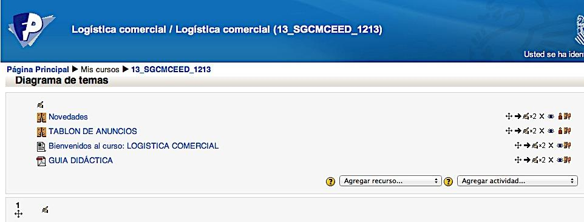{width="300px"}

* Consulta, en este apartado se pone a disposición del alumnado un listado para
que se apunte al examen de cada una de las evaluaciones, lo que favorece ayuda
a la profesora en la organización de espacios y la preparación de los modelos de
examen de las opciones de mañana y tarde de cada uno de los módulos.

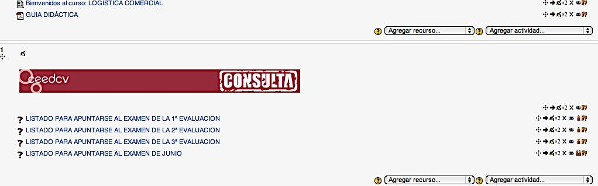{width="300px"}

* Estructura de cada unidad y evaluación Cada unidad está compuesta por:

    - Evaluación a que pertenece la unidad
    - Título e imagen de la unidad y temporalización
    - Objetivos
    - Foros de dudas y preguntas sobre los contenidos de la unidad
    - Recursos o contenidos
    - Consulta u otros contenidos, es un apartado para saber mas
    - Actividades
    - y actividades autoevaluables

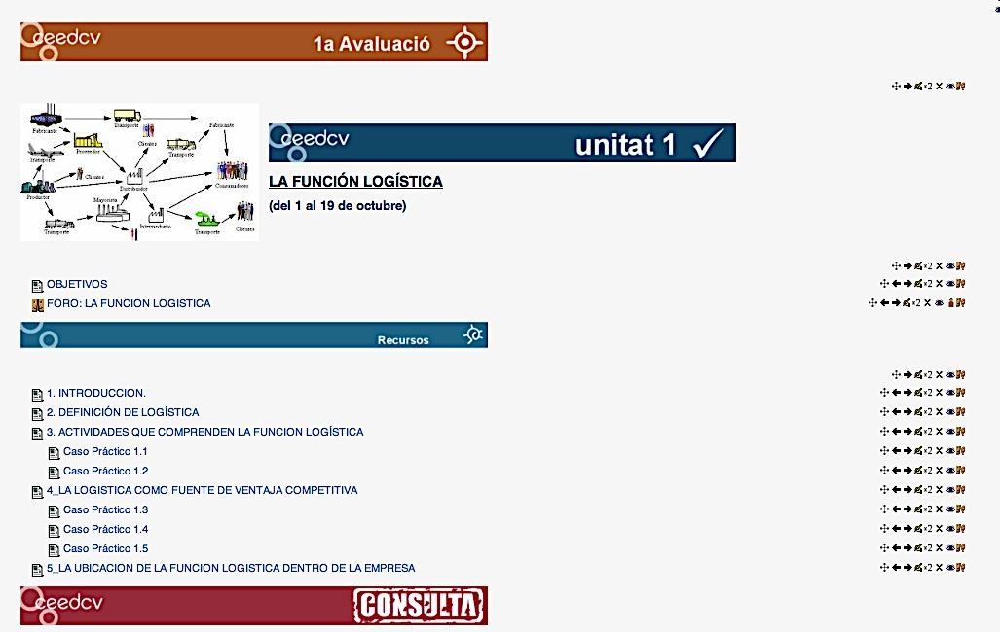{width="300px"}

* Recursos: incluye los contenidos estructurados y divididos en distintos apartados
y casos prácticos resueltos de cada uno de estos apartados, tal como se muestra
en la imagen.

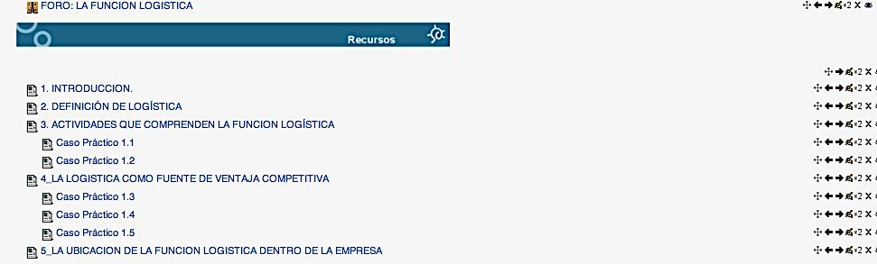{width="300px"}

* Consulta: este apartado incluye una serie de contenidos complementarios para el
estudio de la unidad. Se estructura de la siguiente forma:

    - Esquemas: de algunos conceptos de la unidad.
    - Sabías que… y para saber más.
    - Glosarios, que incluye términos importantes relacionados con la unidad en estudio.
    - Videos: relacionados con algunos apartados del tema.
    - Wiki: que permite la participación y aportación personal de cada alumno/a
    los contenidos de cada unidad.
    - Enlaces a páginas web de interés sobre algunos aspectos tratados en el tema.

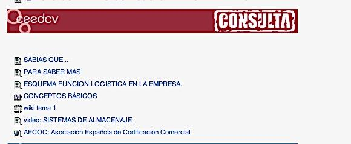{width="300px"}

* Actividades: en este apartado el/la alumno/a dispone de distintos tipos de tareas
y actividades que le permitirán completar el estudio de la unidad y mediante los
cuales el profesorado puede evaluar en qué medida ha alcanzado los objetivos
propuestos al inicio del estudio de la misma. Se incluyen:

    - Grupo de prácticas: para la realización de alguna de las actividades en grupo.

    - Actividades en línea (actividad 1: Ciclo de calidad), para que el alumnado pueda responder directamente a una pregunta o preguntas planteadas.

    - Actividades complementarias, se plantean una serie de tareas sobre los contenidos del tema y el alumnado debe subir una archivo o archivos con las soluciones propuestas.

    - Taller, se asigna un trabajo concreto a los alumnos y alumnas (en este caso como se ve en la imagen, la creación de una red logística) y en este caso el trabajo se realiza de forma individual. El profesor o profesora presenta al alumnado ejemplos de tareas ya completadas y evalúan las tareas de otros compañeros/as.

    - Solución de las actividades complementarias: una vez transcurrido una semana desde la finalización del estudio del tema se facilita al alumnado en formato PDF la solución de las tareas complementarias.

    - Actividades de autoevaluación: como se muestra en la imagen un cuestionario de autoevaluación, que constará de preguntas de selección múltiple, de opción múltiple, de verdadero y falso o de rellenar huecos.

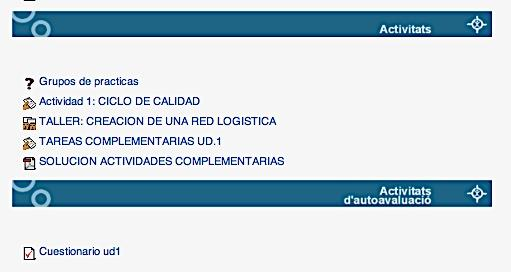{width="300px"}

* Calificaciones: El alumnado puede consultar las calificaciones de las actividades,
cuestionarios, notas de los exámenes de evaluación, así como la calificación final,
a través del apartado de calificaciones del aula virtual, tal como se muestra en la
imagen:

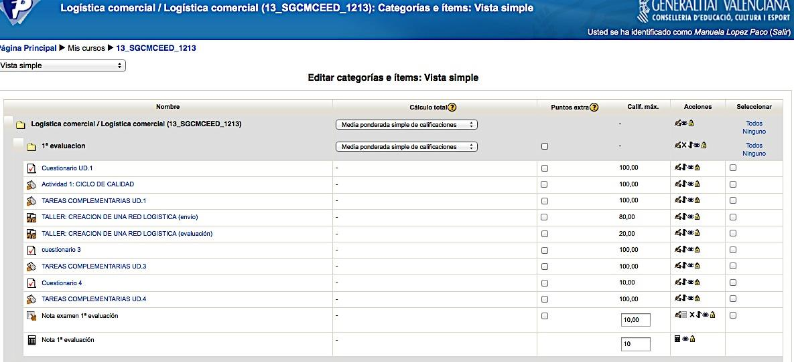{width="300px"}

* Cuestionario de valoración del CURSO: se trata de un formulario creado en Google
drive y en él se pide a los y las alumnas su opinión acerca de distintos aspectos del
curso y que servirá a la profesora como herramienta para mejorar, tanto la
estructura, como los contenidos del tema.

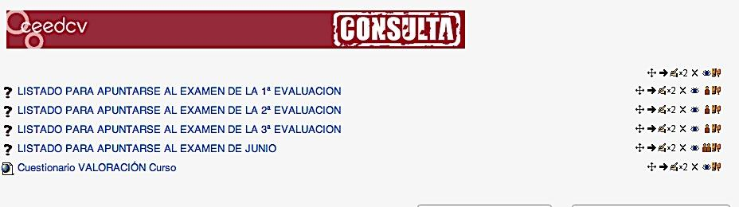{width="300px"}

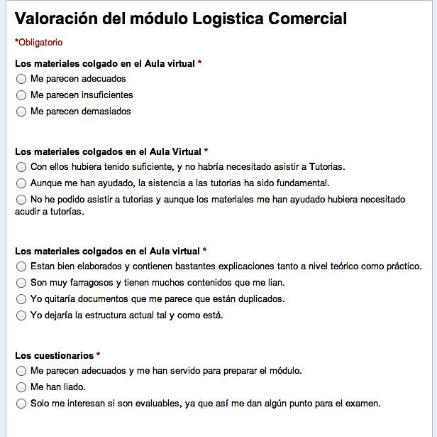{width="300px"}

# CRITERIOS E INSTRUMENTOS DE EVALUACIÓN

Hemos visto a lo largo del desarrollo de nuestro epígrafe, como el enfoque constructivista
del aprendizaje pone el acento en un aprendizaje por competencias, que hemos llamado
competencias de innovación (basadas en las ocho competencias básicas), en busca del
carácter profesionalizador de la Formación Profesional.

Pero ¿en base a qué podemos evaluar todos estos saberes, habilidades, capacidades,
actitudes y, por ende, competencias?
Hemos de referirnos sin duda a los criterios de evaluación.

Los criterios de evaluación son parámetros de referencia que funcionan como base de
comprobación para interpretar el desempeño del o de la estudiante respecto a su
aprendizaje. Hace referencia al dominio de contenidos, pero no nos referimos
únicamente a los establecidos en los Decretos de título de los CF, si no que ampliamos la
visión del concepto. Cuando hablemos de las características de la evaluación veremos
que ésta tiene un carácter criterial, esto es, los resultados de aprendizaje se comparan
con estándares o criterios del sector productivo.

Cuando aplicamos criterios de evaluación, evaluamos no solo la adquisición de
conocimientos, sino también el correcto desarrollo de las competencias.

Una vez establecidos dichos criterios de referencia, deberemos hacernos una nueva
pregunta: ¿Con qué evaluar? Nos referimos a qué instrumentos deberemos utilizar para
llevar a cabo la evaluación, y que denominaremos “pruebas de evaluación”.

Ahora bien, para llegar a establecer y explicar tanto unos como otros, entendemos que
hemos de partir de contestar a otras dos preguntas previas: ¿qué evaluar? y ¿para qué
evaluar?

Su respuesta nos ofrecerá las claves en las que se sustenta el modelo de aprendizaje de
construcción del conocimiento en el que nos basamos, según el enfoque constructivista
del aprendizaje.

## EL ENFOQUE CONSTRUCTIVISTA DEL APRENDIZAJE Y LA EVALUACIÓN

Partiremos de establecer la relación estrecha que existe entre lo que se entiende por
aprendizaje desde el punto de vista del enfoque constructivista con el proceso de
evaluación.

La educación es un factor clave para el desarrollo social y económico y para la adaptación
de los y las estudiantes y futuros trabajadores a la realidad social.

En este sentido, se hace patente establecer un sistema docente que permita una
formación integral de los y las estudiantes para adaptarse a las nuevas necesidades de la
sociedad y al cada vez más competitivo mercado laboral transnacional, que requiere unos
determinados perfiles competenciales y unos conocimientos permanentemente
actualizados lo cual se convierte en todo un desafío para el profesorado.

Tal y como ya dijimos en el apartado de metodología y aprendizaje, este reto supone una
reformulación de las metodologías docentes, que han de estar basadas en el aprendizaje
y no solo en la enseñanza; por lo que en la actualidad hablamos de proceso de enseñanzaaprendizaje, teniendo en cuenta el carácter bidireccional del proceso.
En dicho modelo, el estudiantado pasa a ocupar el centro o eje vertebrador del proceso
de aprendizaje, participando de forma proactiva en la construcción de su propio
conocimiento, y sin duda, en nuestra opinión, la piedra angular del sistema recae sobre
la evaluación, la cual adquiere una nueva dimensión al aplicar un enfoque de tipo
constructivista basado en competencias, lo que nos lleva a un replanteamiento de su
naturaleza, así como del diseño de sus elementos estructurales.

Una evaluación basada en este sistema, debe tener por objetivo la valoración de la calidad
de aprendizaje conseguido por el estudiantado, cuyo esfuerzo y trabajo se convierte en
el eje de la organización de la actividad docente.

No olvidemos que la forma de evaluar las competencias condiciona la consecución real
de las mismas y que el sistema de evaluación aplicado condiciona también la forma de
estudiar y el tiempo dedicado al aprendizaje.

Tradicionalmente, la evaluación se ha orientado más hacia el resultado, condicionada por
un enfoque conductista. Actualmente, los especialistas consideran más apropiado
desarrollar sistemas de evaluación orientados hacia el proceso, siguiendo un enfoque de
tipo constructivista.

Hemos por tanto de diseñar una evaluación capaz, no sólo de evaluar la competencia en
sí misma, sino su ejercicio o puesta en práctica por parte de los y las estudiantes,

debiendo pues, producirse los cambios necesarios tanto en el sistema de evaluación
seguido, como en el planteamiento de actividades que hagan posible dicha evaluación.
Muchas personas expertas han estudiado los sistemas de evaluación, pero
modernamente, y siguiendo dicho enfoque, se entiende la evaluación como un proceso
integrador e interrelacionado con el proceso de formación, desde el momento inicial de
la planificación hasta la comprobación de sus resultados, que tiene como objetivo
detectar aquellos elementos que funcionan correctamente y cuáles no, con la finalidad
última de garantizar la calidad global de dicha formación.

Se ha pasado pues, de una evaluación centrada en los productos a una evaluación
centrada en los procesos. De un único modo de evaluar hemos pasado a distintos tipos
de evaluación, tarea no exenta de cierta complejidad.

Una posible definición en este sentido de evaluación sería la siguiente: “La evaluación es un proceso permanente y sistemático de obtener información objetiva y útil, relativa a los
procesos de aprendizaje y sus resultados, para que, tras su análisis y valoración, se pueda
apoyar un juicio de valor sobre el diseño, la ejecución y los resultados de la formación con
el fin de servir de base para la toma de decisiones”

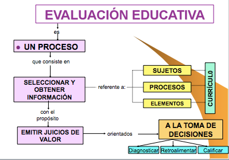{width="300px"}

Estas decisiones se tomarán en tres sentidos:

* diagnosticar los ajustes sobre el proyecto curricular y la programación docente,

* mejorar la práctica docente, proponer los medios y materiales de apoyo, y calificar los resultados.

Lo que dará lugar a los tres tipos de evaluación (diagnóstica, formativa y sumativa), que
más tarde desarrollaremos, y que a nuestro juicio no son más que tres momentos de un proceso.

Según esta definición se está poniendo el acento en la optimización del proceso, de forma
que la finalidad del mismo no es sólo otorgar una nota, sino conseguir un aprendizaje.

Bajo este enfoque, el aprendizaje y la evaluación deben tomar en consideración el
desarrollo del propio estudiantado, es decir, sus expectativas, su nivel inicial, sus estilos
de aprendizaje, sus ritmos e intereses, sus necesidades y proyección futura. Desde esta
perspectiva, el reto de la evaluación es cómo debe plantearse para ser congruente con
las teorías que se propugnan para un aprendizaje significativo y respetuoso con las
peculiaridades individuales y culturales del alumnado y sus necesidades.

## ¿QUÉ EVALUAR?

Abordemos pues la primera de nuestras preguntas previas: ¿Qué evaluar?
Sin abandonar el enfoque por competencias del que hemos partido, y por tanto, si
asumimos que la capacidad productiva de una persona se define y mide en términos de
desempeño en un determinado contexto laboral, y refleja los conocimientos, habilidades,
destrezas y actitudes necesarias para la realización de un trabajo efectivo y de calidad;
llegamos a la conclusión de que, en el proceso formativo, los y las estudiantes deben
desarrollar un conjunto de capacidades terminales o resultados de aprendizaje, que éstos
deben lograr al finalizar el módulo (saber, ser, hacer, relacionar…), las cuales describen
un conjunto de conocimientos, habilidades cognitivas, destrezas y actitudes que los y las
estudiantes deben alcanzar para un desempeño eficiente.

Por tanto, qué es lo que vamos a evaluar a lo largo del proceso de enseñanza-aprendizaje
de los alumnos y alumnas. Para entenderlo mejor, nos ayudaremos de un ejemplo.
Supongamos que planteamos a un alumno o alumna si es capaz de obtener cuál sería la
cantidad que tendría que pagar mensualmente si quiere financiarse con un préstamo
hipotecario para la compra de su vivienda. Esta competencia estaría relacionada con el
módulo de Gestión Financiera en el CFGS de Administración y Finanzas.
Siguiendo nuestro enfoque, deberíamos evaluar al alumnado teniendo en cuenta los
siguientes objetivos del aprendizaje
Evaluar el saber (Evaluación Teórica). Los objetivos de conocimiento hacen referencia a
“conocer”, recuerdo de hechos, términos, procesos métodos estructuras, etc. El principal
propósito de esta clase de objetivos está relacionado con el aumento de conocimiento
teórico del saber de un área. Implica adquisición de información, comprensión de
información y cambio conceptual. La evaluación del saber habitualmente evalúa
conocimientos de tipo teórico, o incluso la aplicación práctica de los mismos, pero
siempre desde el punto de vista teórico. En el caso de nuestro alumno o alumna, se
trataría de comprobar que conoce las características del préstamo que le han concedido,
que interpreta los datos y los traduce correctamente para plantear las fórmulas
matemáticas necesarias que le proporcionarán el resultado de la cantidad a pagar
mensualmente.

Evaluar habilidades y capacidades. Los objetivos de habilidades y capacidades se refieren
a “saber hacer”, dominio de habilidades manuales y de aplicación. Estos objetivos
implican cómo aplicar los conocimientos para actuar ante una situación dada. De ahí que
conlleven la adquisición de técnicas y de estrategias. Mide la destreza del o de la
estudiante para, a partir de unos datos es capaz de llegar a establecer las conexiones
necesarias para aplicar las fórmulas correctas y realizar las transformaciones necesarias
en los datos para obtener los resultados correctos, manejando herramientas o
dispositivos. En este caso, se tratará, por una parte, de saber utilizar la calculadora
científica para procesar los datos, así como utilizar programas informáticos u otro tipo de
herramientas, tales como hojas de cálculo que faciliten el mismo.
Evaluar hábitos y actitudes. Los objetivos de hábitos y actitudes consisten en “saber ser”
y “saber estar”, dominio de habilidades cognitivas o sociales. Es un objetivo integrador de
aprendizajes anteriores y necesariamente contextualizado en los aspectos sociales en los
que previsiblemente se verá inmerso el estudiantado.

Evaluar las competencias. La competencia es el resultado del producto y para que el
resultado sea satisfactorio, evidentemente, el estudiantado tiene que tener conocimientos teóricos, habilidades, capacidades, hábitos y actitudes. En nuestro caso se
trataría de comprobar cómo el alumno o alumna, a partir de unos datos, ha sido capaz
de interpretarlos, ordenarlos, utilizarlos convenientemente y aplicarlos para la obtención
del resultado buscado. Efectivamente, para obtener dicho resultado, el alumno o alumna
ha tenido que partir de unos conocimientos teóricos (conocer las distintas características
de los préstamos, las fórmulas que calculan el pago periódico, las fórmulas que calculan
el interés periódico en su caso, …), habilidades (uso de herramientas que facilitan el
cálculo), y capacidades (relacionar todos los elementos y obtener el resultado e
interpretarlo), sin perder de vista los principios y valores en los que ha desarrollado su
trabajo (ha llegado a sus propias conclusiones como fruto de su trabajo).

## ¿PARA QUE EVALUAR? TIPOS DE EVALUACIÓN

Sigamos con la segunda de nuestras preguntas previas ¿Para qué evaluar? Basándonos
en la definición y los argumentos anteriores sobre la evaluación y el modelo de
aprendizaje en el que se basa, podemos decir que, la evaluación cumple las siguientes
funciones:

1. Motivadora: Estimula para lograr mejorar los resultados y superar las dificultades en el aprendizaje.
2. Diagnóstica: Posibilita la identificación de insuficiencias académicas en las destrezas y conocimientos previos de los y las estudiantes para iniciar el proceso de enseñanza aprendizaje.
3. Pronóstica: Nos permite predecir el desarrollo futuro de los y las estudiantes a partir de las evidencias o información obtenida. Facilita la determinación de posibles logros a alcanzar a través de la acción educativa.
4. Retroalimentadora: Asegura el reajuste inmediato requerido para el logro de los objetivos de aprendizaje y la mejora del currículo.

Y al mismo tiempo, nos está dando respuesta a nuestra pregunta, dando lugar a los
distintos tipos de evaluación, que según el momento de realización y coincidiendo con su
finalidad dividimos en:

### A. Evaluación Inicial o Diagnóstica

Se realiza al principio del proceso y su objetivo es realizar un diagnóstico preventivo para
tomar decisiones sobre las acciones formativas o estrategias de intervención más
adecuadas para cada estudiante particular, teniendo en cuenta el nivel del que parte, y
que sirva para alcanzar los objetivos sobre los que le van a medir.
Podemos considerar que sus propósitos principales son:

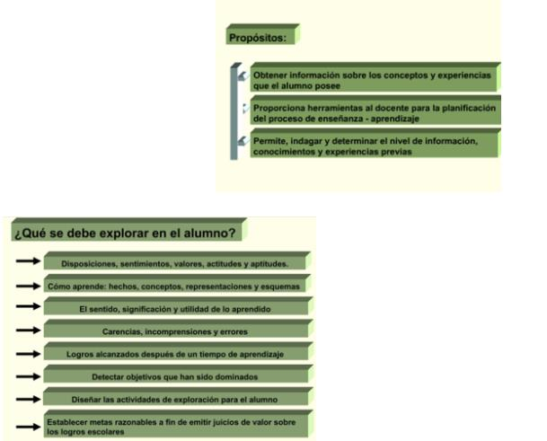{width="300px"}

Para la realización de la estrategia diagnóstica podemos desarrollar alguna de las siguientes actividades de evaluación:

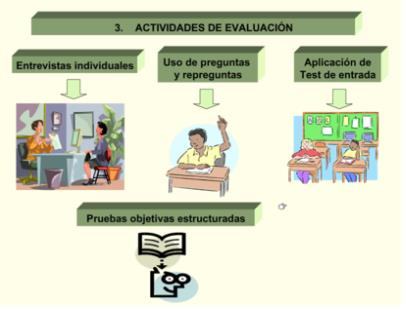{width="300px"}

Y nuestra evaluación diagnóstica debe estar orientada por algún criterio, tales como:

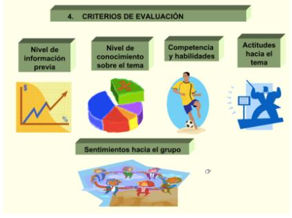{width="300px"}

### B. Evaluación, Procesal o Formativa

Se realiza de forma continua durante el proceso y sirve para detectar problemas de aprendizaje, regular y mejorar el proceso de enseñanza aprendizaje llevando a cabo un seguimiento del mismo; en función del cual se realizan actividades correctoras, para ayudar al alcance de los objetivos formativos. La evaluación formativa se utiliza con fines de retroinformación que puede servir tanto para mejorar el aprendizaje de los y las estudiantes como para mejorar la enseñanza impartida. Permite identificar los errores en el proceso, ajustándolo y reorientándolo, proporcionando un feed back tanto para el estudiante como para el docente.

En este tipo de evaluación se favorece la “práctica distribuida” del aprendizaje (estudio de
unidades de aprendizaje reducidas y distribuidas a lo largo de amplios periodos de
tiempo), frente a la tradicional “práctica masiva” (grandes volúmenes de información en
períodos muy cortos de tiempo que el estudiantado debe asimilar). Utiliza los resultados
obtenidos durante el curso al hilo del aprendizaje y con fines de calificación

### C. Evaluación Final o Sumativa

Se utiliza para calificar a los y las estudiantes al acabar una unidad o para la expedición
del título. Se focaliza en el aprendizaje como producto acabado. Se realiza al final del
proceso y sirve para medir y comprobar los resultados obtenidos, así como el grado de
alcance de unos determinados objetivos. Por tanto, nos ofrecerá respuesta sobre la

decisión a tomar en cuanto a superación de los módulos por parte del alumnado
(evaluación final de módulo) y al final del ciclo la que nos indicará si el estudiantado está
en disposición de obtener el título correspondiente (evaluación final de ciclo).

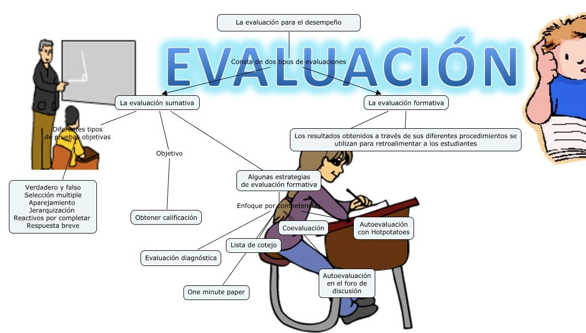{width="300px"}

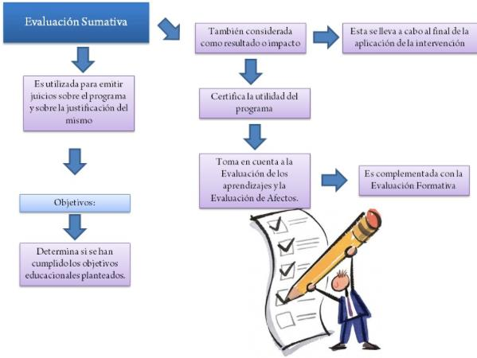{width="300px"}

Basándonos pues, en el enfoque por competencias, partimos de que la evaluación, es un
componente decisivo, ya que orienta todo el proceso formativo, al ser la expresión
observable de la consecución de los propósitos formativos, es decir, el grado de
aprendizaje o adquisición de las competencias profesionales.
Las características que definen la evaluación según este enfoque son las siguientes:

* Tiene por objeto principal las capacidades terminales (LOGSE), o los resultados de aprendizaje (LOE), que son públicos, así como los criterios de evaluación.

* Se halla referenciada por criterios (no por normas): los resultados se comparan con estándar o criterios del sector productivo. Es criterial.

* Tiene carácter individualizado, por tanto, se adapta tanto a las características de las personas como a los medios. Es flexible.

* Es integral, ya que tiene en cuenta todos los elementos del currículo: sujetos, procesos y elementos.

* Siendo por naturaleza una evaluación final Sumativa, admite la evaluación
continua a lo largo del proceso, teniendo pues un carácter acumulativo. También
se realiza una evaluación previa inicial o diagnóstica al principio del proceso. Por
tanto, se puede decir que la evaluación a lo largo del proceso es permanente ya
que se produce en varios momentos (inicial, proceso, final). La evaluación es
Continua, y se organiza por etapas, por tanto, podemos decir que es sistemática.

* Procura establecer situaciones de evaluación lo más próximas posibles a los
escenarios reales.

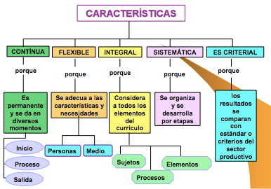{width="300px"}

Paralelamente, y tal como adelantábamos en el apartado de metodología, será necesario
recurrir a nuevas metodologías docentes más enfocadas al desarrollo de destrezas,
habilidades y competencias por parte del o de la estudiante (skills) y resultados de
aprendizaje (learning outcomes), y será el propio docente el que deba fijar todos aquellos
aspectos que el estudiante deberá superar para conseguir los objetivos previstos,
debiendo establecer, como paso previo, la carga lectiva para el profesorado y para el
estudiantado, lo cual no siempre es fácil.

Sin duda, en este sentido, se plantearán dificultades en la aplicación práctica que serán
motivo de reflexión y, sobre todo, la necesidad de dedicar especial atención a la tipología
de actividades de evaluación, tanto continua como final. Actividades que podemos llamar
“evaluables” y que tienen en cuenta todo el esfuerzo del o de la estudiante en su proceso
de aprendizaje. Para ello hemos de ser capaces de construir una unidad de valoración del
volumen total de trabajo y real del o del estudiante requerido para la superación del
módulo, es decir para la correcta asimilación de las competencias previamente fijadas
como objetivos de los módulos, con independencia de la actividad docente del
profesorado; es decir, una unidad de valoración más centrada en el aprendizaje, que mida
el volumen total de trabajo y no la carga lectiva de la materia.

En definitiva, la implantación de un sistema como el descrito, supone un reto y al mismo
tiempo una oportunidad para proceder a implantar un conjunto de mejoras,
innovaciones docentes y nuevas metodologías fruto de la reflexión y el consenso entre
todos los agentes implicados en la docencia ante esta nueva realidad académica,
especialmente, los y las docentes en sus respectivos módulos.

Además, debe ser una evaluación, especialmente, la final, que permita valorar de forma
adecuada todo el trabajo que ha realizado el estudiantado y que, por coherencia, debe
tener una sistemática similar al proceso de aprendizaje que ha realizado.

Por otra parte, situándonos en los entornos virtuales, las teorías constructivistas,
advierten los metodólogos, son más adecuadas a este nuevo sistema, pretendiendo que
el estudiantado adquiera a lo largo de su formación unas determinadas competencias
que lo preparen para la vida profesional (porque no olvidemos que este es el fin último
que se persigue con la formación), lo que exige un diseño curricular por competencias y
un material docente adecuado a la consecución de dichos objetivos.

Este nuevo escenario, que pone más énfasis en lo que aprende el estudiantado, que en
lo que le enseña el profesor o profesora debe incluir una nueva manera de enfocar la
evaluación del proceso de aprendizaje del o de la estudiante que tenga realmente en
cuenta la adquisición de las mencionadas competencias y habilidades; por lo tanto,
siguiendo el enfoque constructivista, los especialistas consideran más apropiada la
evaluación orientada hacia el proceso , y no hacia el resultado, tal y como,
tradicionalmente se hacía con un enfoque conductista.

Este es el motivo por el cual el concepto de evaluación continua ha ido ganando terreno
hasta convertirse en el centro del proceso de evaluación más próximo a los enfoques más
modernos. Así pues, la evaluación continua se adopta como una estrategia de evaluación
formativa más orientada al proceso de aprendizaje que a una valoración puntual.
Si se parte de una visión constructivista, según la cual el conocimiento es algo que se
construye, el aprendizaje es un proceso complejo de creación de significados a partir de
la nueva información y de los conocimientos previos, un proceso de transformación de
las estructuras cognitivas del o de la estudiante como consecuencia de la incorporación
de nuevos conocimientos, fruto de la interrelación de tres elementos que configuran un
triángulo interactivo: actividad mental constructiva del o de la estudiante, intervención
continua del docente, y los contenidos objeto del proceso de enseñanza aprendizaje.
Para su evaluación, es preciso realizar acciones evaluativas que pongan en juego la
significatividad de los nuevos aprendizajes, evitando, de este modo, los ejercicios
memorísticos en los que solo se consigue poner en marcha la capacidad de reconocer y
evocar.

Un elemento determinante del éxito de la evaluación es si ésta se enfoca de forma
coherente con el resto de elementos del proceso de aprendizaje y si se corresponde con
los principales objetivos del mismo.

Llegados a este punto nos parece conveniente que profundicemos en los aspectos más
importantes de la evaluación continua, así como otros relacionados con su relación con
la evaluación final.

La implementación del proceso de evaluación continua
La puesta en funcionamiento de la evaluación continua consiste, básicamente, en
proponer al estudiantado una serie de actividades evaluables que deberá ir realizando a
lo largo del curso con la doble finalidad de planificar (pauta el ritmo de trabajo de los y
las estudiantes) y evaluar su proceso de aprendizaje para la obtención de una calificación
que permite superar el módulo. Una parte importante de la tarea del profesorado cuando
implanta este sistema consiste, precisamente, en la corrección de las actividades que
realiza el estudiantado, y esto evidentemente, representa un notable esfuerzo por parte
del profesorado.

Para rentabilizar al máximo esta tarea de corregir, a veces algo ingrata, se puede
proponer la utilización de un documento de “soluciones”, donde el profesorado explica la
solución de la cuestión o ejercicio planteado, permitiendo así al profesorado saber con
exactitud la dificultad y el tiempo que la elaboración de la cuestión o actividad comportará
a los y las estudiantes. Este documento de soluciones se pone a disposición de los y las
estudiantes una vez que éstos ya han realizado la actividad. La finalidad última de este
documento, no es únicamente proporcionar un criterio objetivo para otorgar una
calificación, sino que persigue fomentar el sistema de autoevaluación del o de la
estudiante como paso previo para estimular el proceso de reflexión sobre su propio
aprendizaje.

El estudiantado, una vez ha realizado y entregado su actividad, acude con impaciencia al
documento para comprobar si sus respuestas se ajustan al modelo redactado por el
profesor o profesora. Este paso propicia la reflexión crítica del o de la estudiante sobre
su propio trabajo. La corrección de la actividad se concluye con el retorno que el
estudiantado recibe del profesorado sobre su actividad. Y en este sentido, somos
plenamente conscientes, pese a las dificultades reales que ello supone, que el éxito de la
evaluación continua es directamente proporcional a la personalización del retorno que el
o la estudiante recibe del profesor o profesora sobre el trabajo que ha realizado.

Para cualquier profesional de la docencia es evidente que introducir el sistema de
evaluación continua supone aumentar el volumen de trabajo del profesorado. El aumento
de trabajo que supone para el profesor o la profesora este tipo de evaluación en relación
con la corrección y administración de los resultados a cada estudiante, puede minorarse
con la utilización de software especializado o evaluación automatizada, utilizando los
instrumentos que aula virtual nos proporciona, tales como cuestionarios, tareas
evaluables, etc.

La motivación del o de la estudiante es un factor muy a tener en cuenta para conseguir
optimizar el grado de seguimiento y superación de los y las estudiantes y, en este
contexto, el sistema de evaluación continua se ha convertido en un método para reducir
el índice de fracaso en un módulo y afrontar de manera decidida el problema del
abandono, tan incisivo sobre todo en la enseñanza sobre todo en entornos virtuales.
Las experiencias de implementación de evaluación continua han puesto de manifiesto
que este sistema de evaluación impacta en otros aspectos del proceso de aprendizaje,
tales como aumentar de forma muy significativa la interacción entre docente y estudiante.
La evaluación continua amplifica la presencia del docente en el proceso de aprendizaje
del o de la estudiante, constituyendo una importante herramienta de comunicación e
interacción bidireccional entre profesorado y estudiante.

**El diseño de la evaluación continua**

En este momento es necesario que nos detengamos en especificar el diseño de la
evaluación continua, en el que destacaríamos tres elementos:

a) Su planificación: la evaluación continua obedece a un conjunto de procesos no
espontáneos, que se plantea en función de los objetivos que el docente desea que consiga
el o la estudiante. Por consiguiente, no se enfoca en función sólo de los contenidos de la
programación del módulo. Dichos objetivos constituyen la finalidad del proceso de
aprendizaje y pueden referirse a contenidos conceptuales, a habilidades y/o a actitudes
que los y las estudiantes deben desarrollar. Así pues, los objetivos concretan las
competencias generales o específicas a desarrollar en cada módulo (cognoscitivas,
habilidades, actitudes…), han de estar bien definidos y deben ser objetivos que realmente
puedan alcanzarse a lo largo del período lectivo.

Una vez tenemos concretados estos objetivos y competencias, se trata de descender un
paso más y pensar a través de qué actividades van a desarrollarlas los y las estudiantes y
cómo se van a evaluar. Por consiguiente, el profesorado deberá decidir, en primer lugar,
la metodología docente que va a seguir, esto es, deberá especificar qué actividades se van
a realizar a lo largo del período docente tanto en el aula como fuera de ella. Y, en segundo
lugar, deberá concretar cómo se van a evaluar tales actividades.
A su vez, cada actividad de evaluación deberá concretar los objetivos y competencias a
que afecta. El número de actividades y su distribución a lo largo del período lectivo, se halla condicionada por la concurrencia de varios factores: depende de la extensión del
propio período lectivo, de las competencias que deban desarrollarse, del volumen de
estudiantes, etc.… Así pues, cada docente deberá valorar cada uno de estos extremos
para decidir estas cuestiones.

Asimismo, también es importante que el docente en el diseño de las actividades de
evaluación tenga en cuenta los recursos didácticos necesarios para realizarlas, así como
la disponibilidad de los mismos para los y las estudiantes.
Por otro lado, también debe realizarse el cálculo del esfuerzo que debe realizar el
estudiantado para superar el módulo. En este punto, puede afirmarse que, si se aplica el
sistema de evaluación continua, en principio, el esfuerzo y la dedicación horaria del o de
la estudiante será mayor. Ahora bien, debe tenerse en cuenta que dependiendo del tipo
de actividad que se proponga, la dedicación del o de la estudiante y el consecuente
esfuerzo será mayor o menor (no es lo mismo solucionar un test que un caso práctico), al
igual que la forma de preparar tales actividades y la utilización de recursos que puedan
implicar también es diferente.

Además, otro factor que influye en el esfuerzo del o de la estudiante es el de la capacidad
que tiene cada estudiante para realizar las actividades de evaluación continua, esto es,
cada uno tiene su propio ritmo de trabajo y de aprendizaje, así como de tiempo disponible
para realizarlas. Por todo ello, es harto difícil calcular el esfuerzo medio que deben realizar
los y las estudiantes y establecer variables objetivas para cuantificar su dedicación horaria
a la realización de las actividades de la evaluación continua. Como mucho, el punto de
partida para determinar el esfuerzo medio del o de la estudiante se encuentra en el
cálculo del tiempo y la dificultad que supone para el propio docente la resolución de las
actividades, ya que es el tiempo que, como mínimo, va a tardar un buen o buena
estudiante en realizarlas.

Otro dato que se puede tener en cuenta a la hora de calcular el esfuerzo o la carga de
trabajo del o de la estudiante, con las cautelas debidas dada su subjetividad, es el de la
opinión de los propios estudiantes recogida en encuestas pasadas por el profesorado a
lo largo del período lectivo o al final del mismo. En cualquier caso, sobre la base de la
experiencia acumulada de cursos anteriores, se puede ir obteniendo algún indicador más
o menos objetivo que sirva para recalcular dicho esfuerzo y acercarlo a la realidad.
Sin embargo, no debe olvidarse que, en un sistema de evaluación continua, al mismo
tiempo, también aumenta el trabajo y la dedicación horaria del docente, no sólo por la
preparación de las actividades, sino también por su corrección y calificación de los
resultados, especialmente cuando el número de estudiantes es elevado.

Por último, debe mencionarse que el profesorado debe determinar también el peso que
juega la evaluación continua en la nota final. Dependiendo de qué se desee primar más,
el proceso o el resultado de aprendizaje, variará el valor que se le asigne. A nuestro juicio,
cuando se compagina la evaluación continua con la final, deberían valorarse ambas cosas:
por un lado, cómo el estudiantado ha progresado en la construcción de su conocimiento
y en el desarrollo de las competencias; y, de otro, el resultado final de este proceso. De
ahí que pueda atribuirse un valor elevado a la evaluación continua respecto del valor
asignado a la prueba final de evaluación; si bien, a estos efectos, no debería realizarse
simplemente una operación aritmética, sino que debería valorarse también la progresión
del o de la estudiante.

b) Información al estudiantado: Otro tema relacionado con la evaluación, especialmente
cuando es continua, es que el estudiantado conozca distintos aspectos relacionados con
la evaluación: cuáles son los objetivos del módulo, ya que va a ser evaluado en atención
a tales objetivos; los criterios de evaluación; las actividades que se van a utilizar en la
evaluación; los criterios que se aplicarán en la evaluación de cada actividad; el calendario
de realización de las actividades; los recursos que se deben utilizar; el tiempo estimado
de elaboración de cada una de las actividades…

Es fundamental que el estudiantado, para una buena orientación y planificación de su
aprendizaje, conozca todos estos extremos a principio de curso, de forma que esté en
condiciones de participar de las actividades de la evaluación continua. Lo cual también
puede redundar en beneficio de su motivación a la hora de estudiar. Toda esta
información debe recogerse en un documento del que el estudiantado dispondrá desde
el principio de curso.

c) Elección de actividades para la evaluación continua: Las actividades de evaluación han
de ser coherentes con el proceso de aprendizaje y la metodología que se haya seguido a
lo largo del período docente (clases presenciales o tutorías colectivas en sistemas
semipresenciales, aprendizaje basado en resolución de problemas o casos prácticos,
trabajo por proyectos, etc.) y deben estar diseñadas para fomentar el interés y la
motivación, así como para estimular la participación del o de la estudiante y la implicación
en su aprendizaje. Pueden ser de muchos tipos pero, no obstante, en la mayor parte de
los casos, responderá a un enfoque práctico que tenga por objeto, bien la aplicación
concreta de la teoría a un supuesto práctico, bien la reflexión sobre determinados
aspectos, o bien la relación entre contenidos. En definitiva la constatación de que se ha
aprendido lo que se ha estudiado y por tanto se saben hacer cosas con ello.

**¿Qué evaluamos a través de la evaluación continua?**

Es importante tener presente, de un lado, que en todas las pruebas de evaluación
continua no tienen por qué trabajarse todas las competencias del módulo, ni tienen
porqué ser siempre las mismas; antes al contrario, conviene ir variando de competencias,
dependiendo del tipo de materia de que se trate. Además, debe tenerse en cuenta que lo
que se evalúa no es la capacidad en sí misma, sino el ejercicio de esa capacidad por parte
del o de la estudiante, es decir, cómo ha sido desarrollada. Asimismo, en cada prueba de
evaluación continua, que irá referida a uno o varios temas del programa del módulo,
deben abordarse todos los contenidos de la materia para que no quede ninguno sin
trabajar por parte del o de la estudiante. Por ello, es conveniente que cada prueba esté
formada por un conjunto de diferentes actividades.

Actividades que, a nuestro juicio, conviene que sean de una tipología diversa, en primer
lugar, porque servirán para desarrollar diferentes competencias; en segundo lugar,
porque enriquece el aprendizaje del o de la estudiante; en tercer lugar, porque coadyuva
a que el estudiantado tenga que utilizar diferentes tipos de recursos y, finalmente, porque
dan más juego al profesorado a la hora de dirigir el aprendizaje.

De otro lado, una misma actividad puede ir referida a varias competencias; es más, el
hecho de que vaya referida al desarrollo de varias competencias, enriquece la actividad.
En cualquier caso, en cada actividad deberían quedar claras cuáles son las competencias
que se desarrollan, dado que su correcto desarrollo es precisamente lo que va a evaluar
el o la profesora.

En función de la clase de competencia o habilidad que se persiga, deberá elegirse la
tipología de actividad que permita su consecución. El abanico de posibles actividades
variará atendiendo a la materia objeto de estudio. Algunas de ellas pueden ser:
planteamiento de supuestos prácticos; formulación de preguntas de desarrollo;
preguntas tipo test de selección múltiple; proposiciones de verdadero o falso;
planteamiento de debates sobre temas de actualidad relacionados con la materia;
comentario crítico; comentario de texto; debates, búsqueda de información en internet;
elaboración de informes y dictámenes; elaboración de cuadros y esquemas
comparativos; redacción de un caso; detección de errores ; pruebas de completar;
cumplimentar formularios relativos a la materia; trabajos de investigación., etc.. Tales
actividades, y según sus propias características, podrán realizarse tanto individualmente
como en grupo, y dada la coexistencia de entornos de enseñanza tanto presenciales como
semipresenciales, deberán diseñarse para adaptarse a los mismos. En fin, las
posibilidades son amplias.

Más adelante, cuando tratemos el tema correspondiente a instrumentos o pruebas de
evaluación, profundizaremos en este aspecto.

Un último aspecto a abordar en relación con la elección de las actividades es la
conveniencia de cambiarlas cada período lectivo, en primer lugar, porque, como se ha
señalado anteriormente, deben ser coherentes con los objetivos-competencias y
metodologías a alcanzar en el módulo, que pueden estar determinados de forma
diferente en uno u otro período docente; en segundo lugar, porque se trata de que el
profesorado, fruto de experiencias anteriores, vaya mejorando el sistema de evaluación
continua; y, en tercer lugar, para evitar la copia o plagio de las actividades resueltas en
períodos lectivos anteriores. A este respecto, si se trata de entornos virtuales, pueden
elaborarse para cada unidad didáctica, cuestionarios formados por preguntas que
formarán un banco o fondo que el propio sistema virtual, a través de sus múltiples
posibilidades, se encargará de redefinir para que nos puedan servir en varias ocasiones.
En el caso de entornos presenciales, será el propio docente, el encargado de recopilar las
preguntas.

Así pues, ya hemos visto como la respuesta a la primera pregunta nos lleva al
establecimiento de los tipos de evaluación que, en el enfoque constructivista, nos lleva a
la conclusión que todas ellas son compatibles, y que el establecimiento de la evaluación
continua puede atraer múltiples ventajas, sobre todo en entornos virtuales de
aprendizaje.

**¿Evaluación continua versus Evaluación final?**

Llegados a este punto cabe que realicemos un análisis comparativo entre la evaluación
final y la evaluación continua, para llegar a conclusiones sobre su conveniencia.
El sistema de evaluación final se focaliza en el aprendizaje como producto acabado con la
finalidad de verificar el logro de los objetivos del proceso educacional. A diferencia de la
evaluación continua, ésta no incide de manera directa en la mejora del proceso de
aprendizaje de los y las estudiantes evaluados, precisamente por ser un tipo de
evaluación que se realiza a posteriori cuando el proceso se considera terminado.

Tradicionalmente, este tipo de evaluación ha tendido a centrarse exclusivamente en el
control. Como hemos visto, la evaluación continua, en cambio, incorpora todo un
conjunto de estrategias que tienen por objeto la mejora del proceso de aprendizaje.

Otra diferencia entre ambas clases de evaluación reside en el tipo de pruebas, en el caso
del examen final tradicional el tipo de preguntas que se suelen plantear son,
principalmente, preguntas de desarrollo, resolución de casos prácticos, pruebas de
elección múltiple o de verdadero y falso; mientras que los sistemas de evaluación continua optan por pruebas que se centran en experiencias del alumnado, en debates, u
otras diversas actuaciones.

La evaluación final focaliza la puntuación del o de la estudiante en relación con la obtenida
por el resto de estudiantes. En cambio, en la evaluación continua la puntuación del o de
la estudiante está en relación con su propio proceso de aprendizaje.
El fracaso de los y las estudiantes es un elemento que, actualmente, preocupa en todos
los centros docentes. De modo que la decisión del momento en el que se plantea la
evaluación debe ser tomada con suma precaución. Es bien sabido que en los casos en los
que se utiliza únicamente la evaluación final como único sistema de evaluación, la mayor
concentración de horas de estudio de los y las estudiantes se produce precisamente
pocos días antes del examen. A diferencia de lo que ocurre con la evaluación continua, ya
que las horas de estudio se distribuyen a lo largo del período lectivo.

Como hemos venido apuntando, el tipo y sistema de evaluación que utilice el profesorado
influye decididamente en el proceso de enseñanza-aprendizaje del o de la estudiante.
Tradicionalmente, un sistema de evaluación centrado en la etapa final del aprendizaje
está concebido más para aprobar que para aprender. Es por ello que no sólo se debe
evaluar en el final de proceso de aprendizaje la asimilación de conocimientos y desarrollo
de competencias, sino que el o la profesora, debe proponer con cierta periodicidad
actividades evaluables que faciliten la asimilación y desarrollo progresivo de los
contenidos y de las competencias a alcanzar (“learning by doing”), de forma que la
evaluación se convierte en continua o progresiva y el profesorado puede realizar un mejor
seguimiento del progreso de aprendizaje del o de la estudiante permitiendo así una
valoración integral, apostando así por un aprendizaje significativo, siguiendo las teorías
constructivistas del conocimiento. No son en ningún caso incompatibles los distintos tipos
de evaluación y de hecho coexisten.

Por tanto, no es necesario que la evaluación final desaparezca en beneficio de la continua,
ya que ambas pueden utilizarse conjuntamente, combinándose ambas. Una evaluación
final con una previa evaluación continua y, por lo tanto, como elemento de cierre de la
misma.

Cuando se utilizan sistemas de evaluación continua, en realidad se habla de los tres
momentos de la evaluación: inicial, formativa y final de acuerdo con la perspectiva
constructivista del aprendizaje, tal y como habíamos establecido antes.

**Coherencia entre evaluación continua y final**

Ahora bien, si hemos llegado a la conclusión de que ambos tipos de evaluación son
compatibles, también hemos de decir que ambos deben ser coherentes.
Como hemos visto, la evaluación continua permite al estudiantado, por un lado, la
adquisición gradual de los contenidos y competencias más importantes del módulo y por
otro conocer, por parte de los y las estudiantes, la forma de evaluar del profesorado.
Además, el estudiantado recibe información sobre su propio ritmo de aprendizaje
reorientándolo en función de sus errores y en definitiva implicándose cada vez más en su
propio aprendizaje. Por último, es también una buena estrategia para la preparación de
la prueba final de evaluación, que por coherencia debe mantener la misma estructura
que las actividades propuestas en la evaluación continua. Es importante que el tipo de
prueba final que se plantee sea coherente con los objetivos de aprendizaje establecidos
y con las competencias que el módulo pretende desarrollar. La evaluación debe medir,
en todo caso, aquello que se pretende enseñar.

A su vez, la evaluación continua proporciona al profesorado información que le permite:
intervenir para mejorar y reorientar el proceso de aprendizaje, ya que dispone de una
visión de las dificultades y progresos de los y las estudiantes en el mismo, informar sobre
el mismo y, finalmente, calificar el rendimiento del o de la estudiante, produciéndose así
un proceso de “feed-back valiosísimo.

Tanto en entornos presenciales como semipresenciales las pruebas de evaluación
continua permitirán al estudiantado conocer el grado de autoaprendizaje y preparar las
pruebas de evaluación final. En entornos presenciales, estas actividades se realizarán
dentro del aula, mientras que, en entornos semipresenciales, el estudiantado realizará
actividades autoevaluables realizadas fuera del aula o “take home”, a través de la
plataforma virtual.

En cuanto a las pruebas de evaluación final, consisten fundamentalmente en el examen
final presencial, que es de carácter obligatorio tanto en entornos presenciales como
semipresenciales. Este examen se realiza dentro de un aula y durante un periodo de
tiempo limitado, estando condicionado pues por los factores espacio y tiempo.

Las competencias que este tipo de examen permite evaluar son, básicamente: la
capacidad de síntesis; la organización y planificación del tiempo; y la expresión oral y
escrita. Fomenta, asimismo, la capacidad de retención y memoria a corto plazo.
Este examen puede ser escrito u oral. Esta segunda modalidad, el examen final oral, es
una práctica muy frecuente sobre todo en los módulos de idioma.

Aunque el examen final presencial, tal y como hemos dicho, tiene carácter obligatorio en
ambos tipos de sistemas de aprendizaje, es cierto que, en entornos semipresenciales,
este examen, suele complementarse con otras actividades evaluables, que el
estudiantado realizará fuera del aula presencial, en su casa, a través de la plataforma, y
durante un tiempo determinado.

Este tipo de pruebas o actividades, permite al estudiantado elaborar un documento bien
redactado y estructurado sobre el tema planteado, siempre que antes de este momento
se haya preparado correctamente la materia objeto de examen, ello exige conocer el
tema, pero, además, dominar las fuentes de información. Este tipo de examen obliga al
estudiantado a planificar bien el tiempo del que dispone para determinar cuánto dedica
a la búsqueda de información y a su lectura, a la estructuración del trabajo y, finalmente,
a la redacción y revisión del mismo.

Los exámenes no presenciales permiten evaluar, además, otras competencias diferentes
a las de los exámenes presenciales, tales como las habilidades de investigación,
razonamiento crítico, búsqueda de información de diversas fuentes, utilización de
herramientas informáticas… En estos casos, para evitar o minimizar el posible plagio o
copia, es importante que el docente medite bien el contenido del examen, que deberá
incorporar, por ejemplo, preguntas de tipo abierto, preguntas con un importante grado
de reflexión individual, etc.…

Los distintos de pruebas que forman tanto la evaluación continua como final, se
ponderarán para obtener la nota final del o de la estudiante en su proceso de evaluación.
En el apartado 2.6.5.1 veremos con mucho más detalle los distintos tipos de pruebas de
evaluación y las competencias que se evalúan a través de ellas.

## ¿EN BASE A QUÉ EVALUAMOS? LOS CRITERIOS E INSTRUMENTOS DE EVALUACIÓN

### NUESTRA REFERENCIA: LOS CRITERIOS DE EVALUACIÓN

Por fin hemos llegado al núcleo principal de nuestro epígrafe.
¿Qué referencias tendremos para evaluar? Nos vamos a referir a la pregunta de base que
nos hacíamos al principio, ¿en base a qué podemos evaluar todos estos saberes,
habilidades, capacidades, actitudes y, por ende, competencias? Hemos de referirnos sin
duda a los criterios de evaluación.

Tal y como dijimos al principio, los criterios de evaluación son parámetros de referencia
que sirven para comprobar e interpretar el dominio que el estudiantado demuestra sobre los contenidos conceptuales, procedimentales y actitudinales, y que desembocarán en los
resultados de aprendizaje, como respuesta a la adquisición y desarrollo de competencias.
A modo de ejemplo, un criterio de evaluación podría ser: “en las actividades no se valora
tanto la extensión de la respuesta como la calidad de la misma y, en particular, la
justificación, convenientemente razonada y documentada de las soluciones, así como el
estilo o la claridad con el que se redacte la respuesta”.

Por ello, los criterios de evaluación se han de fijar, en coherencia, en función de las
competencias y las actividades propuestas. Teniendo en cuenta que todas las actividades
han de evaluarse, que no todas las competencias tienen la misma importancia en una
materia y que el desarrollo de algunas capacidades requiere una menor dedicación de
trabajo y tiempo que otras, la definición de los criterios de evaluación es una tarea nada
fácil. Dada su importancia, los criterios de evaluación han de estar redactados de forma
muy clara y debe especificarse cuál es el valor de cada actividad respecto del total de la
calificación a obtener, especialmente si son varios los profesores y profesoras los que
imparten un mismo módulo.

Los indicadores de evaluación y los ítems de calificación
Derivados del análisis de los criterios de evaluación y haciendo referencia a los
mencionados capacidades y contenidos (conceptuales, procedimentales y actitudinales),
aparecen una serie de conductas observables, signos, indicios o señales que esperamos
exterioricen los y las estudiantes para verificar el logro de dichas capacidades y
competencias. Se trata de los denominados “indicadores de evaluación”.

La formulación de tales indicadores puede realizarse según la siguiente estructura: Verbo
presente indicativo condición/finalidad.

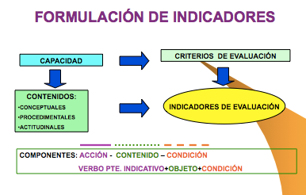{width="300px"}

Deberá existir siempre una coherencia interna entre capacidades terminales (LOGSE)
resultados de aprendizaje (LOE), criterios e indicadores de evaluación.
Por último, hemos de indicar que cada uno de los criterios de evaluación, así como los
indicadores en los que se desarrollan, deberán calificarse a través de “ítems de
calificación”, los cuales establecerán la calificación total que corresponde a la evaluación.

A continuación, modo de ejemplo, incluimos la plantilla que se utiliza en el “CIPFP
MISERICORDIA” para evaluar el módulo de “Proyecto” en el CFGS de Administración y
Finanzas, donde se puede diferenciar claramente cada uno de estos aspectos.

| Denominación del proyecto                    | Estructura formal (2 puntos) | Contenidos (5 puntos) | Exposición y Defensa (3 puntos) | NOTA FINAL |
|----------------------------------------------|------------------------------|-----------------------|-------------------------------|------------|
| Apellidos y Nombre del alumno/a:             |                              |                       |                               |            |
| Apellidos y nombre del evaluador             |                              |                       |                               |            |

| CRITERIOS, INDICADORES E ÍTEMS DE EVALUACIÓN | Excelente (0,5) | Bueno (0,4) | Regular (0,3) | Deficiente (0,2) | Pobre (0,1) |
|----------------------------------------------|----------------|-------------|---------------|------------------|-------------|
| **Estructura Formal (20%)**                  |                |             |               |                  |             |
| La fuente, los márgenes, y los párrafos son los mismos a lo largo del documento |                |             |               |                  |             |
| El documento contiene portada, índice con títulos y subtítulos, presentación, desarrollo, conclusiones y bibliografía |                |             |               |                  |             |
| El orden es adecuado a la estructura del trabajo |                |             |               |                  |             |
| La redacción respeta las normas ortográficas y de sintaxis |                |             |               |                  |             |

| **Contenidos (50%)**                         |                |             |               |                  |             |
| El problema a resolver o el objetivo final del proyecto está definido |                |             |               |                  |             |
| Originalidad y/o novedades que aporta         |                |             |               |                  |             |
| Se identifica el sector de actividad y el área de intervención dentro de la empresa |                |             |               |                  |             |
| Se han definido objetivos de carácter intermedio para alcanzar la meta |                |             |               |                  |             |
| Las estrategias establecidas son adecuadas    |                |             |               |                  |             |

| **Exposición y Defensa (30%)**                |                |             |               |                  |             |
| Argumentación clara y ordenada                |                |             |               |                  |             |
| Capacidad de resolución de dudas              |                |             |               |                  |             |
| Uso adecuado de recursos para la presentación |                |             |               |                  |             |

Como se observa, para la evaluación del módulo de Proyecto, se han establecido tres
criterios de evaluación, y cada uno de ellos se ha descompuesto en distintos indicadores
de evaluación, y a cada uno de ellos se le otorga un “ítem” de calificación cualitativo, que
va desde “excelente a pobre”, al que corresponde a su vez una calificación numérica, que
va desde 0,5 a 0,1 respectivamente. A su vez cada criterio de evaluación se evalúa
ponderando sobre 100, el peso del mismo, el cual corresponderá a la suma total del ítem
de calificación de los indicadores.

La forma de rellenar el cuadro consistirá en marcar cada una de las casillas
correspondientes que correspondan a la decisión del evaluador, de forma que se van
obteniendo las calificaciones parciales correspondientes a los criterios, y cuya suma total
corresponderá a la nota final.

### ¿CON QUÉ EVALUAR? TÉCNICAS VERSUS INSTRUMENTOS DE EVALUACIÓN

Antes de contestar a la última de las preguntas base que nos hemos planteado al
principio, sobre con qué evaluar, nos vamos a referir a las denominadas técnicas de
evaluación, que se identifican como aquellos procedimientos que nos permiten captar o
percibir información sobre conductas, conocimientos, habilidades, sentimientos, y logros
que exteriorizan los y las estudiantes a través de los indicadores de evaluación. Cada una
de esas técnicas contendrá lo que denominaremos los instrumentos o pruebas de
evaluación y que dará respuesta a esa última pregunta base a la que nos referíamos al
principio ¿con qué evaluar?
Las técnicas de evaluación, en general responden a la siguiente clasificación:

1. De interrogatorio: Procedimientos mediante los cuales se solicita información al
estudiantado, en forma oral o escrita. Evalúa básicamente el área cognoscitiva. Las
preguntas requieren su opinión, valoración personal o interpretación de la
realidad, basándose en los contenidos del plan curricular. Ejemplo de
instrumentos pertenecientes a esta técnica son los exámenes o pruebas objetivas,
tanto orales como escritas, que pueden adoptar distintas formas (orales:
exámenes/pruebas, intervenciones, diálogos, exposiciones, entrevistas…y escritas:
exámenes/pruebas, cuestionarios, trabajos de investigación, informes, proyectos…).

2. De resolución de problemas: Esta técnica consiste en solicitar al estudiantado la
resolución de problemas. Se evalúa conocimientos y habilidades. Los problemas
que se presentan al estudiantado pueden ser de orden conceptual, para valorar el
dominio del o de la estudiante a nivel declarativo o bien pueden implicar el
reconocimiento de la secuencia de un procedimiento. Ejemplo de instrumentos de
este tipo son las pruebas objetivas, las pruebas de ensayo o por temas,
simuladores escritos y pruebas estandarizadas.

3. De ejecución o solicitud de productos: Se refiere a la solicitud de productos
resultantes de un proceso de aprendizaje. Deben reflejar los cambios producidos
en el campo cognoscitivo y demostrar las habilidades que el estudiantado ha
desarrollado o adquirido, así como la información que ha integrado. Son diversos
y variados dependiendo del área de conocimiento, los objetivos, el propósito y el
tiempo que se determine para su elaboración. Ejemplos de instrumentos de este
tipo son los proyectos, monografías, o ensayos, prácticas de taller, pruebas de
demostración y ejecución de procesos.

4. Observación: Permite evaluar aspectos como el afectivo y el psicomotor, los cuales
difícilmente se evaluarían con otro tipo de técnica, pues de manera inmediata se
identifican los recursos con que cuenta el estudiantado y la forma en que los usa,
tales como la identificación, selección, ejecución y/o integración, en función del
producto que genere en una situación real o simulada. Ejemplos de instrumentos
de este tipo son: participación, exposición oral, demostraciones, listas de
verificación (de cotejo) registros anecdóticos y escalas de evaluación. Esta técnica
se puede llevar a cabo tanto de forma espontánea como sistemática.

Así pues, ya hemos visto como hemos de distinguir claramente entre lo que son técnicas
e instrumentos o pruebas. Las técnicas son los procedimientos que nos permitirán captar
la información necesaria, mientras que los instrumentos o pruebas serán las
herramientas que nos permiten recoger y registrar información de los aprendizajes de
los y las estudiantes, es decir, los materiales físicos con las que vamos a evaluar.

Los instrumentos o pruebas de evaluación deben elaborarse en función de los
indicadores que se espera registrar, relacionados con el aprendizaje de conocimientos,
habilidades, destrezas motrices y actitudes.

En su elaboración deben cumplirse dos tipos de condiciones:

Prácticas:

* Fácil construcción
* Fácil de administrar
* Sencillo de corregir y e interpretar
* Bajo coste

Técnicas:

* Validez: grado en que un instrumento sirve al propósito para el cual se va a utilizar
y ofrece la información que se requiere. “Mide lo que se desea medir”.

* Confiabilidad: Grado de confianza en la información que brinda dicho
instrumento. Evaluar con precisión y consistencia (se obtiene el mismo resultado
en diferentes momentos).

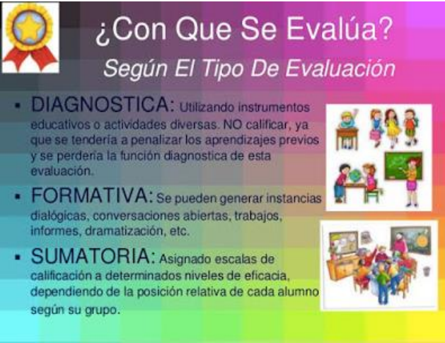{width="300px"}

Por lo tanto, en conclusión, en el proceso de evaluación, identificaremos las siguientes
etapas:

1. Identificación de indicadores y criterios
2. Selección de la técnica y elaboración de los instrumentos.
3. Obtención y registro de la información
4. Organización y tabulación de los resultados
5. Emisión de un juicio sobre la calidad del aprendizaje, expresado mediante una calificación.
6. Toma de decisiones

**Distintos tipos de Pruebas de Evaluación**

Como ya adelantábamos cuando hablamos de elección de actividades o pruebas de
evaluación, profundizaremos ahora en los distintos tipos de pruebas y en su clasificación
en función de tipo de aprendizaje que pretenden evaluar.
A pesar de las diferencias existentes entre sistemas de evaluación continuos y finales, no
podemos hablar de unas actividades específicas o propias de unos sistemas u otros, sino
de modos o formas diferentes de plantear una actividad. Es la particular labor del docente
la que debe dotar a ésta de idoneidad y suficiencia para evaluar adecuadamente un

determinado contenido. Y no todos los contenidos son iguales, ni todas las actividades
pretenden o pueden evaluar los mismos contenidos y objetivos.
En las diferentes actividades que se recogen en este apartado se ha optado por no
diferenciarlas atendiendo a su posible naturaleza teórica o práctica, por cuanto no
pueden circunscribirse de manera excluyente a uno u otro ámbito, dependerá de su
configuración final. Todas ellas gozan de cierta autonomía y flexibilidad para ser
plenamente eficaces como instrumento evaluador de un determinado contenido.

Dos son, a nuestro juicio, los criterios o referencias que deben determinar el diseño de
una actividad concreta:

* que resulte idónea en atención a los objetivos y competencias que se plantean
para la actividad y

* que el contenido sea acorde a la materia objeto de evaluación, es decir, elegir la
actividad adecuada y plantearla correctamente.

Así mismo, las características que debe tener cualquier prueba que pretenda evaluar
aprendizajes, son:

- Ser objetiva: Ser justa con las personas evaluadas, evitando juicios subjetivos.
- Ser eficiente: Debe permitir llegar fácilmente a los resultados deseados y de la forma más eficiente.
- Transparencia: Abarcar procesos abiertos y que sean comprensibles para una persona interesada.
- Comprensibilidad: cubrir todos los objetivos y criterios.
- Discriminación: Diferenciar al candidato exitoso de aquel que no lo es.

Ello determina que, aunque sea recomendable en sistemas de evaluación continua (por
las características intrínsecas de estos modelos), no abusar de determinados tipos de
actividades, especialmente aquéllas de carácter memorístico o de simple plasmación
teórica de contenidos, pueden resultar igualmente válidas si se plantean adecuadamente.
Y a la inversa, la utilización de una determinada actividad que a priori pueda resultar más
próxima a modelos de evaluación continua, puede no garantizar que se alcancen los
objetivos que aquélla persigue.

Se ha señalado anteriormente que el diseño de cualquier actividad de evaluación no
puede desligarse del proceso de aprendizaje. Esta circunstancia conlleva necesariamente
que la misma se adecue a los objetivos que aquél persigue. Pero, además, deben considerarse otros factores, intrínsecos a la propia configuración de los sistemas de
evaluación continua y cuya inobservancia puede distorsionar el proceso evaluativo, a
pesar de abordarse suficientemente los contenidos que se pretendían evaluar. Nos
referimos concretamente al entorno en el que va a realizarse la actividad: lugar, tiempo y
herramientas o materiales de que dispone o puede disponer el estudiantado.

Así, deberá tenerse en consideración si la actividad planteada al estudiantado va a
desarrollarse íntegramente en el aula, de forma mixta (se prepara fuera del aula y,
posteriormente, se realiza en ella) o si se resolverá en su totalidad fuera de la misma.
Según uno u otro caso, el tiempo de que dispondrá el o la estudiante para resolver la
actividad, así como la posibilidad o no de trabajar con materiales de apoyo será diferente,
propiciando una mayor presencia de un tipo de actividades frente a otro.

Estas circunstancias, si bien deben estar presentes a la hora de elegir un tipo concreto de
actividad, no han de ser determinantes en el momento de diseñar su contenido
específico. Una cosa es la materia sujeta a evaluación y otra muy distinta es el entorno en
el que va a evaluarse. No corresponde evaluar al segundo; y, por ende, no puede primar
sobre el primero. En caso contrario, se corre el riesgo de que la actividad diste mucho, o
poco tenga que ver, con los objetivos del aprendizaje y, al mismo tiempo, su resolución
constituya una auténtica odisea para el estudiantado. Y esto no es gratuito, ya que,
además de desmotivarle (tras el estudio de la materia de referencia, puede tener serias
dificultades para la resolución de la actividad), puede alterarse el propio proceso de
aprendizaje, puesto que el estudiantado puede inclinarse a realizar la actividad sin
prepararse previamente la materia. Circunstancia que se agravaría si, además, el tiempo
necesario para resolver la actividad fuera totalmente desproporcionado con relación al
necesario para el estudio de los contenidos sujetos a evaluación. Y es que no debe
olvidarse que el estudiantado afronta el aprendizaje de un módulo en función del sistema
de evaluación del mismo.

Una de las causas que explican este fenómeno reside en que, no en pocas ocasiones, se
recurre a la formulación de actividades más propias de un sistema de evaluación final.
Habitualmente, estas últimas tienen como finalidad complementar o ampliar contenidos
cuyo principal se evaluará en un momento final mediante una prueba única (examen
final) y, por tanto, sin mermar el proceso evaluativo. Trasladar este modelo a un sistema
de evaluación continua, en el que la misma ni es única ni se sitúa en un solo momento,
puede tener consecuencias perniciosas para el propio sistema.

Pero existe, además, otro motivo de mayor peso, como puede ser la cierta desconfianza
del docente hacia el estudiantado por la posibilidad de éste de disponer de cuanto material desee para la realización de la actividad y, de manera especial, si la misma no se
desarrolla en presencia del evaluador.
Se insiste, entonces, en que el diseño de las diferentes actividades no debe circunscribirse
a esta problemática, ya que existen numerosos instrumentos evaluativos que permiten
superar dichas dificultades. Los distintos entornos deben ser vistos como una nueva
posibilidad para trabajar diferentes competencias y que, en ocasiones, no es posible que
se dé en sistemas de evaluación final. Es, por lo tanto, un reto que hay que abordar desde
el optimismo y no como una amenaza para el sistema evaluador.

Afrontar el sistema de evaluación desde esta perspectiva es, además, coherente con una
metodología que configura a la actividad en sí como algo más que una mera ponderación
del progreso de aprendizaje del o de la estudiante. El nuevo rol que el nuevo escenario
otorga a éste, como eje central del aprendizaje, hace necesario que las actividades sean,
asimismo, instrumentos orientados a esa finalidad, como parte integrante de la misma.

Una vez determinada la actividad específica con la que evaluaremos un determinado
contenido, deben considerarse algunos aspectos a la hora de elaborar los enunciados
concretos. En primer lugar, hay que prestar especial atención al tiempo que necesitará el
o la estudiante para resolver la actividad y que ha de ser proporcionado y real. Para ello,
es necesario ponerse en la piel de estudiantado, lo cual no siempre es fácil, como ya se
ha señalado, aunque debe tenerse presente que siempre será un tiempo superior al que
emplearía el docente.

En segundo lugar, el grado de conocimiento y comprensión que tiene el docente no es el
mismo que puede tener el estudiantado, sobre todo en actividades de temática muy
amplia. Resulta, por tanto, imprescindible formular, de forma clara los enunciados, y qué
es lo que se quiere que resuelva el o la estudiante en la práctica concreta, especialmente
en aquellas actividades que realiza por primera vez o que requieren de cierta formalidad.
En estos últimos, es recomendable pautar u orientar al y a la estudiante, al menos durante
la primera actividad, ya que su desarrollo requiere de cierta praxis de la que aquél puede
carecer.

Por último, en aquellas actividades que se realizarán íntegramente de forma no
presencial (fuera de la tutela del evaluador), la posibilidad que tiene el estudiantado de
plantear dudas o aclaraciones sobre un enunciado concreto no es la misma que si se
realiza de manera presencial, con la consecuente demora para el desarrollo de la
actividad. Este hecho refuerza la necesidad anteriormente mencionada de prestar
especial atención a la formulación de la actividad, previendo y evitando posibles dudas,
fruto de una falta de claridad o concreción en el planteamiento de la actividad.

Sin ánimo de ser exhaustivos, la relación de actividades que se detallan a continuación
pretende reflejar las prácticas más habituales e identificar el trabajo de determinadas
habilidades o competencias que se alcanzan con las mismas. Un sistema de evaluación
continua rico debería tener una tipología de actividades lo más variado posible, ya que no
todos los contenidos y competencias pueden ser tratados con las mismas actividades y
viceversa. Asimismo, si bien cada una de ellas presenta una caracterización especial
propicia para evaluar unos contenidos y competencias concretos, nada impide que
puedan ser utilizadas para evaluar contenidos más propios de otras actividades.

**Enunciados con respuesta múltiple, alternativa, de clasificación, de identificación, de selección o de completar.**

Con carácter general, los enunciados con respuesta múltiple, alternativa, de clasificación,
de identificación, de selección o de completar, posibilitan la evaluación de contenido muy
diverso en poco espacio y tiempo. Se trata de pruebas objetivas, al ser la respuesta
correcta única, inequívoca y ajena a cualquier interferencia subjetiva del evaluador. Esta
circunstancia determina, igualmente, que sean un valioso instrumento de aprendizaje, ya
que facilitan al estudiantado conocer de manera bastante fiable y rápida su progreso en
aquél y sin necesidad de intervención de evaluador externo alguno (autoevaluación). Por
el contrario, generalmente, aporta escasa información al estudiantado acerca de la
respuesta, es decir, sabe que está bien o mal, pero no porqué. Y este grado de
inconcreción se traslada al evaluador a la hora de determinar el grado de aprendizaje del
o de la estudiante y que puede tener origen no en una falta de conocimiento de la materia,
sino en la inadecuada formulación de la pregunta o de sus posibles respuestas.

Habitualmente, las respuestas incorrectas no tienen el mismo grado de incorrección, por
lo que la elección de una u otra denota también un nivel de conocimiento de la materia
diferente y que, en ningún caso, admite matices. Para evitarlo, es recomendable que:

* la elaboración de los enunciados y la proposición de las respuestas se realice de
forma clara y evitando redacciones confusas o equívocas;

* que todas las respuestas que se ofrecen como posibles guarden cierta
homogeneidad; y, por último,

* que, una vez evaluada la actividad, se facilite al estudiantado, sobre cada una de
las posibles respuestas, una breve explicación o comentario sobre la idoneidad o
no de las mismas.

Los enunciados con respuesta múltiple, alternativa, de clasificación, de selección o de
completar son herramientas eficaces para la evaluación y el aprendizaje de competencias
tales como la capacidad de análisis, el razonamiento crítico y, en ocasiones, la aplicación práctica de determinados conocimientos. Por el contrario, su eficacia resulta muy limitada para trabajar otros aspectos como la capacidad de comunicación escrita/oral o capacidad
de síntesis, por lo que resulta recomendable completarlas con otro tipo de actividades.

Cuestiones de respuesta breve o concisa Las cuestiones de respuestas breve o concisa,
aunque en menor medida que las anteriores, permiten la evaluación de amplios
contenidos, posibilitando someter a evaluación, además de las propias del grupo anterior,
otras competencias o aptitudes como la capacidad de síntesis, grado de adecuación, uso
adecuado del lenguaje específico, etc. Este alcance de contenidos es lo que las diferencia
de las cuestiones que veremos en los apartados siguientes, las cuales, si bien se
configuran igualmente como preguntas breves, no tienen esta proyección, al referirse a
un contenido de aprendizaje muy concreto ligado al supuesto planteado en la actividad
(caso práctico, fragmento de texto, etc.).

En este tipo de actividades no prima tanto la brevedad material de la contestación como
la concisión de la misma, circunscrita a un posible ámbito de respuesta reducido. Así,
desde el punto de vista del evaluador, presenta ventajas de corrección, por cuanto se
trata (aunque con algunos matices), de cuestiones muy próximas a las de respuesta
objetiva.

Las preguntas de desarrollo consisten en enunciados o cuestiones de respuesta amplia
donde el estudiantado dispone de cierta libertad para su elaboración. Pueden ser
planteadas de forma abierta o guiadas. En estas últimas, se determina mediante
subpreguntas el contenido principal que debe comprender la respuesta, evitando así que
el o la estudiante divague en su resolución. En cualquier caso, la redacción de los
enunciados debe ser clara y formulada de manera que el estudiantado comprenda
fácilmente qué es lo que se pretende que responda.

Mediante estas actividades se posibilita la evaluación y el trabajo de competencias tales
como la capacidad de análisis, capacidad de síntesis, razonamiento crítico y comunicación
escrita u oral. Su principal inconveniente es que, al tratarse de cuestiones de respuesta
abierta, resulta difícil evaluarlas de manera objetiva.
El trabajo con textos y estudios comparativos: resúmenes, esquemas, cuadros, gráficas,
tablas
Dentro del grupo de actividades del trabajo con textos y estudios comparativos, se
engloban un conjunto de actividades que tienen como denominador común su
formulación en torno a un material específico y/o la necesaria observación de una
particular metodología o forma para una correcta resolución.

La estructura puede ser muy variada, desde simples resúmenes, esquemas, hasta
formatos más complejos que incluyen gráficas, cuadros, tablas, etc.
Cuando la actividad tenga como base principal un determinado texto (artículo científico,
texto legal, resolución judicial, etc.) debe prestarse especial atención a la elección de éste,
al efecto de que el mismo posibilite abordar eficazmente los contenidos y objetivos que
persigue la actividad. Si lo que se pretende es incidir más en el seguimiento de una
determinada metodología para la resolución de la actividad, o que la misma tenga una
forma determinada, debe establecerse de forma clara cuál es esta.
Las principales competencias que se desarrollan mediante este grupo de actividades son:
capacidad de análisis, capacidad de síntesis, razonamiento crítico, comunicación oral o
escrita y, en ocasiones, conocimientos de informática.

**Debates y grupos de discusión**

Los debates y grupos de discusión son actividades muy flexibles en cuanto a su
planteamiento como a su realización y constituyen una herramienta eficaz para la
reflexión, como complemento del estudio o para ofrecer una visión práctica de
determinadas cuestiones.

Por lo que respecta a los debates, pueden realizarse de forma oral o escrita. En este
último caso se fomenta más la reflexión al no ser las intervenciones espontáneas (el
estudiantado dispone de tiempo suficiente para su preparación) y posibilitar un adecuado
seguimiento de todas las participaciones que se vayan realizando, mediante la lectura
pausada de las mismas.

Su principal inconveniente yace en las dificultades que entraña su evaluación, al tratarse
de actividades en grupo y, de manera especial, si, además, no todos los y las estudiantes
tienen el mismo conocimiento de la materia, capacidad de análisis, reflexión o capacidad
de argumentación. En estos casos, es fácil que la actividad pierda la dinámica inicial o se
desvíe de su núcleo esencial hacia cuestiones más perentorias y pesen demasiadas
opiniones personales que poco o nada tengan que ver con la temática planteada.
Así, resulta imprescindible establecer, al inicio de la actividad, los criterios a los que deben
sujetarse las intervenciones y el desarrollo general de la actividad, así como la evaluación
de la misma, al efecto de evitar las situaciones no deseables apuntadas y que son
frecuentes en este tipo de actividades: la falta de participación, las intervenciones
reiterativas y aquellas otras que poco o nada tienen que ver con la temática planteada. Y
es que, como, en muchas ocasiones, se plantean en torno a cuestiones de actualidad,
éstas no son desconocidas para el estudiantado, siendo fácil que no se aborden desde
una perspectiva determinada -la que exige la actividad-, sino desde la simple opinión
personal.

El papel del docente no debe limitarse a ese estadio inicial, de establecimiento de las
reglas del juego, sino que debe estar presente durante toda la actividad. Ha de procurar
un nivel óptimo de participación de todos los y las estudiantes y que la temática planteada
inicialmente no acabe agotando la actividad. Y es que las cuestiones planteadas al inicio
del debate deben establecer únicamente un punto de partida que permita explorar otras
cuestiones que puedan ir surgiendo a raíz de las intervenciones de los y las estudiantes,
posibilitando así abrir nuevas vías de debate. En caso contrario, es fácil que la actividad
se estanque con las intervenciones de los primeros participantes, especialmente si el
número de estudiantes es considerable.

**Formulación de supuestos prácticos**

En relación con la formulación de supuestos prácticos, a partir de una serie de datos o
informaciones, el estudiantado debe resolver determinadas cuestiones. Por lo general,
estas actividades se construyen en torno a hechos reales o muy próximos a la realidad
para plantear diversas hipótesis.

Los supuestos prácticos permiten medir con bastante fiabilidad la capacidad de aplicar
los conocimientos a la práctica. Pero, además, fomenta el desarrollo y permite evaluar
otras competencias como la capacidad de análisis, el razonamiento crítico, la resolución
de problemas, toma de decisiones, razonamiento crítico y comunicación oral o escrita.

## REGISTRO DE LOS RESULTADOS

Por último, tras la realización de las pruebas, debemos registrar los resultados de logro
de las capacidades evaluadas, a través de la tabulación y/o procesamiento de la
información obtenida.
Dicho registro se realiza a través de documentos e informes donde se consignan dichos
resultados, así como la toma de decisiones.
Se trata fundamentalmente de las Actas de evaluación, informes académicos a los y las
estudiantes y los informes técnico- pedagógico, informe de incidencias/rendimientos,
específicos y otros.

# NORMATIVA

Esta tabla resume la normativa actualizada y que sustituye a partes o normativas parciales. También incluye las actualizaciones autonómicas y cambios recientes en la estructura y la implantación obligatoria de la FP Dual.

| Document/Norma Vigente                         | Sustituye/Actualiza                         | Descripción/Contenido                                                                                          |
|-----------------------------------------------|--------------------------------------------|---------------------------------------------------------------------------------------------------------------|
| Ley Orgánica 3/2022, de 31 de marzo           | Ley Orgánica 2/2006 (LOE)                   | Ordena e integra la Formación Profesional, transformando el sistema, aunque las EDRE mantienen especificidad.  |
| LOMLOE (Ley Orgánica 3/2020)                   | Marco educativo anterior                     | Marco general para la educación, complementando la regulación de FP.                                           |
| Real Decreto 659/2023, de 18 de julio          | Real Decreto 1363/2007 (parcial)             | Desarrollo actual del ordenamiento del Sistema de Formación Profesional.                                       |
| Real Decreto 278/2023                          | -                                            | Establece el calendario de implantación obligatoria de la FP Dual desde septiembre 2024.                       |
| Real Decreto 499/2024 y Real Decreto 500/2024 | Normativa antigua sobre títulos (2013-2018) | Actualizan los títulos de Formación Profesional de Grado Medio y Superior para su adaptación a nuevo orden.   |
| Decreto 17/2025 (País Vasco)                   | No aplica directamente a CV                   | Ejemplo de actualización autonómica sobre EDRE.                                                               |
| DOGV 2025/40228 (Comunitat Valenciana)         | -                  | Posibles disposiciones específicas autonómicas para EDRE.                                                      |
| Orden 8/2025 (Comunitat Valenciana)            | Sistema Evaluación anterior                   | Nuevo sistema de evaluación para FP (40% PAC + 60% prueba final) y evaluación conjunta en FP Dual.              |
| Decreto 114/2025 (Comunitat Valenciana)        | Currículos anteriores de FP                   | Actualiza los currículos de los ciclos formativos de grado medio y superior en la Comunitat Valenciana.         |

# BIBLIOGRAFÍA Y FUENTES CONSULTADAS

- [Publicada la Ley Orgánica 3/2022, de 31 de marzo, de ordenación e integración de la Formación Profesional.](https://anpecomunidadvalenciana.es/notices/165820/Publicada-la-Ley-Org%C3%A1nica-32022,-de-31-de-marzo,-de-ordenaci%C3%B3n-e-integraci%C3%B3n-de-la-Formaci%C3%B3n-Profesional.)  
Ley que crea un sistema integrado y renovado de Formación Profesional para responder a las necesidades del mercado laboral y formación continua.

- [Ley Orgánica de Formación Profesional](https://www.todofp.es/comunidad-docente/normativa/normativa-estatal/leyes-organicas-educativas.html)  
Normativa estatal que regula la ordenación y estructura general de la Formación Profesional en España.

- [Ley Orgánica 3/2022, de 31 de marzo, de ordenación e integración de la Formación Profesional.](https://www.boe.es/buscar/act.php?id=BOE-A-2022-5139)  
Ley que actualiza y moderniza el sistema de Formación Profesional, sustituyendo la normativa anterior y estableciendo el marco básico actual.

- [LOMLOE (2020) - educaweb.com](https://www.educaweb.com/contenidos/educativos/sistema-educativo/leyes-educacion-estatales/lomloe-2020/)  
Explicación de la Ley Orgánica 3/2020, que reforma el sistema educativo general, marcando el marco legal para la FP.

- [LOMLOE: Nueva ley de educación - Biblioteca de Educación](https://www.educacionyfp.gob.es/biblioteca-central/blog/2022/lomloe.html)  
Descripción y análisis de la ley que regula la educación general, con prioridad en la equidad y calidad educativa.

- [Nuevos Elementos y Estructura en la Formación Profesional](https://todofp.es/sobre-fp/informacion-general/elementos-estructura-formacion-profesional.html)  
Análisis de la reorganización de la FP con un sistema modular de 5 grados y la integración del modelo dual.

- [Implantación de la nueva Ley de Formación Profesional. Curso 2024-2025.](https://www.educa.jccm.es/es/fpclm/implantacion-nueva-ley-formacion-profesional-curso-2024-202)  
Proceso y fases de implantación de la ley desde el curso 2024, con enfoque en la FP Dual y homologación nacional.

- [Publicado el Real Decreto de Ordenación del Sistema de Formación Profesional](https://www.todofp.es/gl/comunes/noticias/2023/noticia24072023-realdecreto659.html)  
Normativa que desarrolla la ordenación del sistema y estructura curricular de la Formación Profesional en España.

- [BOE-A-2025-2039 Real Decreto 69/2025, de 4 de febrero, por el que se regulan los títulos de FP](https://www.boe.es/buscar/doc.php?id=BOE-A-2025-2039)  
Real Decreto que establece modificaciones en los títulos de Formación Profesional y su regulación para 2025.

- [Nuevo Real Decreto 69/2025 sobre Formación Profesional](https://www.ideaspropiaseditorial.com/blog/novedades-real-decreto-69-2025/)  
Análisis y resumen de las novedades legislativas para la formación profesional en el Real Decreto 69/2025.

- [Los nuevos códigos de la Formación Profesional](https://www.ideaspropiaseditorial.com/blog/nuevos-codigos-de-la-formacion-profesional/)  
Explicación sobre la actualización y asignación de nuevos códigos a los títulos y certificados de FP.

- [El Catálogo Nacional de Estándares de Competencias Profesionales (CNECP) - Web INCUAL - Educación](https://incual.educacion.gob.es/bdc)  
Plataforma oficial del Catálogo Nacional que organiza las competencias profesionales de FP.

- [BOE-A-2025-13147 Real Decreto 532/2025 sobre ordenación de módulos formativos](https://www.boe.es/diario_boe/txt.php?id=BOE-A-2025-13147)  
Decreto que regula la estructura y organización de los módulos profesionales en FP.

- [Niveles (o grados) de competencia profesional según la Ley de Formación Profesional](https://cifp.es/index.php?option=com_content&view=article&id=689&Itemid=463)  
Descripción de los cinco grados (A, B, C, D y E) que organizan la FP en España.

- [Nueva Ley de la Formación Profesional: todo lo que debes saber](https://www.grupo2000.es/se-publica-en-el-boe-la-nueva-ley-de-la-formacion-profesional/)  
Guía explicativa de los principales cambios introducidos por la Ley Orgánica 3/2022.

- [Ley de FP 2024-25: ¿qué novedades incorpora? - CEAC](https://www.ceac.es/blog/formacion-profesional/ley-fp-2024)  
Descripción de la modernización estructural y normativa en FP para el curso 2024-25.

- [ORDE 79/2010, de 27 d'agost, de la Conselleria d'Educació](https://www.ciclosformativosceu.es/docs/normativa/orden-79-2010-evaluacion-alumnado-fp.pdf)  
Orden que regula los criterios y procedimientos de evaluación para FP en la Comunitat Valenciana.

- [Evaluación - Formación Profesional - Generalitat Valenciana](https://ceice.gva.es/es/web/formacion-profesional/avaluacio)  
Página oficial con normativa y criterios de evaluación en la FP para la Comunitat Valenciana.

- [Orden 8/2025 - Resultado DOGV - Generalitat Valenciana](https://dogv.gva.es/es/resultat-dogv?signatura=2025%2F13083)  
Orden que establece el modelo de evaluación, promoción y titulación en FP para 2025.

- [Publicada la Orden de Evaluación en ciclos formativos y cursos de especialización](https://anpecomunidadvalenciana.es/notices/194605/Publicada-la-Orden-de-Evaluaci%C3%B3n-en-ciclos-formativos-y-cursos-de-especializaci%C3%B3n)  
Texto oficial que regula la evaluación en ciclos formativos y cursos de especialización en FP.

- [Cómo EVALUAR en FP Dual (Nueva ley de FP) — YouTube](https://www.youtube.com/watch?v=yboaMn3biUc)  
Vídeo explicativo sobre evaluación en la FP Dual conforme a la nueva legislación.

- [NUEVA ORDEN en la CV: la EVALUACIÓN en la FP — YouTube](https://www.youtube.com/watch?v=ea-xq1ONE4I)  
Vídeo informativo de la nueva orden autonómica sobre evaluación en FP en Comunitat Valenciana.

- [Aspectos normativos - Formación Profesional](https://ceice.gva.es/es/web/formacion-profesional/normativa-sobre-ordenacion-y-organizacion-academica-de-los-ciclos-formativos)  
Página oficial con normativa vigente sobre la ordenación de ciclos formativos de FP.

- [DECRETO 114/2025, de 29 de julio, del Consell, por el que se establecen los currículos de los ciclos formativos de grado medio y superior de Formación Profesional - DOGV](https://dogv.gva.es/es/resultat-dogv?signatura=2025%2F29742)  
Establece los nuevos currículos para los ciclos formativos de FP en la Comunitat Valenciana actualizados al marco estatal.

- [Decreto de currículos de los ciclos formativos de grado medio y de grado superior de Formación Profesional](https://www.anpecomunidadvalenciana.es/notices/196975/Decreto-de-curr%C3%ADculos-de-los-ciclos-formativos-de-grado-medio-y-de-grado-superior-de-Formaci%C3%B3n-Profesional)  
Texto oficial que desarrolla y actualiza la estructura curricular para FP en dos niveles formativos.

- [El Consell adapta los ciclos de FP a la nueva ley estatal](https://valencianews.es/comunidad-valenciana/adaptacion-ciclos-fp-comunitat-valenciana/)  
Noticia sobre la adecuación y actualización de los planes de estudios de FP a la legislación estatal vigente.

- [ANPE C. Valenciana: Noticia - Currículo](https://anpecomunidadvalenciana.es/etiqueta1/Curriculo)  
Noticias y actualizaciones sobre la ordenación curricular de FP en la Comunitat Valenciana.

- [La Generalitat actualiza el currículo FP Básica para reforzar](https://valencianews.es/comunidad-valenciana/nuevo-curriculo-fp-basica/)  
Información sobre la modernización del currículo de Formación Profesional Básica en la Comunitat Valenciana.

- [El Consell aprueba el decreto que establece los nuevos currículos de los ciclos de grado básico de FP](https://www.magisnet.com/2025/08/el-consell-aprueba-el-decreto-que-establece-los-nuevos-curriculos-de-los-ciclos-de-grado-basico-de-fp/)  
Decreto que regula las enseñanzas de FP Básica para asegurar calidad y adaptación a la nueva normativa.

- [Nueva Ley de Formación Profesional: Comunidad Valenciana](https://josesande.com/2024/08/21/nueva-ley-de-formacion-profesional-comunidad-valenciana/)  
Artículo informativo sobre los cambios normativos en FP en la Comunidad Valenciana tras la nueva ley estatal.

- [Objetivos y estructura del CNECP - Web incual - Educación](https://incual.educacion.gob.es/objetivos)  
Página oficial con los objetivos y estructura del Catálogo Nacional de Estándares de Competencias Profesionales.

- [Acreditación de Competencias Profesionales](https://todofp.es/acreditacion-de-competencias.html)  
Información sobre los procesos para acreditar competencias profesionales adquiridas en diferentes vías.

- [Instrucciones inicio curso 2025-26 FP](https://ensenyamentugtpv.org/wp-content/uploads/2025/07/2.-Instruccions-graus-D-E-2025-26-mesa-ugtcas.pdf)  
Normativa y orientaciones para la puesta en marcha del curso académico 2025-26 en FP para grados D y E.

- [Instrucciones de inicio de curso 2024-25 de Formación Profesional](https://anpecomunidadvalenciana.es/notices/188358/Instrucciones-de-inicio-de-curso-2024-25-de-Formaci%C3%B3n-Profesional)  
Documento oficial con el protocolo para el inicio del curso 2024-25 en FP en la Comunitat Valenciana.

- [Publicada la 'Ley Celaá', de reforma del sistema educativo](https://elconsultor.laley.es/Content/Documento.aspx?params=H4sIAAAAAAAEAMtMSbF1jTAAAkNTCzNzI7Wy1KLizPw8WyMDIwNDI2MDkEBmWqVLfnJIZUGqbVpiTnEqAMM5phs1AAAAWKE)  
Explicación sobre la reforma educativa estructurada en la Ley Orgánica 3/2020, conocida como 'Ley Celaá'.

- [BOE-A-2022-5139 Ley Orgánica 3/2022, de 31 de marzo, de ordenación e integración de la Formación Profesional](https://www.boe.es/diario_boe/txt.php?id=BOE-A-2022-5139)  
Texto oficial de la Ley que estructura y moderniza la FP en España.

- [BOE-A-2020-17264 Ley Orgánica 3/2020, de 29 de diciembre, por la que se modifica la Ley Orgánica de Educación](https://www.boe.es/buscar/doc.php?id=BOE-A-2020-17264)  
Ley que reforma el sistema educativo estatal, incluyendo bases para FP.

- [BOE-A-2023-16889 Real Decreto 659/2023, de 18 de julio por el que se desarrolla la ordenación del Sistema de Formación Profesional](https://www.boe.es/buscar/doc.php?id=BOE-A-2023-16889)  
Real Decreto que regula la estructura, gestión y organización del Sistema de FP.

- [Ley de Educación - Educagob](https://educagob.educacionfpydeportes.gob.es/lomloe/ley.html)  
Información institucional sobre la LOMLOE y su repercusión en Formación Profesional.

- [Información sobre la nueva Ley de Formación Profesional](https://www.educacionfpydeportes.gob.es/destacados/nueva-ley-fp.html)  
Página oficial informativa sobre las claves y novedades de la nueva Ley de Formación Profesional.

- [Ley Orgánica 3/2022](https://www.fsie.es/documentos/ficheros/Leyes/Revista_FP_FSIE.pdf)  
Publicación detallada y análisis con jurisprudencia de la Ley Orgánica que moderniza la FP.

- [LOMLOE. Ley Orgánica 3/2020, de 29 de diciembre](https://documentos.anpe.es/ANPE_LOMLOE/)  
Documento relacionado con la reforma educativa general y su repercusión en FP.

- [Nueva Ley Orgánica 3/2022 de la FP — YouTube](https://www.youtube.com/watch?v=5ZZLHHo1Jaw)  
Video divulgativo sobre las modificaciones introducidas con la nueva ley de Formación Profesional.

- [Sistema Nacional de Cualificaciones y de Formación Profesional](https://todofp.es/sobre-fp/informacion-general/sistema-nacional-cualificaciones-fp.html)  
Explicación resumida del sistema de cualificaciones profesionales y su integración con FP.

- [BOE-A-2024-13181 Orden EFD/659/2024, de 25 de junio, sobre organización académica](https://www.boe.es/buscar/doc.php?id=BOE-A-2024-13181)  
Orden ministerial que regula la organización académica y las actividades formativas en FP.

- [Guía Práctica de la Orden 8/2025 sobre Evaluación en FP](https://raulsolbes.com/2025/05/16/guia-practica-de-la-orden-8-2025-sobre-evaluacion-en-fp/)  
Explicación práctica y aclaraciones sobre la aplicación de la Orden 8/2025 para la evaluación en FP.

- [Real Decreto 659/2023, de 18 de julio, por el que se desarrolla la ordenación del Sistema de Formación Profesional](https://anpeandalucia.es/notices/178545/Real-Decreto-6592023,-de-18-de-julio,-por-el-que-se-desarrolla-la-ordenaci%C3%B3n-del-Sistema-de-Formaci%C3%B3n-Profesional)  
Análisis del Real Decreto que crea el marco nacional para la gobernanza y la oferta de FP.

- [Nueva ley FP 2024: Todo sobre el próximo curso](https://www.ilerna.es/blog/nueva-ley-fp)  
Resumen de las novedades y expectativas para el curso 2024-2025 tras la nueva ley de FP.

- [EL BOE publica el Real Decreto 659/2023, de 18 de julio, por el que se desarrolla la ordenación del sistema de Formación Profesional](https://cecap.es/el-boe-publica-el-real-decreto-659-2023-de-18-de-julio-por-el-que-se-desarrolla-la-ordenacion-del-sistema-de-formacion-profesional)  
Anuncio oficial de publicación de normativa que establece la ordenación actual de FP.

- [Normativa sobre el CNECP - Web incual - Educación](https://incual.educacion.gob.es/normativa1)  
Normativa reguladora del Catálogo Nacional de Estándares de Competencias Profesionales.

- [Orden EFD/657/2024, de 25 de junio, por la que se regulan aspectos académicos en FP](https://www.boe.es/diario_boe/txt.php?id=BOE-A-2024-13179)  
Orden sobre regulación académica para ciclos formativos de distintas familias profesionales.

- [Real Decreto 659/2023 por el que se desarrolla la ordenación del sistema de Formación Profesional](https://anpearagon.es/notices/180831/Real-Decreto-6592023-por-el-que-se-desarrolla-la-ordenaci%C3%B3n-del-Sistema-de-Formaci%C3%B3n-Profesional)  
Análisis y texto consolidado del Real Decreto referente al sistema nacional de FP.

- [Real Decreto 659/2023, de 18 de julio](https://ceice.gva.es/documents/161634256/174739406/INSTITUTO+VALENCIANO+DE+LAS+CUALIFICACIONES+PROFESIONALES.pdf/9d8c5fa0-f2ed-4f7d-8e6a-ae4386054fa3?t=1727248001062)  
Documento oficial explicativo sobre la implementación del RD 659/2023.

- [Competencias profesionales](https://laadministracionaldia.inap.es/noticia.asp?id=1256457)  
Información general sobre competencias profesionales en el ámbito estatal.

- [Regulación de la evaluación, promoción, titulación y certificación en Formación Profesional](https://laadministracionaldia.inap.es/noticia.asp?id=1250140)  
Artículo con detalles sobre la normativa que regula la evaluación y certificación en FP.

- [Todo sobre el Real Decreto 659/2023: ¿Qué es y cómo afecta?](https://fpaspasia.com/real-decreto-659-2023-que-es-y-en-que-consiste-el-decreto-sobre-formacion-profesional/)  
Explicación clara del contenido y alcance del Real Decreto que establece la ordenación de FP.

- [Real Decreto por el que se desarrollan los elementos integrantes y los instrumentos de gestión del Sistema Nacional de Formación Profesional](https://www.anpe.es/notices/32365/Real-Decreto-por-el-que-se-desarrollan-los-elementos-integrantes-y-los-instrumentos-de-gesti%C3%B3n-del-Sistema-Nacional-de-FP)  
Normativa que detalla instrumentos de gestión y estructura del sistema nacional de FP.

- [DECRETO 117/2025, de 5 de agosto, del Consell - DOGV](https://dogv.gva.es/es/eli?param=es-vc%2Fd%2F2025%2F08%2F05%2F117%2Fdof%2Fvci%2Fhtml)  
Decreto autonómico que regula aspectos relacionados con titulaciones y organización en FP en la Comunitat Valenciana.

- [Legislación Formación Profesional - iessecundaria](https://iessecundaria.wordpress.com/legislacion/legislacion-formacion-profesional-en-comunidad-valenciana/)  
Recopilación de la normativa general y autonómica vigente en FP.

- [Currículos de las Comunidades Autónomas](https://www.todofp.es/que-estudiar/familias-profesionales/imagen-personal/estilismo-direccion-peluqueria/curriculos-ccaa.html)  
Comparativa y resumen de los currículos autonómicos para FP.

- [BOE-A-2021-18812 Real Decreto 984/2021 sobre FP Básica](https://www.boe.es/buscar/doc.php?id=BOE-A-2021-18812)  
Normativa que regula la Formación Profesional Básica.

- [LOE o LOGSE: a qué ciclos de FP afecta](https://www.ilerna.es/blog/diferencia-logse-loe)  
Explicación de cómo afectan las leyes LOE y LOGSE a los ciclos formativos de FP.

- [Ley Orgánica 5/2002, de 19 de junio, de las Cualificaciones y Formación Profesional](https://www.boe.es/buscar/act.php?id=BOE-A-2002-12018)  
Ley que regula las cualificaciones profesionales y la FP en España hasta su actualización.

- [LOE o LOGSE: ¿Cómo saber mi título de FP? - iFP](https://www.ifp.es/blog/loe-logse-como-saber-mi-titulo-fp)  
Guía para identificar si un título de FP corresponde a LOE o LOGSE.

- [Modificación de la Ley Orgánica 5/2002, de 19 de junio mediante la LOMLOEA Formación Profesional](https://incual.educacion.gob.es/ultimas-noticias-del-incual/-/asset_publisher/3YZjCah44Dv2/content/modificacion-de-la-ley-organica-5-2002-de-19-de-junio-mediante-la-lomloea-formacion-profesional-)  
Actualización legal para adaptar la ley anterior a las reformas recientes en FP.

- [Catálogo Nacional de Estándares de Competencias Profesionales](https://www.ideaspropiaseditorial.com/blog/catalogo-nacional-de-cualificaciones-profesionales/)  
Explicación del catálogo que define las competencias profesionales en diferentes sectores.

- [¿Cómo saber si mi título es LOE o LOGSE?](https://medac.es/blogs/te-orientamos/saber-titulo-loe-logse)  
Guía para diferenciar si un título de FP se enmarca en las leyes LOE o LOGSE.

- [BOE-A-2002-12018 Ley Orgánica 5/2002, de 19 de junio, de las cualificaciones y la Formación Profesional](https://www.boe.es/buscar/doc.php?id=BOE-A-2002-12018)  
Texto original de la ley que regula FP y cualificaciones antes de reformas posteriores.

- [LOE o LOGSE: ¿Cómo saber que título FP tengo? - PRO2](https://pro2fp.es/blog/orientacion/loe-o-logse-como-saber-que-titulo-fp-tengo/)  
Artículo orientativo para identificar la legislación que ampara un título de FP.

- [Ley Orgánica 5/2002, de 19 de junio, de las cualificaciones y la Formación Profesional](https://noticias.juridicas.com/base_datos/Laboral/lo5-2002.html)  
Otra referencia al texto legal base previo a la Ley Orgánica 3/2022.

- [Logse o loe: ¿Cómo saber mi título FP?](https://www.cesurformacion.com/blog/logse-o-loe)  
Guía para aclarar el marco legislativo aplicable a los títulos FP antiguos.

- [LEY ORGÁNICA DE ORDENACIÓN E INTEGRACIÓN DE LA FORMACIÓN PROFESIONAL](https://www.llegarasalto.com/wp-content/uploads/2022/10/Agustin-DG-FP-CyL.pdf)  
Informe o análisis de la nueva ley de FP presentada en 2022.

- [¿Cómo saber si mi grado medio es LOE o LOGSE?](https://sinergiafp.es/blog/como-saber-si-mi-grado-medio-es-loe-o-logse/)  
Indicaciones para diferenciar los ciclos formativos de grado medio según su legislación.

- [LEY ORGÁNICA 5/2002, de 19 de junio, de las cualificaciones y la Formación Profesional](https://www.todalaley.com/mostrarLey764p2tn.htm)  
Texto legal histórico de la Ley Orgánica anterior que regía FP.

- [Publicada modificación del Catálogo Nacional de Estándares de Competencias Profesionales](https://anpeandalucia.es/notices/196229/Publicada-modificaci%C3%B3n-del-Cat%C3%A1logo-Nacional-de-Est%C3%A1ndares-de-Competencias-Profesionales)  
Actualización reciente del catálogo que contiene competencias profesionales.

- [¿Cómo saber si tu grado medio es LOE o LOGSE?](https://www.fppro.es/blog/como-saber-si-mi-grado-medio-es-loe-logse/)  
Guía práctica para estudiantes y profesionales para identificar la regulación de su grado medio.

