---
# Front matter
# Metainformació del document
title: "CERTIFICAT OFICIAL DE FORMACIÓ PEDAGÒGICA I DADÀCTICA PER AL PROFESSORAT TÈCNIC"
# author:
titlepage: true

# portada
titlepage-rule-height: 2
titlepage-rule-color: AA0000
titlepage-text-color: AA0000
titlepage-background: ../portades/U1.png

# date: "21-10-2025"
subject: "Proxmox"
keywords: [Xarxa, Instal·lació]
subtitle: "Aprenentatge i ensenyament en la formació professional"
lang: es
page-background: img/bg.png

colorlinks: true
linkcolor: "blue"

# configuració de l'índex
toc-own-page: true
toc-title: Continguts
toc-depth: 2

# capçalera i peu \thetitle
header-left: Aprenentatge i ensenyament en la formació professional
header-right: Curs 2025-2026
footer-left: CEFIRE FP
footer-right: \thepage/\pageref{LastPage}

# Les figures que apareguen on les definim i centrades
float-placement-figure: H
caption-justification: centering 

# No volem numerar les linies de codi
listings-disable-line-numbers: true

# Configuracions dels paquets de latex
header-includes:

  #  imatges i subfigures
  - \usepackage{graphicx}
  - \usepackage{subfigure}
  - \usepackage{lastpage}

  #  - \usepackage{adjustbox}
  # marca d'aigua
  #- \usepackage{draftwatermark}
 # - \SetWatermarkText{\includegraphics{./img/Markdown.png}}
  #- \SetWatermarkText{Per revisar}
  #- \SetWatermarkScale{.5}
  #- \SetWatermarkAngle{20}
   
  # caixes d'avisos 
  - \usepackage{awesomebox}

  # text en columnes
  - \usepackage{multicol}
  - \setlength{\columnseprule}{1pt}
  - \setlength{\columnsep}{1em}

  # pàgines apaïsades
  - \usepackage{pdflscape}
  # caixes mdframed
  - \usepackage{mdframed}
  
  # per a permetre pandoc dins de blocs Latex
  - \newcommand{\hideFromPandoc}[1]{#1}
  - \hideFromPandoc {
      \let\Begin\begin
      \let\End\end
    }
 
# definició de les caixes d'avis
pandoc-latex-environment:
  noteblock: [note]
  tipblock: [tip]
  warningblock: [warning]
  cautionblock: [caution]
  importantblock: [important]
...

\vspace*{\fill}

\begin{mdframed}[linecolor=gray, linewidth=0.5pt, leftline=true, rightline=false, topline=false, bottomline=false]
{\scriptsize
\textbf{EDITA:} \\
Generalitat Valenciana \\
Conselleria d’Educació, Investigació, Cultura i Esport \\
Servei de Formació del Professorat \\
CEFIRE de Formació Professional \\[1em]
\textbf{COORDINACIÓN:} \\
Eva Ciscar Rovira \\
Pablo Moreno Meseguer \\
Fran Navarro García \\[1em]
\textbf{AUTORS VERSIÓ ORIGINAL:} \\
Francisco José de Juan Company \\
Manuela López Paco \\
Encarna Montesa Boix \\[1em]
\textbf{AUTORES REVISIÓN 22-23:} \\
Paula Jardón Giner \\
Almudena Adelaida Navas Saurin \\
Alicia Ros Garrido \\[1em]
\textbf{AUTORES REVISIÓN 25-26:} \\
Gemma Cerezo Gil\\
Alfredo Rafael Vicente Boix \\[1em]
\textbf{MAQUETACIÓ:} \\
Alfredo Rafael Vicente Boix \\[1em]
Este material ha sigut elaborat sota una llicència de \\
Reconeixement-NoComercial-CompartirIgual 3.0 de Creative Commons. \\[0.5em]

\includegraphics[height=8mm,keepaspectratio]{img/cc.png} \\
El codi font es troba disponible a:
\url{https://github.com/arvicenteboix/mastercillo_fp}
}
\end{mdframed}

\newpage

# EL CURRÍCULUM 

## PERSONES COMPETENTS 

El terme “competència professional” ha suposat un canvi de paradigma en la formació professional. El seu èxit es basa en el fet que les persones, en la mesura en què som proveïdores de servicis, treballadores o consumidores, facilitem o requerim de servicis i professionals competents. També les empreses utilitzen, compartixen i entenen este concepte, perquè és allí on va nàixer. 

Què és la competència professional? Com identifiquem a una persona competent? 

A l'hora de definir la competència professional hem de ser conscients de què es tracta d'un constructe social, i que per tant no trobarem una definició científica, sinó que haurem d'obtindre-la a partir d'acords. A continuació, es mostren algunes propostes que, al llarg dels últims anys, han buscat eixe consens: 

 Competència és: 

* Capacitat d'usar el coneixement i les destreses relacionades amb productes i processos i, per consegüent, d'actuar eficaçment per a aconseguir un objectiu (Hates, 1985). 

* Capacitat d'actuar en papers professionals o en treballs conforme el nivell requerit en l'ocupació (NVCQ, 1985). 

* Conjunt de coneixements, destreses i actituds necessàries per a exercir una professió, resoldre problemes professionals de manera autònoma i flexible, i ser capaç de col·laborar en l'entorn professional i l'organització del treball (Bunk, 1994). 

* Una persona és competent si posseïx els coneixements, valors, habilitats i actituds necessaris per a l'acompliment del treball d'acord amb la norma apropiada (Mertens, 1998). 

* Aplicació dels coneixements, capacitats i actituds, que permet realitzar les activitats i rols de treball als nivells requerits en la producció i l'ocupació, i solucionar els problemes derivats del canvi en les situacions de treball (Rueda, 2002). 

* Capacitat efectiva per a dur a terme reeixidament una activitat laboral plenament identificada (OIT, 2004). 

En general, es poden distingir tres perspectives principals: una primera que entén la competència com la capacitat de fer tasques concretes de manera eficaç; una segona centrada en els trets personals, com a actituds, valors o motivacions; i una tercera, més integradora, que combina les dos visions, entenent la competència com la interacció entre saber, saber fer i saber ser. 

Este predomini de l'enfocament tècnic ha sigut especialment visible en l'àmbit de la Formació Professional a Espanya. Des de la reforma de 1970, la terminologia utilitzada en els títols oficials ha recorregut sistemàticament al terme “Tècnic”, com a manera de destacar el caràcter especialitzat i profesionalitzador d'esta formació (Tècnic Auxiliar, Tècnic Especialista, Tècnic Superior…). Esta elecció no sols reflectia una orientació cap a les capacitats operatives, sinó també un intent de dotar a la FP de major reconeixement i prestigi. 

En este context històric i formatiu, la Llei orgànica 3/2022, de 31 de març, que ordena i integra el sistema de Formació Professional — derogant la Llei orgànica 5/2002, de 19 de juny, de les Qualificacions i de la Formació Professional — introduïx una definició més precisa i actualitzada de les competències. En el seu article 2, la llei distingix entre dos tipus fonamentals: la competència bàsica i la competència professional, establint així les bases conceptuals per al nou model formatiu. 

Les competències bàsiques són aquelles que són considerades necessàries per a la realització i desenrotllament personal, per a participar activament en la societat o millorar l'ocupabilitat. El desenrotllament d'estes competències es realitza per múltiples vies, i queda incorporat en qualsevol oferta de formació professional en tant que promou el desenrotllament integral de la persona. 

La Unió Europea ha definit 8 competències bàsiques per a la formació permanent, que tota persona hauria de dominar i que garantixen una major flexibilitat de la mà d'obra per a adaptar-se més ràpidament a l'evolució constant del món: 

* Comunicació en la llengua materna. 

* Comunicació en llengües estrangeres. 

* Competència matemàtica i competències bàsiques en ciència i tecnologia. 

* Competència digital. 

* Aprendre a aprendre. 

* Competències interpersonals, interculturals i socials, i competència cívica. 

* Esperit emprenedor. 

* Expressió cultural. 

Estes competències bàsiques tenen les següents característiques: són coneixements, capacitats, actituds, valors i emocions que no poden entendre's de manera separada; es concreten i desenrotllen associades als diferents contextos d'acció; es nodrixen de les actituds, valors i compromisos que els subjectes van adoptant al llarg de la vida; suposen un procés permanent de reflexió per a coordinar els objectius amb les possibilitats que oferix cada situació; i es desenrotllen, perfeccionen, amplien, o es deterioren i restringixen al llarg de la vida. 

Estes huit competències bàsiques s'entrellacen entre si, perquè determinats aspectes essencials en un àmbit donen suport a la competència en un altre. Així, la competència en les capacitats bàsiques fonamentals de la llengua, la lectura, l'escriptura, el càlcul i les tecnologies de la informació i la comunicació constituïxen el fonament essencial per a l'aprenentatge, mentres que totes les activitats d'aprenentatge se sustenten en la capacitat d'aprendre a aprendre. Al seu torn, hi ha una sèrie de temes que intervenen en les huit competències bàsiques: el pensament crític, la creativitat, la capacitat d'iniciativa, la resolució de problemes, l'avaluació del risc, la presa de decisions i la gestió constructiva dels sentiments. 

Constatem, per tant, que estes competències bàsiques són la base de l'aprenentatge al llarg de la vida, i estan compartides per tots els sistemes de formació en totes les etapes. No obstant això, a més d'estes, la Formació Professional presenta una característica fonamental que ho fa diferent de les altres: ha de preparar a les persones per a ser professionalment competents, i fer que la posada en pràctica d'estes competències li permeta guanyar-se la vida. 

I quant a la Competència professional, ve definida en Llei orgànica 3/2022, de 31 de març, d'ordenació i integració de la Formació Professional, com el conjunt de coneixements i destreses que permeten l'exercici de l'activitat professional conforme a les exigències de la producció i l'ocupació. Les competències professionals s'arrepleguen en els estàndards de competència professional, que serviran per al disseny de qualsevol oferta de formació professional. 

En la mateixa Llei orgànica 3/2022, de 31 de març, d'ordenació i integració de la Formació Professional, es definix Qualificació com: la competència per a l'acompliment d'una activitat professional acreditada oficialment per títols, certificats o acreditacions. Exclusivament en el seu ús en el referit al Marc Espanyol de les Qualificacions (MECU), qualsevol títol o certificat emés per una institució educativa que acredita haver adquirit un conjunt de resultats de l'aprenentatge, després d'haver superat satisfactòriament un programa de formació en una institució legalment reconeguda en l'àmbit del Sistema de Formació Professional. 

Sobre esta base, la Llei orgànica 3/2022, de 31 de març, marca un canvi estructural important. El seu objectiu és crear un sistema unificat de Formació Professional, superant la tradicional divisió entre la formació del sistema educatiu i la formació per a l'ocupació. La llei proposa un model únic, més flexible, dinàmic i centrat en les competències professionals reals, que responga a les demandes dels sectors productius i al desenrotllament personal i professional de les persones al llarg de tota la seua vida. 

Dins d'este nou model de Formació Professional, adquirix una rellevància especial el reconeixement de les competències adquirides a través de l'experiència laboral o de processos formatius no formals i informals. Este reconeixement permet validar els aprenentatges obtinguts fora del sistema educatiu reglat, ampliant les oportunitats de qualificació i afavorint una visió més oberta i inclusiva de l'aprenentatge al llarg de la vida. 

Este principi es desenrotlla amb major claredat en el Reial decret 69/2025, de 4 de febrer, que regula els elements estructurals i els instruments de gestió del Sistema Nacional de Formació Professional. Entre ells, es destaca la incorporació dels estàndards de competència professional, definits per l'Institut Nacional de les Qualificacions (INCUAL). Estos estàndards actuen com a referents comuns per a la formació i l'avaluació, ja que establixen, de manera precisa i objectiva, els coneixements, habilitats i acompliments requerits per a exercir amb eficàcia una determinada activitat professional, conforme a les exigències de qualitat de l'entorn productiu i servixen com a referència per a: 

Dissenyar els títols i certificats professionals. 

Avaluar i reconéixer oficialment les competències adquirides per experiència laboral. 

Alinear la formació amb les necessitats reals del teixit productiu. 

Així doncs, la Formació Professional es convertix en un sistema més coherent, orientat a resultats concrets, i capaç de respondre amb rapidesa a les transformacions del món laboral. 

## EL CATÀLEG NACIONAL D'ESTÀNDARDS DE COMPETÈNCIES PROFESSIONALS 

El Catàleg Nacional d'Estàndards de Competències Professionals, nova denominació que rep el Catàleg Nacional de Qualificacions Professionals (CNCP), és l'instrument del Sistema Nacional de Formació Professional que ordena els estàndards de competències professionals identificats en el sistema productiu, en funció de les competències apropiades i l'estàndard de qualitat requerit per a l'exercici professional, susceptibles de reconeixement i acreditació. 

A este catàleg se li atribuïxen les següents funcions: 

a) Identificarà, classificarà i ordenarà les competències pròpies del mercat laboral significatives per a l'economia productiva amb validesa en tot el territori nacional. El catàleg podrà, així mateix, arreplegar aquells perfils professionals que, pel seu específic valor cultural o patrimonial, requerisquen una especial protecció. 

b) Operarà com a referència obligada per a l'acreditació de competències professionals adquirides per experiència laboral o altres vies no formals o informals. 

c) Proporcionarà la base per al disseny dels mòduls professionals i la creació d'ofertes de formació professional, basades en itineraris, acumulables i acreditables al llarg de la vida, així com per a la mobilitat en un mercat de treball internacional sobre la base de transparència i, si és el cas, equivalència de marcs comuns entre els diferents sistemes nacionals de formació professional de la Unió Europea. 

El Catàleg comprén les Qualificacions professionals més significatives del sistema productiu espanyol, organitzades en famílies professionals i nivells. Constituïx la base per a elaborar l'oferta formativa dels Títols i els Certificats de Professionalitat. El Catàleg inclou el contingut de la formació professional associada a cada qualificació, d'acord amb una estructura de mòduls formatius articulats. Té validesa en tot el territori nacional i ordena les qualificacions professionals susceptibles de reconeixement i avaluació en el sistema productiu. 

El contingut del Catàleg Nacional d'Estàndards de Competències Professionals s'organitzarà en estàndards de competència, per nivells i famílies professionals amb els seus respectius indicadors de qualitat en l'acompliment, conformement a les següents regles: 

a) Els nivells 1, 2 i 3 assignats a cada estàndard de competència seguiran segons criteris concordes amb els comunament establits a escala europea, relatius a coneixements, iniciativa, autonomia, responsabilitat i complexitat de les tasques. 

b) Les famílies professionals es definiran, a efectes orientatius i d'organització del sistema, atenent criteris d'afinitat de la competència professional, podent un estàndard de competència vincular-se a més d'una família professional. 

c) Els estàndards de competència constituïxen la unitat bàsica per al disseny de la formació i per a l'acreditació de competències professionals adquirides per experiència laboral o altres vies no formals o informals. 

d) Els estàndards de competència es componen d'elements de competència, que identifiquen les realitzacions professionals incloses en ells. 

e) Els estàndards de competència podran tindre, excepcionalment, caràcter transversal, quan es referisquen a competències no associades a una o diverses famílies professionals específiques, sinó a múltiples acompliments professionals. 

 

Al costat del Catàleg Nacional d'Estàndards de Competències Professionals, el Catàleg Modular de Formació Professional és un altre dels instruments del Sistema Nacional de Formació Professional que ordena els mòduls professionals de formació professional associats a cada un dels estàndards de competències professionals. Se li atribuïxen les següents funcions: 

a) Determinarà els mòduls professionals vinculats a cada un dels estàndards de competències professionals recollits en el Catàleg Nacional d'Estàndards de Competències Professionals. 

b) Operarà com a referència obligada per al disseny de les ofertes del Catàleg Nacional d'Ofertes de Formació Professional. 

Estructura bàsica d'un Estàndard de Competència Professional (ECP): 

1. Dades d'identificació 

 * Inclou: 
 * Nom oficial de l'estàndard 
 * Família professional a la qual pertany 
 * Nivell de qualificació (1, 2 o 3) 
 * Codi alfanumèric únic 

2. Competència professional 
 És una descripció general del conjunt de coneixements, destreses i actituds necessàries per a exercir una activitat professional de manera eficaç i conforme a les exigències del mercat laboral. 

3. Elements de la competència (EC) 
 Són les realitzacions professionals específiques que ha de dur a terme una persona en el seu lloc de treball. 

Cada element va acompanyat d'indicadors de qualitat (IC), que establixen el nivell d'execució esperat. 

4. Context professional 
 Descriu l'entorn en el qual s'aplica la competència, incloent: 
 
 * Sectors productius i ocupacions relacionades 
 * Equips, ferramentes, materials, procediments i documentació usats 
 * Condicions i característiques de l'entorn de treball 

El nou Catàleg Nacional d'Estàndards de Competències Professionals (denominat anteriorment Catàleg Nacional de Qualificacions Professionals), s'estructura en 26 Famílies Professionals. 

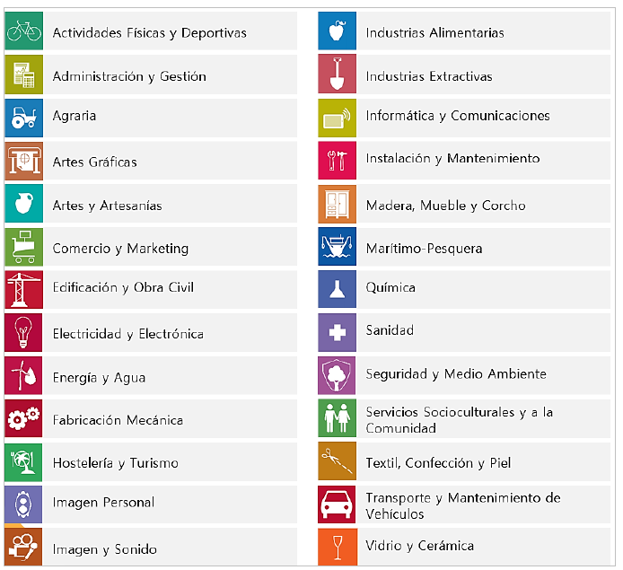{width="300px"}

Una família professional és un grup que reunix diverses qualificacions o especialitats professionals que tenen competències semblants o estan relacionades. 

Característiques que diferencien a una família professional: 
Competències similars: 

- Les professions que formen part d'una mateixa família tenen habilitats i coneixements semblants que s'usen en treballs relacionats. 

Sector o tipus de treball: 

- Cada família està associada a una àrea o sector concret. Per exemple, la família d'Informàtica i Comunicacions inclou treballs relacionats amb ordinadors, programari i xarxes, mentres que la família de Servicis Socioculturals agrupa professions relacionades amb l'atenció social o l'educació. 

Organització de la formació: 

- Les famílies professionals ajuden a organitzar la formació i els títols oficials, així com a definir quines competències ha de tindre cada persona per al seu treball. 

Facilita la mobilitat i el reconeixement: 

- En agrupar treballs semblants, les persones poden canviar d'especialitat o millorar les seues competències dins de la mateixa família. També facilita que es reconeguen oficialment les habilitats adquirides en el treball o per altres vies. 

Diversitat de nivells: 

- Dins d'una família professional hi ha qualificacions amb diferents graus de dificultat o responsabilitat, des de nivells bàsics fins avançats que es corresponen amb nivells assignats a cada estàndard de competència. 

Les famílies professionals són comunes a l'ordenació del Sistema Educatiu i del Sistema de Formació de l'Administració Laboral, i es relacionen amb la Classificació Nacional d'Ocupacions (CNO) i amb la Classificació Nacional d'Activitats Econòmiques (CNAE). 

Al costat del Catàleg Nacional d'Estàndards de Competències, el Catàleg Modular de Formació Professional és un altre dels instruments del Sistema Nacional de Formació Professional que ordena els mòduls professionals de formació professional associats a cada un dels estàndards de competències professionals. Se li atribuïxen les següents funcions: 

a) Determinarà els mòduls professionals vinculats a cada un dels estàndards de competències professionals recollits en el Catàleg Nacional d'Estàndards de Competències Professionals. 

b) Operarà com a referència obligada per al disseny de les ofertes del Catàleg Nacional d'Ofertes de Formació Professional. 

El contingut del Catàleg Modular de Formació Professional s'organitzarà respectant els nivells i les famílies professionals dels estàndards de competència professional amb els seus respectius indicadors de qualitat en l'acompliment i afavorint la transparència de la vinculació directa entre cada estàndard de competència professional i la formació associada, agregada en un mòdul professional. 

Els mòduls professionals permetran, pel seu disseny, identificar la formació vinculada a cada element de l'estàndard de competència i hauran de detallar, almenys: 

a) Els resultats d'aprenentatge vinculats als elements de cada estàndard de competència professional. 

b) Els criteris d'avaluació 

Un mòdul professional és una unitat formativa que forma part d'un títol de Formació Professional. Està vinculat a un o diversos estàndards de competència professional i la seua finalitat és que l'alumnat adquirisca les competències necessàries per a desenrotllar una activitat professional de manera eficaç. 

Relacionar un mòdul professional d'un títol de Formació Professional amb un mòdul d'un certificat professional és totalment possible, ja que els dos s'articulen sobre la mateixa base: els estàndards de competència professional, definits en el Catàleg Nacional d'Estàndards de Competència Professional (que substituïx a l'antic CNCP). 

Taula comparativa: Mòdul de títol vs. mòdul de certificat 

| Element | Mòdul d'un títol d'FP | Mòdul d'un certificat professional |
|---------------|-----------------------------------------------------------------|------------------------------------------------------------------------|
| Finalitat | Formació integral (educativa i professional) | Qualificació laboral específica |
| Marc normatiu | Títol d'FP (RD corresponent) | Certificat professional (RD o resolució corresponent) |
| Vinculació | Un o diversos estàndards de competència professional | Un o diversos estàndards de competència professional |
| Duració | Variable, sol ser més extensa | Adaptada a la unitat de competència associada (més breu) |
| Context | Centres d'FP, amb formació acadèmica estructurada | Formació per a l'ocupació (servicis públics o centres acreditats) |
| Avaluació | Contínua, acadèmica i basada en resultats d'aprenentatge | Basada en criteris d'avaluació de l'estàndard de competència |

## DE LA QUALIFICACIÓ PROFESSIONAL A L'OFERTA FORMATIVA 

Segons el que s'establix en la Llei orgànica 3/2022, de 31 de març, i desenrotllat en el Reial decret 659/2023, de 18 de juliol, que regula l'ordenació del nou Sistema Unificat de Formació Professional a Espanya, l'oferta formativa s'estructura en cinc graus, segons el nivell de complexitat i especialització de les competències adquirides: 

* Grau A: Acreditació parcial de competència 
* Grau B: Certificat de competència 
* Grau C: Certificat professional 
* Grau D: Cicles formatius de grau bàsic, mitjà o superior 
* Grau E: Cursos d'especialització (de grau mitjà o superior) 

L'organització dels continguts formatius varia en funció del grau: 

* Les formacions de Grau A se componen de blocs formatius més xicotets que un mòdul professional, dissenyats per a adquirir o acreditar parts concretes d'un estàndard de competència professional. 
* En els Graus B, C, D i E, la formació s'estructura en mòduls professionals de duració variable, basats en estàndards complets de competència professional, d'acord amb el marc comú establit pel Sistema de Formació Professional, que unifica la formació del sistema educatiu i la formació per a l'ocupació. 

:::note
Podeu trobar més informació sobre la Formació Professional en la web oficial:

[Inici - TodoFP | Ministeri d'Educació, Formació Professional i Esports](https://www.todofp.es/inicio.html) 
:::

## ACREDITACIÓ PARCIAL ACUMULABLE

L'avaluació i acreditació de competències professionals és un procés mitjançant el qual s'atorga una acreditació oficial, a la persona candidata, prèvia avaluació de les competències professionals adquirides per l'experiència laboral i vies no formals de formació. 

El Reial decret 1224/2009, de 17 de juliol, de reconeixement de les competències professionals adquirides per experiència laboral, determina el procediment únic, tant per a l'àmbit educatiu com per al laboral, per a l'avaluació i acreditació de les competències professionals adquirides a través de l'experiència laboral o de vies no formals de formació, del qual tracta l'article 8.2 de la Llei orgànica 5/2002, de 19 de juny, de les Qualificacions i de la Formació Professional. Este Reial decret comporta la realització de convocatòries per les Administracions competents per a avaluar i si és el cas, acreditar la competència professional dels candidats que desitgen veure-la reconeguda. 

Les persones que participen en les convocatòries podran veure acreditades unitats de competència que constituïxen una part d'un títol de Formació Professional o d'un Certificat de Professionalitat. En finalitzar el procediment, la comissió d'avaluació pertinent els indicarà la formació complementària que el participant ha de cursar, si desitja continuar amb la seua formació, per a poder obtindre el títol de Formació Professional o el Certificat de Professionalitat. 

Una Acreditació Parcial Acumulable és la certificació oficial d'una Unitat de Competència. Pot obtindre's en superar els mòduls formatius (dels Certificats de Professionalitat), els mòduls professionals (dels Títols), o en finalitzar de manera positiva el Procediment d'avaluació i acreditació de la competència adquirida a través de l'experiència laboral i de l'aprenentatge informal (EVA). 

La unitat de mesura de la “grandària” d'una qualificació és el “crèdit europeu”, que representa la quantitat de treball que ha de realitzar un aprenent, per a aconseguir els resultats d'aprenentatge. Forma part del llenguatge acadèmic, especialment l'universitari, i en ell s'integren les ensenyances teòriques i pràctiques, activitats acadèmiques dirigides, hores d'estudi, de treball i d'avaluació. 

En l'Espai Europeu d'Ensenyança Superior, que regula l'anomenat procés de Bolonya, esta unitat de mesura és la que utilitzen totes les institucions d'ensenyança Superior, formant part del European Credit Transfer System (ECTS). En la Formació Professional, que seguix amb un cert retard a la superior, a través del Procés de Copenhaguen, es denomina European Credit System for Vocational Education and Training (ECVET). 

# NIVELLS DE CONCRECIÓ EN LA FORMACIÓ PROFESSIONAL: DEL MARC NORMATIU A LA PROGRAMACIÓ D'AULA 

Per a elaborar una programació d'aula coherent i ajustada al marc legal, és fonamental que el docent consulte tota la normativa vinculada al mòdul professional que impartirà. Esta normativa s'organitza en diferents nivells de concreció —des del marc legal general fins als documents específics del centre educatiu— i està elaborada per diferents organismes: l'Estat, les comunitats autònomes i el propi centre. Conéixer i manejar adequadament estos documents garantix que la programació responga als principis del sistema de Formació Professional, a les necessitats de l'alumnat i a les exigències de l'entorn professional. 

Este procés de concreció normativa pot semblar complex, però seguix una lògica clara: part dels principis i objectius establits en la llei, i va descendint per diferents nivells fins a arribar a la realitat de l'aula, on el professorat dona forma a les ensenyances mitjançant la seua programació. 

1. **Elaboració del marc legal**

Responsable: Govern de l'Estat (Corts Generals) 

El punt de partida és la Llei orgànica 3/2022, de 31 de març, que establix els principis, objectius i estructura del nou sistema de Formació Professional. Definix elements clau com els graus de formació, els estàndards de competència professional, la col·laboració amb els sectors productius i l'enfocament d'aprenentatge al llarg de la vida. 

2. **Desenrotllament normatiu i regulació tècnica**

Responsable: Ministeri d'Educació i Formació Professional 

Després de l'aprovació de la llei, el Ministeri desenrotlla el seu contingut mitjançant reials decrets i ordes ministerials. Destaquen especialment: 

* Reial decret 659/2023, que regula l'ordenació general del sistema d'FP. 

* Reial decret 69/2025, que definix els instruments de gestió, com els estàndards de competència, l'acreditació de competències i els procediments d'avaluació. 

En esta fase també intervé l'Institut Nacional de les Qualificacions (INCUAL), encarregat d'elaborar els estàndards de competència professional que serviran de base per als títols i certificats. 

3. **Disseny del catàleg de títols i certificats**

Responsable: Ministeri d'Educació i FP, en col·laboració amb les CCAA i agents sectorials 

A partir dels estàndards de competència definits pel INCUAL, el Ministeri dissenya i aprova els títols de Formació Professional i els certificats professionals. Este procés es realitza en diàleg amb les comunitats autònomes i els sectors productius. 

Cada títol arreplega: 

* Els mòduls professionals que ho componen 

* Els resultats d'aprenentatge i els criteris d'avaluació 

* La duració i estructura formativa del cicle 

4. **Desenrotllament del currículum oficial**

Responsable: Comunitats Autònomes 

Amb el títol aprovat, cada comunitat autònoma desenrotlla el seu propi currículum oficial, adaptat al seu context territorial. Este document concret: 

* Els resultats d'aprenentatge per mòdul 

* Els continguts i criteris d'avaluació 

* Les orientacions metodològiques 

* L'organització temporal i horària 

5. **Concreció en el centre educatiu**

Responsable: Equipe directiu i professorat del centre 

Cada centre adapta el currículum oficial a la seua realitat concreta mitjançant: 

* El projecte educatiu de centre (PAC) 

* El projecte curricular del cicle formatiu 

* L'organització i planificació d'espais, mòduls i recursos 

Este treball és coordinat per l'equip directiu juntament amb els departaments didàctics o equips de cicle, tenint en compte les característiques de l'alumnat, l'entorn socioeconòmic i les possibilitats de col·laboració amb empreses. 

6. **Programació d'aula**

Responsable: Docent del mòdul professional 

En l'últim nivell, cada docent és responsable d'elaborar la seua programació didàctica d'aula, que traduïx el currículum en activitats concretes d'ensenyança i aprenentatge. Esta programació ha d'alinear-se amb les decisions preses en el centre i reflectir: 

- Les situacions d'aprenentatge 
- La seqüenciació de continguts 
- Les metodologies actives i estratègies didàctiques 
- Els instruments d'avaluació i criteris de qualificació 
- Les mesures d'atenció a la diversitat 
- La incorporació de la digitalització, la sostenibilitat i el treball col·laboratiu amb l'entorn productiu 

 
| NIVELL | DOCUMENT / FASE | RESPONSABLE |
|-------|------------------------------------------------------------------------------------------------------|--------------------------------------------------------------|
| 1 | Llei orgànica 3/2022, de 31 de març | Govern de l'Estat / Corts Generals |
| 2 | Desenrotllament normatiu i tècnic (RD 659/2023, RD 69/2025, etc.) | Ministeri d'Educació i FP + INCUAL |
| 3 | Catàleg de títols i certificats | Ministeri + Comunitats Autònomes + agents sectorials |
| 4 | Currículum oficial autonòmic Orde d'Avaluació Resolucions anuals amb instruccions d'inici de curs | Comunitats Autònomes |
| 5 | PAC Projecte curricular de cicle formatiu | Equip directiu + Equips docents del centre |
| 6 | Programació didàctica Unitats de programació | Docent del mòdul professional |

 
La Formació Professional és un sistema complex que requerix ordenar i adaptar la normativa i el currículum perquè siguen útils i aplicables en la pràctica educativa. Per a això, resulta fonamental agrupar tot el procés en tres nivells de concreció curricular que reflectixen el grau de detall i la responsabilitat dels qui intervenen: 

Currículum base: Este primer nivell arreplega la normativa general i oficial, elaborada per les administracions educatives a nivell estatal i autonòmic. Ací es definixen els objectius, continguts, resultats d'aprenentatge i criteris d'avaluació mínims que garantixen una formació comuna i de qualitat en tot el país. Esta base oferix un marc clar i homogeni que orienta el disseny i desenrotllament dels títols i certificats d'FP. 

Currículum de centre: El segon nivell respon a la necessitat d'adaptar el currículum base a les característiques específiques del centre educatiu i el seu context. En este nivell, l'equip directiu i els docents ajusten l'organització, els temps i recursos disponibles, així com les característiques de l'alumnat, per a fer viable i pertinent la formació. Esta adaptació permet respondre a la diversitat i singularitats de cada centre i el seu entorn. 

Programació d'aula: Finalment, el tercer nivell és on la docent concreta, de manera personalitzada, el desenrotllament diari del seu mòdul professional. Ací es planifiquen les activitats, metodologies, criteris d'avaluació i recursos específics per al grup d'estudiants que té assignat. És el nivell més pròxim a la pràctica educativa i a les necessitats reals dels alumnes, i on es materialitza l'aprenentatge. 

 
# NIVELLS DE CONCRECIÓ CURRICULAR

| Nivell de Concreció | Àmbit | Documents |
|----------------------|-------------|----------------------------------------------------------------------------|
| **1r Nivell** | **Estatal** | Llei orgànica 3/2020, de 29 de setembre Llei orgànica 3/2022, de 31 de març Reial decret 659/2023, de 18 de juliol Reial decret de Títol |
| | **Autonòmic** | Decret 114/2025, de 29 de juliol Decret 117/2025, de 5 d'agost Orde 8/2025, de 22 d'abril Instruccions anuals d'inici de curs |
| **2n Nivell** | **Centre** | Institut d'Educació Secundària: Projecte Educatiu de Centre Centre Integrat de Formació Professional: Projecte Funcional de Centre, Pla d'Actuació |
| **3r Nivell** | **Professorat** | Projecte Curricular de cicle formatiu Programació didàctica Programació d'aula |
 

:::note
Podeu trobar més informació sobre la Formació Professional en la web oficial de la Generalitat Valenciana:

[Ordenació acadèmica i Planificació - Formació Professional - Generalitat](https://ceice.gva.es/es/web/formacion-profesional/ordenacio-academica-i-planificacio)
:::
 
## SEGON NIVELL DE CONCRECIÓ CURRICULAR 

En este apartat es desenrotllen breument els documents bàsics corresponents al segon nivell de concreció curricular: el centre que impartix la formació. Així, diferenciarem entre els centres que impartixen formació professional, d'una banda, els centres de secundària i, per una altra, els centres integrats de formació professional. 

* Instituts de Secundària, en els quals conviu amb les etapes d'Educació Secundària Obligatòria i Batxillerat. 

* Centres Integrats de Formació Professional, amb una organització particular, en els quals s'impartixen les diferents ofertes de formació per a l'Ocupació: inicial, ocupacional o contínua. Les ofertes pròpies de cada una són els Títols (de formació bàsica, Cicles Formatius de grau mitjà o superior), Certificats de Professionalitat, i altres especialitats vinculades o no al Catàleg Nacional de Qualificacions. 

En el cas d'impartir-se en un Centre de Secundària, este nivell de concreció curricular té la forma de Projecte Educatiu de Centre. 

Este document estratègic és elaborat per l'Equip Directiu i aprovat pel Consell Escolar. Té una vocació d'estabilitat, per a diversos anys, i inclou tots els elements que permeten caracteritzar el context escolar, i elaborar un projecte curricular d'etapa. Inclou, entre altres aspectes: 

a) Els objectius i les prioritats d'actuació del centre. 

b) Les característiques de l'entorn social i cultural del centre. 

c) Les línies i els criteris bàsics que han d'orientar l'establiment de mesures a mitjà i llarg termini per a: 

 1. L'organització i el funcionament del centre. 

 2. La participació dels diferents estaments de la comunitat educativa i les formes de col·laboració entre estos. 

 3. La cooperació entre les famílies o els representants legals de l'alumnat i el centre. 

 4. La coordinació amb els servicis del municipi, les relacions amb institucions públiques i privades per a la millor consecució de les finalitats establides, així com la possible utilització de les instal·lacions del centre per part d'altres entitats per a realitzar activitats educatives, culturals, esportives o altres de caràcter social. 

 5. La coordinació i la transició entre nivells i etapes. 

 6. L'atenció a la diversitat de l'alumnat. 

 7. L'acció tutorial i l'orientació acadèmica i professional. 

 8. La promoció de l'equitat i la inclusió educativa de l'alumnat. 

 9. La promoció de la igualtat i la convivència. 

 10. La promoció i el bon ús de les tecnologies de la informació i les comunicacions. 

d) La concreció dels currículums establits per l'Administració educativa per a les diferents ensenyances impartides en el centre. 

e) El projecte lingüístic de centre. 

f) Els diferents plans i programes establits per l'Administració educativa. 

g) Altres aspectes que determine l'Administració educativa en l'àmbit de les seues competències. 

En el cas de Centres Integrats, el Projecte Funcional del Centre arreplega les directrius que emanen d'estos dos documents, descriu les condicions del context, tant de manera territorial com sectorial, i fixa els elements essencials que han d'orientar l'actuació estratègica del Centre en els pròxims anys. Especificarà, entre altres, els següents elements: 

a) Les directrius del consell social en les quals es basa. 

b) Els objectius, procediments i indicadors d'avaluació del projecte. 

c) El pla d'actuació del centre integrat. 

d) El pla d'acció tutorial. 

e) El pla d'informació i orientació educativa i professional. 

f) El reglament de règim intern. 

g) El pla d'igualtat i convivència. 

h) El pla d'autoprotecció i mesures d'emergència. 

i) Qualssevol altres plans i projectes, procediments de gestió basats en processos de millora contínua i criteris organitzatius i de participació que hagen de regir la vida del centre. 

Igual que el Projecte Educatiu, el Projecte Funcional és habitualment elaborat per l'Equip Directiu o per algun grup representatiu del Consell Social, i és aprovat per este últim. 

Al costat dels dos documents anteriorment esmentats, existixen dos documents més relacionats directament amb el desenrotllament curricular: la Programació General Anual (PGA) en el cas dels Instituts de secundària; i el Pla d'Actuació en el cas dels Centres Integrats de Formació Professional. 

En el cas de la Programació General Anual (PGA) inclourà, almenys, els aspectes següents: 

a) Informació de caràcter administratiu, a través de l'aplicació que determine la Conselleria competent en matèria d'educació. 

b) Pla d'actuació per a la millora. 

Així, el Pla d'actuació per a la millora és considerat com la part pedagògica de la PGA, és el document en el qual es concreta la intervenció educativa que es durà a terme en el centre educatiu i en el seu entorn durant un curs escolar. 

El PAM té les finalitats següents: incrementar el percentatge d'alumnat que aconseguix els objectius i les competències educatives corresponents, reduir l'absentisme escolar, millorar la competència emocional i les habilitats d'interacció social de l'alumnat per a aconseguir una integració socioeducativa més elevada i desenrotllar accions per a previndre i compensar les desigualtats en educació des d'una perspectiva inclusiva. 

El PAM haurà de contindre, almenys, els elements següents: 

a) Descripció de les intervencions educatives que es desenrotllaran per a atendre la diversitat de l'alumnat des d'una perspectiva inclusiva. 

b) L'actualització dels diferents plans i programes desenrotllats pel centre, amb una menció especial al pla d'igualtat i convivència. 

c) Criteris i procediments previstos per al seguiment i l'avaluació del propi PAM. 

Per part seua, el Pla d'Actuació dels Centres Integrats de Formació professional, haurà d'incorporar: 

a) Les activitats i servicis que prestarà el centre, els objectius que es perseguixen, les directrius per a aconseguir els objectius proposats i els procediments a desenrotllar, així com  els indicadors per a valorar el compliment d'objectius en els diferents procediments. 

b) Els plans de cada un dels òrgans de coordinació constituïts en el centre, en els quals es registraran, així mateix, els objectius perseguits, les activitats a desenrotllar, els recursos humans i materials previstos per a això, el pressupost i els procediments de gestió, així com els mecanismes d'avaluació i altres aspectes requerits en procés de millora contínua. 

c) La concreció curricular dins dels projectes educatius de cada cicle, el projecte socioeducatiu de cada programa formatiu de qualificació bàsica i el projecte de cada acció formativa de Formació Professional per a l'ocupació. 

d) Les programacions didàctiques de cada un dels mòduls professionals del conjunt de l'oferta formativa. 

e) Les estratègies d'informació i orientació professional que vinculen la formació rebuda amb la inserció laboral i amb els mecanismes d'acreditació de les accions formatives. 

f) La memòria econòmica i el pressupost anual del centre. 

g) El calendari d'activitats formatives per a cada una de les ensenyances. 

h) L'horari d'activitats lectives i no lectives organitzades en el centre. 

i) Quants altres projectes i plans pretenguen desenrotllar el centre. 

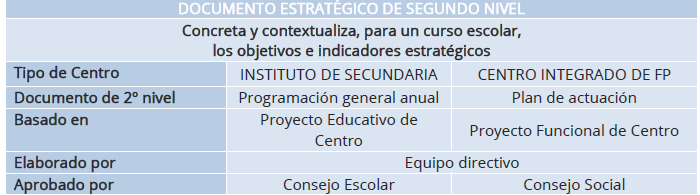{width="300px"}
 
El punt de partida del Pla d'actuació és el Projecte Funcional, on es definixen les característiques fonamentals del context i les principals línies estratègiques. Dins dels elements del context, en el cas de Formació Professional no sols han de contemplar-se els relacionats particulars d'esta oferta, el Centre no sols acull alumnat del barri o del context pròxim, sinó que s'inscriuen en ell persones jóvens o adultes amb interés particular en una determinada família professional o cicle formatiu. La incorporació de l'oferta en horari nocturn o en modalitat semipresencial accentuen esta visió àmplia de la territorialitat, i la d'uns usuaris que no sols provenen del sistema educatiu i estan en formació inicial, sinó que són cada vegada més adults, amb experiència laboral prèvia, i amb interessos diversos. 

El segon element del context que diferencia esta formació de la resta és el component sectorial, i de vinculació amb l'empresa. Com hem vist anteriorment, les competències evolucionen amb rapidesa, i cal atendre les tendències comunes a totes les famílies professionals, i les pròpies del camp ocupacional, per a adaptar el currículum anual de forma que s'incremente l'ocupabilitat de l'alumnat i les seues possibilitats d'inserció. 

## DELS DOCUMENTS DEL CENTRE A LA PROGRAMACIÓ DE MÒDUL 

Una vegada situats en el centre on s'impartirà la formació, ja siga un Institut d'Educació Secundària (IES) o un Centre Integrat de Formació Professional (CIPFP), és imprescindible elaborar el Projecte Curricular del Cicle Formatiu. Per a elaborar este document la Direcció General de Formació Professional ha publicat una guia que proporciona pautes clares per a l'elaboració del PCCF i la programació didàctica per competències, tal com establix la nova Llei de Formació Professional. 

La guia publicada per la Direcció General de Formació Professional és una referència essencial per a l'elaboració del Projecte Curricular del Cicle Formatiu (PCCF) i la programació didàctica per competències, conforme al que s'establix en la nova Llei de Formació Professional. Este document proporciona pautes clares i detallades que faciliten l'adaptació del currículum oficial a les característiques específiques del centre, de l'alumnat i de l'entorn soci-productiu. 

La seua elaboració implica un treball conjunt de l'equip docent, que permet consensuar decisions metodològiques, organitzatives i avaluatives. A través d'este procés, s'establix un marc comú que orienta la programació docent i garantix l'adquisició de les competències professionals previstes, en coherència amb les finalitats educatives i el Projecte Educatiu del Centre (PAC). 

El Projecte Curricular del Cicle Formatiu (PCCF) és un document clau que s'elabora per cada cicle i centre, amb independència de la modalitat o horari en què s'impartisca. La seua finalitat és concretar i contextualitzar el currículum oficial, ajustant-lo a les característiques de l'entorn socioeconòmic, cultural i productiu del centre. Per a això, inclou la identificació del cicle formatiu i el marc normatiu que el regula, així com una adaptació de les competències professionals del títol al context en el qual es desenrotlla la formació. 

El PCCF definix de forma coordinada la contribució de cada mòdul al desenrotllament de les competències professionals del cicle i a les competències clau per a l'ocupabilitat, promovent un enfocament integrador i intermodular. També arreplega els enfocaments didàctics i metodològics acordats per l'equip docent, juntament amb l'organització i distribució dels mòduls professionals al llarg del curs. 

Quant a l'avaluació, establix criteris comuns per a la seua organització, comunicació i desenrotllament, així com els procediments per a avaluar tant a l'alumnat com al professorat i al propi PCCF. A més, contempla orientacions per a l'atenció a la diversitat i la inclusió educativa. 

El document incorpora una base de dades amb les empreses o organismes que col·laboren amb el centre en la formació en empresa, i definix els criteris d'assignació de l'alumnat. També establix els criteris per a l'elaboració dels Plans Formatius Individuals, essencials en la FE i en el mòdul de projecte. Este últim compta a més amb criteris específics per a la seua organització, recollits dins del PCCF. 

S'inclouen, igualment, orientacions per a adaptar els mòduls de Digitalització Aplicada i Sostenibilitat a les particularitats del perfil professional del cicle, garantint així la seua contextualització. Al costat d'això, el PCCF contempla el pla de tutoria i orientació professional, la concreció dels plans i programes institucionals vinculats al currículum, i orientacions per a l'ús pedagògic dels espais, mitjans i equipaments disponibles en el centre. 

Finalment, s'arrepleguen els criteris per a la planificació d'activitats complementàries i extraescolars, amb la finalitat d'enriquir el procés formatiu més enllà de l'aula. 

En el seu conjunt, el PCCF es convertix en un marc compartit de referència per al treball docent, assegurant coherència pedagògica, coordinació i adaptació a la realitat de l'entorn educatiu i productiu. 

Una vegada definit el PCCF, el següent pas correspon a l'elaboració de les programacions didàctiques. Estes constituïxen el document pedagògic en el qual es planifica el desenrotllament de cada mòdul professional, a partir del marc establit en el PCCF. Han de ser elaborades pel docent o l'equip docent responsable d'impartir el mòdul, i seran comuns i consensuades per a tots els grups, independentment de la modalitat o horari en què s'impartisquen. 

En la programació didàctica es detallen els continguts del mòdul, la seqüència temporal d'estos, els resultats d'aprenentatge, els criteris d'avaluació, els enfocaments metodològics, les activitats formatives, així com les evidències d'aprenentatge que haurà de generar l'alumnat per a demostrar el seu progrés. Així mateix, es concreten els instruments d'avaluació que s'utilitzaran per a valorar estes evidències, garantint l'objectivitat, coherència i transparència del procés avaluador. 

D'esta manera, la programació didàctica establix una base comuna per a tot el professorat que impartix el mòdul, assegurant una intervenció docent coordinada. A partir d'ella, cada docent elaborarà la seua programació d'aula, en la qual s'adaptaran els elements de la programació comuna a les característiques concretes del grup: nivell de l'alumnat, necessitats específiques, horaris o altres condicions particulars. Esta adaptació permet ajustar la intervenció educativa a la realitat de l'aula, mantenint la coherència amb el currículum i amb les decisions acordades a nivell d'equip docent. 

La mateixa guia indica els punts essencials que ha de contindre esta programació per competències, assegurant una planificació integral i coherent de cada mòdul formatiu. 

Els punts principals de la programació del mòdul són: 

1. Dades identificatives i contextualització 

2. Relació entre les Unitats de Competència i mòduls del Cicle Formatiu 

3. Contribució dels RA a les competències professionals 

4. Esquema general i seqüenciació de les UP 

5. Metodologia 

6. Recursos 

7. Planificació de l'ús d'espais i equipaments 

8. Les mesures d'atenció a la diversitat i inclusió. 

9. Avaluació de l'aprenentatge. 

10. Les activitats complementàries i extraescolars que es pretenguen realitzar. 

11. Procediments per a l'avaluació de la programació i la pràctica docent. 

<!-- A partir d'ACÍ ES DEIXA COM *ESTÁ -->

# DESENROTLLAMENT D'UNITATS DIDÀCTIQUES
## DEFINICIONS QUÈ SÓN LES UNITATS DIDÀCTIQUES?

A continuació, s'exposen algunes de les definicions d'unitat didàctica:
«La unitat didàctica o unitat de programació serà la intervenció de tots els
elements que intervenen en el procés d'ensenyança-aprenentatge amb una coherència
metodològica interna i per un període de temps determinat» (Antúnez i altres, 1992, 104).

«La unitat didàctica és la interrelació de tots els elements que intervenen en el
procés d'ensenyança-aprenentatge amb una coherència interna metodològica i per un
període de temps determinat» (Ibáñez, 1992, 13).
«Unitat de programació i actuació docent configurada per un conjunt de
activitats que es desenrotllen en un temps determinat, per a la consecució d'uns
objectius didàctics. Una unitat didàctica dona resposta a totes les qüestions
curriculars al què ensenyar (objectius i continguts), quan ensenyar (seqüència
ordenada d'activitats i continguts), com ensenyar (activitats, organització del
espai i del temps, materials i recursos didàctics) i a l'avaluació (criteris e
instruments per a l'avaluació), tot això en un temps clarament delimitats (MEC,
1992, 87 o 91 –en Caixes Roges d'Infantil o Primària respectivament-).
«La unitat didàctica és una manera de planificar el procés d'ensenyança-aprenentatge
al voltant d'un element de contingut que es convertix en eix integrador del procés,
aportant-li consistència i rellevància. Esta manera d'organitzar coneixements i
experiències ha de considerar la diversitat d'elements que contextualitzen el procés
(nivell de desenrotllament de l'alumnat, mig sociocultural i familiar, Projecte Curricular,
recursos disponibles) per a regular la pràctica dels continguts, seleccionar els objectius
bàsics que pretén aconseguir, les pautes metodològiques amb les quals treballarà, les
experiències d'ensenyança-aprenentatge necessaris per a perfeccionar este procés»
(Escamilla, 1993, 39).

Per tant, es pot dir que s'entén per unitat didàctica tota unitat de treball de
duració variable, que organitza un conjunt d'activitats d'ensenyança i aprenentatge i
que respon, en el seu màxim nivell de concreció, a tots els elements del currículum: 
què, com i quan ensenyar i avaluar. Per això la unitat didàctica suposa una unitat
de treball articulat i completa en la qual s'han de precisar els objectius i continguts,
les activitats d'ensenyança i aprenentatge i avaluació, els recursos materials i la
organització de l'espai i el temps, així com totes aquelles decisions encaminades a
oferir una més adequada atenció a la diversitat de l'alumnat.

En esta àmplia definició es poden incloure organitzacions de continguts de molt diversa
naturalesa que, fins i tot precisant tots d'una planificació que contemple els elements
que ací s'han citat s'allunyen, a vegades, de la configuració d'unitats didàctiques
que habitualment s'ha manejat.

## ELEMENTS QUE COMPONEN LES UNITATS DIDÀCTIQUES

El següent gràfic ens mostra la idea de la mútua implicació entre elements i el seu
interrelació i la necessitat d'un procés de «anar i vindre».

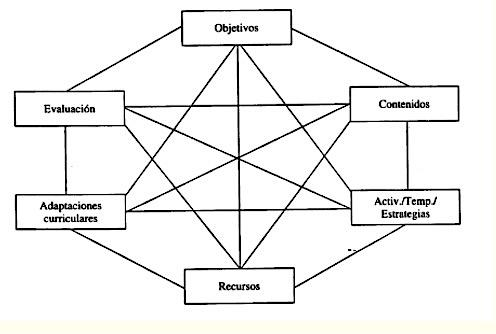{width="300px"}

Les unitats didàctiques, qualsevol que siga l'organització, han de tindre en compte els
següents aspectes: descripció, objectius didàctics, continguts, activitats, recursos
materials, organització de l'espai i el temps, avaluació.
És important considerar que tots els aprenentatges necessiten ser programats, ja que
és necessari per a poder abordar-los, marcar-se objectius i continguts, dissenyar activitats
de desenrotllament i avaluació i preveure els recursos necessaris.
En el quadre que s'oferix a continuació, apareix un breu resum dels elements
fonamentals que una unitat didàctica pot arreplegar:

# ELEMENTS DE LA UNITAT DIDÀCTICA

| Núm. | Element | Descripció |
|--------------------------------------------------|-------------------------------------------------------------------------------------------------------------------------------------------------------------------------------------------------------------|
| **Descripció de la unitat didàctica** | Indicar el tema específic o nom de la unitat, coneixements previs, activitats de motivació, nombre de sessions, situació en el curs/cicle i moment d'aplicació. |
| **Objectius didàctics** | El que es pretén que adquirisca l'alumnat durant la unitat. Tindre en compte temes transversals i estratègies per a la participació de l'alumnat. |
| **Continguts d'aprenentatge** | Conceptes, procediments i actituds sobre els quals es treballarà. |
| **Seqüència d'activitats** | Establir una seqüència interconnectada d'activitats, considerant la diversitat de l'aula i ajustant a les diferents necessitats educatives. |
| **Recursos materials** | Assenyalar els recursos específics per al desenrotllament de la unitat. |
| **Organització de l'espai i el temps** | Indicar aspectes específics sobre l'organització de l'espai i del temps requerits per la unitat. |
| **Avaluació** | Activitats per a valorar l'aprenentatge de l'alumnat i la pràctica docent, instruments utilitzats, criteris i indicadors de valoració en el context general de la unitat. |

 

També és important que s'incloguen activitats de
autoavaluació en les quals els alumnes i alumnes puguen
reflexionar sobre el propi aprenentatge.

## DISSENY COM ELABORAR LES UNITATS DIDÀCTIQUES?

### DESCRIPCIÓ DE LA UNITAT DIDÀCTICA

Breu descripció
Elecció del tema: eix entorn del qual s'organitzarà.
Opcions: contingut, rutina, activitat puntual, identificació de les àrees implicades.
Títol, que haurà de ser clar, curt i suggeridor. I nivell al qual es dirigix. Característiques
“generals”, “espacials”, duració, etc.
Justificació
En este apartat s'inclouran aspectes com el motiu de la seua elecció, finalitat i relació
amb altres unitats didàctiques que conformen la programació, també, es poden
incloure els coneixements previs que els/as alumnes/as necessiten per a abordar-la, les
idees prèvies més comunes o altres opcions didàctiques necessàries per al desenrotllament de
esta unitat. Coherència amb PAC i PCC. Seqüències amb les unitats prèvies i les
posteriors.

### ELEMENTS QUE COMPONEN LA UNITAT DIDÀCTICA

**Objectius**

El principal aspecte dels objectius és que estiguen expressats en termes de capacitats
i no de comportaments. És a dir, l'escola ha d'ajudar a desenrotllar no tant
comportaments específics iguals per a tot l'alumnat, sinó capacitats generals,
competències globals que després es posen de manifest en actuacions concretes
que poden ser distintes en cada alumne/a, encara que responguen a la mateixa capacitat.
Cada objectiu didàctic fa referència generalment a més d'un contingut i es
desenrotlla en diverses activitats.
Les funcions bàsiques dels objectius didàctics són: servir de guia als continguts i a
les activitats d'aprenentatge, i proporcionar criteris per al control d'estes
activitats.

És important fer partícips als alumnes i alumnes del procés d'ensenyança
aprenentatge compartint amb ells els objectius didàctics, buscant que sàpien què es
espera d'ells/as, què aprendran, per què i com.

Un altre aspecte a tindre en compte en l'establiment dels objectius didàctics és el seu
adequació a la diversitat de l'alumnat. Ja que les unitats didàctiques han de permetre
diferents graus d'adquisició d'un contingut i la participació de tot l'alumnat
en una tasca comuna, per a atendre el conjunt de l'alumnat, en la mesura que siga possible.

Per tant, en establir els objectius, és necessari establir alguns que es
denominarien bàsics i, per tant, comuns per a tots, junts a uns altres d'aprofundiment,
ampliació i de reforç, perquè tots/as troben activitats en les quals es
desenrotllen les seues capacitats. Per a d'esta manera no haver d'estar constantment
establint activitats complementàries paral·leles al desenrotllament ordinari de la unitat
didàctica.

Els objectius didàctics que tenen un major predomini en la seua referència a conceptes,
solen formular-se amb verbs com: definir, explicar, assenyalar, identificar, ….
Els objectius didàctics que fan referència a procediments solen formular-se amb
verbs com: simular, construir, aplicar, debatre, ….
Els objectius didàctics que en grau més alt es referixen a actituds solen formular-se
amb verbs del tipus: acceptar, valorar, apreciar, col·laborar, gaudir, ….
Depenent de la unitat didàctica predominaran més un tipus d'objectius o altres.

**Continguts**

Este element de la unitat didàctica comprén els continguts concrets que seran
objecte d'aprenentatge.

Igual que s'ha indicat amb els objectius, els continguts que se seleccionen per a ser
treballats en cada unitat han de tindre en compte les diferències individuals entre el
alumnat.

És convenient organitzar i distribuir els continguts de manera que s'interrelacionen
continguts de diferents àrees i que estos, a més, giren al voltant de temes o projectes
pròxims a l'alumnat, ja que l'ajudaran millor a comprendre les situacions reals en
les que poden trobar-se l'alumnat.

Tindrem en compte en la seqüenciació de continguts en el projecte curricular de
centre i tractarem de posar en relació els continguts de les diferents unitats
didàctiques perquè al llarg de tot el curs hàgem treballats tots els continguts
necessaris.

**Activitats, estratègies i temporalització**

Tenint en compte els elements anteriors, s'han d'identificar aquelles activitats
que considerem rellevants per al desenrotllament de la unitat didàctica.

Dissenyar activitats coherents amb els objectius i continguts de la unitat. Seran
necessàries activitats que treballen els tres tipus de continguts (conceptuals,
procedimentals i actitudinals) i a més que estes activitats siguen concordes al procés
de motivació, diagnòstic, síntesi, reforç…

Una vegada establit en marc en el qual es desenrotllaran les activitats, s'establirà
la seqüència de desenrotllament i es preveu el temps que s'emprarà en cada una d'elles.
Ja que siga el que siga la selecció d'activitats, és important que totes elles estiguen
organitzades d'acord amb una seqüència d'aprenentatge. Una unitat didàctica no deu
entendre's com una mera suma d'activitats.

En elaborar les activitats hem de tindre en compte:

* Oferisquen contextos rellevants i interessants.

* Promoguen una activitat mental en l'alumnat.

* Presenten graus de dificultat ajustats i progressius.

* Estimulen la participació, solidaritat i no discriminació.

* Integren continguts de distint tipus.

* Puguen resoldre's utilitzant diferents enfocaments.

* Admeten nivells de resposta i tipus d'expressió diversos que promoguen la participació de tots.

* Admeten nivells diferents d'intervenció del professorat i els iguals.

* Admeten nivells diferents d'intervenció del professorat i d'interacció a l'aula.

**Recursos**

A l'hora de seleccionar els recursos hem de tindre en compte la gran diversitat de
interessos i capacitats que sempre hi ha a l'aula.
És important organitzar els recursos materials perquè puguen ser utilitzats per el
alumnat de manera autònoma.

Els recursos poden ser distinta naturalesa: bibliogràfics (bé per al professorat o
per a l'alumnat), audiovisuals, informàtics, vistes de diferents persones a l'aula,
eixides del centre, etc.
Els recursos es poden classificar en:

* Espais: l'aula habitual i l'apropiat disseny espacial, altres espais del centre o qualsevol altre tipus d'espais.

* Materials: distingim entre didàctics, tant d'ús del professorat com dels alumnes/as, com a humans, possibilitat de col·laboració d'altres persones com, especialistes, pares, mares, …

En la programació de la unitat didàctica, haurem de preveure els recursos, tant els
habituals com aquells altres que puguen ser més extraordinàries, que necessitarem
per a les diferents sessions.

**Adaptacions curriculars**

Segons Fonts (1990), per a atendre les diferents necessitats que els alumnes i
alumnes presenten, dins d'un mateix grup, la unitat didàctica ha de ser el
suficientment flexible per a permetre que els mateixos objectius s'aconseguisquen a través de
activitats distintes. Això vol dir que, tant per a un grup d'alumnat o com
per a un/a alumne/a individualment es planifique les activitats que resulten més
adequades per a ells. Si la modificació de les activitats no fora suficient serà
necessari modificar els objectius didàctics mitjançant la selecció d'altres continguts o,
finalment, en este recorregut “cap amunt” dels elements desenrotllar els objectius
generals d'àrea, i fins i tot d'etapa, mitjançant uns objectius didàctics elaborats
especialment per a un alumne/a o grup d'alumnes/as.

D'altra banda, l'especificitat, importància o permanència en el temps de determinades
necessitats educatives especials, portarà a considerar-les no solament en l'àmbit de
les unitats didàctiques, sinó buscar-los una resposta més general dins del Projecte
curricular.

Organització de l'espai i del temps a l'aula
L'organització espaciotemporal la decidix cada equip educatiu en el seu Projecte
Curricular. Tenint com a referència esta organització, hem de tindre en compte que el
desenrotllament de cada unitat didàctica concreta implica, en molts casos, modificacions
que comporten acudir a espais diferents dels habituals, modificar els temps
establits o preveure agrupaments distints.

**Avaluació**

L'avaluació s'entén com a part del procés d'ensenyança-aprenentatge i té
com a funció obtindre informació per a prendre decisions, reflexionar, planificar i
reajustar la pràctica educativa per a millorar el procés d'aprenentatge. En este sentit, la
avaluació no se centra en el mesurament de rendiments, ni pot entendre's com
responsabilitat exclusiva de cada professor/a.

El disseny de les activitats d'avaluació ha de ser coherent amb el procés de
ensenyança-aprenentatge i permetre informar l'alumnat sobre el seu propi progrés.
També es podran establir activitats específiques, quan siga necessari obtindre
informació que no estiga suficientment explicita, en la resta de les activitats
dissenyades.

En el disseny de l'avaluació de les unitats didàctiques és important tindre en compte
algunes consideracions:

* Planificar activitats d'avaluació que permeten al professorat conéixer els
coneixements previs dels i les alumnes en relació als continguts que es van
a treballar, això servirà com a punt de partida per a començar a treballar sobre la
Unitat didàctica, així com per a assegurar-se que es puguen aconseguir els objectius
programats a partir dels coneixements previs de l'alumnat, o per a reajustar
la programació.

* Establir els requisits previs perquè l'alumnat puga treballar
adequadament una determinada unitat didàctica. En conseqüència, si el
alumnat manca d'ells caldrà treballar-los, dissenyant activitats que es
ho permeten.

* Els instruments d'avaluació han de ser els més diversos possibles i emportar-se a
cap al llarg del desenrotllament i finalització de tota la unitat didàctica, mitjançant
recursos com: observació directa, quadern de treball, proves escrites de
distint tipus, etc.

Per tant, en el disseny d'una unitat didàctica, hem de tindre en compte:

* Si les unitats arrepleguen les capacitats que s'han decidit desenrotllar en el cicle
per tant són coherents amb els objectius.

* Si les activitats permeten diferents ritmes en la seua execució i per tant graus
diferents de desenrotllament de capacitats.

* Si hi ha un equilibri entre els diferents continguts (conceptes, procediments i
actituds).

Si la unitat preveu instruments d'avaluació que permeten al professorat
obtindre informació sobre el progrés del seu alumnat i sobre el procés de
ensenyança aprenentatge i permet als i les alumnes reflexionar sobre el seu propi
aprenentatge.

Cada unitat didàctica convé que siga programada pel conjunt de professors i
professores que atén un mateix nivell, a partir dels acords que s'han pres
prèviament en l'equip de cicle. Encara que estes unitats han de ser prou
flexibles perquè, puguen realitzar-se modificacions, quan s'estiguen desenrotllant, en
funció del grup.
Finalment, també s'ha de tindre en compte a l'hora d'avaluar la percepció que el
propi alumnat té sobre els nous coneixements adquirits, sobre l'esforç
empleat per a això. Programar i desenrotllar activitats d'autoavaluació a més de
permetre realitzar al professorat una avaluació més completa dels processos de
ensenyança i aprenentatge.

### MODEL D'UNITAT DIDÀCTICA

Com s'ha dit anteriorment la planificació i programació de l'activitat docent,
perquè esta siga més operativa, es concreta en unitats didàctiques.
A causa dels canvis educatius, pedagògics i sobretot normatius, fan molt difícil
esta tasca per als i les docents, això unit, a la falta de prescripcions normatives que
definisquen un model o plantilla per a la programació de les Unitats Didàctiques i en
molts casos certs models que podem trobar en Internet, o les propostes de
editorials, disten molt de ser operatius i funcionals i fins i tot de complir amb els
fins pedagògics i normatius que s'exigixen.
Es proposa ací una plantilla que ens servirà per a programar una unitat didàctica i
que arreplega tots els elements fonamentals que ha de contindre esta unitat i que
ja han sigut explicats en els apartats anteriors.

:::note
Pots trobar més documentació en la següent pàgina web: [Projecte curricular de cicle formatiu](https://ceice.gva.es/documents/388109149/390831792/pccf_guia_practica_docente.pdf/8bc62623-4792-05b4-707f-3ad694f6be0b?t=1741783900533)
:::

## MODEL D'UNITAT DIDÀCTICA PER A LA MODALITAT A DISTÀNCIA

Si bé en l'ensenyança presencial el professorat pot reajustar de manera ràpida la seua
estratègia didàctica, en funció del grau de comprensió dels missatges educatius
que manifesten els alumnes i alumnes, esta particularitat no es dona en la formació a
distància.
Es vol destacar ací, la importància que els materials tenen per a l'aprenentatge en
la modalitat a distància. Sent per tant el mitjà o recurs utilitzat per a l'aprenentatge
la base fonamental de l'ensenyança a distància.
Podem distingir entre materials per a l'aprenentatge (impresos, audiovisuals e
informàtics) i vies de comunicació professor/a-alumnat (presencial, en alguns casos,
telefònica i telemàtica).
Detallem a continuació una sèrie de característiques que han de tindre uns materials
de qualitat utilitzats en la planificació d'una unitat didàctica a distància:
* Adequats: adaptats al context soci institucional, apropiats per al nivell al
que atén, a les previsibles característiques del grup a qui va destinat i la
dedicació requerida per a la superació del curs.

* Integrals: materials que desenrotllen íntegrament tots els continguts exigits
per a aconseguir els coneixements, capacitats o actituds pretesos, és a dir,
que establisquen totes les recomanacions oportunes per a orientar i conduir
tot el treball de l'o de l'estudiant.

* Integrats: l'ensenyança requerix que tots els materials utilitzats en el
procés d'aprenentatge estiguen integrats formant una unitat i els diferents
materials no poden formar unitats independents i agregades sense més.

* Coherents: Coherència entre els diferents elements i variables del procés de
ensenyança-aprenentatge, per exemple, entre objectius, continguts, activitats i
avaluació i, per tant, les activitats i exercicis pràctics, han d'aprofundir en
aquells continguts establits amb la finalitat que l'alumne o alumna aconseguisca els
objectius proposats i no uns altres, que seran els que caldrà comprovar, si es
van aconseguir o no, a través de l'avaluació.

Significatius: materials els continguts dels quals tinguen sentit en si mateixos, estiguen
presentats de manera progressiva i resulten interessants per al destinatari.

* Interactius: que no siguen materials merament expositius, sinó que exigisquen la
participació activa de l'alumnat i que permeten i conviden a l'intercanvi de
opinions i a establir un dialogue simulat i permanent amb el professorat.

* Vàlids i fiables: els continguts arreplegats en els materials han de representar
solidesa, consistència i *contractibilidad i han de transmetre tot allò que es
pretén que aprenga l'alumnat i no sobre qüestions laterals.

* Representatius: Han de seleccionar-se aquells continguts d'un determinat
àmbit, disciplina o curs, que formen bloc, unitats, temes o apartats que
realment representen l'essencial d'eixe camp.

* Estandarditzats: s'han d'utilitzar sempre materials compatibles amb els suports
més utilitzats, amb la finalitat de no crear problemes als i les alumnes, que sol vindre
daus per la incompatibilitat de tipus programari.

* Que permeten l'autoavaluació: utilitzant per a això activitats, exercicis,
qüestionaris, que permeten a l'alumnat comprovar els progressos realitzats i la
consecució dels objectius proposats, mitjançant la consulta immediata de les
corresponents solucions a les qüestions i treballs proposats.

## ESTRUCTURA D'UNA UNITAT DIDÀCTICA A DISTÀNCIA

En este apartat es pretén donar una visió general i de manera sintètica de tots els
elements, distribuïts en diferents apartats, que ha de contindre una unitat didàctica
en la modalitat d'ensenyança a distància, tal com es mostra en la següent taula:

| Element | Descripció |
|----------|-------------|
| Títol i introducció | Títol de la unitat i element motivador inicial. Introducció: utilitat, importància i relació amb la realitat professional. Instruccions per a l'estudi: organització del treball, credencials de l'autor, prerequisits i detalls essencials per a la comprensió. Relació amb altres unitats i ajudes externes. |
| Objectius | Objectius clars, específics, comprensibles i assequibles. Poden agrupar-se en nivells (obligatoris, convenients, desitjables) i vincular-se a l'estructura del mòdul. |
| Esquema | Visió global i integradora de la unitat: seqüència de continguts, esquema numerat o mapa conceptual que facilite la lectura prèvia. |
| Desenrotllament | Contingut ordenat en apartats seqüenciats. Llenguatge clar i progressiu; incorporació de nova terminologia amb exemples i exercicis. Ús de preguntes i activitats intercalades, reforços motivadors i exemples reals. Organitzadors interns (encapçalats, requadres, taules, diagrames), tipografia i realços coherents, i il·lustracions clares amb peu. |
| Resumixen | Síntesi redactada que destaque els punts clau i seguisca l'esquema inicial per a facilitar la revisió. |
| Bibliografia | Referències de la unitat i bibliografia recomanada; extensió adaptada al nivell de l'alumnat. |
| Activitats | Suposats pràctics i exercicis ben planificats per a aplicar coneixements: clars, puntuals i centrats en els aspectes fonamentals. Poden anar intercalats o situats en un bloc específic. |
| Glossari | Definició de termes fonamentals i vocabulari nou present en la unitat. |
| Autoavaluació | Qüestionaris i proves breus (recomanable opció múltiple) que permeten comprovar l'assimilació dels continguts bàsics; poden intercalar-se en el text. |
| Solucions a l'autoavaluació | Claus correctes amb explicacions del perquè de cada resposta per a afavorir la reflexió i l'aprenentatge. |
| Annexos | Material complementari: taules, quadres, documents de referència, diagrames, textos legals, enllaços web, vídeos, etc., necessaris per a la comprensió i realització d'activitats. |
| Índex temàtic | Índex alfabètic al final del bloc de continguts per a localitzar ràpidament conceptes i apartats. |

A continuació, es mostra un exemple d'implementació en una aula virtual d'una
unitat didàctica corresponent al mòdul de LOGÍSTICA COMERCIAL, detallant els
elements que la componen, a través de les diferents imatges que es mostren:
Per a la implementació del curs/mòdul s'ha utilitzat la plataforma *Moodle, amb la
següent estructura, que es mostra a tall d'exemple per a una de les unitats:

* L'inici del curs/module s'inclou:

* Un missatge de benvinguda, en el qual la professora es presenta als i les alumnes
i es dona una breu explicació del mòdul que s'estudiarà i quins són els
objectius generals del mateix i el seu enquadrament en el cicle formatiu al qual
pertany.

* Un tauler d'anuncis és el que es van informant els alumnes i alumnes de
aquells canvis o novetats que afecten el normal funcionament del
mòdul/curse.

* Guia didàctica, en format pdf perquè l'alumnat puga descarregar-lo i en el
que s'indica als i les alumnes tot el relatiu a l'estructura, continguts i
funcionament general del mòdul.

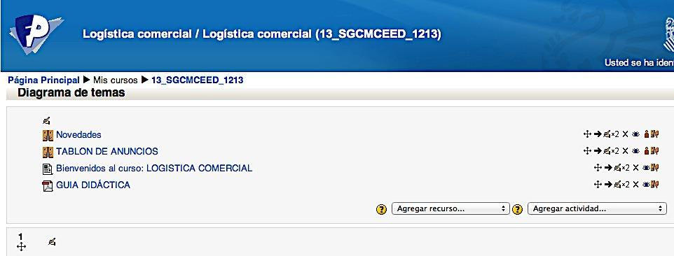{width="300px"}

* Consulta, en este apartat es posa a la disposició de l'alumnat un llistat per a
que s'apunte a l'examen de cada una de les avaluacions, la qual cosa afavorix ajuda
a la professora en l'organització d'espais i la preparació dels models de
examen de les opcions de matí i vesprada de cada un dels mòduls.

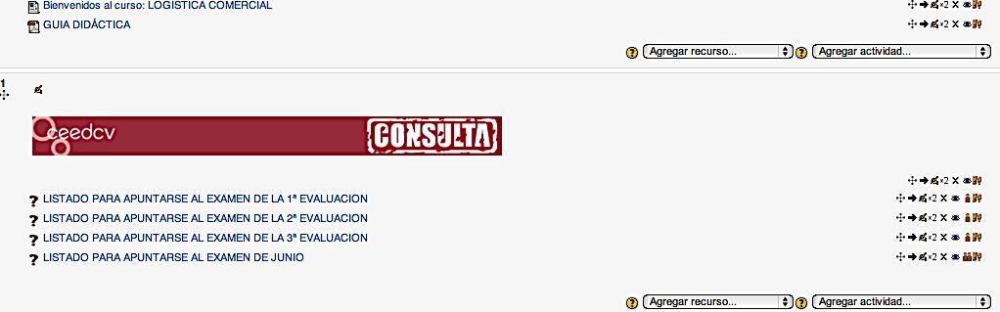{width="300px"}

* Estructura de cada unitat i avaluació Cada unitat està composta per:

 - Avaluació a què pertany la unitat
 - Títol i imatge de la unitat i temporalització
 - Objectius
 - Fòrums de dubtes i preguntes sobre els continguts de la unitat
 - Recursos o continguts
 - Consulta o altres continguts, és un apartat per a saber mes
 - Activitats
 - i activitats *autoevaluables

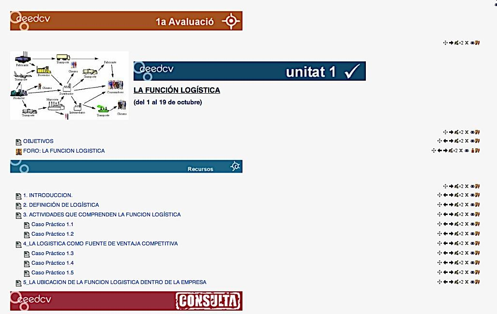{width="300px"}

* Recursos: inclou els continguts estructurats i dividits en diferents apartats
i casos pràctics resolts de cada un d'estos apartats, tal com es mostra
en la imatge.

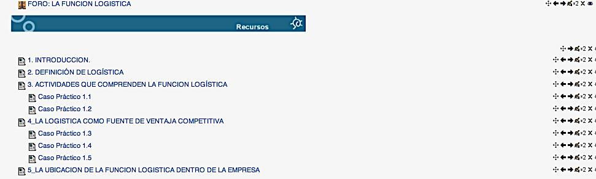{width="300px"}

* Consulta: este apartat inclou una sèrie de continguts complementaris per al
estudi de la unitat. S'estructura de la manera següent:

 - Esquemes: d'alguns conceptes de la unitat.
 - Sabies que… i per a saber més.
 - Glossaris, que inclou termes importants relacionats amb la unitat en estudi.
 - Vídeos: relacionats amb alguns apartats del tema.
 - Wiki: que permet la participació i aportació personal de cada alumne/a
 els continguts de cada unitat.
 - Enllaços a pàgines web d'interés sobre alguns aspectes tractats en el tema.

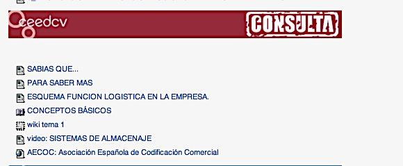{width="300px"}

* Activitats: en este apartat l'alumne/a disposa de diferents tipus de tasques
i activitats que li permetran completar l'estudi de la unitat i mitjançant els
quals el professorat pot avaluar en quina mesura ha aconseguit els objectius
proposats a l'inici de l'estudi d'esta. S'inclouen:

 - Grup de pràctiques: per a la realització d'alguna de les activitats en grup.

 - Activitats en línia (activitat 1: Cicle de qualitat), perquè l'alumnat puga respondre directament a una pregunta o preguntes plantejades.

 - Activitats complementàries, es plantegen una sèrie de tasques sobre els continguts del tema i l'alumnat ha de pujar una arxiu o arxius amb les solucions proposades.

 - Taller, s'assigna un treball concret als alumnes i alumnes (en este cas com es veu en la imatge, la creació d'una xarxa logística) i en este cas el treball es realitza de manera individual. El professor o professora presenta a l'alumnat exemples de tasques ja completades i avaluen les tasques d'altres companys/as.

 - Solució de les activitats complementàries: una vegada transcorregut una setmana des de la finalització de l'estudi del tema es facilita a l'alumnat en format PDF la solució de les tasques complementàries.

 - Activitats d'autoavaluació: com es mostra en la imatge un qüestionari d'autoavaluació, que constarà de preguntes de selecció múltiple, d'opció múltiple, de verdader i fals o d'emplenar buits.

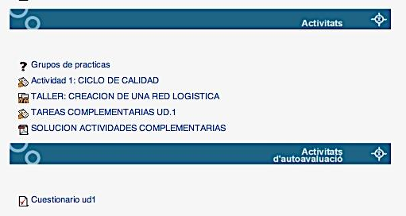{width="300px"}

* Qualificacions: L'alumnat pot consultar les qualificacions de les activitats,
qüestionaris, notes dels exàmens d'avaluació, així com la qualificació final,
a través de l'apartat de qualificacions de l'aula virtual, tal com es mostra en la
imatge:

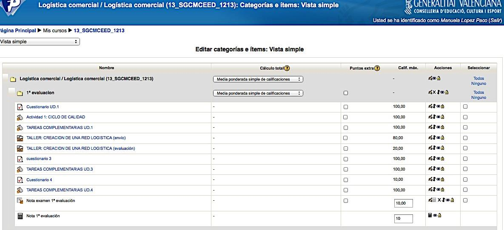{width="300px"}

* Qüestionari de valoració del CURS: es tracta d'un formulari creat en Google drive i en ell es demana als i les alumnes la seua opinió sobre diferents aspectes del
curs i que servirà a la professora com a ferramenta per a millorar, tant la
estructura, com els continguts del tema.

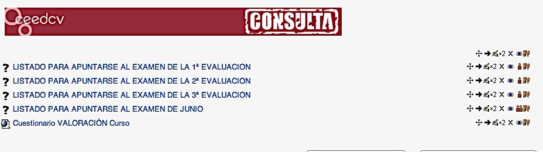{width="300px"}

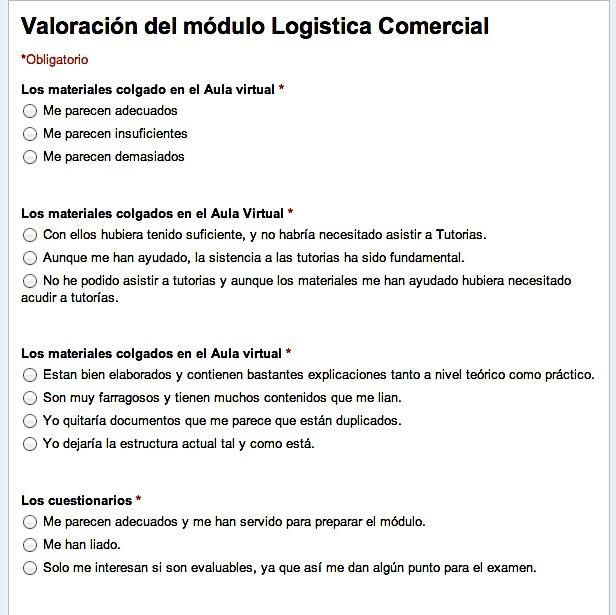{width="300px"}

# CRITERIS I INSTRUMENTS D'AVALUACIÓ

Hem vist al llarg del desenrotllament del nostre epígraf, com l'enfocament constructivista
de l'aprenentatge posa l'accent en un aprenentatge per competències, que hem anomenat
competències d'innovació (basades en les huit competències bàsiques), a la recerca del
caràcter profesionalitzador de la Formació Professional.

Però sobre la base de què podem avaluar tots estos sabers, habilitats, capacitats,
actituds i, per tant, competències?
Hem de referir-nos sens dubte als criteris d'avaluació.

Els criteris d'avaluació són paràmetres de referència que funcionen com a base de
comprovació per a interpretar l'acompliment de l'o de l'estudiant respecte a la seua
aprenentatge. Fa referència al domini de continguts, però no ens referim
únicament als establits en els Decrets de títol dels CF, si no que ampliem la visió del concepte. Quan parlem de les característiques de l'avaluació veurem que esta té un caràcter criterial, això és, els resultats d'aprenentatge es comparen amb estàndards o criteris del sector productiu.

Quan apliquem criteris d'avaluació, avaluem no sols l'adquisició de
coneixements, sinó també el correcte desenrotllament de les competències.

Una vegada establits estos criteris de referència, haurem de fer-nos una nova
pregunta: Amb què avaluar? Ens referim a quins instruments haurem d'utilitzar per a
dur a terme l'avaluació, i que denominarem “proves d'avaluació”.

Ara bé, per a arribar a establir i explicar tant els uns com els altres, entenem que
hem de partir de contestar a altres dos preguntes prèvies: què avaluar? i per a què
avaluar?

La seua resposta ens oferirà les claus en les quals se sustenta el model d'aprenentatge de
construcció del coneixement en el qual ens basem, segons l'enfocament constructivista
de l'aprenentatge.

## L'ENFOCAMENT CONSTRUCTIVISTA DE L'APRENENTATGE I L'AVALUACIÓ

Partirem d'establir la relació estreta que existix entre el que s'entén per
aprenentatge des del punt de vista de l'enfocament constructivista amb el procés de
avaluació.

L'educació és un factor clau per al desenrotllament social i econòmic i per a l'adaptació
dels i les estudiants i futurs treballadors a la realitat social.

En este sentit, es fa palés establir un sistema docent que permeta una
formació integral dels i les estudiants per a adaptar-se a les noves necessitats de la
societat i al cada vegada més competitiu mercat laboral transnacional, que requerix uns
determinats perfils competencials i uns coneixements permanentment
actualitzats la qual cosa es convertix en tot un desafiament per al professorat.

Tal com ja vam dir en l'apartat de metodologia i aprenentatge, este repte suposa una
reformulació de les metodologies docents, que han d'estar basades en l'aprenentatge
i no sols en l'ensenyança; pel que en l'actualitat parlem de procés de ensenyament-aprenentatge, tenint en compte el caràcter bidireccional del procés.
En este model, l'estudiantat passa a ocupar el centre o eix vertebrador del procés
d'aprenentatge, participant de manera proactiva en la construcció del seu propi
coneixement, i sens dubte, en la nostra opinió, la pedra angular del sistema recau sobre
l'avaluació, la qual adquirix una nova dimensió en aplicar un enfocament de tipus
constructivista basat en competències, la qual cosa ens porta a un replantejament del seu
naturalesa, així com del disseny dels seus elements estructurals.

Una avaluació basada en este sistema, ha de tindre per objectiu la valoració de la qualitat
d'aprenentatge aconseguit per l'estudiantat, l'esforç i el treball del qual es convertix en
l'eix de l'organització de l'activitat docent.

No oblidem que la manera d'avaluar les competències condiciona la consecució real
de les mateixes i que el sistema d'avaluació aplicat condiciona també la forma de
estudiar i el temps dedicat a l'aprenentatge.

Tradicionalment, l'avaluació s'ha orientat més cap al resultat, condicionada per
un enfocament conductista. Actualment, els especialistes consideren més apropiat
desenrotllar sistemes d'avaluació orientats cap al procés, seguint un enfocament de
tipus constructivista.

Hem per tant de dissenyar una avaluació capaç, no sols d'avaluar la competència en
sí mateixa, sinó el seu exercici o posada en pràctica per part dels i les estudiants,

devent perquè, produir-se els canvis necessaris punt en el sistema d'avaluació
seguit, com en el plantejament d'activitats que facen possible esta avaluació.
Moltes persones expertes han estudiat els sistemes d'avaluació, però
modernament, i seguint este enfocament, s'entén l'avaluació com un procés
integrador i interrelacionat amb el procés de formació, des del moment inicial de
la planificació fins a la comprovació dels seus resultats, que té com a objectiu
detectar aquells elements que funcionen correctament i quins no, amb la finalitat
última de garantir la qualitat global d'esta formació.

S'ha passat perquè, d'una avaluació centrada en els productes a una avaluació
centrada en els processos. D'un únic mode d'avaluar hem passat a diferents tipus
d'avaluació, tasca no exempta d'una certa complexitat.

Una possible definició en este sentit d'avaluació seria la següent: “L'avaluació és un procés permanent i sistemàtic d'obtindre informació objectiva i útil, relativa a els
processos d'aprenentatge i els seus resultats, perquè, després de la seua anàlisi i valoració, es puga
donar suport a un juí de valor sobre el disseny, l'execució i els resultats de la formació amb
la fi de servir de base per a la presa de decisions”

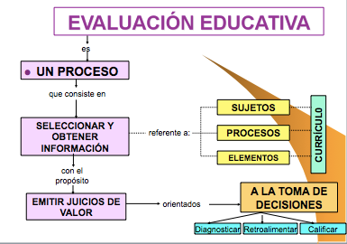{width="300px"}

Estes decisions es prendran en tres sentits:

* diagnosticar els ajustos sobre el projecte curricular i la programació docent,

* millorar la pràctica docent, proposar els mitjans i materials de suport, i qualificar els resultats.

El que donarà lloc als tres tipus d'avaluació (diagnòstica, formativa i sumativa), que
més tard desenrotllarem, i que al nostre juí no són més que tres moments d'un procés.

Segons esta definició s'està posant l'accent en l'optimització del procés, de forma
que la finalitat del mateix no és només atorgar una nota, sinó aconseguir un aprenentatge.

Sota este enfocament, l'aprenentatge i l'avaluació han de prendre en consideració el
desenrotllament del propi estudiantat, és a dir, les seues expectatives, el seu nivell inicial, els seus estils
d'aprenentatge, els seus ritmes i interessos, les seues necessitats i projecció futura. Des d'esta
perspectiva, el repte de l'avaluació és com ha de plantejar-se per a ser congruent amb
les teories que es propugnen per a un aprenentatge significatiu i respectuós amb les
peculiaritats individuals i culturals de l'alumnat i les seues necessitats.

## QUÈ AVALUAR?

Abordem doncs la primera de les nostres preguntes prèvies: Què avaluar?
Sense abandonar l'enfocament per competències del qual hem partit, i per tant, si
assumim que la capacitat productiva d'una persona es definix i mesura en termes de
acompliment en un determinat context laboral, i reflectix els coneixements, habilitats,
destreses i actituds necessàries per a la realització d'un treball efectiu i de qualitat;
arribem a la conclusió que, en el procés formatiu, els i les estudiants deuen
desenrotllar un conjunt de capacitats terminals o resultats d'aprenentatge, que estos
han d'aconseguir en finalitzar el mòdul (saber, ser, fer, relacionar…), les quals descriuen
un conjunt de coneixements, habilitats cognitives, destreses i actituds que els i les
estudiants han d'aconseguir per a un acompliment eficient.

Per tant, què és el que avaluarem al llarg del procés d'ensenyança-aprenentatge
dels alumnes i alumnes. Per a entendre-ho millor, ens ajudarem d'un exemple.
Suposem que plantegem a un alumne o alumna si és capaç d'obtindre quina seria la
quantitat que hauria de pagar mensualment si vol finançar-se amb un préstec
hipotecari per a la compra de la seua vivenda. Esta competència estaria relacionada amb el
mòdul de Gestió Financera en el CFGS d'Administració i Finances.
Seguint el nostre enfocament, hauríem d'avaluar a l'alumnat tenint en compte els
següents objectius de l'aprenentatge
Avaluar el saber (Avaluació Teòrica). Els objectius de coneixement fan referència a
“conéixer”, record de fets, termes, processos mètodes estructures, etc. El principal
propòsit d'esta classe d'objectius està relacionat amb l'augment de coneixement
teòric del saber d'una àrea. Implica adquisició d'informació, comprensió de
informació i canvi conceptual. L'avaluació del saber habitualment avalua
coneixements de tipus teòric, o fins i tot l'aplicació pràctica d'estos, però
sempre des del punt de vista teòric. En el cas del nostre alumne o alumna, es
tractaria de comprovar que coneix les característiques del préstec que li han concedit,
que interpreta les dades i els traduïx correctament per a plantejar les fórmules
matemàtiques necessàries que li proporcionaran el resultat de la quantitat a pagar
mensualment.

Avaluar habilitats i capacitats. Els objectius d'habilitats i capacitats es referixen
a “saber fer”, domini d'habilitats manuals i d'aplicació. Estos objectius
impliquen com aplicar els coneixements per a actuar davant una situació donada. D'ací ve que
comporten l'adquisició de tècniques i d'estratègies. Mesura la destresa de l'o de la
estudiant per a, a partir d'unes dades és capaç d'arribar a establir les connexions
necessàries per a aplicar les fórmules correctes i realitzar les transformacions necessàries
en les dades per a obtindre els resultats correctes, manejant ferramentes o
dispositius. En este cas, es tractarà, d'una banda, de saber utilitzar la calculadora
científica per a processar les dades, així com utilitzar programes informàtics o un altre tipus de
ferramentes, com ara fulls de càlcul que faciliten el mateix.
Avaluar hàbits i actituds. Els objectius d'hàbits i actituds consistixen a “saber ser”
i “saber estar”, domini d'habilitats cognitives o socials. És un objectiu integrador de
aprenentatges anteriors i necessàriament contextualitzat en els aspectes socials en els
que previsiblement es veurà immers l'estudiantat.

Avaluar les competències. La competència és el resultat del producte i perquè el
resultat siga satisfactori, evidentment, l'estudiantat ha de tindre coneixements teòrics, habilitats, capacitats, hàbits i actituds. En el nostre cas es
tractaria de comprovar com l'alumne o alumna, a partir d'unes dades, ha sigut capaç
d'interpretar-los, ordenar-los, utilitzar-los convenientment i aplicar-los per a l'obtenció
del resultat buscat. Efectivament, per a obtindre este resultat, l'alumne o alumna
ha hagut de partir d'uns coneixements teòrics (conéixer les diferents característiques
dels préstecs, les fórmules que calculen el pagament periòdic, les fórmules que calculen
l'interés periòdic si és el cas, …), habilitats (ús de ferramentes que faciliten el
càlcul), i capacitats (relacionar tots els elements i obtindre el resultat e
interpretar-ho), sense perdre de vista els principis i valors en els quals ha desenrotllat el seu
treball (ha arribat a les seues pròpies conclusions com a fruit del seu treball).

## PERQUÈ AVALUAR? TIPUS D'AVALUACIÓ

Seguim amb la segona de les nostres preguntes prèvies Per a què avaluar? Basant-nos
en la definició i els arguments anteriors sobre l'avaluació i el model de
aprenentatge en el qual es basa, podem dir que, l'avaluació complix les següents
funcions:

1. Motivadora: Estimula per a aconseguir millorar els resultats i superar les dificultats en l'aprenentatge.
2. Diagnòstica: Possibilita la identificació d'insuficiències acadèmiques en les destreses i coneixements previs dels i les estudiants per a iniciar el procés d'ensenyança aprenentatge.
3. Pronòstica: Ens permet predir el desenrotllament futur dels i les estudiants a partir de les evidències o informació obtinguda. Facilita la determinació de possibles assoliments a aconseguir a través de l'acció educativa.
4. Retroalimentadora: Assegura el reajustament immediat requerit per a l'assoliment dels objectius d'aprenentatge i la millora del currículum.

I al mateix temps, ens està donant resposta a la nostra pregunta, donant lloc a els
diferents tipus d'avaluació, que segons el moment de realització i coincidint amb la seua
finalitat dividim en:

### A. Avaluació Inicial o Diagnòstica

Es realitza al principi del procés i el seu objectiu és realitzar un diagnòstic preventiu per a
prendre decisions sobre les accions formatives o estratègies d'intervenció més
adequades per a cada estudiant particular, tenint en compte el nivell del qual part, i
que servisca per a aconseguir els objectius sobre els quals li mesuraran.
Podem considerar que els seus propòsits principals són:

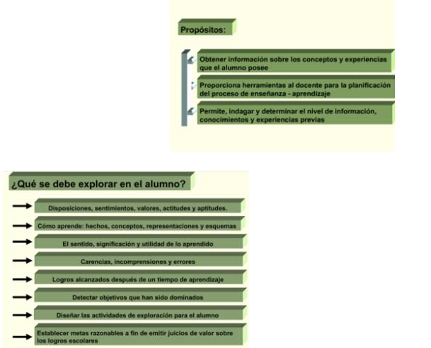{width="300px"}

Per a la realització de l'estratègia diagnòstica podem desenrotllar alguna de les següents activitats d'avaluació:

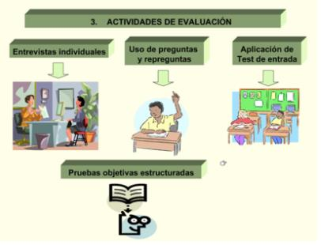{width="300px"}

I la nostra avaluació diagnòstica ha d'estar orientada per algun criteri, com ara:

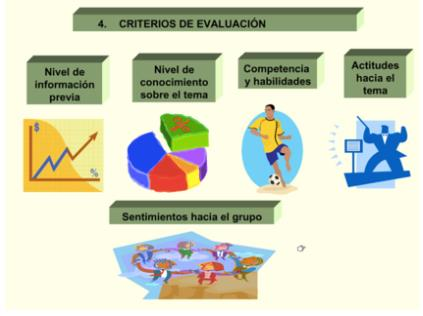{width="300px"}

### B. Avaluació, Processal o Formativa

Es realitza de manera contínua durant el procés i servix per a detectar problemes d'aprenentatge, regular i millorar el procés d'ensenyança aprenentatge duent a terme un seguiment d'este; en funció del qual es realitzen activitats correctores, per a ajudar a l'abast dels objectius formatius. L'avaluació formativa s'utilitza amb finalitats de retroinformació que pot servir tant per a millorar l'aprenentatge dels i les estudiants com per a millorar l'ensenyança impartida. Permet identificar els errors en el procés, ajustant-lo i reorientant-lo, proporcionant un feed back tant per a l'estudiant com per al docent.

En esta mena d'avaluació s'afavorix la “pràctica distribuïda” de l'aprenentatge (estudi de
unitats d'aprenentatge reduïdes i distribuïdes al llarg d'amplis períodes de
temps), enfront de la tradicional “pràctica massiva” (grans volums d'informació en
períodes molt curts de temps que l'estudiantat ha d'assimilar). Utilitza els resultats
obtinguts durant el curs al fil de l'aprenentatge i amb finalitats de qualificació

### C. Avaluació Final o Sumativa

S'utilitza per a qualificar als i les estudiants en acabar una unitat o per a l'expedició
del títol. Es focalitza en l'aprenentatge com a producte acabat. Es realitza al final del
procés i servix per a mesurar i comprovar els resultats obtinguts, així com el grau de
abast d'uns determinats objectius. Per tant, ens oferirà resposta sobre la

decisió a prendre quant a superació dels mòduls per part de l'alumnat
(avaluació final de mòdul) i al final del cicle la que ens indicarà si l'estudiantat està
en disposició d'obtindre el títol corresponent (avaluació final de cicle).

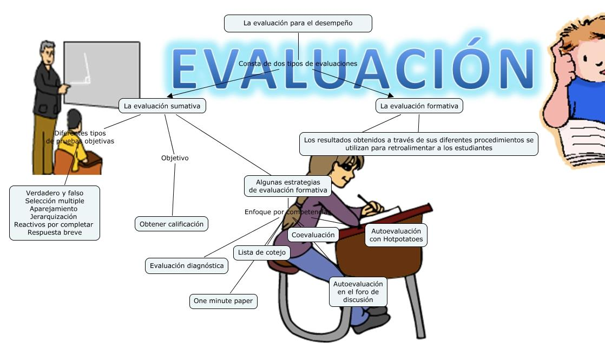{width="300px"}

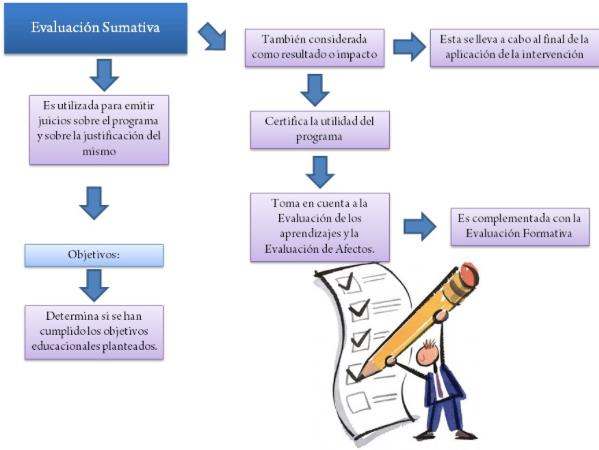{width="300px"}

Basant-nos perquè, en l'enfocament per competències, partim que l'avaluació, és un
component decisiu, ja que orienta tot el procés formatiu, a l'ésser l'expressió
observable de la consecució dels propòsits formatius, és a dir, el grau de
aprenentatge o adquisició de les competències professionals.
Les característiques que definixen l'avaluació segons este enfocament són les següents:

* Té per objecte principal les capacitats terminals (LOGSE), o els resultats d'aprenentatge (LOE), que són públics, així com els criteris d'avaluació.

* Es troba referenciada per criteris (no per normes): els resultats es comparen amb estàndard o criteris del sector productiu. És criterial.

* Té caràcter individualitzat, per tant, s'adapta tant a les característiques de les persones com als mitjans. És flexible.

* És integral, ja que té en compte tots els elements del currículum: subjectes, processos i elements.

* Sent per naturalesa una avaluació final Sumativa, admet l'avaluació
contínua al llarg del procés, tenint doncs un caràcter acumulatiu. També
es realitza una avaluació prèvia inicial o diagnòstica al principi del procés. Per
tant, es pot dir que l'avaluació al llarg del procés és permanent ja
que es produïx en diversos moments (inicial, procés, final). L'avaluació és
Contínua, i s'organitza per etapes, per tant, podem dir que és sistemàtica.

* Procura establir situacions d'avaluació el més pròximes possibles a els
escenaris reals.

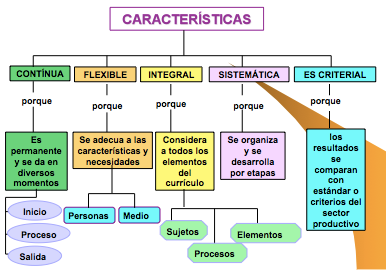{width="300px"}

Paral·lelament, i tal com avançàvem en l'apartat de metodologia, serà necessari
recórrer a noves metodologies docents més enfocades al desenrotllament de destreses,
habilitats i competències per part de l'o de l'estudiant (skills) i resultats de
aprenentatge (learning outcomes), i serà el propi docent el que haja de fixar tots aquells
aspectes que l'estudiant haurà de superar per a aconseguir els objectius previstos,
havent d'establir, com a pas previ, la càrrega lectiva per al professorat i per al
estudiantat, la qual cosa no sempre és fàcil.

Sens dubte, en este sentit, es plantejaran dificultats en l'aplicació pràctica que seran
motiu de reflexió i, sobretot, la necessitat de dedicar especial atenció a la tipologia
d'activitats d'avaluació, tant contínua com final. Activitats que podem cridar
“avaluables” i que tenen en compte tot l'esforç de l'o de l'estudiant en el seu procés
d'aprenentatge. Per a això hem de ser capaços de construir una unitat de valoració del
volum total de treball i real de l'o de l'estudiant requerit per a la superació del
mòdul, és a dir per a la correcta assimilació de les competències prèviament fixades
com a objectius dels mòduls, amb independència de l'activitat docent del
professorat; és a dir, una unitat de valoració més centrada en l'aprenentatge, que mesure
el volum total de treball i no la càrrega lectiva de la matèria.

En definitiva, la implantació d'un sistema com el descrit, suposa un repte i a este
temps una oportunitat per a procedir a implantar un conjunt de millores,
innovacions docents i noves metodologies fruit de la reflexió i el consens entre
tots els agents implicats en la docència davant esta nova realitat acadèmica,
especialment, els i les docents en els seus respectius mòduls.

A més, ha de ser una avaluació, especialment, la final, que permeta valorar de forma
adequada tot el treball que ha realitzat l'estudiantat i que, per coherència, deu
tindre una sistemàtica similar al procés d'aprenentatge que ha realitzat.

D'altra banda, situant-nos en els entorns virtuals, les teories constructivistes,
advertixen els metodòlegs, són més adequades a este nou sistema, pretenent que
l'estudiantat adquirisca al llarg de la seua formació unes determinades competències
que ho preparen per a la vida professional (perquè no oblidem que este és la fi última
que es perseguix amb la formació), la qual cosa exigix un disseny curricular per competències i
un material docent adequat a la consecució d'estos objectius.

Este nou escenari, que posa més èmfasi en el que aprén l'estudiantat, que en
el que li ensenya el professor o professora ha d'incloure una nova manera d'enfocar la
avaluació del procés d'aprenentatge de l'o de l'estudiant que tinga realment en
compte l'adquisició de les esmentades competències i habilitats; per tant,
seguint l'enfocament constructivista, els especialistes consideren més apropiada la
avaluació orientada cap al procés , i no cap al resultat, tal com,
tradicionalment es feia amb un enfocament conductista.

Este és el motiu pel qual el concepte d'avaluació contínua ha anat guanyant terreny
fins a convertir-se en el centre del procés d'avaluació més pròxim als enfocaments més
moderns. Així doncs, l'avaluació contínua s'adopta com una estratègia d'avaluació
formativa més orientada al procés d'aprenentatge que a una valoració puntual.
Si es partix d'una visió constructivista, segons la qual el coneixement és una cosa que es
construïx, l'aprenentatge és un procés complex de creació de significats a partir de
la nova informació i dels coneixements previs, un procés de transformació de
les estructures cognitives de l'o de l'estudiant a conseqüència de la incorporació
de nous coneixements, fruit de la interrelació de tres elements que configuren un
triangle interactiu: activitat mental constructiva de l'o de l'estudiant, intervenció
contínua del docent, i els continguts objecte del procés d'ensenyança aprenentatge.
Per a la seua avaluació, cal realitzar accions avaluatives que posen en joc la
rellevància dels nous aprenentatges, evitant, d'esta manera, els exercicis
memorístics en els quals només s'aconseguix posar en marxa la capacitat de reconéixer i
evocar.

Un element determinant de l'èxit de l'avaluació és si esta s'enfoca de forma
coherent amb la resta d'elements del procés d'aprenentatge i si es correspon amb
els principals objectius d'este.

Arribats a este punt ens sembla convenient que aprofundim en els aspectes més
importants de l'avaluació contínua, així com altres relacionats amb la seua relació amb
l'avaluació final.

La implementació del procés d'avaluació contínua
La posada en funcionament de l'avaluació contínua consistix, bàsicament, en
proposar a l'estudiantat una sèrie d'activitats avaluables que haurà d'anar realitzant a
el llarg del curs amb la doble finalitat de planificar (pauta el ritme de treball dels i
les estudiants) i avaluar el seu procés d'aprenentatge per a l'obtenció d'una qualificació
que permet superar el mòdul. Una part important de la tasca del professorat quan
implanta este sistema consistix, precisament, en la correcció de les activitats que
realitza l'estudiantat, i això evidentment, representa un notable esforç per part
del professorat.

Per a rendibilitzar al màxim esta tasca de corregir, a vegades una mica ingrata, es pot
proposar la utilització d'un document de “solucions”, on el professorat explica la
solució de la qüestió o exercici plantejat, permetent així al professorat saber amb
exactitud la dificultat i el temps que l'elaboració de la qüestió o activitat comportarà
als i les estudiants. Este document de solucions es posa a la disposició dels i les
estudiants una vegada que estos ja han realitzat l'activitat. La finalitat última d'este
document, no és únicament proporcionar un criteri objectiu per a atorgar una
qualificació, sinó que perseguix fomentar el sistema d'autoavaluació de l'o de la
estudiant com a pas previ per a estimular el procés de reflexió sobre el seu propi
aprenentatge.

L'estudiantat, una vegada ha realitzat i entregat la seua activitat, acudix amb impaciència al
document per a comprovar si les seues respostes s'ajusten al model redactat per el
professor o professora. Este pas propícia la reflexió crítica de l'o de l'estudiant sobre
el seu propi treball. La correcció de l'activitat es conclou amb el retorn que el
estudiantat rep del professorat sobre la seua activitat. I en este sentit, som
plenament conscients, malgrat les dificultats reals que això suposa, que l'èxit de la
avaluació contínua és directament proporcional a la personalització del retorn que el
o l'estudiant rep del professor o professora sobre el treball que ha realitzat.

Per a qualsevol professional de la docència és evident que introduir el sistema de
avaluació contínua suposa augmentar el volum de treball del professorat. L'augment
de treball que suposa per al professor o la professora este tipus d'avaluació en relació
amb la correcció i administració dels resultats a cada estudiant, pot minorar-se
amb la utilització de programari especialitzat o avaluació automatitzada, utilitzant els
instruments que aula virtual ens proporciona, com ara qüestionaris, tasques
avaluables, etc.

La motivació de l'o de l'estudiant és un factor molt a tindre en compte per a aconseguir
optimitzar el grau de seguiment i superació dels i les estudiants i, en este
context, el sistema d'avaluació contínua s'ha convertit en un mètode per a reduir
l'índex de fracàs en un mòdul i afrontar de manera decidida el problema del
abandó, tan incisiu sobretot en l'ensenyança sobretot en entorns virtuals.
Les experiències d'implementació d'avaluació contínua han posat de manifest
que este sistema d'avaluació impacta en altres aspectes del procés d'aprenentatge,
com ara augmentar de forma molt significativa la interacció entre docent i estudiant.
L'avaluació contínua amplifica la presència del docent en el procés d'aprenentatge
de l'o de l'estudiant, constituint una important ferramenta de comunicació e
interacció bidireccional entre professorat i estudiant.

**El disseny de l'avaluació contínua**

En este moment és necessari que ens detinguem a especificar el disseny de la
avaluació contínua, en el qual destacaríem tres elements:

a) La seua planificació: l'avaluació contínua obeïx a un conjunt de processos no
espontanis, que es planteja en funció dels objectius que el docent desitja que aconseguisca
l'o l'estudiant. Per consegüent, no s'enfoca en funció només dels continguts de la
programació del mòdul. Estos objectius constituïxen la finalitat del procés de
aprenentatge i poden referir-se a continguts conceptuals, a habilitats i/o a actituds
que els i les estudiants han de desenrotllar. Així doncs, els objectius concreten les
competències generals o específiques a desenrotllar en cada mòdul (cognoscitives,
habilitats, actituds…), han d'estar ben definits i han de ser objectius que realment
puguen aconseguir-se al llarg del període lectiu.

Una vegada tenim concretats estos objectius i competències, es tracta de descendir un
pas més i pensar a través de quines activitats les desenrotllaran els i les estudiants i
com s'avaluaran. Per consegüent, el professorat haurà de decidir, en primer lloc,
la metodologia docent que seguirà, això és, haurà d'especificar quines activitats es van
a realitzar al llarg del període docent tant a l'aula com fora d'ella. I, en segon
lloc, haurà de concretar com s'avaluaran tals activitats.
Al seu torn, cada activitat d'avaluació haurà de concretar els objectius i competències a
que afecta. El nombre d'activitats i la seua distribució al llarg del període lectiu, es troba condicionada per la concurrència de diversos factors: depén de l'extensió del
propi període lectiu, de les competències que hagen de desenrotllar-se, del volum de
estudiants, etc.… Així doncs, cada docent haurà de valorar cada un d'estos extrems
per a decidir estes qüestions.

Així mateix, també és important que el docent en el disseny de les activitats de
avaluació tinga en compte els recursos didàctics necessaris per a realitzar-les, així com
la disponibilitat dels mateixos per als i les estudiants.
D'altra banda, també ha de realitzar-se el càlcul de l'esforç que ha de realitzar el
estudiantat per a superar el mòdul. En este punt, pot afirmar-se que, si s'aplica el
sistema d'avaluació contínua, en principi, l'esforç i la dedicació horària de l'o de
l'estudiant serà major. Ara bé, ha de tindre's en compte que depenent del tipus
d'activitat que es propose, la dedicació de l'o de l'estudiant i el conseqüent
esforç serà major o menor (no és el mateix solucionar un test que un cas pràctic), al
igual que la manera de preparar tals activitats i la utilització de recursos que puguen
implicar també és diferent.

A més, un altre factor que influïx en l'esforç de l'o de l'estudiant és el de la capacitat
que té cada estudiant per a realitzar les activitats d'avaluació contínua, això és,
cada un té el seu propi ritme de treball i d'aprenentatge, així com de temps disponible
per a realitzar-les. Per tot això, és fart difícil calcular l'esforç medie que han de realitzar
els i les estudiants i establir variables objectives per a quantificar la seua dedicació horària
a la realització de les activitats de l'avaluació contínua. Com a molt, el punt de
partida per a determinar l'esforç mitjà de l'o de l'estudiant es troba en el
càlcul del temps i la dificultat que suposa per al propi docent la resolució de les
activitats, ja que és el temps que, com a mínim, tardarà un bon o bona
estudiant a realitzar-les.

Una altra dada que es pot tindre en compte a l'hora de calcular l'esforç o la càrrega de
treball de l'o de l'estudiant, amb les cauteles degudes donada la seua subjectivitat, és el de la
opinió dels propis estudiants arreplegada en enquestes passades pel professorat a
el llarg del període lectiu o al final d'este. En qualsevol cas, sobre la base de la
experiència acumulada de cursos anteriors, es pot anar obtenint algun indicador més
o menys objectiu que servisca per a recalcular este esforç i acostar-ho a la realitat.
No obstant això, no ha d'oblidar-se que, en un sistema d'avaluació contínua, a este
temps, també augmenta el treball i la dedicació horària del docent, no sols per la
preparació de les activitats, sinó també per la seua correcció i qualificació de els
resultats, especialment quan el nombre d'estudiants és elevat.

Finalment, ha d'esmentar-se que el professorat ha de determinar també el pes que
juga l'avaluació contínua en la nota final. Depenent de què es desitge prevaldre més,
el procés o el resultat d'aprenentatge, variarà el valor que se li assigne. Al nostre juí,
quan es compagina l'avaluació contínua amb la final, haurien de valorar-se les dos coses:
d'una banda, com l'estudiantat ha progressat en la construcció del seu coneixement
i en el desenrotllament de les competències; i, d'un altre, el resultat final d'este procés. De
ací que puga atribuir-se un valor elevat a l'avaluació contínua respecte del valor
assignat a la prova final d'avaluació; si bé, a este efecte, no hauria de realitzar-se
simplement una operació aritmètica, sinó que hauria de valorar-se també la progressió
de l'o de l'estudiant.

b) Informació a l'estudiantat: Un altre tema relacionat amb l'avaluació, especialment
quan és contínua, és que l'estudiantat conega diferents aspectes relacionats amb
l'avaluació: quins són els objectius del mòdul, ja que serà avaluat en atenció
a tals objectius; els criteris d'avaluació; les activitats que s'utilitzaran en la
avaluació; els criteris que s'aplicaran en l'avaluació de cada activitat; el calendari
de realització de les activitats; els recursos que s'han d'utilitzar; el temps estimat
d'elaboració de cada una de les activitats…

És fonamental que l'estudiantat, per a una bona orientació i planificació de la seua
aprenentatge, conega tots estos extrems a principi de curs, de manera que estiga en
condicions de participar de les activitats de l'avaluació contínua. La qual cosa també
pot redundar en benefici de la seua motivació a l'hora d'estudiar. Tota esta
informació ha d'arreplegar-se en un document del qual l'estudiantat disposarà des de
el principi de curs.

c) Elecció d'activitats per a l'avaluació contínua: Les activitats d'avaluació han
de ser coherents amb el procés d'aprenentatge i la metodologia que s'haja seguit a
el llarg del període docent (classes presencials o tutories col·lectives en sistemes
semipresencials, aprenentatge basat en resolució de problemes o casos pràctics,
treball per projectes, etc.) i han d'estar dissenyades per a fomentar l'interés i la
motivació, així com per a estimular la participació de l'o de l'estudiant i la implicació
en el seu aprenentatge. Poden ser de molts tipus però, no obstant això, en la major part de
els casos, respondrà a un enfocament pràctic que tinga per objecte, bé l'aplicació
concreta de la teoria a un supòsit pràctic, bé la reflexió sobre determinats
aspectes, o bé la relació entre continguts. En definitiva la constatació que s'ha
aprés el que s'ha estudiat i per tant se saben fer coses amb això.

**Què avaluem a través de l'avaluació contínua?**

És important tindre present, d'un costat, que en totes les proves d'avaluació
contínua no tenen per què treballar-se totes les competències del mòdul, ni tenen
perquè ser sempre les mateixes; ans al contrari, convé anar variant de competències,
depenent del tipus de matèria de què es tracte. A més, ha de tindre's en compte que el
que s'avalua no és la capacitat en si mateixa, sinó l'exercici d'eixa capacitat per part
de l'o de l'estudiant, és a dir, com ha sigut desenrotllada. Així mateix, en cada prova de
avaluació contínua, que anirà referida a un o diversos temes del programa del mòdul,
han d'abordar-se tots els continguts de la matèria perquè no quede cap sense
treballar per part de l'o de l'estudiant. Per això, és convenient que cada prova estiga
formada per un conjunt de diferents activitats.

Activitats que, al nostre juí, convé que siguen d'una tipologia diversa, en primer
lloc, perquè serviran per a desenrotllar diferents competències; en segon lloc,
perquè enriquix l'aprenentatge de l'o de l'estudiant; en tercer lloc, perquè coadjuva
al fet que l'estudiantat haja d'utilitzar diferents tipus de recursos i, finalment, perquè
donen més joc al professorat a l'hora de dirigir l'aprenentatge.

D'un altre costat, una mateixa activitat pot anar referida a diverses competències; és més, el
fet que vaja referida al desenrotllament de diverses competències, enriquix l'activitat.
En qualsevol cas, en cada activitat haurien de quedar clares quines són les competències
que es desenrotllen, atés que el seu correcte desenrotllament és precisament el que avaluarà
l'o la professora.

En funció de la classe de competència o habilitat que es perseguisca, haurà de triar-se la
tipologia d'activitat que permeta la seua consecució. El ventall de possibles activitats
variarà atenent la matèria objecte d'estudi. Algunes d'elles poden ser:
plantejament de supòsits pràctics; formulació de preguntes de desenrotllament;
preguntes tipus test de selecció múltiple; proposicions de verdader o fals;
plantejament de debats sobre temes d'actualitat relacionats amb la matèria;
comentari crític; comentari de text; debats, busca d'informació en internet;
elaboració d'informes i dictàmens; elaboració de quadres i esquemes
comparatius; redacció d'un cas; detecció d'errors ; proves de completar;
emplenar formularis relatius a la matèria; treballs d'investigació., etc.. Tales
activitats, i segons les seues pròpies característiques, podran realitzar-se tant individualment
com en grup, i donada la coexistència d'entorns d'ensenyança tant presencials com
semipresencials, hauran de dissenyar-se per a adaptar-se a estos. En fi, les
possibilitats són àmplies.

Més avant, quan tractem el tema corresponent a instruments o proves de
avaluació, aprofundirem en este aspecte.

Un últim aspecte a abordar en relació amb l'elecció de les activitats és la
conveniència de canviar-les cada període lectiu, en primer lloc, perquè, com s'ha
assenyalat anteriorment, han de ser coherents amb els objectius-competències i
metodologies a aconseguir en el mòdul, que poden estar determinats de forma
diferent en l'un o l'altre període docent; en segon lloc, perquè es tracta que el
professorat, fruit d'experiències anteriors, vaja millorant el sistema d'avaluació
contínua; i, en tercer lloc, per a evitar la còpia o plagi de les activitats resoltes en
períodes lectius anteriors. Referent a això, si es tracta d'entorns virtuals, poden
elaborar-se per a cada unitat didàctica, qüestionaris formats per preguntes que
formaran un banc o fons que el propi sistema virtual, a través dels seus múltiples
possibilitats, s'encarregarà de redefinir perquè ens puguen servir en diverses ocasions.
En el cas d'entorns presencials, serà el propi docent, l'encarregat de recopilar les
preguntes.

Així doncs, ja hem vist com la resposta a la primera pregunta ens porta al
establiment dels tipus d'avaluació que, en l'enfocament constructivista, ens porta a
la conclusió que totes elles són compatibles, i que l'establiment de l'avaluació
contínua pot atraure múltiples avantatges, sobretot en entorns virtuals de
aprenentatge.

**Avaluació contínua versus Avaluació final?**

Arribats a este punt cap que realitzem una anàlisi comparativa entre l'avaluació
final i l'avaluació contínua, per a arribar a conclusions sobre la seua conveniència.
El sistema d'avaluació final es focalitza en l'aprenentatge com a producte acabat amb la
finalitat de verificar l'assoliment dels objectius del procés educacional. A diferència de la
avaluació contínua, esta no incidix de manera directa en la millora del procés de
aprenentatge dels i les estudiants avaluats, precisament per ser un tipus de
avaluació que es realitza a posteriori quan el procés es considera acabat.

Tradicionalment, este tipus d'avaluació ha tendit a centrar-se exclusivament en el
control. Com hem vist, l'avaluació contínua, en canvi, incorpora tot un
conjunt d'estratègies que tenen per objecte la millora del procés d'aprenentatge.

Una altra diferència entre les dos classes d'avaluació residix en el tipus de proves, en el cas
de l'examen final tradicional el tipus de preguntes que se solen plantejar són,
principalment, preguntes de desenrotllament, resolució de casos pràctics, proves de
elecció múltiple o de verdader i fals; mentres que els sistemes d'avaluació contínua opten per proves que se centren en experiències de l'alumnat, en debats, o
altres diverses actuacions.

L'avaluació final focalitza la puntuació de l'o de l'estudiant en relació amb l'obtinguda
per la resta d'estudiants. En canvi, en l'avaluació contínua la puntuació de l'o de
l'estudiant està en relació amb el seu propi procés d'aprenentatge.
El fracàs dels i les estudiants és un element que, actualment, preocupa en tots
els centres docents. De manera que la decisió del moment en el qual es planteja la
avaluació ha de ser presa amb summa precaució. És ben sabut que en els casos en els
que s'utilitza únicament l'avaluació final com a únic sistema d'avaluació, la major
concentració d'hores d'estudi dels i les estudiants es produïx precisament
pocs dies abans de l'examen. A diferència del que ocorre amb l'avaluació contínua, ja
que les hores d'estudi es distribuïxen al llarg del període lectiu.

Com hem vingut apuntant, el tipus i sistema d'avaluació que utilitze el professorat
influïx decididament en el procés d'ensenyança-aprenentatge de l'o de l'estudiant.
Tradicionalment, un sistema d'avaluació centrat en l'etapa final de l'aprenentatge
està concebut més per a aprovar que per a aprendre. És per això que no sols es deu
avaluar en el final de procés d'aprenentatge l'assimilació de coneixements i desenrotllament
de competències, sinó que l'o la professora, ha de proposar amb una certa periodicitat
activitats avaluables que faciliten l'assimilació i desenrotllament progressiu de els
continguts i de les competències a aconseguir (“learning by doing”), de manera que la
avaluació es convertix en contínua o progressiva i el professorat pot realitzar un millor
seguiment del progrés d'aprenentatge de l'o de l'estudiant permetent així una
valoració integral, apostant així per un aprenentatge significatiu, seguint les teories
constructivistes del coneixement. No són en cap cas incompatibles els diferents tipus
d'avaluació i de fet coexistixen.

Per tant, no és necessari que l'avaluació final desaparega en benefici de la contínua,
ja que les dos poden utilitzar-se conjuntament, combinant-se les dos. Una avaluació
final amb una prèvia avaluació contínua i, per tant, com a element de tancament de la
mateixa.

Quan s'utilitzen sistemes d'avaluació contínua, en realitat es parla dels tres
moments de l'avaluació: inicial, formativa i final d'acord amb la perspectiva
constructivista de l'aprenentatge, tal com havíem establit abans.

**Coherència entre avaluació contínua i final**

Ara bé, si hem arribat a la conclusió que els dos tipus d'avaluació són
compatibles, també hem de dir que els dos han de ser coherents.
Com hem vist, l'avaluació contínua permet a l'estudiantat, d'una banda, la
adquisició gradual dels continguts i competències més importants del mòdul i per
un altre conéixer, per part dels i les estudiants, la manera d'avaluar del professorat.
A més, l'estudiantat rep informació sobre el seu propi ritme d'aprenentatge
reorientant-ho en funció dels seus errors i en definitiva implicant-se cada vegada més en la seua
propi aprenentatge. Finalment, és també una bona estratègia per a la preparació de
la prova final d'avaluació, que per coherència ha de mantindre la mateixa estructura
que les activitats proposades en l'avaluació contínua. És important que el tipus de
prova final que es plantege siga coherent amb els objectius d'aprenentatge establits
i amb les competències que el mòdul pretén desenrotllar. L'avaluació ha de mesurar,
en tot cas, allò que es pretén ensenyar.

Al seu torn, l'avaluació contínua proporciona al professorat informació que li permet:
intervindre per a millorar i reorientar el procés d'aprenentatge, ja que disposa d'una
visió de les dificultats i progressos dels i les estudiants en este, informar sobre
el mateix i, finalment, qualificar el rendiment de l'o de l'estudiant, produint-se així
un procés de “feed-back valuosíssim.

Tant en entorns presencials com semipresencials les proves d'avaluació
contínua permetran a l'estudiantat conéixer el grau d'autoaprenentatge i preparar les
proves d'avaluació final. En entorns presencials, estes activitats es realitzaran
dins de l'aula, mentres que, en entorns semipresencials, l'estudiantat realitzarà
activitats autoavaluables realitzades fora de l'aula o “take home”, a través de la
plataforma virtual.

Quant a les proves d'avaluació final, consistixen fonamentalment en l'examen
final presencial, que és de caràcter obligatori tant en entorns presencials com
semipresencials. Este examen es realitza dins d'una aula i durant un període de
temps limitat, estant condicionat doncs pels factors espai i temps.

Les competències que este tipus d'examen permet avaluar són, bàsicament: la
capacitat de síntesi; l'organització i planificació del temps; i l'expressió oral i
escrita. Fomenta, així mateix, la capacitat de retenció i memòria a curt termini.
Este examen pot ser escrit o oral. Esta segona modalitat, l'examen final oral, és
una pràctica molt freqüent sobretot en els mòduls d'idioma.

Encara que l'examen final presencial, tal com hem dit, té caràcter obligatori en
els dos tipus de sistemes d'aprenentatge, és cert que, en entorns semipresencials,
este examen, sol complementar-se amb altres activitats avaluables, que el
estudiantat realitzarà fora de l'aula presencial, a la seua casa, a través de la plataforma, i
durant un temps determinat.

Este tipus de proves o activitats, permet a l'estudiantat elaborar un document bé
redactat i estructurat sobre el tema plantejat, sempre que abans d'este moment
s'haja preparat correctament la matèria objecte d'examen, això exigix conéixer el
tema, però, a més, dominar les fonts d'informació. Este tipus d'examen obliga el
estudiantat a planificar bé el temps del qual disposa per a determinar quant dedica
a la busca d'informació i a la seua lectura, a l'estructuració del treball i, finalment,
a la redacció i revisió d'este.

Els exàmens no presencials permeten avaluar, a més, altres competències diferents
a les dels exàmens presencials, com ara les habilitats d'investigació,
raonament crític, busca d'informació de diverses fonts, utilització de
ferramentes informàtiques… En estos casos, per a evitar o minimitzar el possible plagi o
còpia, és important que el docent medite bé el contingut de l'examen, que deurà
incorporar, per exemple, preguntes de tipus obert, preguntes amb un important grau
de reflexió individual, etc.…

Els distints de proves que formen tant l'avaluació contínua com final, es
ponderaran per a obtindre la nota final de l'o de l'estudiant en el seu procés d'avaluació.
En l'apartat 2.6.5.1 veurem amb molt més detalle els diferents tipus de proves de
avaluació i les competències que s'avaluen a través d'elles.

## SOBRE LA BASE DE QUÈ AVALUEM? ELS CRITERIS I INSTRUMENTS D'AVALUACIÓ

### LA NOSTRA REFERÈNCIA: ELS CRITERIS D'AVALUACIÓ

Per fi hem arribat al nucli principal del nostre epígraf.
Quines referències tindrem per a avaluar? Ens referirem a la pregunta de base que
ens féiem al principi, sobre la base de què podem avaluar tots estos sabers,
habilitats, capacitats, actituds i, per tant, competències? Hem de referir-nos sense
dubte als criteris d'avaluació.

Tal com vam dir al principi, els criteris d'avaluació són paràmetres de referència
que servixen per a comprovar i interpretar el domini que l'estudiantat demostra sobre els continguts conceptuals, procedimentals i actitudinals, i que desembocaran en els
resultats d'aprenentatge, com a resposta a l'adquisició i desenrotllament de competències.
A tall d'exemple, un criteri d'avaluació podria ser: “en les activitats no es valora
tant l'extensió de la resposta com la qualitat de la mateixa i, en particular, la
justificació, convenientment raonada i documentada de les solucions, així com el
estil o la claredat amb el qual es redacte la resposta”.

Per això, els criteris d'avaluació s'han de fixar, en coherència, en funció de les
competències i les activitats proposades. Tenint en compte que totes les activitats
han d'avaluar-se, que no totes les competències tenen la mateixa importància en una
matèria i que el desenrotllament d'algunes capacitats requerix una menor dedicació de
treball i temps que unes altres, la definició dels criteris d'avaluació és una tasca res
fàcil. Donada la seua importància, els criteris d'avaluació han d'estar redactats de forma
molt clara i ha d'especificar-se quin és el valor de cada activitat respecte del total de la
qualificació a obtindre, especialment si són diversos els professors i professores els que
impartixen un mateix mòdul.

Els indicadors d'avaluació i els ítems de qualificació
Derivats de l'anàlisi dels criteris d'avaluació i fent referència a els
esmentats capacitats i continguts (conceptuals, procedimentals i actitudinals),
apareixen una sèrie de conductes observables, signes, indicis o senyals que esperem
exterioritzen els i les estudiants per a verificar l'assoliment d'estes capacitats i
competències. Es tracta dels denominats “indicadors d'avaluació”.

La formulació de tals indicadors pot realitzar-se segons la següent estructura: Verb
present indicatiu condició/finalitat.

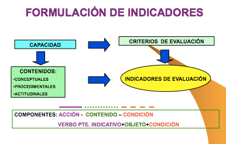{width="300px"}

Haurà d'existir sempre una coherència interna entre capacitats terminals (LOGSE)
resultats d'aprenentatge (LOE), criteris i indicadors d'avaluació.
Finalment, hem d'indicar que cada un dels criteris d'avaluació, així com els
indicadors en els quals es desenrotllen, hauran de qualificar-se a través de “ítems de
qualificació”, els quals establiran la qualificació total que correspon a l'avaluació.

A continuació, mode d'exemple, incloem la plantilla que s'utilitza en el “CIPFP
MISERICÒRDIA” per a avaluar el mòdul de “Projecte” en el CFGS d'Administració i
Finances, on es pot diferenciar clarament cada un d'estos aspectes.

| Denominació del projecte | Estructura formal (2 punts) | Continguts (5 punts) | Exposició i Defensa (3 punts) | NOTA FINAL |
|----------------------------------------------|------------------------------|-----------------------|-------------------------------|------------|
| Cognoms i Nom de l'alumne/a: | | | | |
| Cognoms i nom de l'avaluador | | | | |

| CRITERIS, INDICADORS I ÍTEMS D'AVALUACIÓ | Excel·lent (0,5) | Bueno (0,4) | Regular (0,3) | Deficient (0,2) | Pobra (0,1) |
|----------------------------------------------|----------------|-------------|---------------|------------------|-------------|
| **Estructura Formal (20%)** | | | | | |
| La font, els màrgens, i els paràgrafs són els mateixos al llarg del document | | | | | |
| El document conté portada, índex amb títols i subtítols, presentació, desenrotllament, conclusions i bibliografia | | | | | |
| L'orde és adequat a l'estructura del treball | | | | | |
| La redacció respecta les normes ortogràfiques i de sintaxis | | | | | |
| **Continguts (50%)** | | | | | |
| El problema a resoldre o l'objectiu final del projecte està definit | | | | | |
| Originalitat i/o novetats que aporta | | | | | |
| S'identifica el sector d'activitat i l'àrea d'intervenció dins de l'empresa | | | | | |
| S'han definit objectius de caràcter intermedi per a aconseguir la meta | | | | | |
| Les estratègies establides són adequades | | | | | |
| **Exposició i Defensa (30%)** | | | | | |
| Argumentació clara i ordenada | | | | | |
| Capacitat de resolució de dubtes | | | | | |
| Ús adequat de recursos per a la presentació | | | | | |

Com s'observa, per a l'avaluació del mòdul de Projecte, s'han establit tres
criteris d'avaluació, i cada un d'ells s'ha descompost en diferents indicadors
d'avaluació, i a cada un d'ells se li atorga un “ítem” de qualificació qualitatiu, que
va des de “excel·lent a pobre”, al qual correspon al seu torn una qualificació numèrica, que
va des de 0,5 a 0,1 respectivament. Al seu torn cada criteri d'avaluació s'avalua
ponderant sobre 100, el pes d'este, el qual correspondrà a la suma total de l'ítem
de qualificació dels indicadors.

La manera d'emplenar el quadre consistirà a marcar cada una de les caselles
corresponents que corresponguen a la decisió de l'avaluador, de manera que es van
obtenint les qualificacions parcials corresponents als criteris, i la suma total dels quals
correspondrà a la nota final.

### AMB QUÈ AVALUAR? TÈCNIQUES VERSUS INSTRUMENTS D'AVALUACIÓ

Abans de contestar a l'última de les preguntes base que ens hem plantejat al
principi, sobre amb què avaluar, ens referirem a les denominades tècniques de
avaluació, que s'identifiquen com aquells procediments que ens permeten captar o
percebre informació sobre conductes, coneixements, habilitats, sentiments, i assoliments
que exterioritzen els i les estudiants a través dels indicadors d'avaluació. Cada una
d'eixes tècniques contindrà el que denominarem els instruments o proves de
avaluació i que donarà resposta a eixa última pregunta base a la qual ens referíem al
principi amb què avaluar?
Les tècniques d'avaluació, en general responen a la següent classificació:

1. D'interrogatori: Procediments mitjançant els quals se sol·licita informació al
estudiantat, en forma oral o escrita. Avalua bàsicament l'àrea cognoscitiva. Les
preguntes requerixen la seua opinió, valoració personal o interpretació de la
realitat, basant-se en els continguts del pla curricular. Exemple de
instruments pertanyents a esta tècnica són els exàmens o proves objectives,
tant orals com escrites, que poden adoptar diferents formes (orals:
exàmens/proves, intervencions, diàlegs, exposicions, entrevistes…i escrites:
exàmens/proves, qüestionaris, treballs d'investigació, informes, projectes…).

2. De resolució de problemes: Esta tècnica consistix a sol·licitar a l'estudiantat la
resolució de problemes. S'avalua coneixements i habilitats. Els problemes
que es presenten a l'estudiantat poden ser d'orde conceptual, per a valorar el
domini de l'o de l'estudiant a nivell declaratiu o bé poden implicar el
reconeixement de la seqüència d'un procediment. Exemple d'instruments de
este tipus són les proves objectives, les proves d'assaig o per temes,
simuladors escrits i proves estandarditzades.

3. D'execució o sol·licitud de productes: Es referix a la sol·licitud de productes
resultants d'un procés d'aprenentatge. Han de reflectir els canvis produïts
en el camp cognoscitiu i demostrar les habilitats que l'estudiantat ha
desenrotllat o adquirit, així com la informació que ha integrat. Són diversos
i variats depenent de l'àrea de coneixement, els objectius, el propòsit i el
temps que es determine per a la seua elaboració. Exemples d'instruments d'este
tipus són els projectes, monografies, o assajos, pràctiques de taller, proves de
demostració i execució de processos.

4. Observació: Permet avaluar aspectes com l'afectiu i el psicomotor, els quals
difícilment s'avaluarien amb una altra mena de tècnica, doncs de manera immediata es
identifiquen els recursos amb què compta l'estudiantat i la forma en què els usa,
com ara la identificació, selecció, execució i/o integració, en funció del
producte que genere en una situació real o simulada. Exemples d'instruments
d'este tipus són: participació, exposició oral, demostracions, llistes de
verificació (d'acarament) registres anecdòtics i escales d'avaluació. Esta tècnica
es pot dur a terme tant de manera espontània com sistemàtica.

Així doncs, ja hem vist com hem de distingir clarament entre el que són tècniques
i instruments o proves. Les tècniques són els procediments que ens permetran captar
la informació necessària, mentres que els instruments o proves seran les
ferramentes que ens permeten arreplegar i registrar informació dels aprenentatges de
els i les estudiants, és a dir, els materials físics amb les quals avaluarem.

Els instruments o proves d'avaluació han d'elaborar-se en funció de els
indicadors que s'espera registrar, relacionats amb l'aprenentatge de coneixements,
habilitats, destreses motrius i actituds.

En la seua elaboració han de complir-se dos tipus de condicions:

Pràctiques:

* Fàcil construcció
* Fàcil d'administrar
* Senzill de corregir i i interpretar
* Sota cost

Tècniques:

* Validesa: grau en què un instrument servix al propòsit per al qual s'utilitzarà
i oferix la informació que es requerix. “Mesura el que es desitja mesurar”.

* Confiabilitat: Grau de confiança en la informació que brinda dit
instrument. Avaluar amb precisió i consistència (s'obté el mateix resultat
en diferents moments).

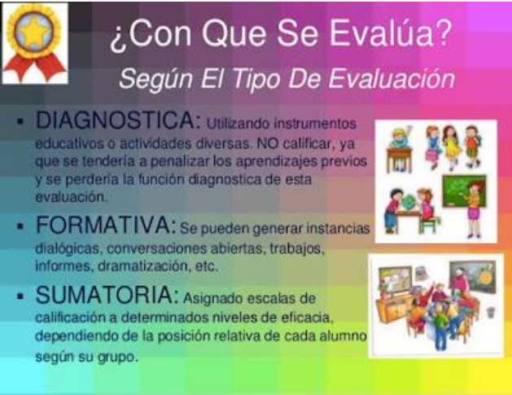{width="300px"}

Per tant, en conclusió, en el procés d'avaluació, identificarem les següents
etapes:

1. Identificació d'indicadors i criteris
2. Selecció de la tècnica i elaboració dels instruments.
3. Obtenció i registre de la informació
4. Organització i tabulació dels resultats
5. Emissió d'un juí sobre la qualitat de l'aprenentatge, expressat mitjançant una qualificació.
6. Presa de decisions

**Diferents tipus de Proves d'Avaluació**

Com ja avançàvem quan parlem d'elecció d'activitats o proves de
avaluació, aprofundirem ara en els diferents tipus de proves i en la seua classificació
en funció de tipus d'aprenentatge que pretenen avaluar.
Malgrat les diferències existents entre sistemes d'avaluació continus i finals, no
podem parlar d'unes activitats específiques o pròpies d'uns sistemes o altres, sinó
de modes o formes diferents de plantejar una activitat. És la particular labor del docent
la que ha de dotar a esta d'idoneïtat i suficiència per a avaluar adequadament un

determinat contingut. I no tots els continguts són iguals, ni totes les activitats
pretenen o poden avaluar els mateixos continguts i objectius.
En les diferents activitats que s'arrepleguen en este apartat s'ha optat per no
diferenciar-les atenent la seua possible naturalesa teòrica o pràctica, ja que no
poden circumscriure's de manera excloent a l'un o l'altre àmbit, dependrà del seu
configuració final. Totes elles gaudixen d'una certa autonomia i flexibilitat per a ser
plenament eficaços com a instrument avaluador d'un determinat contingut.

Dos són, al nostre juí, els criteris o referències que han de determinar el disseny de
una activitat concreta:

* que resulte idònia en atenció als objectius i competències que es plantegen
per a l'activitat i

* que el contingut siga conforme a la matèria objecte d'avaluació, és a dir, triar la
activitat adequada i plantejar-la correctament.

Així mateix, les característiques que ha de tindre qualsevol prova que pretenga avaluar
aprenentatges, són:

- Ser objectiva: Ser justa amb les persones avaluades, evitant juís subjectius.
- Ser eficient: Ha de permetre arribar fàcilment als resultats desitjats i de la forma més eficient.
- Transparència: Abastar processos oberts i que siguen comprensibles per a una persona interessada.
- Comprensibilitat: cobrir tots els objectius i criteris.
- Discriminació: Diferenciar al candidat exitós d'aquell que no ho és.

Això determina que, encara que siga recomanable en sistemes d'avaluació contínua (per
les característiques intrínseques d'estos models), no abusar de determinats tipus de
activitats, especialment aquelles de caràcter memorístic o de simple plasmació
teòrica de continguts, poden resultar igualment vàlides si es plantegen adequadament.
I al revés, la utilització d'una determinada activitat que a priori puga resultar més
pròxima a models d'avaluació contínua, pot no garantir que s'aconseguisquen els
objectius que aquella perseguix.

S'ha assenyalat anteriorment que el disseny de qualsevol activitat d'avaluació no
pot deslligar-se del procés d'aprenentatge. Esta circumstància comporta necessàriament
que la mateixa s'adeqüe als objectius que aquell perseguix. Però, a més, han de considerar-se altres factors, intrínsecs a la pròpia configuració dels sistemes de
avaluació contínua i la inobservança de la qual pot distorsionar el procés avaluatiu, a
pesar d'abordar-se suficientment els continguts que es pretenien avaluar. Ens
referim concretament a l'entorn en el qual es realitzarà l'activitat: lloc, temps i
ferramentes o materials de què disposa o pot disposar l'estudiantat.

Així, haurà de tindre's en consideració si l'activitat plantejada a l'estudiantat va a
desenrotllar-se íntegrament a l'aula, de manera mixta (es prepara fora de l'aula i,
posteriorment, es realitza en ella) o si es resoldrà íntegrament fora d'esta.
Segons l'un o l'altre cas, el temps de què disposarà l'o l'estudiant per a resoldre la
activitat, així com la possibilitat o no de treballar amb materials de suport serà diferent,
propiciant una major presència d'una mena d'activitats enfront d'un altre.

Estes circumstàncies, si bé han de ser presents a l'hora de triar un tipus concret de
activitat, no han de ser determinants en el moment de dissenyar el seu contingut
específic. Una cosa és la matèria subjecta a avaluació i una altra molt distinta és l'entorn en
el que s'avaluarà. No correspon avaluar al segon; i, per tant, no pot prevaldre
sobre el primer. En cas contrari, es corre el risc que l'activitat diste molt, o
poc tinga a veure, amb els objectius de l'aprenentatge i, al mateix temps, la seua resolució
constituïsca una autèntica odissea per a l'estudiantat. I això no és gratuït, ja que,
a més de desmotivar-li (després de l'estudi de la matèria de referència, pot tindre serioses
dificultats per a la resolució de l'activitat), pot alterar-se el propi procés de
aprenentatge, ja que l'estudiantat pot inclinar-se a realitzar l'activitat sense
preparar-se prèviament la matèria. Circumstància que s'agreujaria si, a més, el temps
necessari per a resoldre l'activitat fora totalment desproporcionat en relació amb el
necessari per a l'estudi dels continguts subjectes a avaluació. I és que no deu
oblidar-se que l'estudiantat afronta l'aprenentatge d'un mòdul en funció del sistema
d'avaluació d'este.

Una de les causes que expliquen este fenomen residix en què, no en poques ocasions, es
recorre a la formulació d'activitats més pròpies d'un sistema d'avaluació final.
Habitualment, estes últimes tenen com a finalitat complementar o ampliar continguts
que el seu principal s'avaluarà en un moment final mitjançant una prova única (examen
final) i, per tant, sense minvar el procés avaluatiu. Traslladar este model a un sistema
d'avaluació contínua, en el qual la mateixa ni és única ni se situa en un sol moment,
pot tindre conseqüències pernicioses per al propi sistema.

Però existix, a més, un altre motiu de major pes, com pot ser la certa desconfiança
del docent cap a l'estudiantat per la possibilitat d'este de disposar de quant material desitge per a la realització de l'activitat i, de manera especial, si la mateixa no es
desenrotlla en presència de l'avaluador.
S'insistix, llavors, que el disseny de les diferents activitats no ha de circumscriure's
a esta problemàtica, ja que existixen nombrosos instruments avaluatius que permeten
superar estes dificultats. Els diferents entorns han de ser vistos com una nova
possibilitat per a treballar diferents competències i que, a vegades, no és possible que
es done en sistemes d'avaluació final. És, per tant, un repte que cal abordar des de
l'optimisme i no com una amenaça per al sistema avaluador.

Afrontar el sistema d'avaluació des d'esta perspectiva és, a més, coherent amb una
metodologia que configura a l'activitat en si com alguna cosa més que una mera ponderació
del progrés d'aprenentatge de l'o de l'estudiant. El nou rol que el nou escenari
atorga a este, com a eix central de l'aprenentatge, fa necessari que les activitats siguen,
així mateix, instruments orientats a eixa finalitat, com a part integrant d'esta.

Una vegada determinada l'activitat específica amb la qual avaluarem un determinat
contingut, han de considerar-se alguns aspectes a l'hora d'elaborar els enunciats
concrets. En primer lloc, cal prestar especial atenció al mateix temps que necessitarà el
o l'estudiant per a resoldre l'activitat i que ha de ser proporcionat i real. Per a això,
és necessari posar-se en la pell d'estudiantat, la qual cosa no sempre és fàcil, com ja es
ha assenyalat, encara que ha de tindre's present que sempre serà un temps superior al que
empraria el docent.

En segon lloc, el grau de coneixement i comprensió que té el docent no és el
mateix que pot tindre l'estudiantat, sobretot en activitats de temàtica molt
àmplia. Resulta, per tant, imprescindible formular, de manera clara els enunciats, i què
és el que es vol que resolga l'o l'estudiant en la pràctica concreta, especialment
en aquelles activitats que realitza per primera vegada o que requerixen d'una certa formalitat.
En estos últims, és recomanable pautar o orientar a l'i a l'estudiant, almenys durant
la primera activitat, ja que el seu desenrotllament requerix d'una certa praxi de la qual aquell pot
mancar.

Finalment, en aquelles activitats que es realitzaran íntegrament de forma no
presencial (fora de la tutela de l'avaluador), la possibilitat que té l'estudiantat de
plantejar dubtes o aclariments sobre un enunciat concret no és la mateixa que si es
realitza de manera presencial, amb la conseqüent demora per al desenrotllament de la
activitat. Este fet reforça la necessitat anteriorment esmentada de prestar
especial atenció a la formulació de l'activitat, preveient i evitant possibles dubtes,
fruit d'una falta de claredat o concreció en el plantejament de l'activitat.

Sense ànim de ser exhaustius, la relació d'activitats que es detallen a continuació
pretén reflectir les pràctiques més habituals i identificar el treball de determinades
habilitats o competències que s'aconseguixen amb estes. Un sistema d'avaluació
contínua ric hauria de tindre una tipologia d'activitats el més variat possible, ja que no
tots els continguts i competències poden ser tractats amb les mateixes activitats i
viceversa. Així mateix, si bé cada una d'elles presenta una caracterització especial
propícia per a avaluar uns continguts i competències concrets, res impedix que
puguen ser utilitzades per a avaluar continguts més propis d'altres activitats.

**Enunciats amb resposta múltiple, alternativa, de classificació, d'identificació, de selecció o de completar.**

Amb caràcter general, els enunciats amb resposta múltiple, alternativa, de classificació,
d'identificació, de selecció o de completar, possibiliten l'avaluació de contingut molt
divers en poc espai i temps. Es tracta de proves objectives, a l'ésser la resposta
correcta única, inequívoca i aliena a qualsevol interferència subjectiva de l'avaluador. Esta
circumstància determina, igualment, que siguen un valuós instrument d'aprenentatge, ja
que faciliten a l'estudiantat conéixer de manera bastant fiable i ràpida el seu progrés en
aquell i sense necessitat d'intervenció d'avaluador extern algun (autoavaluació). Per
el contrari, generalment, aporta escassa informació a l'estudiantat sobre la
resposta, és a dir, sap que està bé o malament, però no perquè. I este grau de
inconcreció es trasllada a l'avaluador a l'hora de determinar el grau d'aprenentatge del
o de l'estudiant i que pot tindre origen no en una falta de coneixement de la matèria,
sinó en la inadequada formulació de la pregunta o de les seues possibles respostes.

Habitualment, les respostes incorrectes no tenen el mateix grau d'incorrecció, per
el que l'elecció de l'una o l'altra denota també un nivell de coneixement de la matèria
diferent i que, en cap cas, admet matisos. Per a evitar-ho, és recomanable que:

* l'elaboració dels enunciats i la proposició de les respostes es realitze de
forma clara i evitant redaccions confuses o equívoques;

* que totes les respostes que s'oferixen com a possibles guarden certa
homogeneïtat; i, finalment,

* que, una vegada avaluada l'activitat, es facilite a l'estudiantat, sobre cada una de
les possibles respostes, una breu explicació o comentari sobre la idoneïtat o
no d'estes.

Els enunciats amb resposta múltiple, alternativa, de classificació, de selecció o de
completar són ferramentes eficaces per a l'avaluació i l'aprenentatge de competències
com ara la capacitat d'anàlisi, el raonament crític i, a vegades, l'aplicació pràctica de determinats coneixements. Per contra, la seua eficàcia resulta molt limitada per a treballar altres aspectes com la capacitat de comunicació escrita/oral o capacitat
de síntesi, per la qual cosa resulta recomanable completar-les amb una altra mena d'activitats.

Qüestions de resposta breu o concisa Les qüestions de respostes breu o concisa,
encara que en menor mesura que les anteriors, permeten l'avaluació d'amplis
continguts, possibilitant sotmetre a avaluació, a més de les pròpies del grup anterior,
altres competències o aptituds com la capacitat de síntesi, grau d'adequació, ús
adequat del llenguatge específic, etc. Este abast de continguts és el que les diferencia
de les qüestions que veurem en els apartats següents, les quals, si bé es
configuren igualment com a preguntes breus, no tenen esta projecció, en referir-se a
un contingut d'aprenentatge molt concret lligat al supòsit plantejat en l'activitat
(cas pràctic, fragment de text, etc.).

En esta mena d'activitats no prima tant la brevetat material de la contestació com
la concisió d'esta, circumscrita a un possible àmbit de resposta reduït. Així,
des del punt de vista de l'avaluador, presenta avantatges de correcció, ja que es
tracta (encara que amb alguns matisos), de qüestions molt pròximes a les de resposta
objectiva.

Les preguntes de desenrotllament consistixen en enunciats o qüestions de resposta àmplia
on l'estudiantat disposa d'una certa llibertat per a la seua elaboració. Poden ser
plantejades de manera oberta o guiades. En estes últimes, es determina mitjançant subpreguntes el contingut principal que ha de comprendre la resposta, evitant així que
l'o l'estudiant divague en la seua resolució. En qualsevol cas, la redacció de els
enunciats ha de ser clara i formulada de manera que l'estudiantat comprenga
fàcilment què és el que es pretén que responga.

Mitjançant estes activitats es possibilita l'avaluació i el treball de competències tals
com la capacitat d'anàlisi, capacitat de síntesi, raonament crític i comunicació
escrita o oral. El seu principal inconvenient és que, en tractar-se de qüestions de resposta
oberta, resulta difícil avaluar-les de manera objectiva.
El treball amb textos i estudis comparatius: resums, esquemes, quadres, gràfiques,
taules
Dins del grup d'activitats del treball amb textos i estudis comparatius, es
engloben un conjunt d'activitats que tenen com a denominador comú el seu
formulació entorn d'un material específic i/o la necessària observació d'una
particular metodologia o forma per a una correcta resolució.

L'estructura pot ser molt variada, des de simples resums, esquemes, fins a
formats més complexos que inclouen gràfiques, quadres, taules, etc.
Quan l'activitat tinga com a base principal un determinat text (article científic,
text legal, resolució judicial, etc.) ha de prestar-se especial atenció a l'elecció d'este,
a este efecte que el mateix possibilite abordar eficaçment els continguts i objectius que
perseguix l'activitat. Si el que es pretén és incidir més en el seguiment d'una
determinada metodologia per a la resolució de l'activitat, o que la mateixa tinga una
forma determinada, ha d'establir-se de manera clara quina és esta.
Les principals competències que es desenrotllen mitjançant este grup d'activitats són:
capacitat d'anàlisi, capacitat de síntesi, raonament crític, comunicació oral o
escrita i, a vegades, coneixements d'informàtica.

**Debats i grups de discussió**

Els debats i grups de discussió són activitats molt flexibles quant a la seua
plantejament com a la seua realització i constituïxen una ferramenta eficaç per a la
reflexió, com a complement de l'estudi o per a oferir una visió pràctica de
determinades qüestions.

Pel que respecta als debats, poden realitzar-se de manera oral o escrita. En este
últim cas es fomenta més la reflexió al no ser les intervencions espontànies (el
estudiantat disposa de temps suficient per a la seua preparació) i possibilitar un adequat
seguiment de totes les participacions que es vagen realitzant, mitjançant la lectura
pausada d'estes.

El seu principal inconvenient jau en les dificultats que comporta la seua avaluació, en tractar-se
d'activitats en grup i, de manera especial, si, a més, no tots els i les estudiants
tenen el mateix coneixement de la matèria, capacitat d'anàlisi, reflexió o capacitat
d'argumentació. En estos casos, és fàcil que l'activitat perda la dinàmica inicial o es
desvie del seu nucli essencial cap a qüestions més peremptòries i pesen massa
opinions personals que poc o res tinguen a veure amb la temàtica plantejada.
Així, resulta imprescindible establir, a l'inici de l'activitat, els criteris als quals deuen
subjectar-se les intervencions i el desenrotllament general de l'activitat, així com l'avaluació
d'esta, a este efecte d'evitar les situacions no desitjables apuntades i que són
freqüents en esta mena d'activitats: la falta de participació, les intervencions
reiteratives i aquelles altres que poc o res tenen a veure amb la temàtica plantejada. I
és que, com, en moltes ocasions, es plantegen entorn de qüestions d'actualitat,
estes no són desconegudes per a l'estudiantat, sent fàcil que no s'aborden des de
una perspectiva determinada -la que exigix l'activitat-, sinó des de la simple opinió
personal.

El paper del docent no ha de limitar-se a eixe estadi inicial, d'establiment de les
regles del joc, sinó que ha de ser present durant tota l'activitat. Ha de procurar
un nivell òptim de participació de tots els i les estudiants i que la temàtica plantejada
inicialment no acabe esgotant l'activitat. I és que les qüestions plantejades a l'inici
del debat han d'establir únicament un punt de partida que permeta explorar unes altres
qüestions que puguen anar sorgint arran de les intervencions dels i les estudiants,
possibilitant així obrir noves vies de debat. En cas contrari, és fàcil que l'activitat
s'estance amb les intervencions dels primers participants, especialment si el
nombre d'estudiants és considerable.

**Formulació de supòsits pràctics**

En relació amb la formulació de supòsits pràctics, a partir d'una sèrie de dades o
informacions, l'estudiantat ha de resoldre determinades qüestions. En general,
estes activitats es construïxen entorn de fets reals o molt pròxims a la realitat
per a plantejar diverses hipòtesis.

Els supòsits pràctics permeten mesurar amb bastant fiabilitat la capacitat d'aplicar
els coneixements a la pràctica. Però, a més, fomenta el desenrotllament i permet avaluar
altres competències com la capacitat d'anàlisi, el raonament crític, la resolució
de problemes, presa de decisions, raonament crític i comunicació oral o escrita.

## REGISTRE DELS RESULTATS

Finalment, després de la realització de les proves, hem de registrar els resultats d'assoliment
de les capacitats avaluades, a través de la tabulació i/o processament de la
informació obtinguda.
Este registre es realitza a través de documents i informes on es consignen dits
resultats, així com la presa de decisions.
Es tracta fonamentalment de les Actes d'avaluació, informes acadèmics als i les
estudiants i els informes tècnic- pedagògic, informe d'incidències/rendiments,
específics i altres.

# NORMATIVA

Esta taula resumix la normativa actualitzada i que substituïx a parts o normatives parcials. També inclou les actualitzacions autonòmiques i canvis recents en l'estructura i la implantació obligatòria de la FP Dual.

| Document/Norma Vigent | Substituïx/Actualitza | Descripció/Contingut |
|-----------------------------------------------|--------------------------------------------|---------------------------------------------------------------------------------------------------------------|
| Llei orgànica 3/2022, de 31 de març | Llei orgànica 2/2006 (LOE) | Ordena i integra la Formació Professional, transformant el sistema, encara que les EDRE mantenen especificitat. |
| LOMLOE (Llei orgànica 3/2020) | Marc educatiu anterior | Marc general per a l'educació, complementant la regulació d'FP. |
| Reial decret 659/2023, de 18 de juliol | Reial decret 1363/2007 (parcial) | Desenrotllament actual de l'ordenament del Sistema de Formació Professional. |
| Reial decret 278/2023 | - | Establix el calendari d'implantació obligatòria de la FP Dual des de setembre 2024. |
| Reial decret 499/2024 i Reial decret 500/2024 | Normativa antiga sobre títols (2013-2018) | Actualitzen els títols de Formació Professional de Grau Mitjà i Superior per a la seua adaptació a nou orde. |
| Decret 17/2025 (País Basc) | No aplica directament a CV | Exemple d'actualització autonòmica sobre EDRE. |
| DOGV 2025/40228 (Comunitat Valenciana) | - | Possibles disposicions específiques autonòmiques per a EDRE. |
| Orde 8/2025 (Comunitat Valenciana) | Sistema Avaluació anterior | Nou sistema d'avaluació per a fP (40% PAC + 60% prova final) i avaluació conjunta en FP Dual. |
| Decret 114/2025 (Comunitat Valenciana) | Currículums anteriors d'FP | Actualitza els currículums dels cicles formatius de grau mitjà i superior en la Comunitat Valenciana. |

# BIBLIOGRAFIA I FONTS CONSULTADES

- [Publicada la Llei orgànica 3/2022, de 31 de març, d'ordenació i integració de la Formació Professional.](https://anpecomunidadvalenciana.es/notices/165820/publicada-la-ley-org%C3%*A1nica-32022,-de-31-de-març,-de-*ordenaci%C3%*B3n-i-*integraci%C3%*B3n-de-la-*Formaci%C3%*B3n-Professional.) 
Llei que crea un sistema integrat i renovat de Formació Professional per a respondre a les necessitats del mercat laboral i formació contínua.

- [Llei orgànica de Formació Professional](https://www.todofp.es/comunidad-docente/normativa/normativa-estatal/leyes-organicas-educativas.html) 
Normativa estatal que regula l'ordenació i estructura general de la Formació Professional a Espanya.

- [Llei orgànica 3/2022, de 31 de març, d'ordenació i integració de la Formació Professional.](https://www.boe.es/buscar/act.php?id=boe-a-2022-5139) 
Llei que actualitza i modernitza el sistema de Formació Professional, substituint la normativa anterior i establint el marc bàsic actual.

- [*LOMLOE (2020) - educaweb.com](https://www.educaweb.com/contenidos/educativos/sistema-educativo/leyes-educacion-estatales/lomloe-2020/) 
Explicació de la Llei orgànica 3/2020, que reforma el sistema educatiu general, marcant el marc legal per a la FP.

- [*LOMLOE: Nova llei d'educació - Biblioteca d'Educació](https://www.educacionyfp.gob.es/biblioteca-central/blog/2022/lomloe.html) 
Descripció i anàlisi de la llei que regula l'educació general, amb prioritat en l'equitat i qualitat educativa.

- [Nous Elements i Estructura en la Formació Professional](https://todofp.es/sobre-fp/informacion-general/elementos-estructura-formacion-profesional.html) 
Anàlisi de la reorganització de la FP amb un sistema modular de 5 graus i la integració del model dual.

- [Implantació de la nova Llei de Formació Professional. Curs 2024-2025.](https://www.educa.jccm.es/es/fpclm/implantacion-nueva-ley-formacion-profesional-curso-2024-202) 
Procés i fases d'implantació de la llei des del curs 2024, amb enfocament en l'FP Dual i homologació nacional.

- [Publicat el Reial decret d'Ordenació del Sistema de Formació Professional](https://www.todofp.es/gl/comunes/noticias/2023/noticia24072023-realdecreto659.html) 
Normativa que desenrotlla l'ordenació del sistema i estructura curricular de la Formació Professional a Espanya.

- [BOE-A-2025-2039 Reial decret 69/2025, de 4 de febrer, pel qual es regulen els títols d'FP](https://www.boe.es/buscar/doc.php?id=boe-a-2025-2039) 
Reial decret que establix modificacions en els títols de Formació Professional i la seua regulació per a 2025.

- [Nou Reial decret 69/2025 sobre Formació Professional](https://www.ideaspropiaseditorial.com/blog/novedades-real-decreto-69-2025/) 
Anàlisi i resum de les novetats legislatives per a la formació professional en el Reial decret 69/2025.

- [Els nous codis de la Formació Professional](https://www.ideaspropiaseditorial.com/blog/nuevos-codigos-de-la-formacion-profesional/) 
Explicació sobre l'actualització i assignació de nous codis als títols i certificats d'FP.

- [El Catàleg Nacional d'Estàndards de Competències Professionals (*CNECP) - Web INCUAL - Educació](https://incual.educacion.gob.es/bdc) 
Plataforma oficial del Catàleg Nacional que organitza les competències professionals d'FP.

- [BOE-A-2025-13147 Reial decret 532/2025 sobre ordenació de mòduls formatius](https://www.boe.es/diario_boe/txt.php?id=boe-a-2025-13147) 
Decret que regula l'estructura i organització dels mòduls professionals en FP.

- [Nivells (o graus) de competència professional segons la Llei de Formació Professional](https://cifp.es/index.php?option=com_content&*view=*article&aneu=689&*Itemid=463) 
Descripció dels cinc graus (A, B, C, D i E) que organitzen l'FP a Espanya.

- [Nova Llei de la Formació Professional: tot el que has de saber](https://www.grupo2000.es/se-publica-en-el-boe-la-nueva-ley-de-la-formacion-profesional/) 
Guia explicativa dels principals canvis introduïts per la Llei orgànica 3/2022.

- [Llei d'FP 2024-25: quines novetats incorpora? - *CEAC](https://www.ceac.es/blog/formacion-profesional/ley-fp-2024) 
Descripció de la modernització estructural i normativa en FP per al curs 2024-25.

- [*ORDE 79/2010, de 27 d'*agost, de la Conselleria d'*Educació](https://www.ciclosformativosceu.es/docs/normativa/orden-79-2010-evaluacion-alumnado-fp.pdf) 
Orde que regula els criteris i procediments d'avaluació per a fP en la Comunitat Valenciana.

- [Avaluació - Formació Professional - Generalitat Valenciana](https://ceice.gva.es/es/web/formacion-profesional/avaluacio) 
Pàgina oficial amb normativa i criteris d'avaluació en l'FP per a la Comunitat Valenciana.

- [Orde 8/2025 - Resultat DOGV - Generalitat Valenciana](https://dogv.gva.es/es/resultat-dogv?signatura=2025%2F13083) 
Orde que establix el model d'avaluació, promoció i titulació en FP per a 2025.

- [Publicada l'Orde d'Avaluació en cicles formatius i cursos d'especialització](https://anpecomunidadvalenciana.es/notices/194605/publicada-la-orden-de-evaluaci%C3%*B3n-en-cicles-formatius-i-cursos-de-*especializaci%C3%*B3n) 
Text oficial que regula l'avaluació en cicles formatius i cursos d'especialització en FP.

- [Com AVALUAR en FP Dual (Nova llei d'FP) — YouTube](https://www.youtube.com/watch?v=yboamn3biuc) 
Vídeo explicatiu sobre avaluació en l'FP Dual conforme a la nova legislació.

- [NOVA ORDE en la CV: l'AVALUACIÓ en l'FP — YouTube](https://www.youtube.com/watch?v=ea-xq1one4i) 
Vídeo informatiu de la nova orde autonòmica sobre avaluació en FP en Comunitat Valenciana.

- [Aspectes normatius - Formació Professional](https://ceice.gva.es/es/web/formacion-profesional/normativa-sobre-ordenacion-y-organizacion-academica-de-los-ciclos-formativos) 
Pàgina oficial amb normativa vigent sobre l'ordenació de cicles formatius d'FP.

- [DECRET 114/2025, de 29 de juliol, del Consell, pel qual s'establixen els currículums dels cicles formatius de grau mitjà i superior de Formació Professional - DOGV](https://dogv.gva.es/es/resultat-dogv?signatura=2025%2F29742) 
Establix els nous currículums per als cicles formatius d'FP en la Comunitat Valenciana actualitzats al marc estatal.

- [Decret de currículums dels cicles formatius de grau mitjà i de grau superior de Formació Professional](https://www.anpecomunidadvalenciana.es/notices/196975/decreto-de-curr%C3%*ADculos-de-els-cicles-formatius-de-grau-mitjà-i-de-grau-superior-de-*Formaci%C3%*B3n-Professional) 
Text oficial que desenrotlla i actualitza l'estructura curricular per a fP en dos nivells formatius.

- [El Consell adapta els cicles d'FP a la nova llei estatal](https://valencianews.es/comunidad-valenciana/adaptacion-ciclos-fp-comunitat-valenciana/) 
Notícia sobre l'adequació i actualització dels plans d'estudis d'FP a la legislació estatal vigent.

- [*ANPE C. Valenciana: Notícia - Currículum](https://anpecomunidadvalenciana.es/etiqueta1/curriculo) 
Notícies i actualitzacions sobre l'ordenació curricular d'FP en la Comunitat Valenciana.

- [La Generalitat actualitza el currículum FP Bàsica per a reforçar](https://valencianews.es/comunidad-valenciana/nuevo-curriculo-fp-basica/) 
Informació sobre la modernització del currículum de Formació Professional Bàsica en la Comunitat Valenciana.

- [El Consell aprova el decret que establix els nous currículums dels cicles de grau bàsic d'FP](https://www.magisnet.com/2025/08/el-consell-aprueba-el-decreto-que-establece-los-nuevos-curriculos-de-los-ciclos-de-grado-basico-de-fp/) 
Decret que regula les ensenyances d'FP Bàsica per a assegurar qualitat i adaptació a la nova normativa.

- [Nova Llei de Formació Professional: Comunitat Valenciana](https://josesande.com/2024/08/21/nueva-ley-de-formacion-profesional-comunidad-valenciana/) 
Article informatiu sobre els canvis normatius en FP a la Comunitat Valenciana després de la nova llei estatal.

- [Objectius i estructura del *CNECP - Web incual - Educació](https://incual.educacion.gob.es/objetivos) 
Pàgina oficial amb els objectius i estructura del Catàleg Nacional d'Estàndards de Competències Professionals.

- [Acreditació de Competències Professionals](https://todofp.es/acreditacion-de-competencias.html) 
Informació sobre els processos per a acreditar competències professionals adquirides en diferents vies.

- [Instruccions inicie curs 2025-26 FP](https://ensenyamentugtpv.org/wp-content/uploads/2025/07/2.-instruccions-graus-d-e-2025-26-mesa-ugtcas.pdf) 
Normativa i orientacions per a la posada en marxa del curs acadèmic 2025-26 en FP per a graus D i E.

- [Instruccions d'inici de curs 2024-25 de Formació Professional](https://anpecomunidadvalenciana.es/notices/188358/instrucciones-de-inicio-de-curso-2024-25-de-formaci%C3%*B3n-Professional) 
Document oficial amb el protocol per a l'inici del curs 2024-25 en FP en la Comunitat Valenciana.

- [Publicada la 'Llei *Celaá', de reforma del sistema educatiu](https://elconsultor.laley.es/content/documento.aspx?params=h4siaaaaaaaeamtmsbf1jtaaakntcznzi7wy1klizpw8wymdiwndi2mdkebmwqvlfnjizugqbvpitneqamm5phs1aaaawke) 
Explicació sobre la reforma educativa estructurada en la Llei orgànica 3/2020, coneguda com a 'Llei *Celaá'.

- [BOE-A-2022-5139 Llei orgànica 3/2022, de 31 de març, d'ordenació i integració de la Formació Professional](https://www.boe.es/diario_boe/txt.php?id=boe-a-2022-5139) 
Text oficial de la Llei que estructura i modernitza l'FP a Espanya.

- [BOE-A-2020-17264 Llei orgànica 3/2020, de 29 de desembre, per la qual es modifica la Llei orgànica d'Educació](https://www.boe.es/buscar/doc.php?id=boe-a-2020-17264) 
Llei que reforma el sistema educatiu estatal, incloent-hi bases per a fP.

- [BOE-A-2023-16889 Reial decret 659/2023, de 18 de juliol pel qual es desenrotlla l'ordenació del Sistema de Formació Professional](https://www.boe.es/buscar/doc.php?id=boe-a-2023-16889) 
Reial decret que regula l'estructura, gestió i organització del Sistema d'FP.

- [Llei d'Educació - *Educagob](https://educagob.educacionfpydeportes.gob.es/lomloe/ley.html) 
Informació institucional sobre la *LOMLOE i la seua repercussió en Formació Professional.

- [Informació sobre la nova Llei de Formació Professional](https://www.educacionfpydeportes.gob.es/destacados/nueva-ley-fp.html) 
Pàgina oficial informativa sobre les claus i novetats de la nova Llei de Formació Professional.

- [Llei orgànica 3/2022](https://www.fsie.es/documentos/ficheros/leyes/revista_fp_fsie.pdf) 
Publicació detallada i anàlisi amb jurisprudència de la Llei orgànica que modernitza l'FP.

- [*LOMLOE. Llei orgànica 3/2020, de 29 de desembre](https://documentos.anpe.es/anpe_lomloe/) 
Document relacionat amb la reforma educativa general i la seua repercussió en FP.

- [Nova Llei orgànica 3/2022 de la FP — YouTube](https://www.youtube.com/watch?v=5zzlhho1jaw) 
Vídeo divulgatiu sobre les modificacions introduïdes amb la nova llei de Formació Professional.

- [Sistema Nacional de Qualificacions i de Formació Professional](https://todofp.es/sobre-fp/informacion-general/sistema-nacional-cualificaciones-fp.html) 
Explicació resumida del sistema de qualificacions professionals i la seua integració amb FP.

- [BOE-A-2024-13181 Orde *EFD/659/2024, de 25 de juny, sobre organització acadèmica](https://www.boe.es/buscar/doc.php?id=boe-a-2024-13181) 
Orde ministerial que regula l'organització acadèmica i les activitats formatives en FP.

- [Guia Pràctica de l'Orde 8/2025 sobre Avaluació en FP](https://raulsolbes.com/2025/05/16/guia-practica-de-la-orden-8-2025-sobre-evaluacion-en-fp/) 
Explicació pràctica i aclariments sobre l'aplicació de l'Orde 8/2025 per a l'avaluació en FP.

- [Reial decret 659/2023, de 18 de juliol, pel qual es desenrotlla l'ordenació del Sistema de Formació Professional](https://anpeandalucia.es/notices/178545/real-decreto-6592023,-de-18-de-julio,-por-el-que-se-desarrolla-la-ordenaci%C3%*B3n-del-Sistema-de-*Formaci%C3%*B3n-Professional) 
Anàlisi del Reial decret que crea el marc nacional per a la governança i l'oferta d'FP.

- [Nova llei FP 2024: Tot sobre el pròxim curs](https://www.ilerna.es/blog/nueva-ley-fp) 
Resum de les novetats i expectatives per al curs 2024-2025 després de la nova llei d'FP.

- [EL BOE publica el Reial decret 659/2023, de 18 de juliol, pel qual es desenrotlla l'ordenació del sistema de Formació Professional](https://cecap.es/el-boe-publica-el-real-decreto-659-2023-de-18-de-julio-por-el-que-se-desarrolla-la-ordenacion-del-sistema-de-formacion-profesional) 
Anunci oficial de publicació de normativa que establix l'ordenació actual d'FP.

- [Normativa sobre el *CNECP - Web incual - Educació](https://incual.educacion.gob.es/normativa1) 
Normativa reguladora del Catàleg Nacional d'Estàndards de Competències Professionals.

- [Orde *EFD/657/2024, de 25 de juny, per la qual es regulen aspectes acadèmics en FP](https://www.boe.es/diario_boe/txt.php?id=boe-a-2024-13179) 
Orde sobre regulació acadèmica per a cicles formatius de diferents famílies professionals.

- [Reial decret 659/2023 pel qual es desenrotlla l'ordenació del sistema de Formació Professional](https://anpearagon.es/notices/180831/real-decreto-6592023-por-el-que-se-desarrolla-la-ordenaci%C3%*B3n-del-Sistema-de-*Formaci%C3%*B3n-Professional) 
Anàlisi i text consolidat del Reial decret referent al sistema nacional d'FP.

- [Reial decret 659/2023, de 18 de juliol](https://ceice.gva.es/documents/161634256/174739406/instituto+VALENCIÀ+DE+LES+QUALIFICACIONS+PROFESSIONALS.pdf/*9d8c5fa0-*f2ed-*4f7d-*8e6a-*ae4386054fa3?t=1727248001062) 
Document oficial explicatiu sobre la implementació del RD 659/2023.

- [Competències professionals](https://laadministracionaldia.inap.es/noticia.asp?id=1256457) 
Informació general sobre competències professionals en l'àmbit estatal.

- [Regulació de l'avaluació, promoció, titulació i certificació en Formació Professional](https://laadministracionaldia.inap.es/noticia.asp?id=1250140) 
Article amb detalls sobre la normativa que regula l'avaluació i certificació en FP.

- [Tot sobre el Reial decret 659/2023: Què és i com afecta?](https://fpaspasia.com/real-decreto-659-2023-que-es-y-en-que-consiste-el-decreto-sobre-formacion-profesional/) 
Explicació clara del contingut i abast del Reial decret que establix l'ordenació d'FP.

- [Reial decret pel qual es desenrotllen els elements integrants i els instruments de gestió del Sistema Nacional de Formació Professional](https://www.anpe.es/notices/32365/real-decreto-por-el-que-se-desarrollan-los-elementos-integrantes-y-los-instrumentos-de-gesti%C3%*B3n-del-Sistema-Nacional-de-FP) 
Normativa que detalla instruments de gestió i estructura del sistema nacional d'FP.

- [DECRET 117/2025, de 5 d'agost, del Consell - DOGV](https://dogv.gva.es/es/eli?param=es-vc%*2Fd%2F2025%2F08%2F05%2F117%*2Fdof%*2Fvci%*2Fhtml) 
Decret autonòmic que regula aspectes relacionats amb titulacions i organització en FP en la Comunitat Valenciana.

- [Legislació Formació Professional - *iessecundaria](https://iessecundaria.wordpress.com/legislacion/legislacion-formacion-profesional-en-comunidad-valenciana/) 
Recopilació de la normativa general i autonòmica vigent en FP.

- [Currículums de les Comunitats Autònomes](https://www.todofp.es/que-estudiar/familias-profesionales/imagen-personal/estilismo-direccion-peluqueria/curriculos-ccaa.html) 
Comparativa i resum dels currículums autonòmics per a fP.

- [BOE-A-2021-18812 Reial decret 984/2021 sobre FP Bàsica](https://www.boe.es/buscar/doc.php?id=boe-a-2021-18812) 
Normativa que regula la Formació Professional Bàsica.

- [LOE o LOGSE: a quins cicles d'FP afecta](https://www.ilerna.es/blog/diferencia-logse-loe) 
Explicació de com afecten les lleis LOE i LOGSE als cicles formatius d'FP.

- [Llei orgànica 5/2002, de 19 de juny, de les Qualificacions i Formació Professional](https://www.boe.es/buscar/act.php?id=boe-a-2002-12018) 
Llei que regula les qualificacions professionals i l'FP a Espanya fins a la seua actualització.

- [LOE o LOGSE: Com saber el meu títol d'FP? - *iFP](https://www.ifp.es/blog/loe-logse-como-saber-mi-titulo-fp) 
Guia per a identificar si un títol d'FP correspon a LOE o LOGSE.

- [Modificació de la Llei orgànica 5/2002, de 19 de juny mitjançant la *LOMLOEA Formació Professional](https://incual.educacion.gob.es/ultimas-noticias-del-incual/-/asset_publisher/3yzjcah44dv2/content/modificacion-de-la-ley-organica-5-2002-de-19-de-junio-mediante-la-lomloea-formacion-profesional-) 
Actualització legal per a adaptar la llei anterior a les reformes recents en FP.

- [Catàleg Nacional d'Estàndards de Competències Professionals](https://www.ideaspropiaseditorial.com/blog/catalogo-nacional-de-cualificaciones-profesionales/) 
Explicació del catàleg que definix les competències professionals en diferents sectors.

- [Com saber si el meu títol és LOE o LOGSE?](https://medac.es/blogs/te-orientamos/saber-titulo-loe-logse) 
Guia per a diferenciar si un títol d'FP s'emmarca en les lleis LOE o LOGSE.

- [BOE-A-2002-12018 Llei orgànica 5/2002, de 19 de juny, de les qualificacions i la Formació Professional](https://www.boe.es/buscar/doc.php?id=boe-a-2002-12018) 
Text original de la llei que regula FP i qualificacions abans de reformes posteriors.

- [LOE o LOGSE: Com saber que títol FP tinc? - PRO2](https://pro2fp.es/blog/orientacion/loe-o-logse-como-saber-que-titulo-fp-tengo/) 
Article orientatiu per a identificar la legislació que empara un títol d'FP.

- [Llei orgànica 5/2002, de 19 de juny, de les qualificacions i la Formació Professional](https://noticias.juridicas.com/base_datos/laboral/lo5-2002.html) 
Una altra referència al text legal base previ a la Llei orgànica 3/2022.

- [Logse o lloe: Com saber el meu títol FP?](https://www.cesurformacion.com/blog/logse-o-loe) 
Guia per a aclarir el marc legislatiu aplicable als títols FP antics.

- [LLEI ORGÀNICA D'ORDENACIÓ I INTEGRACIÓ DE LA FORMACIÓ PROFESSIONAL](https://www.llegarasalto.com/wp-content/uploads/2022/10/agustin-dg-fp-cyl.pdf) 
Informe o anàlisi de la nova llei d'FP presentada en 2022.

- [Com saber si el meu grau mitjà és LOE o LOGSE?](https://sinergiafp.es/blog/como-saber-si-mi-grado-medio-es-loe-o-logse/) 
Indicacions per a diferenciar els cicles formatius de grau mitjà segons la seua legislació.

- [LLEI ORGÀNICA 5/2002, de 19 de juny, de les qualificacions i la Formació Professional](https://www.todalaley.com/mostrarley764p2tn.htm) 
Text legal històric de la Llei orgànica anterior que regia FP.

- [Publicada modificació del Catàleg Nacional d'Estàndards de Competències Professionals](https://anpeandalucia.es/notices/196229/publicada-modificaci%C3%*B3n-del-*Cat%C3%*A1logo-Nacional-de-*Est%C3%*A1ndares-de-Competències-Professionals) 
Actualització recent del catàleg que conté competències professionals.

- [Com saber si el teu grau mitjà és LOE o LOGSE?](https://www.fppro.es/blog/como-saber-si-mi-grado-medio-es-loe-logse/) 
Guia pràctica per a estudiants i professionals per a identificar la regulació del seu grau mitjà.

