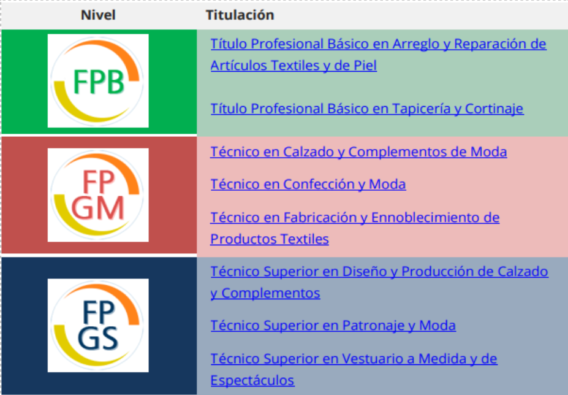

---
# Front matter
# Metainformació del document
title: "CERTIFICADO OFICIAL DE FORMACIÓN PEDAGÓGICA Y DIDÁCTICA PARA PROFESORADO TÉCNICO"
# author:
titlepage: true

# portada
titlepage-rule-height: 2
titlepage-rule-color: AA0000
titlepage-text-color: AA0000
titlepage-background: ../portades/UX.png

# date: "21-10-2025"
subject: "Proxmox"
keywords: [Xarxa, Instal·lació]
subtitle: "Familia profesional:"
lang: es
page-background: img/bg.png

colorlinks: true
linkcolor: "blue"

# configuració de l'índex
toc-own-page: true
toc-title: Continguts
toc-depth: 2

# capçalera i peu \thetitle
header-left: "Familia profesional:"
header-right: Curso 2025-2026
footer-left: CEFIRE FP
footer-right: \thepage/\pageref{LastPage}

# Les figures que apareguen on les definim i centrades
float-placement-figure: H
caption-justification: centering 

# No volem numerar les linies de codi
listings-disable-line-numbers: true

# Configuracions dels paquets de latex
header-includes:

  #  imatges i subfigures
  - \usepackage{graphicx}
  - \usepackage{subfigure}
  - \usepackage{lastpage}

  #  - \usepackage{adjustbox}
  # marca d'aigua
  #- \usepackage{draftwatermark}
 # - \SetWatermarkText{\includegraphics{./img/Markdown.png}}
  #- \SetWatermarkText{Per revisar}
  #- \SetWatermarkScale{.5}
  #- \SetWatermarkAngle{20}
   
  # caixes d'avisos 
  - \usepackage{awesomebox}

  # text en columnes
  - \usepackage{multicol}
  - \setlength{\columnseprule}{1pt}
  - \setlength{\columnsep}{1em}

  # pàgines apaïsades
  - \usepackage{pdflscape}
  # caixes mdframed
  - \usepackage{mdframed}
  
  # per a permetre pandoc dins de blocs Latex
  - \newcommand{\hideFromPandoc}[1]{#1}
  - \hideFromPandoc {
      \let\Begin\begin
      \let\End\end
    }
 
# definició de les caixes d'avis
pandoc-latex-environment:
  noteblock: [note]
  tipblock: [tip]
  warningblock: [warning]
  cautionblock: [caution]
  importantblock: [important]
...

\vspace*{\fill}

\begin{mdframed}[linecolor=gray, linewidth=0.5pt, leftline=true, rightline=false, topline=false, bottomline=false]
{\scriptsize
\textbf{EDITA:} \\
Generalitat Valenciana \\
Conselleria d’Educació, Investigació, Cultura i Esport \\
Servei de Formació del Professorat \\
CEFIRE de Formació Professional \\[1em]
\textbf{AUTOR VERSIÓN ORIGINAL:} \\
 \\
\textbf{AUTORES REVISIÓN 25-26:} \\
Gemma Cerezo Gil\\
Alfredo Rafael Vicente Boix \\[1em]
\textbf{MAQUETACIÓN:} \\
Alfredo Rafael Vicente Boix \\[1em]
Este material ha sido elaborado bajo una licencia de \\
Reconocimiento-NoComercial-CompartirIgual 3.0 de Creative Commons. \\[0.5em]

\includegraphics[height=8mm,keepaspectratio]{img/cc.png} \\
El código fuente del documento se encuentra disponible en:
\url{https://github.com/arvicenteboix/mastercillo_fp}
}
\end{mdframed}

\newpage

# INTRODUCCIÓN

La Formación Profesional constituye en la actualidad un elemento
vertebrador del sistema educativo y de empleo en España, situándose en
el centro de las políticas activas de aprendizaje a lo largo de la vida.
Bajo el marco normativo establecido por la Ley Orgánica 3/2022 y su
desarrollo reglamentario en el RD 659/2023, se configura un **sistema
unificado y flexible**, capaz de responder a las necesidades cambiantes
del entorno social y productivo.

Desde la perspectiva docente, este modelo implica un cambio
significativo en la concepción de la enseñanza-aprendizaje. La Formación
Profesional ya no se limita únicamente a la transmisión de conocimientos
técnicos, sino que se articula en torno a la **adquisición, integración
y transferencia de competencias profesionales**, entendidas como el
conjunto de conocimientos, destrezas, habilidades, actitudes y valores
necesarios para el ejercicio cualificado de una actividad profesional,
en contextos reales y diversos.

El nuevo sistema sitúa la competencia profesional como eje estructurador
de toda la acción formativa.

Además, el modelo fomenta una fuerte vinculación con el entorno
productivo mediante la formación en entornos reales de trabajo, el
desarrollo de proyectos colaborativos con empresas, la formación dual y
la evaluación de competencias adquiridas por vías no formales o
informales. En este sentido, la labor docente requiere un enfoque
metodológico activo y adaptativo, centrado en el desarrollo integral del
alumnado y orientado a su empleabilidad, a su itinerario formativo y a
su crecimiento profesional y personal.

La Formación Profesional comprende distintos grados de estudios ---tanto
en régimen inicial como para la formación continua o de personas
trabajadoras---, con una organización modular, articulada a través de
oferta formativa ajustada al catálogo de competencias profesionales. En
este sentido, el sistema se integra en el Catálogo Modular de Formación
Profesional y otros instrumentos de acreditación que permiten reconocer
competencias adquiridas por vías formales, no formales o informales,
según lo regulado en el Real Decreto 659/2023 (Titular VI).

Así mismo, el sistema normativo contempla que el currículo, los
procedimientos de evaluación, los espacios de formación, los centros y
los procesos de acreditación se adapten a los estándares profesionales
vigentes, lo que favorece el desarrollo profesional y social del
alumnado, así como una mejor respuesta a las exigencias del mundo
productivo.

# MODALIDADES DE LA FORMACIÓN PROFESIONAL

En el marco del Real Decreto 659/2023, la Formación Profesional se
organiza mediante distintos grados (A, B, C, D y E) y modalidades que
permiten una mayor accesibilidad, flexibilidad y adecuación a las
trayectorias personales y profesionales.

Entre las modalidades destacan:

- La modalidad **modular** para los Grados C, D y E, que permite cursar
  uno o varios módulos profesionales según el ritmo personal de
  aprendizaje y las necesidades de cualificación, adaptándose a personas
  adultas, en activo, o con experiencia laboral.

- La formación en alternancia con empresa (modalidades duales) y la
  oferta para personas trabajadoras o en transición profesional, de modo
  que se favorezca el aprendizaje en entornos reales de trabajo y la
  inserción laboral.

- La modalidad semipresencial o a distancia, especialmente para personas
  adultas, que compatibilizan formación con empleo o responsabilidades
  personales, mediante la combinación de actividades no presenciales y
  sesiones presenciales, así como recursos tecnológicos de apoyo (aunque
  la normativa estatal pone énfasis en modularización, flexibilidad y
  ritmo personalizado).

## Tipología de ofertas según grados

El RD 659/2023 organiza las ofertas del sistema de FP en **cinco
grados** (A, B, C, D y E), lo cual estructura de manera clara todo el
sistema

- Grado A: Acreditación parcial de competencias.

- Grado B: Certificado de competencia.

- Grado C: Certificado profesional.

- Grado D: Ciclo formativo (Grado Básico/Medio/Superior).

- Grado E: Cursos de especialización.\
  Este enfoque remarca que no solamente hay ciclos
  básicos/media/superior como antes, sino una tipología mucho más amplia
  para itinerarios modulares, acumulativos y flexibles.

## Modalidades de la oferta de formación

El sistema de Formación Profesional en España, de acuerdo con lo
establecido en el **Real Decreto 659/2023**, por el que se ordena el
sistema de Formación Profesional, y recogido a nivel autonómico en el
**Decreto 114/2025** (Comunitat Valenciana), reconoce **tres modalidades
de oferta** para los ciclos formativos: **presencial, semipresencial y
virtual (a distancia)**.

Estas modalidades responden a la necesidad de ofrecer una formación
**flexible, accesible y adaptada a distintos perfiles del alumnado**,
así como a las condiciones del entorno socioeconómico y productivo.

**Modalidad Presencial**

Es la forma tradicional de enseñanza, en la que el alumnado acude físicamente al centro educativo para realizar la formación teórica y práctica.

**Características principales:**

- **Asistencia regular al aula**: Requiere la presencia habitual del
  alumnado en el centro, según un horario establecido.

- **Interacción directa**: Favorece la comunicación cara a cara entre
  alumnado y profesorado.

- **Entornos simulados o reales**: Uso intensivo de talleres,
  laboratorios y espacios específicos del ciclo.

- **Evaluación continua**: Mayor facilidad para aplicar una evaluación
  formativa y ajustada al ritmo del grupo.

**Modalidad Semipresencial**

Combina la asistencia al centro educativo con actividades formativas desarrolladas de forma virtual, utilizando plataformas de aprendizaje en línea.

**Características principales:**

- **Flexibilidad horaria**: Permite al alumnado organizar parte de su
  formación según su disponibilidad.

- **Parte presencial obligatoria**: Se definen módulos o partes de
  módulos que requieren asistencia (por ejemplo, prácticas de taller).

- **Uso de entornos virtuales**: Empleo de plataformas LMS (como Aules,
  Moodle, etc.) para contenidos, tareas y seguimiento.

- **Tutorías presenciales y virtuales**: Seguimiento combinado por parte
  del profesorado.

**Modalidad Virtual (o a Distancia)**

La totalidad del ciclo formativo se desarrolla mediante plataformas digitales, sin exigencia de presencialidad salvo en momentos específicos (por ejemplo, exámenes o FCT si no se convalida).

**Características principales:**

- **Autonomía del alumnado**: El aprendizaje se organiza de forma
  autónoma, respetando los tiempos establecidos por el centro.

- **Sin presencialidad habitual**: Aunque pueden fijarse sesiones
  presenciales voluntarias o puntuales (evaluaciones finales, prácticas
  concretas...).

- **Plataformas de aprendizaje**: El entorno virtual es el espacio
  central del aprendizaje (contenidos, comunicación, evaluación).

- **Perfil adulto**: Muy orientada a personas trabajadoras, con
  responsabilidades familiares o que no pueden acudir regularmente a un
  centro.

En todas las modalidades, se asegura el cumplimiento de los resultados
de aprendizaje y la adquisición de las competencias profesionales
recogidas en el currículo oficial.

# Niveles formativos

La Formación Profesional se estructura en diferentes niveles de
cualificación profesional, definidos en el **Catálogo de Estándares de
Competencia**, que sirve como eje vertebrador para toda la oferta
formativa del sistema.

**Independientemente de la modalidad en la que se imparta** (presencial,
semipresencial o virtual), la oferta de Formación Profesional se
organiza en **tres niveles: básico, medio y superior**, agrupados bajo
la denominación de **Grados D**.

Esta clasificación responde a distintos grados de dominio competencial,
itinerarios formativos y salidas tanto profesionales como académicas. A
continuación, se desarrollan las características de cada uno de estos
niveles:

## Grados

### Grado Básico

**Nivel 1 del Catálogo de Estándares de Competencia**

Los ciclos de Grado Básico están dirigidos a alumnado que necesita una
vía alternativa a la educación secundaria obligatoria convencional, y
que requiere de un enfoque más práctico y adaptado a sus necesidades
formativas. Su finalidad es **favorecer la permanencia en el sistema
educativo**, reducir el abandono escolar temprano y facilitar la
transición al empleo.

**Características principales:**

- Forman parte de la **educación básica obligatoria**.

- Ofrecen una **formación general adaptada** y una iniciación
  profesional en un perfil ocupacional.

- Permiten obtener el **Título Profesional Básico**, con efectos
  académicos y laborales.

- Facilitan el acceso directo a ciclos de **Grado Medio** de la misma
  familia profesional.

- Tienen una duración es de dos cursos.

- Requieren haber cursado al menos 3.º de ESO o, de forma excepcional,
  2.º, y contar con **propuesta del equipo docente**.

- Se contempla en módulo de Formación en Empresa con sus características
  particulares

**Ordenación de los Ciclos de grado básico**

Constará de tres ámbitos y Proyecto:

a)  Ámbito de comunicación y Ciencias Sociales

b)  Ámbito de Ciencias Aplicadas

c)  Ámbito Profesional

d)  Proyecto intermodular de aprendizaje colaborativo vinculado a los
    tres ámbitos.

### Grado Medio

**Nivel 2 del Catálogo de Estándares de Competencia**

Los ciclos de Grado Medio están dirigidos a alumnado que ha superado la
Educación Secundaria Obligatoria o que ha obtenido el título de
Profesional Básico. Estos ciclos proporcionan la **cualificación
necesaria para el desempeño de una profesión técnica** en un entorno
productivo concreto. Forman parte de la educación secundaria
postobligatoria.

**Características principales:**

- Conducen a la obtención del **Título de Técnico**, con validez
  académica y profesional.

- Permiten el acceso directo a estudios de **Grado Superior**, una vez
  finalizado el ciclo.

- Se organizan en **módulos profesionales**, tanto teóricos como
  prácticos.

- Pueden impartirse en modalidad **presencial, semipresencial o
  virtual**.

- Su duración también es de dos cursos.

### Grado Superior

**Nivel 3 del Catálogo de Estándares de Competencia**

Los ciclos de Grado Superior están orientados a la **especialización
profesional avanzada**, y capacitan al alumnado para desarrollar
funciones de mayor complejidad técnica y de responsabilidad en el ámbito
laboral. Forman parte de la educación superior.

**Características principales:**

- Conducen al **Título de Técnico Superior**.

- Permiten el acceso a estudios universitarios, con posibilidad de
  reconocimiento de créditos ECTS.

- Incluyen formación en **emprendimiento, digitalización,
  sostenibilidad** y otros aspectos transversales.

- También incorporan el módulo de **Formación en Empresa**

- Pueden ofrecerse en modalidad **presencial, semipresencial o
  virtual**, favoreciendo así la conciliación laboral y formativa.

- Su duración también es de dos cursos.

**Ordenación de los Ciclos de grado medio y superior**

a) Una parte troncal obligatoria

1. Módulos Profesionales de Catálogo Modular de Formación Profesional.

2. Módulos transversales

- Itinerario para la empleabilidad I y II

- Digitalización aplicada al sistema productivo

- Sostenibilidad aplicada al sistema productivo

- Inglés profesional

b) Una parte de optativa integrada de un módulo de los que se ofrecerán
en el centro educativo que tendrá duración anual y se cursará en segundo
curso.

## Acceso a los ciclos formativos

El acceso a los Ciclos Formativos se regula por el Real Decreto
6523/2011, de 18 de julio

**Acceso a ciclos de grado básico**

1. El acceso a los ciclos formativos de grado básico de los
destinatarios del párrafo a) del apartado 1 del artículo anterior
requerirá, conforme al artículo 41.1 de la Ley Orgánica 2/2006, de 3 de
mayo, de Educación, el cumplimiento simultáneo de los siguientes
requisitos:

a) Tener cumplidos quince años, o cumplirlos durante el año natural en
curso.

b) Haber cursado el tercer curso o, excepcionalmente y a criterio del
equipo docente y el responsable de la orientación en el centro, el
segundo curso de educación secundaria obligatoria.

c) Ser objeto de propuesta o solicitar a petición propia, junto con los
padres, madres o tutores legales, la incorporación a un ciclo formativo
de grado básico, cuando el perfil vocacional del alumno o alumna así lo
aconseje. Las administraciones educativas determinarán la intervención
del alumnado, sus familias y los equipos o servicios de orientación en
este proceso.

d) En el supuesto de realización de ciclos formativos de grado básico en
régimen intensivo, el alumno deberá tener cumplidos 16 años para poder
acceder a la formación práctica en empresa por esta modalidad, al estar
vinculada a la contratación.

**Acceso a ciclos formativos de grado medio.**

1. Para el acceso a los ciclos formativos de grado medio se precisará el
cumplimiento de uno de los siguientes requisitos:

a) Estar en posesión del título de graduado en Educación Secundaria
Obligatoria.

b) Estar en posesión del título de Técnico Básico o de Técnico.

c) Haber superado una oferta formativa de Grado C incluida en el ciclo
formativo.

d) Haber superado un curso de formación específico preparatorio y
gratuito para el acceso a ciclos formativos de grado medio en centros
expresamente autorizados por la Administración educativa.

e) Haber superado una prueba de acceso.

**Acceso a ciclos formativos de grado superior.**

1. Para el acceso a los ciclos formativos de grado superior se precisará
el cumplimiento de uno de los siguientes requisitos:

a) Poseer el título de Técnico de Grado Medio de Formación Profesional o
el título de Técnico o Técnica de Artes Plásticas y Diseño.

b) Poseer el título de Bachiller.

c) Haber superado una oferta formativa de Grado C incluida en el ciclo
formativo.

d) Haber superado un curso de formación específico preparatorio y
gratuito para el acceso a ciclos de grado superior en centros
expresamente autorizados por la Administración educativa.

e) Haber superado una prueba de acceso.

f) Estar en posesión de un título de Técnico Superior de Formación
Profesional o grado universitario.

# DISTRIBUCIÓN HORARIA CICLOS Y MÓDULOS FORMATIVOS

La distribución horaria de los ciclos formativos y de sus módulos
profesionales viene establecida por el real decreto estatal que fija el
currículo básico del título. En la Comunitat Valenciana, las
administraciones educativas autonómicas pueden concretar y adaptar dicha
distribución, de modo que responda a las necesidades y condiciones
específicas del territorio.

La duración de los ciclos formativos es de 2000 horas que se distribuyen
en los diferentes módulos formativos durante dos cursos escolares. Tanto
el comienzo como la finalización del año académico se fija en un
calendario escolar que viene publicado en una Resolución.

A cada módulo formativo le corresponde una fijación horaria que se
distribuye en horas semanales. Los días de la semana que se imparten
estas horas son flexibles y vienen determinados por cada centro
educativo. En los cuadros horarios se indica los módulos susceptibles de
doblaje (DT) y también los módulos que pueden ser impartidos,
indistintamente, por otro docente de otra especialidad.

La secuenciación de los módulos y el horario de los diferentes ciclos de
las Familias Profesionales están publicados en la web de Conselleria se
pueden consultar el siguiente enlace:

[Dosier ciclos - Formación Profesional - Generalitat Valenciana](https://ceice.gva.es/es/web/formacion-profesional/dossier-cicles)

## MÓDULOS PROFESIONALES Y TITULACIONES ACADÉMICAS REQUERIDAS PARA SU IMPARTICIÓN

La página web de **Todo FP** y el portal de la **Conselleria d'Educació,
Cultura i Esport** en su sección de Formación Profesional constituyen
una fuente viva y actualizada de información, imprescindible para todos
los docentes. En estos espacios se dispone de toda la documentación y
recursos necesarios para la elaboración y desarrollo de una programación
didáctica adecuada y conforme a la normativa vigente.

Es, por tanto, en estos portales donde debéis remitiros para consultar
los diferentes módulos que conforman un ciclo formativo, así como para
conocer la atribución docente correspondiente a cada uno de ellos.

Los aspectos referentes al profesorado con atribución docente en los
módulos profesionales de cada ciclo formativo, donde el profesorado
técnico imparte docencia, están recogidos en los correspondientes reales
decretos de título. Asimismo, estos decretos proporcionan información
sobre los resultados de aprendizaje y los criterios de evaluación, que
constituyen pilares fundamentales en nuestra programación didáctica.

Es fundamental consultar los decretos y órdenes específicos de nuestra
Comunidad Autónoma, ya que, como se ha señalado en apartados anteriores,
estos concretan y detallan las instrucciones establecidas en los reales
decretos de título correspondientes a cada ciclo formativo. Esta
normativa autonómica ofrece directrices precisas sobre la organización,
atribución docente y otros aspectos esenciales para el desarrollo de una
programación didáctica conforme a las necesidades y características del
sistema educativo valenciano.

# LA FAMILIA PROFESIONAL DE TEXTIL, CONFECCIÓN Y PIEL

## INTRODUCCIÓN  

La familia profesional de Textil, Confección y Piel integra un conjunto de actividades dedicadas al diseño, fabricación, transformación y comercialización de productos textiles, de confección, calzado y marroquinería, abarcando desde los procesos industriales hasta la creación artesanal. Su ámbito de actuación incluye la preparación y tratamiento de materias primas, el diseño y patronaje de prendas y complementos, la confección y acabado de productos textiles, así como la fabricación de artículos de cuero, calzado y marroquinería, lo que la convierte en una de las familias profesionales con mayor diversidad técnica y creativa. 

En la Comunitat Valenciana, esta familia profesional tiene una larga tradición industrial y artesanal, especialmente en sectores como el calzado, la moda, el textil hogar y los complementos de piel. Las comarcas del Baix Vinalopó, l’Alcoià, la Vall d’Albaida, la Ribera y el Camp de Morvedre destacan por su elevada concentración de empresas dedicadas a la producción textil y de calzado, lo que sitúa a la región entre las principales áreas industriales del sector en España. Este tejido empresarial combina grandes empresas exportadoras con pymes y talleres artesanales, generando un importante volumen de empleo y contribuyendo significativamente al desarrollo económico y cultural del territorio. 

La oferta formativa en la Comunitat Valenciana dentro de esta familia profesional es amplia y está adaptada a las necesidades del sector. Se imparten ciclos formativos de Grado Básico, Medio y Superior en especialidades como Confección y Moda, Patronaje y Moda, Calzado y Complementos de Moda, donde el alumnado adquiere competencias en diseño, patronaje, producción, control de calidad, sostenibilidad y comercialización. Además, la colaboración entre centros educativos, empresas, asociaciones del sector y centros tecnológicos permite una formación práctica, innovadora y ajustada a la realidad productiva. 

El sector textil, de confección y piel ha experimentado una profunda transformación tecnológica y sostenible en los últimos años. La incorporación de nuevos materiales ecológicos, procesos de economía circular, digitalización del diseño (CAD-CAM), automatización en la confección y el uso de tecnologías 3D para el desarrollo de prototipos ha renovado los métodos de producción y los perfiles profesionales. Estas innovaciones exigen trabajadores cualificados, capaces de integrar creatividad, conocimiento técnico, sostenibilidad y competencias digitales. En este contexto, la Formación Profesional se adapta de forma continua, incorporando contenidos actualizados sobre moda sostenible, diseño digital, innovación productiva y emprendimiento, garantizando una formación moderna, creativa y alineada con las demandas actuales del sector textil, de confección y de la piel. 

## OFERTA FORMATIVA

### TITULOS POR NIVELES

Dentro de esta familia profesional podemos encontrar ciclos formativos de los tres niveles: 

## REALES DECRETOS 

### GRADO BÁSICO 

**Arreglo y reparación de artículos textiles y de piel**

- Real Decreto 127/2014, de 28 de febrero, por el que se regulan aspectos específicos de la Formación Profesional Básica de las enseñanzas de formación profesional del sistema educativo, se aprueban catorce títulos profesionales básicos, se fijan sus currículos básicos y se modifica el Real Decreto 1850/2009, de 4 de diciembre, sobre expedición de títulos académicos y profesionales correspondientes a las enseñanzas establecidas en la Ley Orgánica 2/2006, de 3 de mayo, de Educación. 

- DECRETO 185/2014, de 31 de octubre, del Consell, por el que se establecen veinte currículos correspondientes a los ciclos formativos de Formación Profesional Básica en el ámbito de la Comunitat Valenciana. 

**Tapicería y cortinaje**

- Real Decreto 127/2014, de 28 de febrero, por el que se regulan aspectos específicos de la Formación Profesional Básica de las enseñanzas de formación profesional del sistema educativo, se aprueban catorce títulos profesionales básicos, se fijan sus currículos básicos y se modifica el Real Decreto 1850/2009, de 4 de diciembre, sobre expedición de títulos académicos y profesionales correspondientes a las enseñanzas establecidas en la Ley Orgánica 2/2006, de 3 de mayo, de Educación. 

- DECRETO 185/2014, de 31 de octubre, del Consell, por el que se establecen veinte currículos correspondientes a los ciclos formativos de Formación Profesional Básica en el ámbito de la Comunitat Valenciana. 

### GRADO MEDIO 

**Calzado y complementos de moda**

- Real Decreto 257/2011, de 28 de febrero, por el que se establece el título de Técnico en Calzado y Complementos de Moda y se fijan sus enseñanzas mínimas. 

- CORRECCIÓN de errores del Decreto 119/2017, de 8 de septiembre, del Consell, por el que se establece para la Comunitat Valenciana el currículo del ciclo formativo de grado medio correspondiente al título de Técnico o Técnico en Calzado y Complementos de Moda, 

- Para elaborar la programación didáctica será necesario consultar el Decreto 114/2025, de 29 de julio, con el fin de comprobar si el módulo que se va a programar ha experimentado alguna modificación. En caso de que el decreto introduzca cambios, se deberán tener en cuenta y aplicar las adaptaciones correspondientes en la programación. 

**Confección y moda**

- Real Decreto 955/2008, de 6 de junio, por el que se establece el título de Técnico en Confección y Moda y se fijan sus enseñanzas mínimas. 

- ORDEN de 29 de julio 2009, de la Conselleria de Educación, por la que se establece para la Comunitat Valenciana el currículo del ciclo formativo de Grado Medio correspondiente al título de Técnico en Confección y Moda. 

- Para elaborar la programación didáctica será necesario consultar el Decreto 114/2025, de 29 de julio, con el fin de comprobar si el módulo que se va a programar ha experimentado alguna modificación. En caso de que el decreto introduzca cambios, se deberán tener en cuenta y aplicar las adaptaciones correspondientes en la programación. 

**Fabricación y ennoblecimiento de productos textiles**

- Real Decreto 1591/2011, de 4 de noviembre, por el que se establece el Título de Técnico en Fabricación y Ennoblecimiento de Productos Textiles y se fijan sus enseñanzas mínimas. 

- DECRETO 40/2017, de 24 de marzo, del Consell, por el que se establece el currículo del ciclo formativo de grado medio correspondiente al título de Técnico/a en Fabricación y Ennoblecimiento de Productos Textiles.  

- Para elaborar la programación didáctica será necesario consultar el Decreto 114/2025, de 29 de julio, con el fin de comprobar si el módulo que se va a programar ha experimentado alguna modificación. En caso de que el decreto introduzca cambios, se deberán tener en cuenta y aplicar las adaptaciones correspondientes en la programación.  

### GRADO SUPERIOR 

**Diseño y producción de calzado y complementos**

- Real Decreto 689/2010, de 20 de mayo, por el que se establece el título de Técnico Superior en Diseño y Producción de Calzado y Complementos y se fijan sus enseñanzas mínimas. 

- ORDEN 61/2012, de 25 de septiembre, de la Conselleria de Educación, Formación y Empleo por la que se establece para la Comunitat Valenciana el currículo del ciclo formativo de grado superior correspondiente al título de Técnico Superior en Diseño y Producción de Calzado y Complementos 

- Para elaborar la programación didáctica será necesario consultar el Decreto 114/2025, de 29 de julio, con el fin de comprobar si el módulo que se va a programar ha experimentado alguna modificación. En caso de que el decreto introduzca cambios, se deberán tener en cuenta y aplicar las adaptaciones correspondientes en la programación. 

**Diseño técnico en textil y piel**

- Real Decreto 1580/2011, de 4 de noviembre, por el que se establece el Título de Técnico Superior en Diseño Técnico en Textil y Piel y se fijan sus enseñanzas mínimas. 

- ORDEN 61/2012, de 25 de septiembre, de la Conselleria de Educación, Formación y Empleo por la que se establece para la Comunitat Valenciana el currículo del ciclo formativo de grado superior correspondiente al título de Técnico Superior en Diseño y Producción de Calzado y Complementos.  

- Para elaborar la programación didáctica será necesario consultar el Decreto 114/2025, de 29 de julio, con el fin de comprobar si el módulo que se va a programar ha experimentado alguna modificación. En caso de que el decreto introduzca cambios, se deberán tener en cuenta y aplicar las adaptaciones correspondientes en la programación. 

**Patronaje y moda**

- Real Decreto 954/2008, de 6 de junio, por el que se establece el título de Técnico Superior en Patronaje y Moda y se fijan sus enseñanzas mínimas. 

- ORDEN de 29 de julio 2009, de la Conselleria de Educación, por la que se establece para la Comunitat Valenciana el currículo del ciclo formativo de Grado Superior correspondiente al título de Técnico Superior en Patronaje y Moda.  

- Para elaborar la programación didáctica será necesario consultar el Decreto 114/2025, de 29 de julio, con el fin de comprobar si el módulo que se va a programar ha experimentado alguna modificación. En caso de que el decreto introduzca cambios, se deberán tener en cuenta y aplicar las adaptaciones correspondientes en la programación. 

**Vestuario a medida y de espectáculos**

- Real Decreto 1679/2011, de 18 de noviembre, por el que se establece el título de Técnico Superior en Vestuario a medida y de espectáculos y se fijan sus enseñanzas mínimas. 

- DECRETO 102/2017, de 21 de julio, del Consell, por el que se establece para la Comunitat Valenciana el currículo del ciclo formativo de grado superior correspondiente al título de Técnico/a Superior en Vestuario a Medida y de Espectáculos. 

## INSTALACIONES  

### LA ESPECIALIDAD DE PATRONAJE Y CONFECCIÓN 

En este apartado veremos los módulos de los ciclos que pertenecen a esta especialidad  

#### FP BÁSICA  

**Espacios**

# Tabla de Superficies de Espacios Formativos

| Espacio Formativo | Superficie m2 (30 alumnos) | Superficie m2 (20 alumnos) |
|-------------------|---------------------------|---------------------------|
| Aula Polivalente | 60 | 40 |
| Taller de confección | 200 | 140 |
| Aula Patronaje | 200 | 140 |

**Equipamientos**

| Espacio Formativo | Equipamiento y Recursos |
|-------------------|------------------------|
| Taller de confección | Maquinaria para la confección de prendas de vestir y complementos de decoración. Herramientas y materiales para la confección de prendas de vestir y complementos de decoración. Mesas de trabajo adecuadas a las operaciones que se deben realizar. Equipos de planchado. Equipos y medios de seguridad. |
| Aula Polivalente | Ordenadores instalados en red, cañón de proyección e Internet. Medios audiovisuales. Software de aplicación. |
| Taller de reparación y Marroquinería | Herramientas para la reparación de calzado y marroquinería y actividades complementarias. Banco de finalización. Máquina de formas para ensamchar. Máquina de rebajar y dividir. Máquina de pegar filis, suelas y otros. Máquinas auxiliares de dar adhesivo. Máquinas de coser de zapatero. Máquinas de ribetear. Máquinas de zigzag. Máquinas de pasador, remaches y otros. Máquina y mesa de corte. Reactivador de adhesivos. Pistolas para pegar. Herramientas para grabar y repujar. Equipos y medios de seguridad. |

#### GRADO MEDIO

**Espacios **

| Espacio Formativo | Superficie m2 (30 alumnos) | Superficie m2 (20 alumnos) |
|-------------------|---------------------------|---------------------------|
| Aula Polivalente | 60 | 40 |
| Taller de confección | 200 | 140 |
| Aula Patronaje | 120 | 90 |
| Laboratorio de Materiales | 90 | 60 |

**Equipamientos **

| Espacio Formativo | Equipamiento |
|-------------------|--------------|
| Aula Polivalente | Ordenadores instalados en red, cañón de proyección e Internet. Medios audiovisuales. Software de aplicación. |
| Aula Patronaje | Tablas de dibujo. Taburetes. Lugares informáticos en red con equipos para CAD-CAM de calzado y marroquinería. Ladrillo/Tableta digitalizadora A3 Plotter para corte y marcado. Impresora láser A3. Programas de software. Cañón de proyección. Mesa para copiar patrones. Taladrador para patrones. Apoyos para rollos de papel y cartón. Escáner. Hormas de calzado. |
| Taller de confección | Máquina llana programable. Máquina overlock. Máquina de zigzag. Etiquetadora manual. Taburete regulable. Equipo de broches a presión. Máquina impresora de etiquetas. Termofijadora. Prensa universal. Máquina de 2 agujas de columna. Máquinas llanas de coser piel. Máquina de rebajar. Máquina de bordar. Máquinas de colocar vives con embudos. Máquina de cortado de banda. Máquina de triple arrastramiento. Sillas ajustables. Hormas de calzado (mujer, hombre y niño para tallas). Máquina de dividir. Máquina de dobladillado. Máquina de picar. Cizallas de patrones. Tablas de corte. Máquina de ribetear. Máquina de embastar. Máquina de modelar gom. Máquina de modelar contrafuertes. Clavadora de Palmillas. Máquina de reactivar. Máquina de centrar puntas. Máquina de montar talones. Máquina de vaporizar. Máquina de pulir y cardar. Reactivador de pisos. Máquina de prefijar talones. Máquina de prensar pisos. Máquina de sacar formas. Máquina de grapar talones. Cabina de dar adhesivo. Cabina de acabado. Molde de vulcanizado. |
| Laboratorio de Materiales | armarios para reactivos, taburetes). Dinamómetro electrónico. Micrómetro. Flexómetro de empeines. Abrasímetro. Microscopios. Balanzas de precisión. Aspe para numeración de hilos. Romana para numeración de hilos. Filocono. Torsiómetro manual. Balanza de precisión para peso. Dinamómetro para hilos y tejidos. Equipamiento de química para análisis de materias. Equipo para destilación de agua. Cámara de colores o cámara de luces UV Horno o Estufa de secado. Equipamiento de laboratorio (tablas, módulos de fregaderos, vitrinas, armarios para reactivos, taburetes)  Dinamómetro electrónico Micrómetro Flexómetro de empeines Abrasímetro |

#### GRADO SUPERIOR 

##### TÍTULO PROFESIONAL GRADO SUPERIOR EN PATRONAJE Y MODA

**Espacios **

Based on the table in your image, here's the markdown version:

| Espacio Formativo | Superficie m2 (30 alumnos) | Superficie m2 (20 alumnos) |
|---|---|---|
| Aula Polivalente | 60 | 40 |
| Taller de Confección | 240 | 160 |
| Aula Patronaje | 90 | 60 |
| Laboratorio de Materiales | 60 | 40 |

**Equipamientos**

| Espacio Formativo | Equipamiento |
|---|---|
| Aula Polivalente | Ordenadores instalados en red, cañón de proyección e Internet. Medios audiovisuales. Software de aplicación |
| Aula Patronaje | Tablas de dibujo. Taburetes. Lugares informáticos en red con equipos para CAD-CAM. Tablero con patas de realizar. Plotter. Impresora láser. Programas de Software. Cañón de proyección. Mesa copiar patrones. Taladrádor para patrones. Apoyos para rollos de cartón y papel. |
| Taller de confección | Máquina llana programable. Máquina Owerlock de 3 hilos. Máquina Owerlock de 4 hilos. Máquina Owerlock sobrehilar 5 hilos. Máquina de Recubrir 2 agujas. Máquina de triple arrastre. Máquina de ojales, camisería. Máquina de ojales sastrería. Máquina de bajos (puntada invisible). Máquina de zigzag. Sillas ajustables. Máquina corte de hoja vertical. Máquina corte de hoja circular. Máquina de perforar colchón. (Marcador de señales). Lavadora. Etiquetadora manual. Tijeras eléctricas. Mesa de corte (para extendido y corte de tejidos). Taburete regulable. Cabezal de corte para cuño. Juego de utensilios para corte. (Tijeras, peces, pinzas ...). Guantes de malla cinco dedos. Maniquí (mujer, nombre y niño). Equipo de broches a presión. Equipo multifunción para forrar botones. Volteador de cuellos. Máquina impresora de etiquetas. Termofijadora. Mesa de plancha con aspiración y soplado + plancha. Mesa de plancha universal + plancha. Prensa universal. Juego de varias formas de plancha (costuras, señora, caballero.). Generador vapor. Juego de carretes, aplanadores, martillos y utensilios para piel. Máquina de bordor de 1cabezal y 6 color |
| Laboratorio de Materiales | Microscopios. Balanzas de precisión. Aspe para numeración de hilos. Romana para numeración de hilos. Filocono. Torsiómetro manual. Balanza de precisión para peso. Dinamómetro para hilos y tejidos. Equipamiento de química para análisis de materiales. Equipo para destilación de agua. Cámara de colores o Cámara de luces UV. Horno o Estufa de secado. Equipamiento de laboratorio (tablas, módulos de fregaderos vitrinas, armarios para reactivos, taburetes). |

 
#### TÍTULO PROFESIONAL GRADO SUPERIOR EN DISEÑO Y PRODUCCIÓN DE CALZADO Y COMPLEMENTOS 

**Espacios**

Aquí está la tabla en markdown:

| Espacio Formativo | Superficie m2 (30 alumnos) | Superficie m2 (20 alumnos) |
|---|---|---|
| Aula Polivalente | 60 | 40 |
| Aula técnica + Taller + Laboratorio | 390 | 260 |

**Equipamientos**
 
| Espacio Formativo | Equipamiento |
|---|---|
| Aula Polivalente | Ordenadores instalados en red, cañón de proyección e Internet. Medios audiovisuales. Software de aplicación. |
| Aula Patronaje | Tablas de dibujo. Taburetes. Lugares informáticos en red con equipos para CAD-CAM de calzado y marroquinería. Ladrillo/tableta digitalizadora A3. Plotter. Impresora láser A3. Programas de software. Cañón de proyección. Mesa para copiar patrones. Taladrádor para patrones. Apoyos para rollos de papel y cartón. Escáner. Hormas de calzado. |
| Taller de confección | Máquina llana programable. Máquina overlock. Máquina de zigzag. Etiquetadora manual. Taburete regulable. Cabezal de corte. Herramientas para el corte. Útiles para la piel. Máquina impresora de etiquetas. Termofijadora. Prensa universal. Máquina de 2 agujas de columna. Máquinas llanas de coser piel. Máquina de rebajar. Máquina de bordar. Máquinas de colocar vives con embudos. Máquina de cortado de banda. Juegos de broche a presión. Máquina de triple arrastre. Sillas ajustables. Hormas de calzado (mujer, hombre e niño por tallas). Máquina de dividir. Máquina para hacer el doblado. Máquina de picar. Cizallas de patrones. Tablas de corte. Máquina de modelar gom. Máquina de modelar contrafuertes. Clavadora de Palmillas. Máquina de reactivar. Máquina de centrar puntas. Máquina de montar talones. Máquina de vaporizar. Máquina de pulir y cardar. Reactivador de pisos. Máquina de prefjar talones. Máquina de prensar pisos. Máquina de sacar formas. Máquina de grapar talones. Cabina de dar adhesivo. Cabina de acabado. Molde de vulcanizado. |
| Laboratorio de Materiales | Microscopios. Balanzas de precisión. Aspe para numeración de hilos. Romana para numeración de hilos. Filocono. Torsiómetro manual. Balanza de precisión para peso. Dinamómetro para hilos y tejidos. Equipamiento de química para análisis de materias. Equipo para destilación de agua. Cámara de colores o cámara de luces UV. Horno o Estufa de secado. Equipamiento de laboratorio (tablas, módulos de fregaderos vitrinas, armarios para reactivos, taburetes). Dinamómetro electrónico. Micrómetro. Flexómetro de empeines. Abrasímetro. |

##### TÍTULO PROFESIONAL GRADO SUPERIOR DE VESTUARIO A MEDIDA Y DE ESPECTÁCULOS 

**Espacios **

| Espacio Formativo | Superficie m2 (30 alumnos) | Superficie m2 (20 alumnos) |
|---|---|---|
| Aula Polivalente | 60 | 40 |
| Taller de Confección | 200 | 140 |
| Aula Patronaje | 120 | 90 |
| Laboratorio de Materiales | 90 | 60 |

**Equipamientos **

| Espacio Formativo | Equipamiento |
|---|---|
| Aula Polivalente | Ordenadores instalados en red, cañón de proyección e Internet. Medios audiovisuales. Software de aplicación. |
| Aula Patronaje | Tablas de dibujo. Taburetes. Lugares informáticos en red con equipos por CAD-CAM. Tablero con patas de realizar. Plotter. Impresora láser. Programas de Software. Cañón de proyección. Mesa copiar patrones. Taladrádor para patrones. Apoyos para rollos de cartón y papel. |
| Taller de confección | Máquina llana programable. Máquina overlockde 3 hilos. Máquina Owerlock de 4 hilos. Máquina Owerlock sobrehilar 5 hilos. Máquina de Recubrir 2 agujas. Máquina de triple arrastre. Máquina de ojales, camisería. Máquina de ojales sastrería. Máquina de bajos (puntada invisible). Máquina de zigzag. Sillas ajustables. Máquina corte de hoja vertical. Máquina corte de hoja circular. Máquina de perforar colchón. (Marcador de señales). Lavadora. Etiquetadora manual. Tijeras eléctricas. Mesa de corte (para extendido y corte de tejidos). Taburete regulable. Cabezal de corte para cuño. Juego de utensilios para corte. (Tijeras, peces, pinzas ...). Guantes de malla cinco dedos. Maniquí (mujer, nombre y niño). Equipo de broches a presión. Equipo multifunción para forrar botones. Volteador de cuellos. Máquina impresora de etiquetas. Termofijadora. Mesa de plancha con aspiración y soplado + plancha. Mesa de plancha universal + plancha. Prensa universal. Juego de varias formas de plancha (costuras, señora, caballero.). Generador vapor. Juego de carretes, aplanadores, martillos y utensilios para piel. Máquina de bordor de 1cabezal y 6 color. |
| Laboratorio de Materiales | Microscopios. Balanzas de precisión. Aspe para numeración de hilos. Romana para numeración de hilos. Filocono. Torsiómetro manual. Balanza de precisión para peso. Dinamómetro para hilos y tejidos. Equipamiento de química para análisis de materiales. Equipo para destilación de agua. Cámara de colores o Cámara de luces UV. Horno o Estufa de secado. Equipamiento de laboratorio (tablas, módulos de fregaderos vitrinas, armarios para reactivos, taburetes). |

 
## ENTORNO PROFESIONAL 

### Título profesional básico arreglo y reparación de artículos de textil y piel 

Mediante este ciclo de grado básico se puede acceder a desarrollar puestos de trabajo del mercado laboral en empresas relacionadas con las siguientes actividades: 

* Zapatero - reparador de calzado  
* Ayudante de reparación de calzado 
* Reparador de artículos de marroquinería 
* Ayudante de marroquinería  
* Guarnicionero 
* Marroquinero artesanal 
* Operador de máquinas lavadoras y secadoras de ropa  
* Operador de máquinas y equipos de planchado de prendas de vestir 
* Costurero a mano o máquina doméstica 
* Costurero - zurcidor* Modisto de arreglos y composturas 
* Operario de confección* Operario de modistería 

### Título profesional básico tapicería y cortinaje 

Mediante este ciclo de grado básico se puede acceder a desarrollar puestos de trabajo del mercado laboral en empresas relacionadas con las siguientes actividades: 

* Tapicero de muebles  
* Tapicero artesanal  
* Tapicero de decoración auxiliar  
* Montador de cortinajes y estores 

### Título profesional básico confección y moda

Mediante este ciclo de grado medio se puede acceder a desarrollar puestos de trabajo del mercado laboral en empresas relacionadas con las siguientes actividades: 

* Técnico o técnica en confección industrial de piezas y complementos de vestir y artículos textiles  
* Técnico cortador y costurero o técnica cortadora y costurera de piezas de vestir y artículos textiles y de piel  
* Bordador o bordadora a máquina 
* Planchador o planchadora 
* Acabador o acabadora  
* Técnico o técnica en confección a medida 

### Técnico en calzado y complementos de moda

Mediante este ciclo de grado medio se puede acceder a desarrollar puestos de trabajo del mercado laboral en empresas relacionadas con las siguientes actividades:  

* Tallador de artículos de piel y cuero  
* Preparador / Costurero de piel y cuero (escaparate) 
* Montador-separador de marroquinería  
* Montador-acabador de calzado 
* Reparador de calzado y marroquinería 
* Guarnicionero 
* Zapatero de calzado a medida 

### Técnico en fabricación y ennoblecimiento de productos textiles

Mediante este ciclo de grado medio se puede acceder a desarrollar puestos de trabajo del mercado laboral en empresas relacionadas con las siguientes actividades: 

* Técnico en preparación y control de máquinas de tintura 
* Técnico en preparación y control de máquinas de estampado 
* Técnico en preparación y control de máquinas de aprestos y acabados 
* Preparador de disoluciones 

### Técnico Superior PATRONAJE Y MODA

Mediante este ciclo de grado superior se puede acceder a desarrollar puestos de trabajo del mercado laboral en empresas relacionadas con las siguientes actividades:

* Técnico o técnica patronista
* Técnico o técnica responsable en muestrario 
* Técnico o técnica en confección de prototipos 
* Técnico o técnica en confección industrial  
* Técnico o técnica en fabricación de artículos de piel y de cuero 
* Técnico o técnica en organización de la producción  
* Diseñador técnico o diseñadora técnica de patronaje y confección con diseño y producción asistidos para ordenador (cad / cam) 
* Técnico o técnica de desarrollo de productos de confección (y + d + y) 

### Técnico superior diseño y producción de calzado y complementos

Mediante este ciclo de grado superior se puede acceder a desarrollar puestos de trabajo del mercado laboral en empresas relacionadas con las siguientes actividades: 

* Diseñador técnico de calzado y de artículos de marroquinería. 
* Técnico de Patronaje con CAD / CAM  
* Modelista-patronista-ajustador de calzado y artículos de marroquinería 
* Técnico de desarrollo de productos de calzado y de marroquinería (R + D + Y) 
* Patronista-escalador de calzado y artículos de marroquinería 
* Técnico en fabricación de calzado y de artículos de marroquinería 
* Técnico en control de calidad en industrias del calzado y la marroquinería 
* Controlador de producción 

### Técnico superior vestuario a medida y de espectáculos

Mediante este ciclo de grado superior se puede acceder a desarrollar puestos de trabajo del mercado laboral en empresas relacionadas con las siguientes actividades:

* Modelista-patronista de piezas de vestir
* Sastre/a medida
* Sastre/a de vestuario del espectáculo
* Modisto/a 

# ARTES GRÁFICAS

## LA FAMILIA PROFESIONAL 

1. LA INDUSTRIA GRÁFICA  

Según el Ministerio de Industria, Energía y Turismo, el sector se engloba dentro del grupo 18 Artes Gráficas y servicios relacionados con las mismas, de la Clasificación Nacional de Actividades Económicas (CNAE-2009). 

(Divisiones 17 y 18 de la CNAE-2009 y Rama 20 de la clasificación RAMI) comprende los siguientes subsectores:  

* Industria del papel (División 17, CNAE-2009)
* Artes gráficas y reproducción de soportes grabados (División 18, CNAE-2009) 

El sector de papel, artes gráficas y reproducción de soportes grabados engloba las siguientes agrupaciones de otras clasificaciones estadísticas: 

* TSIO-2010. Rama 8 (Papel y productos del papel) 
* ISIC. Códigos de producto: 21 (papel y productos de papel) y 22 (artes gráficas y reproducción de soportes grabado  

El proceso de trabajo se puede sintetizar en las siguientes tareas:  

* Manipulación de papel y cartón: Preparación del soporte según el proceso que se vaya a seguir. 
* Preimpresión: Preparación y disposición de textos e imágenes para obtener la forma impresora. 
* Impresión: Tipografía, litografía (offset), bajorrelieve (huecograbado), serigrafía, flexografía, impresión digital y reprografía; sistemas de impresión utilizados para transferir la imagen al soporte.  
* Acabado y encuadernación (postimpresión): Plegado, perforado, cosido, troquelado, corte, laminados, acabados de ennoblecimiento y encuadernación. 

## OFERTA FORMATIVA 

Dentro de la familia profesional de Artes Gráficas se ofertan seis ciclos formativos. 

### TÍTULO DE FORMACIÓN PROFESIONAL BÁSICA 

* Título Profesional Básico en Artes Gráficas 

### TÍTULOS DE FORMACIÓN PROFESIONAL DE GRADO MEDIO

* Técnico en Impresión Gráfica 
* Técnico en Postimpresión  y Acabados Gráficos 
* Técnico en Preimpresión Digital 

### TÍTULOS DE FORMACIÓN PROFESIONAL DE GRADO SUPERIOR

* Técnico Superior en Diseño y Ediciones de Publicaciones Impresas y Multimedia 
* Técnico Superior en Diseño y Gestión de la Producción Gráfica 

 

## REALES DECRETOS

**Título Profesional Básico en Artes Gráficas**

- Real Decreto 356/2014, de 16 de mayo, por el que se establecen siete títulos de Formación Profesional Básica del catálogo de títulos de las enseñanzas de Formación Profesional. 

- DECRETO 185/2014, de 31 de octubre, del Consell, por el que se establecen veinte currículos correspondientes a los ciclos formativos de Formación Profesional Básica en el ámbito de la Comunitat Valenciana. 

 

**Técnico en Impresión Gráfica**

- Real Decreto 1590/2011, de 4 de noviembre, por el que se establece el Título de Técnico en Impresión Gráfica y se fijan sus enseñanzas mínimas. 

- DECRET 114/2025, de 29 de juliol, del Consell, pel qual s’establixen els currículums dels cicles formatius de grau mitjà i de grau superior de Formació Professional, en aplicació de la Llei orgànica 3/2022, de 31 de març, d’ordenació i integració de la Formació Professional. 

 

**Técnico en Postimpresión  y Acabados Gráficos**

- Real Decreto 1683/2011, de 18 de noviembre, por el que se establece el título de Técnico en Postimpresión y Acabados Gráficos y se fijan sus enseñanzas mínimas. 

- DECRET 114/2025, de 29 de juliol, del Consell, pel qual s’establixen els currículums dels cicles formatius de grau mitjà i de grau superior de Formació Professional, en aplicació de la Llei orgànica 3/2022, de 31 de març, d’ordenació i integració de la Formació Professional. 

 

**Técnico en Preimpresión Digital '**

- Real Decreto 1586/2011, de 4 de noviembre, por el que se establece el Título de Técnico en Preimpresión Digital y se fijan sus enseñanzas mínimas 

- ORDEN 28/2015, de 12 de marzo, de la Consellería de Educación, Cultura y Deporte, por la que se establece para la Comunitat Valenciana el currículo del ciclo formativo de grado medio correspondiente al título de Técnico en Preimpresión Digital.  

**Técnico Superior en Diseño y Ediciones de Publicaciones Impresas y Multimedia**

- Real Decreto 174/2013, de 8 de marzo, por el que se establece el título de Técnico Superior en Diseño y Edición de Publicaciones Impresas y Multimedia y se fijan sus enseñanzas mínimas 

- DECRET 114/2025, de 29 de juliol, del Consell, pel qual s’establixen els currículums dels cicles formatius de grau mitjà i de grau superior de Formació Professional, en aplicació de la Llei orgànica 3/2022, de 31 de març, d’ordenació i integració de la Formació Professional. 

 
**Técnico Superior en Diseño y Gestión de la Producción Gráfica**

- Real Decreto 175/2013, de 8 de marzo, por el que se establece el título de Técnico Superior en Diseño y Gestión de la Producción Gráfica y se fijan sus enseñanzas mínimas. 

- DECRET 114/2025, de 29 de juliol, del Consell, pel qual s’establixen els currículums dels cicles formatius de grau mitjà i de grau superior de Formació Professional, en aplicació de la Llei orgànica 3/2022, de 31 de març, d’ordenació i integració de la Formació Professional. 

 

## INSTALACIONES  

Estas enseñanzas se imparten en las aulas polivalentes, en el laboratorio y principalmente en talleres dotados de una serie de mobiliario, aparatología, materiales y equipos que varían en función del módulo formativo. 

En los Reales Decretos donde se establecen los títulos de cada ciclo formativo, especifica las medidas que deben tener los espacios según el número de alumnos y el equipamiento necesario.  

Por otro lado, en las Órdenes por la que se establece para la Comunidad Valenciana los currículos de los Ciclos Formativos, se observa una mayor especificación de las instalaciones y espacios.  

Ejemplo: 

En el Ciclo de Grado Medio de Impresión Gráfica, el R.D. en su Anexo II nos proporciona una información general sin especificar de los espacios necesarios para impartir este ciclo: 

| Espacio Formativo |
|---|
| Aula polivalente. |
| Aula técnica de offset. |
| Aula técnica de impresión digital. |
| Aula de ordenadores con simuladores. |
| Aula técnica de flexografía. |
| Aula técnica de serigrafía y tampografía. |
| Laboratorio de materiales. |

Sin embargo, en el Decreto autonómico que establece el currículo de este ciclo, en el anexo IV, nos proporciona información más específica y detallada: 

| Espacio Formativo / Espacio Formativo (EN/ES) | Superficie m2 (30 alumnos) | Superficie m2 (20 alumnos) |
|---|---|---|
| Aula polivalent / Aula polivalente | 90 | 60 |
| Aula técnica d'offset / Aula técnica de offset | 200 | 130 |
| Aula técnica de impressió digital / Aula técnica de impresión digital | 120 | 80 |
| Aula d'ordinadors amb simuladors / Aula de ordenadores amb simuladores | 120 | 80 |
| Aula técnica de flexografía / Aula técnica de flexografía | 200 | 130 |
| Aula técnica de serigrafía i tampografia / Aula técnica de serigrafía y tampografía | 120 | 80 |
| Laboratori de materials / Laboratorio de materiales | 90 | 60 |

 

## ENTORNO PROFESIONAL 

**Título Profesional Básico en Artes Gráficas**
  
- Operario de reprografía.  
- Operario de acabados de reprografía.  
- Auxiliar técnico de máquinas y equipos de producción gráfica.  
- Auxiliar de taller en industrias gráficas.  
- Ayudante de máquinas y equipos de producción gráfica.  
- Auxiliar de máquinas y equipos de producción gráfica.    
- Operario de manipulados de papel, cartón y otros materiales.  
- Operario de oficios auxiliares de papel, cartón y otros materiales.  
- Manipulador de productos de gigantografía.  
- Peón de la industria gráfica. 

**Técnico en Impresión Gráfica**

- Operador de máquinas de offset en general. 
- Maquinista de impresión offset.  
- Técnico de impresión offset.  
- Montador de planchas de flexografía.  
- Operador de máquina flexográfica.  
- Conductor de máquina de impresión flexográfica.  
- Operador de máquina de huecograbado. 

**Impresor digital.**

- Técnico en impresión digital.  
- Técnico de impresión serigráfica. Impresor de serigrafía. 
- Técnico en Postimpresión  y Acabados Gráficos 
- Las personas que obtienen este título ejercen su actividad en empresas de artes gráficas, editoriales, comunicación, publicidad, imprentas, encuadernaciones, empresas de packaging, acabados gráficos, fabricación de complejos, transformados de papel y cartón.  
- También pueden ejercer su actividad en otras empresas que tengan secciones de encuadernación industrial y fabricación de envases y embalajes 

**Técnico en Preimpresión Digital**

- Técnico en preimpresión.  
- Técnico en tratamiento de textos.  
- Técnico en tratamiento de imágenes.  
- Maquetador/compaginador digital.  
- Técnico en publicaciones electrónicas/multimedia. 
- Preparador de archivos digitales. Escanista/especialista de color.
- Técnico en imposición digital.  
- Operador de equipos de filmación de ordenador a plancha (computer to plate-CTP).  
- Operador de equipos de filmación de ordenador a pantalla (computer to screen-CTS). 
- Operador de equipos de filmación de ordenador a fotopolímero (computer to photopolymer-CTP).  
- Técnico en impresión digital. 

**Técnico Superior en Diseño y Ediciones de Publicaciones Impresas y Multimedia**

- Diseñador gráfico. 
- Diseñador de publicaciones multimedia.
- Diseñador de envases y embalajes.  
- Técnico en producción editorial.  
- Asistente a la edición.  
- Técnico en preimpresión.  
- Técnico en gestión de producción gráfica. 
- Técnico en desarrollo y publicación de productos multimedia.  
- Técnico en comercialización de productos gráficos y multimedia.

**Técnico Superior en Diseño y Gestión de la Producción Gráfica**

- Diseñador gráfico.  
- Técnico en preimpresión.  
- Técnico en impresión.  
- Técnico de encuadernación industrial.  
- Técnico en procesos de transformados de papel, cartón y otros soportes gráficos. Verificador de productos acabados de papel y cartón. 
- Técnico en gestión de color en industrias gráficas. 
- Ayudante de producción en industrias gráficas.  
- Presupuestador de industrias gráficas.  
- Técnico de oficina técnica en industrias gráficas. 