---
# Front matter
# Metainformació del document
title: "INTRODUCCIÓN A LLIUREX"
author: [Creado por José A. Murcia, Àngels Piera i Albert Fletes \newline Adaptado por Alfredo Vicente, Revisado por Sergio Balaguer]
date: "05-05-2024"
subject: "Proxmox"
keywords: [Red, Instalación]
subtitle: "Introducción a conceptos básicos de LliureX"

lang: ca
page-background: img/bg.png
titlepage: true
# portada
titlepage-rule-height: 2
titlepage-rule-color: AA0000
titlepage-text-color: AA0000
titlepage-background: ../portades/U1.png

# configuració de l'índex
toc-own-page: true
toc-title: Continguts
toc-depth: 2

# capçalera i peu
header-left: \thetitle
header-right: Curs 2025-2026
footer-left: CEFIRE FP
footer-right: \thepage/\pageref{LastPage}

# Les figures que apareguen on les definim i centrades
float-placement-figure: H
caption-justification: centering 

# No volem numerar les linies de codi
listings-disable-line-numbers: true

# Configuracions dels paquets de latex
header-includes:

  #  imatges i subfigures
  - \usepackage{graphicx}
  - \usepackage{subfigure}
  - \usepackage{lastpage}

  #  - \usepackage{adjustbox}
  # marca d'aigua
  #- \usepackage{draftwatermark}
 # - \SetWatermarkText{\includegraphics{./img/Markdown.png}}
  #- \SetWatermarkText{Per revisar}
  #- \SetWatermarkScale{.5}
  #- \SetWatermarkAngle{20}
   
  # caixes d'avisos 
  - \usepackage{awesomebox}

  # text en columnes
  - \usepackage{multicol}
  - \setlength{\columnseprule}{1pt}
  - \setlength{\columnsep}{1em}

  # pàgines apaïsades
  - \usepackage{pdflscape}
  
  # per a permetre pandoc dins de blocs Latex
  - \newcommand{\hideFromPandoc}[1]{#1}
  - \hideFromPandoc {
      \let\Begin\begin
      \let\End\end
    }
 
# definició de les caixes d'avis
pandoc-latex-environment:
  noteblock: [note]
  tipblock: [tip]
  warningblock: [warning]
  cautionblock: [caution]
  importantblock: [important]
...

\vspace*{\fill}

{ height=50px }

Este documento está sujeto a una licencia creative commons que permite su difusión y uso comercial reconociendo siempre la autoría de su creador. Este documento se encuentra para ser modificado en el siguiente repositorio de github:
<!-- CAMBIAR EL ENLACE -->
[https://github.com/arvicenteboix/lliurexproxmox](https://github.com/arvicenteboix/lliurexproxmox)
\newpage

# ¿Qué es LliureX?

*LliureX* es la distribución GNU/Linux desarrollada por la Generalitat Valenciana para facilitar el acceso a las TIC en la comunidad educativa.

El proyecto LliureX nació el 2004, y actualmente se encuentra presente en todos los centros públicos del País valenciano, en más de 120.000 equipos y servidores. El año 2019 recibió el premio *Open Awards* a la innovación tecnológica en el campo de la educación[^1], y se ha convertido en un referente respecto a distribuciones educativas basadas en *software libre* a escala mundial.

[^1]: https://portal.edu.gva.es/lliurex/?p=1433

## Software libre

Cuando hablamos de *software libre*, hacemos referencia a todo aquel *software* del cual podemos estudiar el *código fuente*, modificarlo, utilizarlo con cualquier finalidad y redistribuirlo.

Para entender mejor estos conceptos, podemos hacer un símil con el mundo de la cocina. Los programas informáticos o *software* en inglés, podría ser un plato, y el *código fuente* sería la receta para elaborar este. Con estas premisas, podemos tener dos visiones de qué sería la cocina:

* Aquella que guarda en secreto la receta, para que nadie la pueda *copiar* y mantener la exclusividad del plato, o bien
* Aquella que publica los ingredientes y el procedimiento para hacerla, de forma que nosotros la podemos cocinar en casa, la podemos adaptar o modificar a nuestro gusto, y la podemos redistribuir para hacerla llegar a otras para que la prueban o mejoran. Además, como que tenemos la lista de ingredientes, podemos saber si hay algún alérgeno presente.

Volviendo al mundo del software, la primera visión sería aquella que se corresponde en el software propietario, del que no conocemos el código fuente, y del que no podemos saber cómo trabaja ni que hace con nuestros datos personales. El segundo punto de vista sería el que se correspondería en el software libre, donde todo el código es público y abierto, de forma que sabemos cómo trabaja, que hace con nuestros datos, y podemos aplicarle cualquier mejora o adaptación.

> **Las cuatro libertades del software libre** 
>
> Todo software es libre si nos aporta las siguientes *libertades*:
> 
> * Libertad de utilizar el software con cualquier finalidad.
> * Libertad de estudiar el código fuente y modificarlo para adaptarlo en las propias necesidades.
> * Libertad para distribuirlo cómo y a quién vullguem.
> * Libertad para hacer mejoras y hacerlas públicas, de forma que se beneficie toda la comunidad.

## ¿Qué aporta LliureX?

LliureX es una variante del sistema operativo GNU/Linux Ubuntu, modificada, mejorada y adaptada al ecosistema educativo valenciano. LliureX es código libre, y además del sistema operativo de base, incorpora una gran variedad de aplicaciones educativas, adaptaciones y desarrollos propios, para facilitar la tarea docente, de mantenimiento y de administración de equipos a los docentes.

De entre las principales características que aporta LliureX, podemos destacar:

* Es fácil de utilizar y configurar. 
* Soporta varios idiomas, con el valenciano como lengua destacada. En este punto, hay que decir que además de la traducción al valenciano del mismo sistema se ha colaborado con la traducción de partes de Ubuntu, se ha trabajado conjuntamente con Softvalencià para la traducción de varias aplicaciones, entre ellas LibreOffice, y se ha colaborado también con instituciones como ARASAAC, en la traducción del banco de pictogramas y la futura web.
* Incluye una buena colección de aplicaciones educativas organizadas por niveles y para todos los ámbitos.
* Incluye recursos educativos: actividades Jclic, html, etc.
* Incorpora herramientas de creación de Objetos Digitales Educativos (ODE): para crear actividades con diferentes formatos.
* Ahorra los costes de las licencias de software y muchas horas de mantenimiento, al ser un sistema menos vulnerable a malware y piratas informáticos.
* Optimiza de la dotación informática de centro, y nos puede servir para reutilizar equipos viejos, puesto que está diseñado para consumir menos recursos que otros sistemas operativos propietarios.
* Además del sistema operativo por equipos individuales, aporta todo un modelo de aula y de centro, de forma que centraliza en servidores todos los datos del centro, y facilita la gestión remota de los equipos.

## Versiones y sabores de LliureX

LliureX lanza actualizaciones completas del sistema aproximadamente cada dos años, basándose en la última versión LTS (Long Term Support de Ubuntu). Por ejemplo, LliureX 19 se basa en Ubuntu 18.04 LTS, LliureX 21 sen Ubuntu 20.04 LTS y Lliurex 23 en Ubuntu 22.04 LTS. Además, los años que no se actualiza completamente el sistema de base, se realiza una actualización completa del software, y se añaden mejoras, pero sin cambiar este sistema de base.

Por otro lado, cada versión tiene diferentes Sabores*. Podemos decir que los sabores* son adaptaciones de LliureX a los diferentes contextos educativos en que se vayan a implantar. Así, los diferentes sabores que presenta LliureX son:

* **LliureX Escritorio**: Pensada para ordenadores autónomos (no conectados a ningún servidor), y con un subconjunto de aplicaciones orientadas principalmente a secundaria y bachillerato.
* **LliureX Infantil**: Pensada también para ordenadores autónomos, pero con una selección de software por defecto más orientada a alumnos de infantil y los primeros cursos de primaria.
* **LliureX Música**: Versión de escritorio pensada para los ordenadores del aula de música, con software específico para el tratamiento, la edición y la composición de audio.
* **LliureX Pyme**: Versión de escritorio reducida, sin aplicaciones educativas, y pensada para pequeñas y medias emprendidas que desean introducirse en el mundo del software libre.
* **LliureX Servidor**: Pensada para los servidores del centro, que centralizan la gestión, apoyan a clientes ligeros (como los ordenadores de la biblioteca), y almacenan la información de los usuarios del centro.
* **Cliente**: Versión de escritorio que depende de un servidor, de forma que se conecta a este para validar los usuarios y guardar en él los datos. La versión Servidor y Cliente están pensadas para implantarse al modelo de centro, donde se dependerá de uno o varios servidores centrales, y el resto de ordenadores del centro serán clientes. De este modo, nos conectamos desde donde nos conectamos, tenemos disponibles nuestros datos.
* **FP**: Desde la versión de LliureX 19.07 (Julio 2020) también se dispone de un sabor pensado para ciclos formativos, sin las aplicaciones educativas orientadas a primaria y secundaria, y con una selección de software de gestión empresarial.

En este curso, utilizaremos principalmente la versión Servidor.

## LliureX y la inclusión

Desde sus inicios hasta el día de hoy, LliureX ha acompañado los centros en su transformación digital, y teniendo en especial consideración aquella parte del alumnado que presenta necesidades educativas especiales o dificultades de aprendizaje. 

Con el fin de acercar las Tecnologías de la Información y la Comunicación al alumnado con necesidades educativas especiales, y convertirlas en un elemento integrador e innovador, la *Consellería d'Educació*, a través de la D.G. de Innovación Tecnológica Educativa, puso en marcha el plan INTEGRA-TIC entre los años 2008-2010. Este plan contemplaba dotar las aulas de los centros de Educación Especial de pizarra digital, cañón proyector y ordenador con LliureX. Las dimensiones de la pizarra, facilitan el trabajo a los alumnos con problemas motores o dificultades grafomotrices, o bien alumnas que por sus características cognitivas, no saben utilizar el ratón. Además, la PDI también presentaba muchas posibilidades de trabajo: desde las rutinas diarias, hasta actividades de aprendizaje más activas y participativas.
 
LliureX estuvo presente durante todo este proceso con la adaptación y mejora de herramientas para el trabajo con pizarras digitales como lo Notebook o el desarrollo de aplicaciones propias de accesibilidad como la herramienta MiniScreen para el control de la PDI por parte de alumnas con problemas de movilidad.

A pesar de aportar una gran mejora, el sistema no era perfecto. Con el tiempo, se ha tenido que mejorar y adaptar a las nuevas circunstancias con la aplicación del modelo de centro y han aparecido nuevos retos, como la integración de las tabletas digitales al aula.

Por ahora, las posibilidades que ofrece LliureX en cuanto al mundo de la inclusión se pueden resumir en:

* Aplicaciones del sistema y de terceros adaptadas e incluidas a LliureX:
    * En torno a escritorio Accesible,
    * Herramienta *Eviacam* para controlar el ratón con el movimiento del jefe,
    * *AraSuite*, que incluye el AraWord y lo Tico, con los pictogramas de ARASAAC

* Herramientas desarrolladas específicamente para LliureX:
    * *LliureX Miniscreen*, para el control de la PDI para alumnos con movilidad reducida,
    * *Casimir Editor*, editor de texto para alumnos con dificultades de aprendizaje como la dislexia,
    * *ClassJam*, o la *Asamblea de aula*, para trabajar la Asamblea del aula con la PDI
    * *CloudBook*, para realizar todo tipo de recurso educativo, 

* Además, se ha colaborado con otros proyectos, entre ellos:
    * *Portal Aragonés de Comunicación Alternativa y Aumentativa* (*ARASAAC*), con la adaptación al valenciano de su banco de pictogramas y el sitio web,
    * *joComunico*, de Joan Pahisa, un comunicador pictográfico que procesa el lenguaje de forma natural,

A día de hoy se estan actualizando las pizarras digitales de los centros educativos a través del Aula Digital Interactiva (ADI). Se trata de una herramienta pedagógica para la mejora de los centros educativos. Estas aulas están equipadas con tecnología avanzada, como paneles, ordenadores y dispositivos de interacción, que permiten al personal docente y al alumnado interactuar de manera dinámica.  Con las Aulas Digitales Interactivas, el alumnado puede participar activamente en el aprendizaje, colaborar con sus compañeras y compañeros y recibir retroalimentación inmediata.  

## Recursos en línea

Para conocer un poquito mejor el proyecto, tenemos a nuestro alcance diferentes recursos en línea que podemos consultar, a través de la página web del proyecto [https://portal.edu.gva.es/lliurex/](https://portal.edu.gva.es/lliurex/), desde donde podréis conocer las últimas noticias, la historia y las motivaciones del proyecto, y acceder a:

* La página de **Descargas**, desde donde podréis descargaros diferentes versiones y sabores de LliureX,
* **Recursos**, como explicaciones del modelo de centro o acceso al material de diferentes cursos de formación, 
* El **Foro** de LliureX, que supone una gran base de conocimiento de dudas que han planteado otros compañeros y que os permite preguntar cualquier duda que tengáis al equipo,
* La **Wiki de LliureX**, que podéis acceder también a través de la dirección web [https://wiki.edu.gva.es/lliurex/tiki-index.php](https://wiki.edu.gva.es/lliurex/tiki-index.php), y donde podéis encontrar muchísima información sobre las aplicaciones incluidas a LliureX, el modelo de centro, etc.

# Obtención e instalación de LliureX

La mejor forma de trabajar con LliureX es tenerlo instalado al ordenador, puesto que aprovechamos todos los recursos de este. Desde la versión 19.07 de LliureX (julio 2020), también tenemos disponible LliuWin, un instalador de LliureX como si  se tratara de una aplicación para Windows. Otra opción, a pesar de que con las limitaciones esperables de compartir los recursos del ordenador es hacer uso de máquinas virtuales.

## Instalación de LliureX al ordenador

Como hemos comentado, la mejor manera de trabajar con LliureX es tenerlo instalado a nuestro ordenador. El proceso general para lo cual será el siguiente:

1. Obtención de una *imagen ISO* de LliureX desde la web
2. Creación de un USB de arranque con LliureX
3. Arranque desde USB e instalación del sistema

Hay que tener en cuenta que si queremos instalar LliureX en un ordenador que ya tiene un sistema operativo previamente instalado, como pueda ser Windows, nos tendremos que asegurar de tener espacio suficiente en disco para instalar LliureX. A pesar de que una instalación limpia ocupa unos 13 GB, sería conveniente disponer de un mínimo de 20-30 GB libres al disco.

### Obtención de la ISO de LliureX

Para descargar LliureX, accederemos a la sección de descargas de la página web de LliureX:

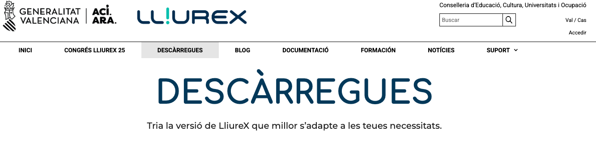{ width=450px }

En esta página, veremos que podemos descargar cualquier *Sabor* de las diferentes versiones de LliureX.

Para descargar la versión de escritorio, abriremos el desplegable correspondiente al sabor (la barra con el texto *Escritorio* y el signo +), y después en el botón de descarga del sistema en 64 bits:

{ width=450px }

Una vez hacemos clic, se iniciará la descarga a nuestro ordenador. Esto puede tardar un tiempo, puesto que se trata de un fichero de un peso considerable.

El fichero descargado, será un fichero con extensión *.iso*, que tendremos que volcar sobre una memoria USB con espacio suficiente, para arrancar nuestro ordenador con él.

### Creación de un USB de arranque

Una vez disponemos de la imagen *.iso* descargada, tendremos que volcarla a un dispositivo de memoria USB. Como que este fichero ocupa más de 4 Gb, con una memoria USB de 8 GB debería de ser suficiente, pero podemos utilizar una de mayor capacidad. **Hay que tener en cuenta que esta memoria USB se utilizará de forma exclusiva para el volcado de la imagen, por el que cualquier fichero que contenga será borrado.**

En los siguientes puntos, vamos a ver como generar este USB de arranque tanto desde LliureX como desde Windows.

:::tip
Podemos hacer uso de la herramienta Ventoy que nos permite tener varias imágenes en el mismo usb: [https://www.ventoy.net/en/index.html](https://www.ventoy.net/en/index.html)
:::

**Creación del USB de arranque con LliureX/Ubuntu**

Si queremos crear el USB de arranque desde un ordenador con LliureX o Ubuntu, lo haremos a través de la herramienta *Startup Disk Creator*. En la [wiki de LliureX](https://wiki.edu.gva.es/lliurex/tiki-index.php?page=creaci%C3%B3+d%27un+USB+d%27arrancada) tenemos descrito este proceso.

Lo que tendremos que hacer es buscar esta aplicación desde el menú de inicio (*Sistema* > *Startup Disk Creator*) y ejecutarla:

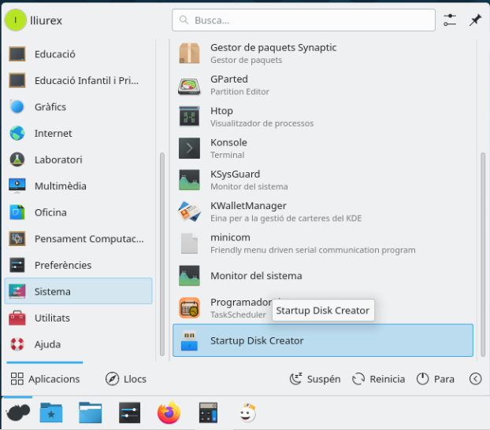{ width=400px }

La pantalla principal de esta aplicación nos muestra dos secciones: la parte superior, con la lista de imágenes *iso* que conoce la aplicación (Imagen de Disco Font), y la parte inferior (Disco a utilizar), con la lista de memorias USB conectadas en ese momento. Para crear el USB de arranque, deberemos tenerlo conectado antes de iniciar la aplicación para qué esta lo detecto.

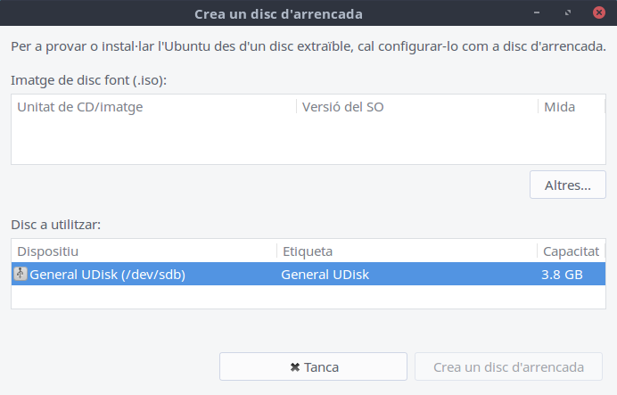{ width=450px }

Inicialmente, si no nos aparece el fichero *.iso* que hemos descargado en la lista superior, haremos clic en *Otros*, y buscaremos dentro de nuestro ordenador la imagen que hemos descargado (generalmente en la carpeta de Descargas).

Hecho esto, nos tendremos que asegurar que tenemos en la parte superior seleccionada la imagen de LliureX que hemos descargado, y en la parte inferior seleccionado el dispositivo sobre el qué queremos crear la imagen. Si todo es correcto, tendremos que hacer clic al botón *Crea un disco de arranque* para iniciar el proceso.

En este momento, después de un posible mensaje advirtiendo de la pérdida de datos de la memoria USB, se nos mostrará una barra con el progreso de la creación. Cuando esté finalizando, es posible que tengamos que introducir la contraseña del usuario administrador, para hacer el USB arrancable.

Finalmente, nos mostrará la siguiente ventana indicando que ha finalizado el proceso.

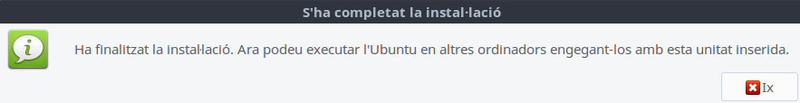{ width=350px }

Con esto ya tendremos el USB preparado para arrancar el ordenador con un sistema *Live* de LliureX. 

En el artículo de la wiki se nos comenta también, como alternativa, como realizar este proceso desde la línea de comandos. Este proceso se basa en órdenes desde la terminal, y requiere de algunos conocimientos más avanzados, pero en ocasiones, puede sernos útil en casos en que la creación de la usb de forma gráfica de problemas (bien por el formato de algunas imágenes *iso*, o bien por cuestiones de espacio a la memoria).

*Creación del USB de arranque desde Windows o macOS*

Para crear el disco de arranque USB desde otros sistemas, como Windows, macOS, o incluso GNU/Linux (si no queremos utilizar el Startup Disco Creator), haremos uso de la herramienta *Etcher*.

Para lo cual, el primero que tendremos que hacer es acceder en su web https://www.balena.io/etcher/, y descargarlo para nuestro sistema.

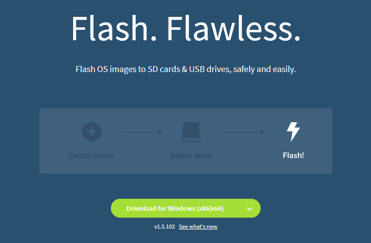{ width=300px }

Una vez descargado, ejecutamos el instalador, aceptamos la licencia y en breve tendremos el acceso directo a Etche a nuestro escritorio.

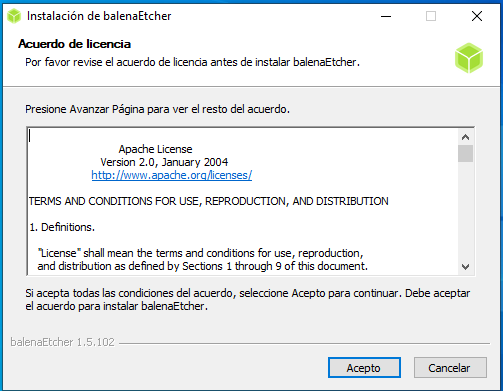{ width=300px }

El uso de esta herramienta es bastante sencillo, y consta de tres sencillos pasos:

1. Hagamos clic al primer icono *Flash from image* y seleccionamos el fichero *.iso* que hemos descargado.

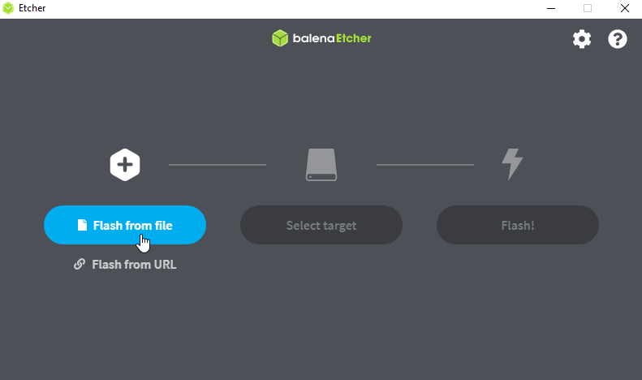{ width=300px }

2. Hagamos clic sobre *Select Drive*, para escoger el dispositivo USB sobre el que queremos volcar la imagen.

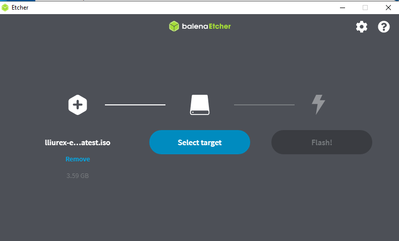{ width=300px }

3. Finalmente hacemos clic al botón *Flash* para volcar la imagen que hemos seleccionado sobre el dispositivo escogido.

Con esto, ya tendremos un dispositivo USB preparado para arrancar en modo Live y probar o instalar LliureX con él.

### Arranque desde el USB e instalación de LliureX

El siguiente paso es arrancar nuestro ordenador desde el dispositivo USB que hemos creado. Para lo cual tendremos que poner en marcha nuestro ordenador con la memoria USB conectada, y acceder al menú de arranque del sistema.

Cada fabricante utiliza una tecla diferente para acceder al menú de arranque. A la siguiente tabla se muestran las teclas más habituales para acceder al menú de arranque para diferentes fabricantes:

| Marca del ordenador | Tecla Boot Menu |
|-------------------------|-----------------------------------|
| Acero | F12 |
| Asus | Esc o F8, según modelos |
| Dell | F12 |
| Fujitsu | F12 |
| Gateway | F12 |
| HP | Esc |
| Huawei | F12 |
| Intel NUDO | F10 |
| Lenovo | F12 |
| Samsung | Esc |
| Sony | F11, Esc, F10 según modelos |
| Toshiba | F12 | 
 
Cuando reiniciamos el ordenador y pulsamos la tecla correspondiente a nuestro equipo, se nos mostrará un menú similar al siguiente, al que tendremos que indicar que queremos arrancar desde el USB que hemos creado:

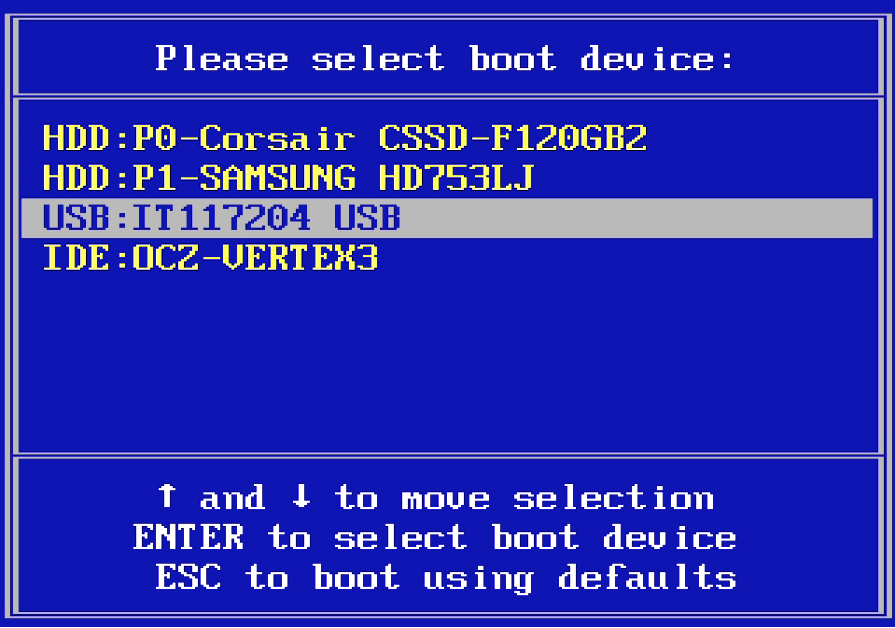{ width=300px }

Una vez seleccionada la opción, arrancaremos desde el USB, que nos cargará una versión *Live* de LliureX para poder probarlo e instalarlo.

Vemos a continuación las diferentes pantallas que se nos presentan y las diferentes opciones de instalación que tenemos:

1. **Pantalla de arrancada de LliureX Live:** En esta primera pantalla cuando arrancamos desde el USB tendremos que pulsar una tecla para iniciar la sesión Live de LliureX. Si no pulsamos ninguna tecla, el sistema se iniciará desde el disco duro del ordenador.

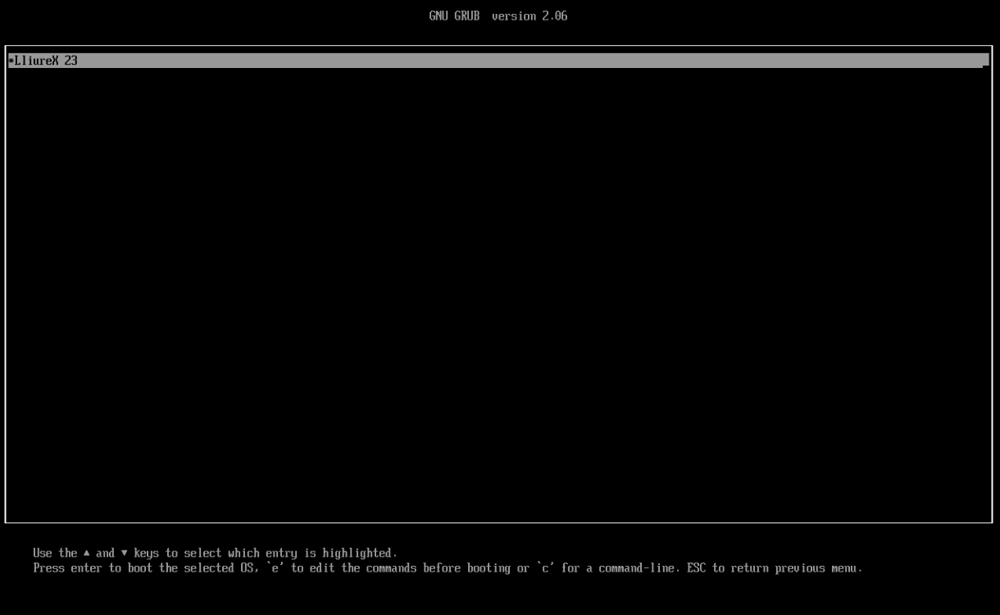{ width=350px }

2. **Menú de inicio del sistema Live**, con diferentes opciones, como hacer un testeo de memoria o comprobar si el CD/USB de instalación tiene defectos. Elegiremos la opción **Probar LliureX sin instalarlo**, para iniciar el modo live y desde ahí empezar la instalación. En versiones más nuevas esto no aparece.

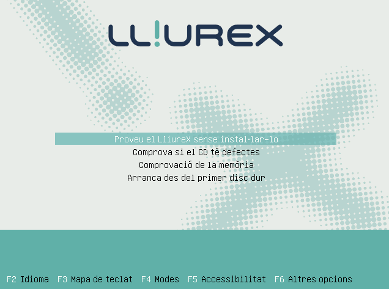{ width=350px }

En caso de que tengamos el modo UEFI activado en nuestro ordenador, es posible que estas opciones de arranque cambien, dando opción a iniciar LliureX Live en modo UEFI o bien a instalar directamente el sistema. En este caso, podemos bien lanzar directamente el instalador o bien arrancar la sesión Live, y desde esta instalar LliureX directamente. Disponéis de un [extenso artículo](https://wiki.edu.gva.es/lliurex/tiki-index.php?page=uefi) en la wiki de LliureX sobre qué es UEFI y cómo activarlo y desactivarlo al ordenador.

3. **LliureX Live**: Se iniciará LliureX en modo Live desde el USB, y a partir de aquí podremos iniciar la instalación. Primero elegiremos el idioma y la distribución del teclado con los que se desea arrancar la sesiónde prueba de la iso y después aparecerá un escritorio de Lliurex donde ya podrmos iniciar la instalación. Para lo cual ***haremos doble clic al icono Instala la versión LliureX*** que aparece en el Escritorio.

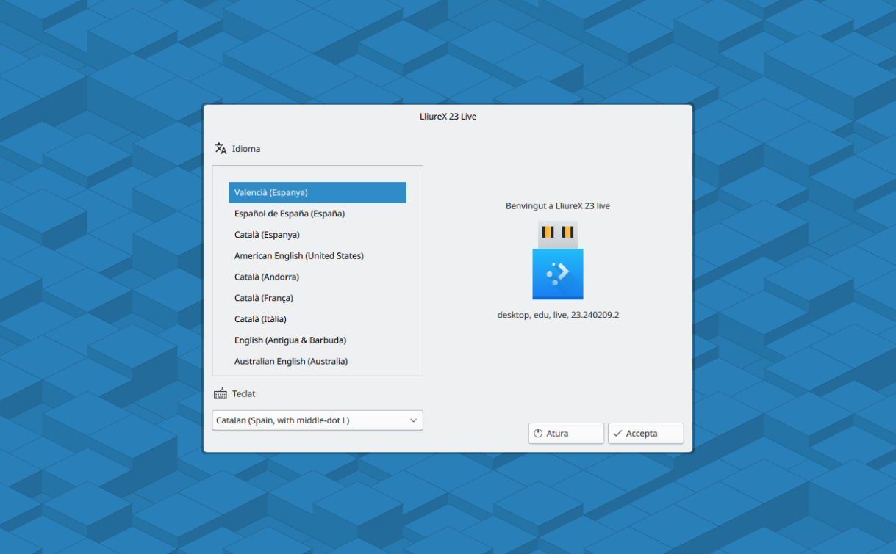{ width=350px } 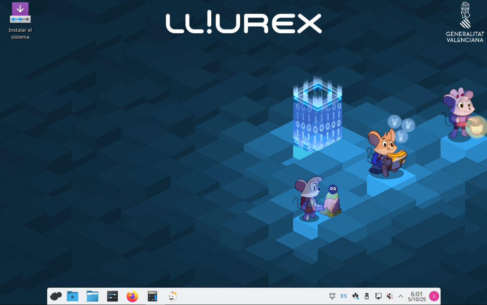{ width=350px } 

4. **Instalador de LliureX**: Ahora se iniciará el instalador de LliureX. La primera ventana de este asistente de instalación nos pedirá qué idioma deseamos para la instalación y el sistema.

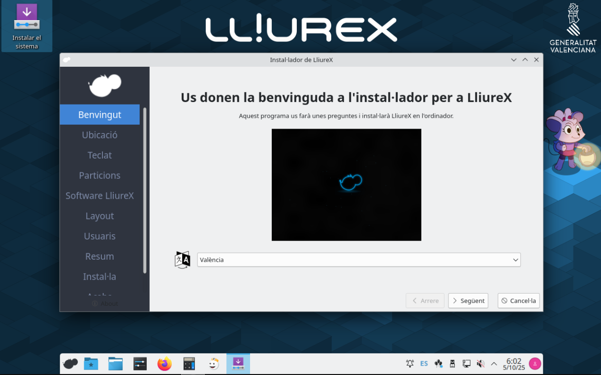{ width=350px }

5. **Selección de la distribución del teclado**, en este caso, elegiremos la *Disposición en Español* y la variante del catalán para tener habilitado el punto medio (el de la ele geminada **l·l**).

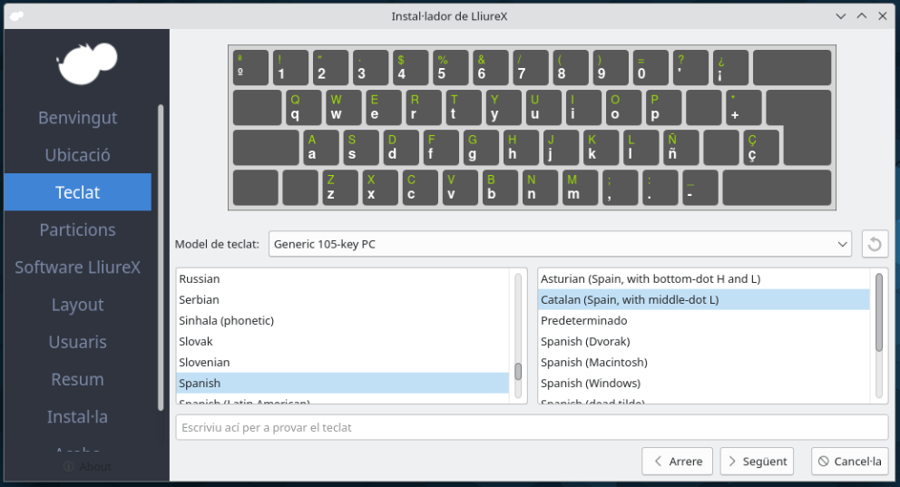{ width=350px }

6.   **Selección de la ubicación**. La siguiente ventana nos pregunta la región donde estamos, para establecer el huso horario correctamente. A la parte inferior de la ventana, podremos ver el progreso de la instalación.

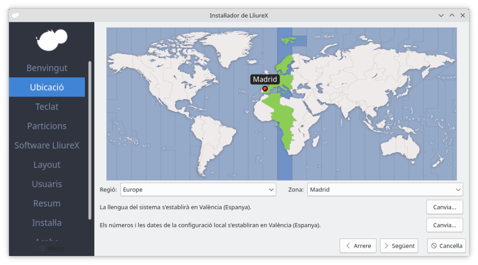{ width=350px }

7. **Tipo de instalación**. Este es uno de los puntos más delicados de la instalación, y es donde decidiremos la parte de disco que vamos a dedicar a LliureX. El propio particionador ya nos sugerirá la distribución que considero más adecuada según el espacio que encuentra disponible en el disco duro bajo la opción de *particionamento guiado*.

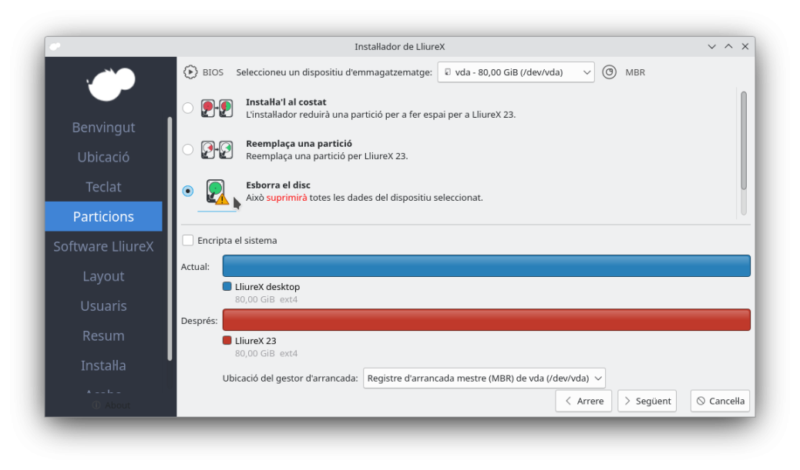{ width=500px }

Cuando hablamos de *particiones* hacemos referencia a las partes en que dividimos, de forma lógica, un disco duro de forma que es cómo si tuviéramos tantos discos duros como particiones. Cada sistema operativo necesita ubicar su sistema de ficheros en una de estas particiones. En esta ventana de *Tipo de instalación* tenemos varias opciones para hacer estas particiones:

* *Guiado - redimensiona disco y utiliza el espacio libre*, que será la opción recomendada, siempre que el particionador encuentro espacio suficiente en el disco como para hacer la instalación. A la instalación de ejemplo que estamos haciendo se ha utilizado este sistema, sobre un disco que ya tenía varias particiones. El sistema ha detectado la partición donde más espacio disponible había y nos ha sugerido reducir esta y crear una nueva para instalar LliureX. Cómo vemos a la imagen, se nos muestra el estado actual del disco, y como quedaría después de hacer la nueva partición. En esta barra de abajo, fijaos que aparece una flecha doble entre la partición que vayamos a redimensionar y la nueva por sí queremos ajustar los espacios. Si deseáis ajustar el espacio, acordaros de dejar unos 20GB para la partición con LliureX.

* *Guiado - utiliza el disco entero*. En este caso, se borraría todo el contenido del disco, y lo utilizaría completamente para LliureX.

* *Guiado - utiliza el disco entero y configura LVM*, es parecido al anterior pero utilizando volúmenes lógicos ( *LVM, Logical Volume Manager*), que gestiona varias particiones como si se tratara de una.

* *Guiado - utiliza el disco entero y configura LVM cifrado*, que sería como el anterior, pero cifrando el disco.

* *Manual*, es la opción más versátil y potente, puesto que nos permite gestionar las particiones a nuestro gusto y, por tanto, la más peligrosa si no sabemos muy bien qué estamos haciendo.

Lo más recomendable, será pues, seguir el modo guiado que nos sugiere el reparticionamento del disco.

Una vez elegimos el tipo de instalación nos mostrará el siguiente mensaje advirtiendo que se van a hacer cambios al disco, y pidiendo confirmación:

{ width=300px }

Una vez le damos a *Continuar* el sistema empezará a instalarse, mientras sigue el asistente para configurar el sistema.

8. **Selección de software adicional**, en principio no tendremos que instalar este software por defecto, por el que **no marcaremos nada y pulsaremos en Continua**.

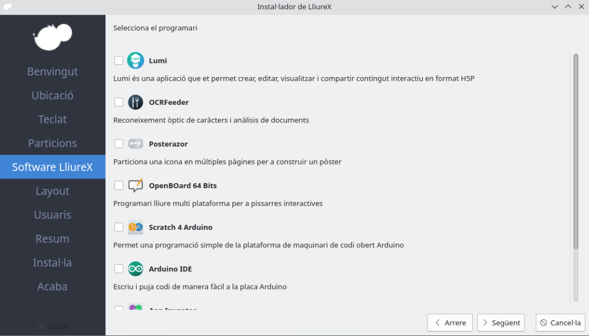{ width=350px }

9. **Complementos del sistema**, desde donde podremos habilitar el apoyo de flash, así como el envío de estadísticas de uso de LliureX de forma anónima y el servicio de inventario, para recoger información del hardware. En nuestro caso, dejaremos marcado el apoyo de flash y el uso de estadíticas.

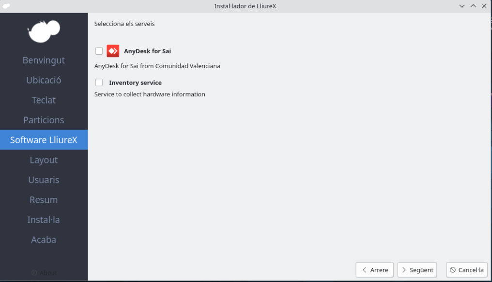{ width=350px }

10. **Selección de la distribución del escritorio**, donde podremos elegir qué apariencia queremos darle a nuestro escritorio LliureX. Tenemos dos opciones. La primero es la distribución por defecto (*Default Layout*), con una barra superior y el *dock* a la parte inferior, tal y como se ha estado trabajando en las últimas versiones de LliureX. La segunda opción es una distribución más clásica (*Classic Layout*) con una única barra a la parte inferior. **En principio escogeremos la distribución por defecto**.

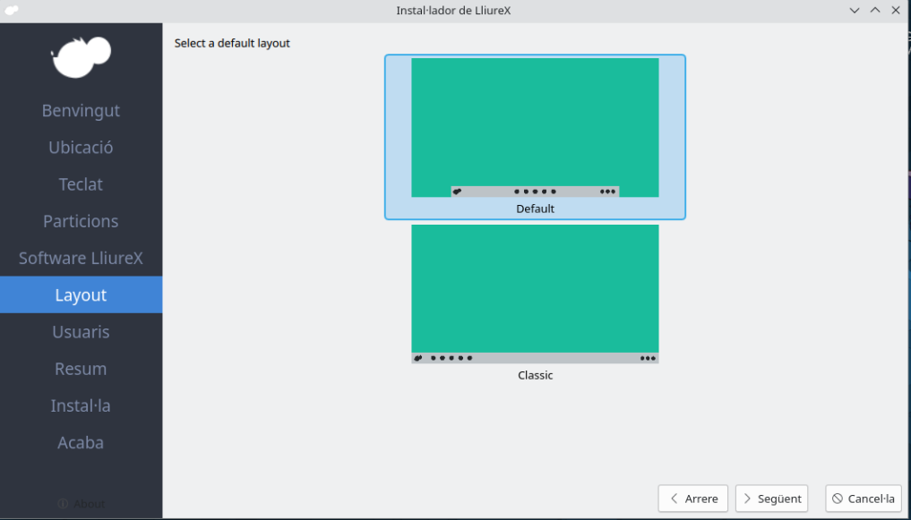{ width=350px }

11. **Configuración del usuario primario**. En la siguiente ventana configuraremos el nombre del usuario primario (que tendrá permiso de administrador), su contraseña y así como el nombre del sistema. Además, determinaremos si hace falta una contraseña para entrar al ordenador. Indicaremos nuestro nombre, el nombre de usuario que utilizaremos, nuestra contraseña (dos veces) y que sí que queremos una contraseña para entrar.

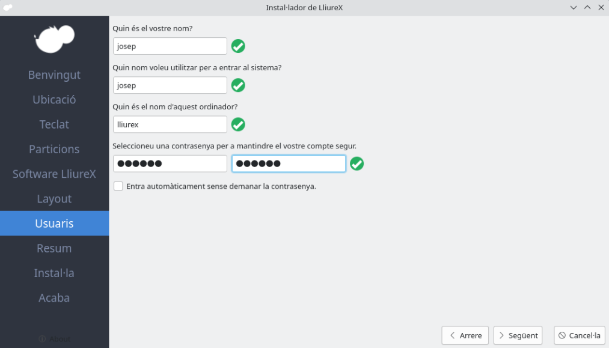{ width=350px }

12. **Últimos pasos de la instalación**. Una vez configurado el sistema, aparece un resumen de la configuración realizada para la instalación y pulsaremos en siguiente para que comience la instalación. Mientras lo hace, nos muestra las principales novedades de la versión. Ahora tendremos que esperar un tiempo para que el sistema esté instalado por completo.

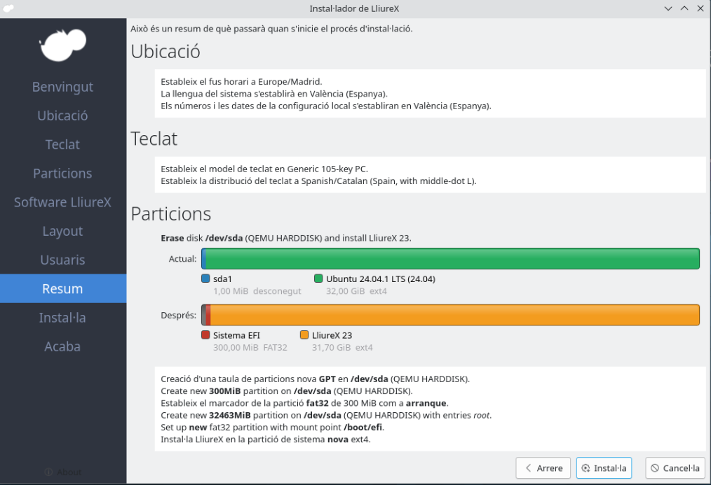{ width=350px } 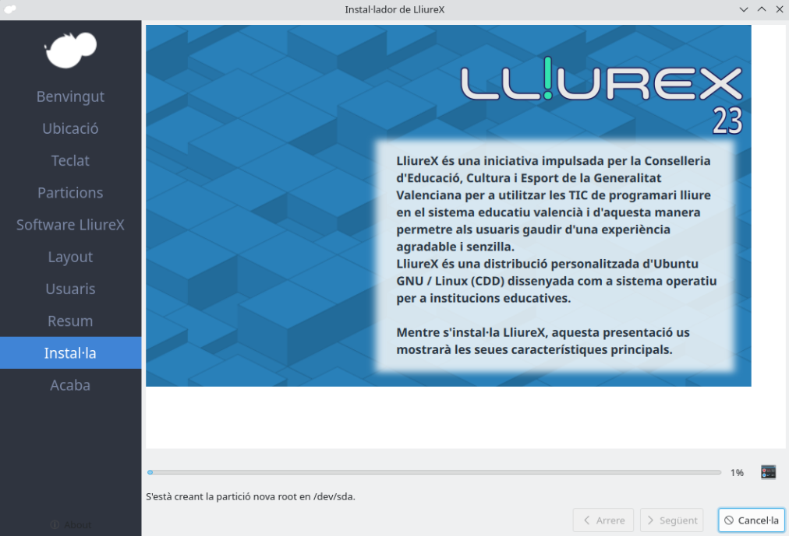{ width=350px }

13. Cuando finaliza la instalación por completo, nos muestra la siguiente ventana informándonos, y pidiéndonos si queremos reiniciar el equipo o seguir con la prueba. Elegimos la opción de reiniciar, y quitamos el USB cuando nos diga el sistema. Cuando el ordenador se inicie de nuevo, nos mostrará el menú de inicio, al cual podremos elegir qué sistema operativo iniciar.

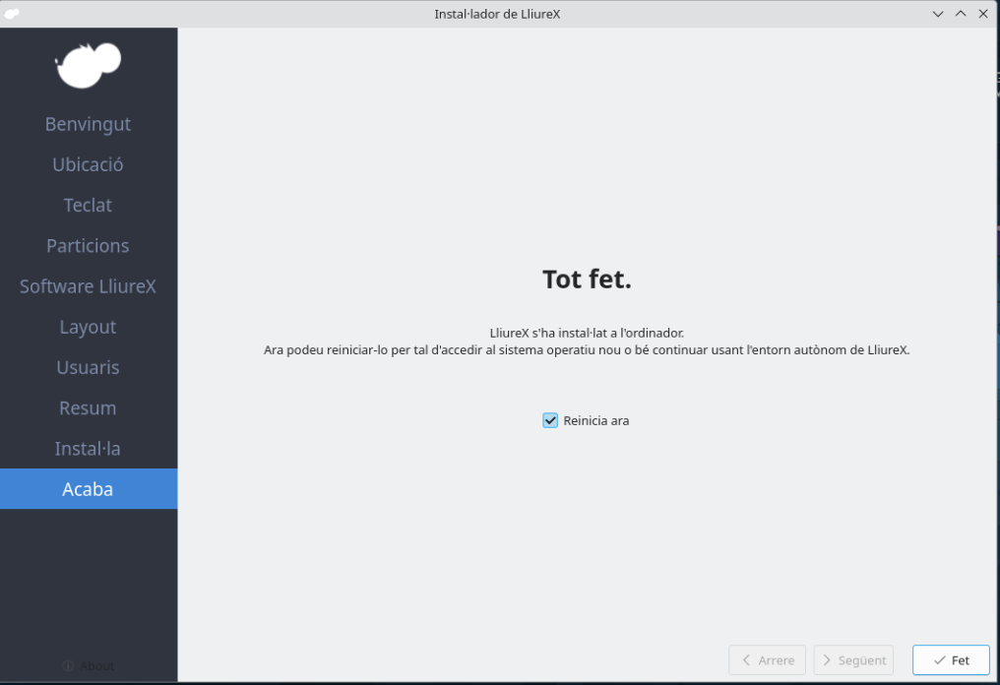{ width=300px }

* Disponemos de la [página de la wiki](https://wiki.edu.gva.es/lliurex/tiki-index.php?page=instal%C2%B7laci%C3%B3+de+LliureX+16&highlight=instal%C2%B7laci%C3%B3+lliurex) de LliureX sobre la instalación.

## Instalación de LliureX sobre Windows: LliuWin

Si no deseamos dedicar una partición del disco a LliureX, desde LliureX 19.07 podemos hacer uso de LliuWin. 

LliuWin es un instalador de LliureX para Windows, de forma que se pueda probar sin correr el riesgo de perder información durante el formateado o particionamiento. La idea es instalar LliureX y poder desinstalarlo cómo si se tratara de una aplicación más de Windows. Para lo cual hace uso de una imagen de LliureX ubicada como un fichero sobre el mismo sistema de ficheros de Windows. No se trata por lo tanto de una virtualización de LliureX, sino de una instalación en sí, con la diferencia que, en lugar de dedicar una partición del disco, esta se instala sobre un fichero de Windows, y es este quien se encarga de ponerla en marcha o de poner en marcha Windows. La principal diferencia en cuanto al rendimiento frente a un sistema instalado es que este último descansa sobre el sistema de ficheros de Windows, el que hace que no sea óptimo.

El proceso de instalación de LliuWin consta de dos pasos genéricos:

1. Descarga e instalación de *LliuWin Installer*
2. Ejecución de *LliuWin Installer* para descargar la imagen de LliureX

### Descarga e instalación de LliuWin

Para obtener el instalador de *LliuWin*, tendremos que acceder a [su página en Github](https://github.com/lliurex/lliuwin/releases), y descargar el fichero instalador `lliuwin_installer_x64.msi`:

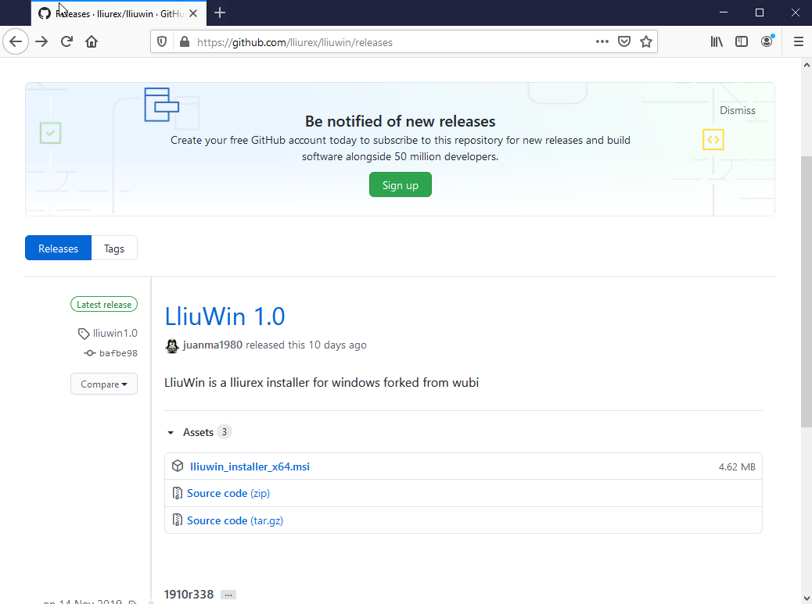{ width=450px }

Una vez descargado, ejecutamos el instalador. Si nos aparece un mensaje de protección de Windows parecido al siguiente, elegiremos *Ejecutar de todas formas*, que nos aparece cuando hacemos clic en *Más información*.

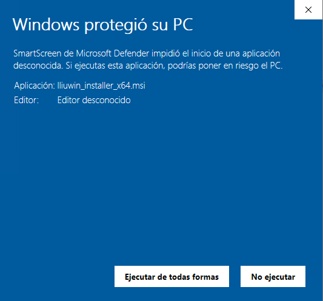{ width=300px }

Ahora dejamos que el programa realice cambios al equipo:

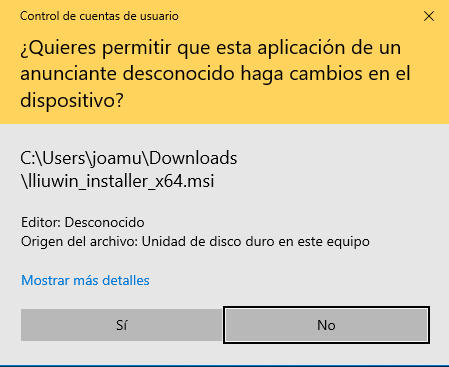{ width=300px }

Y nos aparecerá el siguiente icono en el escritorio (y también en el menú de aplicaciones):

{ width=100px }

Con esto tendremos instalado *LliuWin Installer*, que nos permitirá instalar LliureX sobre Windows.

### Descarga e instalación de LliureX con LliuWin Installer

Para iniciar el instalador, hacemos doble clic en el acceso directo de LliuWin, y seleccionamos, cuando nos pregunte, que queremos permitir que la aplicación realice cambios al dispositivo:

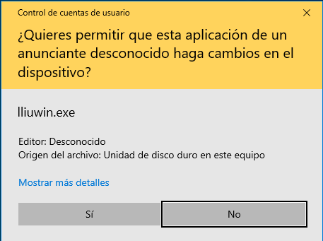{ width=300px }

La ventana principal del instalador nos mostrará algunas opciones sobre la instalación de LliureX, teles como la unidad de disco sobre la que queremos descargar la imagen (en nuestro caso `C:`), el idioma en que queremos LliureX, que ocupa la instalación, y qué entorno de escritorio queremos (LliureX)

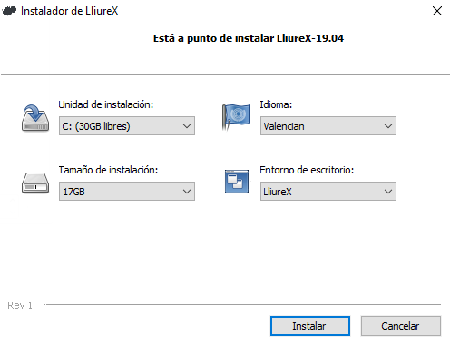{ width=400px }

Haremos clic en instalar para empezar la instalación. Este proceso puede ser bastante lento, puesto que tiene que descargar todo el sistema. 

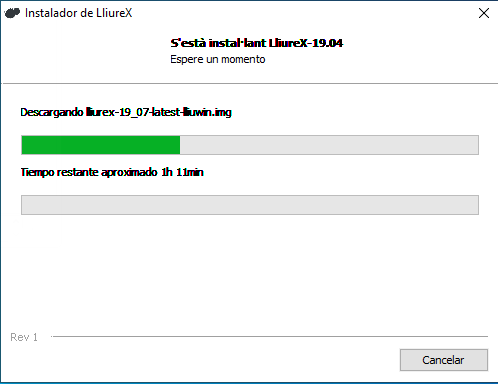{ width=300px }

Cuando termine la descarga tendremos que reiniciar para finalizar el asistente de configuración:

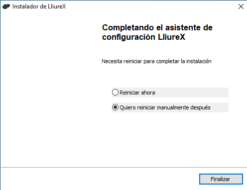{ width=300px }

Y cuando arrancamos Windows, nos pedirá con cual de los dos sistemas arrancar:

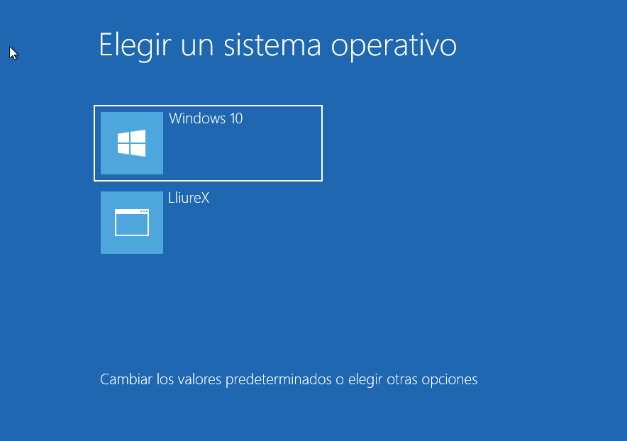{ width=400px }

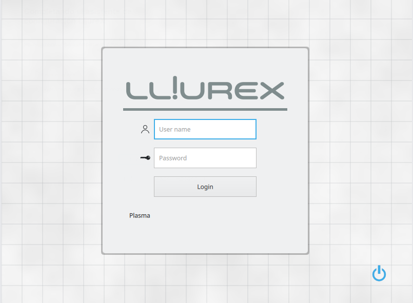{ width=400px }

Con esto hemos conseguido realizar una instalación de LliureX sobre un ordenador sin necesidad de hacer particiones del disco, como si se tratara de una aplicación más. En el momento en que queramos desinstalarlo, lo hacemos de igual manera como si se tratara de una aplicación Windows.

# Un paseo por el entorno a LliureX

Desde la versión 19 de LliureX, se utiliza la en torno a escritorio Plasma, de KDE en lugar de Mate o Gnome que se ha utilizado en versiones anteriores. Se trata de un escritorio que respeta los recursos del sistema y le da un aspecto más moderno y útil.

A pesar de que no entraremos a verlo en detalle, vamos a hacer un breve paseo por el escritorio para conocer, cuál será nuestro entorno de trabajo.

## El escritorio

A la Wiki de LliureX tenéis disponible [el artículo Primeros pasos en el nuevo entorno de LliureX 23](https://wiki.edu.gva.es/lliurex/tiki-index.php?page=Primeros+pasos+en+el+nuevo+entorno+de+LliureX+23&structure=Informaci%C3%B3n+LliureX+23&page_ref_id=2156) donde se habla más extensamente del escritorio de LliureX 23. En este apartado vamos a hacer un resumen, **basándonos en la configuración de escritorio por defecto** y poniendo atención a aquellos aspectos que más nos interesarán para el desarrollo del curso.

Cuando iniciamos sesión, el aspecto de nuestro escritorio tiene dos configuraciones:

* **Configuración por defecto**: parecido a la configuración clásica, con la barra de menú con una longitud y anchura personalizada para darle un aspecto más moderno al escritorio.

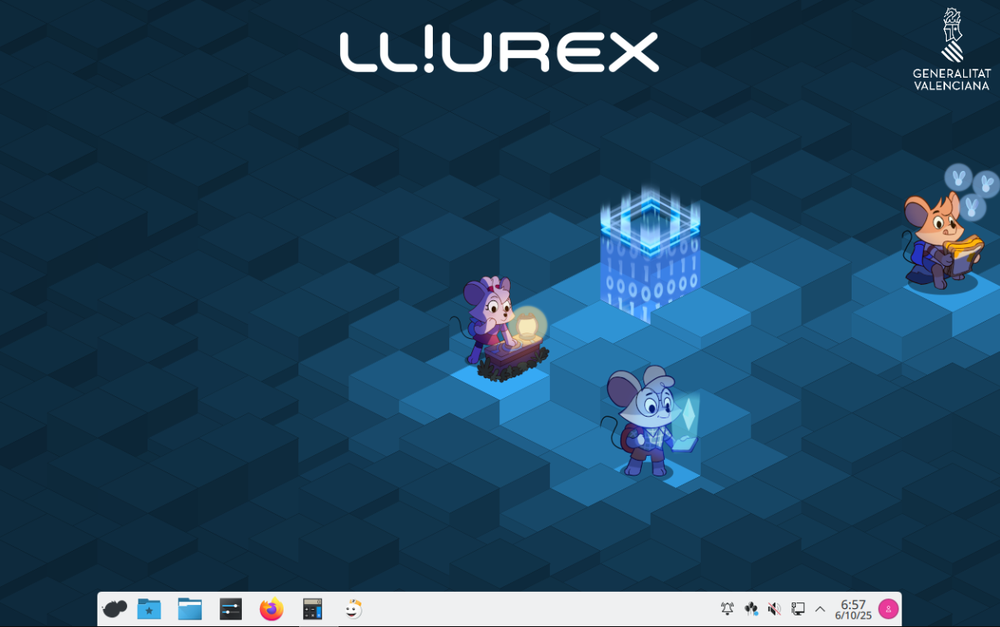{ width=500px }

* **Configuración clásica**: con la barra de menú en la parte inferior del escritorio y sin gestor de tareas independiente (igual que en LliureX 19).

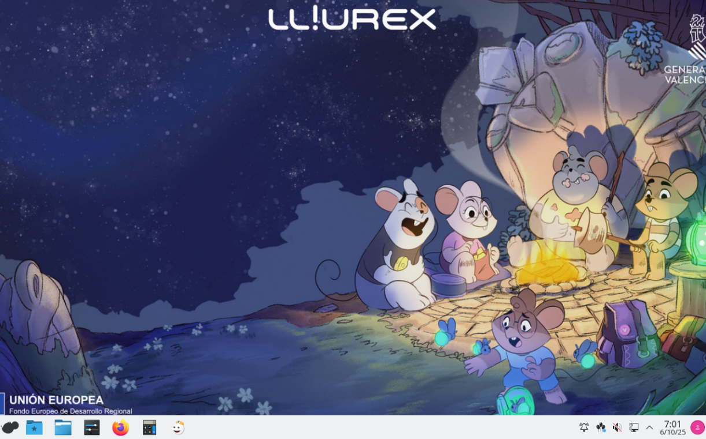{ width=500px }

Como podemos ver, la barra de menú consta de varias partes :

* Menú de inicio (1)
* Directorios habituales (2)
* Bandeja del sistema (3)
* Calendario (4)
* Selector de usuario (5)
* Gestor de tareas (6)

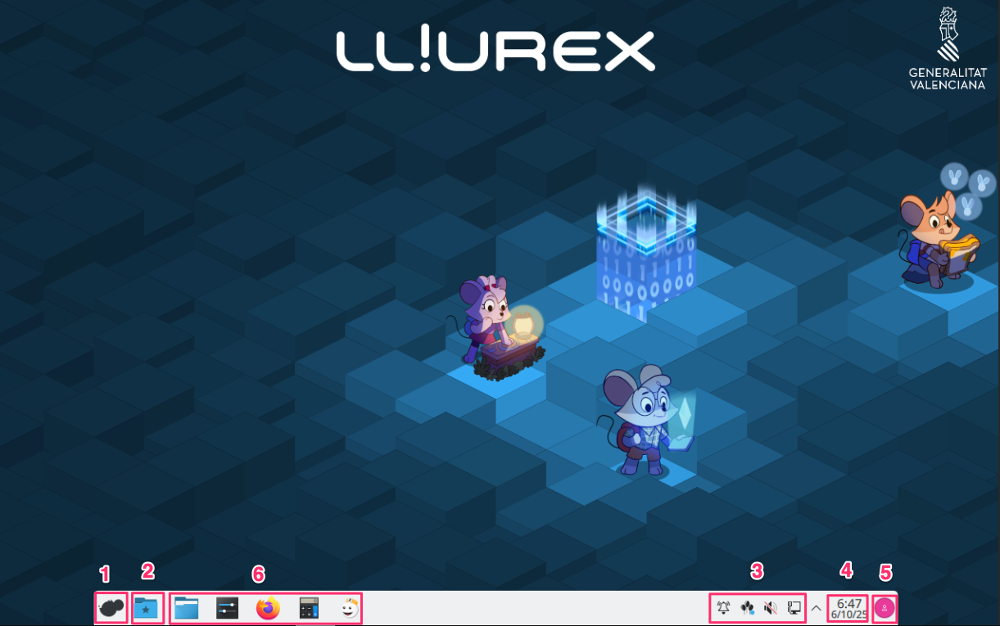{ width=500px }

* El **Menú de inicio**, a través del cual podremos acceder a las aplicaciones, organizadas por categorías, o buscarlas a través del cuadro de busca, así como gestionar la sesión y la parada del ordenador a través de la opción *Energía/Sesión*. Además, en la parte izquierda dispondremos de una barra de *Preferidos*, con accesos directos a las aplicaciones más importantes, tales como el navegador Firefox, el centro de control, el Zero Center, el gestor de ficheros Dolphin, la LliureX Store o la terminal. En la parte superior de esta barra de accesos directos tendremos también tres accesos para salir de la sesión, reiniciar el equipo o apagarlo.
* **Lugares** o **Directorios Habituales**, nos mostrará aquellas ubicaciones más usuales de nuestro equipo, como nuestra carpeta personal (Inicio), la carpeta del Escritorio, los Documentos o las Bajadas, entre otros.
* Botón para **Limpiar el escritorio**, minimizando todas las ventanas de las aplicaciones que tengamos en ejecución,
* La **Bandeja del Sistema**, que muestra los *widgets* o *complementos* de aplicaciones que tengan notificaciones disponibles (como por ejemplo qué hay actualizaciones disponibles), o acceso a algunas funcionalidades, como gestionar el volumen, la red, el Bluetooth o el portapapeles. Si pasamos el ratón sobre los widgets, nos mostrará la información sobre este. Algunos de estos *widgets* nos permiten también realizar ciertas acciones, al hacer clic sobre ellas. 
* El **Calendario**, donde por defecto se muestra la hora del sistema, y nos muestra el calendario completo si hacemos clic sobre él.
* El **Selector de usuario**, donde se nos muestra nuestro nombre de usuario. Si hagamos clic sobre él, se nos mostrarán opciones para iniciar una nueva sesión, bloquear la pantalla, o salir de la sesión actual.

Por su parte, en la parte inferior se encuentra el *Dock* o *Gestor de tareas*, a través del cual podremos acceder de manera rápida a las diferentes aplicaciones que tengamos en ejecución. Esta barra también dispone de algunos accesos directos a las aplicaciones más comunes, como el Firefox, el gestor de ficheros o las preferencias del sistema. Si queremos añadir alguna aplicación a esta barra, para iniciarla con un solo clic desde el escritorio, solo tenemos que localizarla al menú y arrastrarla hasta aquí.

## ¿Dónde están mis cosas?

Nuestros documentos, y ficheros en general se guardan en nuestra carpeta de usuario. Es conveniente conocer cómo se organiza esta para mantener una organización coherente, y saber dónde guardamos todo aquello que hacemos.

### El sistema de ficheros de LliureX

Como sabemos, tanto los documentos como los programas se almacenan en una partición del disco duro, y dentro de esta, se organizan el que se conoce como directorios*, o más habitualmente **carpetas***. Estos directorios se organizan de forma jerárquica, es decir, unas carpetas dentro de otras. Vamos a ver en general como se organizan estas carpetas a nivel de sistema, y después como lo hacen en nuestra carpeta de usuario.

A escala de sistema, existe un directorio (carpeta), llamado directorio *raíz* a partir del cual *cuelgan* el resto de directorios. Es decir, es la *carpeta* que contiene el resto de carpetas. LliureX sigue la estructura de carpetas recomendada por el estándar FHS (*Filesystem Hierarchy Standard*), una norma que define los directorios principales y sus contenidos en el sistema operativo GNU/Linux. 

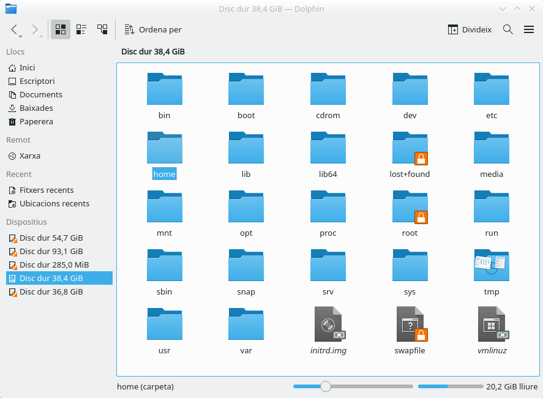{ width=400px }

Algunas de las carpetas más importantes de esta organización son:

*  **/bin**: Contiene los programas esenciales de la línea de comandos necesarios para una sesión de usuario (copia de ficheros, listar directorios, etc.)
*  **/boot**: Encargada de la puesta en marcha del sistema,
*  **/etc**: Contiene ficheros de configuración del sistema,
*  **/home**: Contiene las carpetas de trabajo de los usuarios. Dentro de esta carpeta habrá una carpeta de trabajo para cada usuario del sistema.
*  **/media**: Carpeta donde se *montarán* los dispositivos que conectamos al ordenador, como puedan ser las memorias USB. Los sistemas Linux, a diferencia de Windows, no generan una nueva unidad (D:, E:, etc.) cuando conectamos un dispositivo, sino que añaden carpetas dentro de esta carpeta. Los accesos que  tendremos a *Dispositivos*, harán referencia en estas carpetas.
*  **/opt**: Carpeta con programas opcionales que tienen una configuración personalizada para cada usuario.
* **/root**: Carpeta personal del administrador del sistema. Por motivos de seguridad, esta no se encuentra dentro del directorio */home*.
* **/sbin**: Contiene los programas esenciales de la línea de órdenes que solo puede utilizar el usuario administrador,
* **/usr**: Contiene la mayoría de aplicaciones y utilidades multiusuario del sistema.

Cómo hemos comentado, hay más carpetas en la raíz del sistema, pero con las que hemos comentado nos es suficiente para hacernos una idea de las más importantes.

### La carpeta de Inicio

Nos centramos ahora al directorio */home*, que contendrá una carpeta con el nombre de cada usuario. Esta será la carpeta que, desde el punto de vista de nuestro usuario, se nos mostrará como la carpeta de *Inicio*:

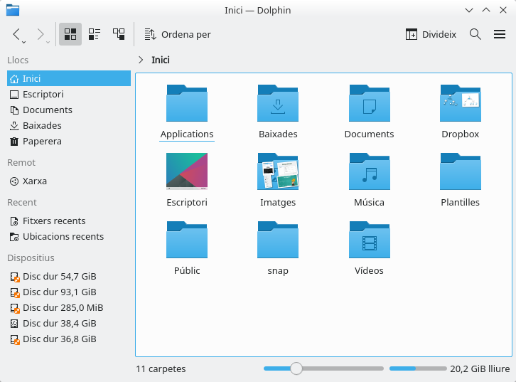{ width=400px }

La ventana anterior muestra la aplicación *Dolphin*, que es el explorador de ficheros del entorno KDE. Para acceder a ella, lo hemos hecho a través del acceso directo que hay en la barra de tareas inferior, con el icono de una carpeta. También  podemos acceder a través del menú de *inicio* y su barra lateral de *Preferidos*, o bien a través de los *Directorios Habituales* o *Lugares*.

Cómo vemos, esta carpeta de inicio contiene otras carpetas, tales como:

* **Descargas**, donde se guardarán de forma predeterminada los ficheros que descargamos desde el navegador u otras aplicaciones.
* **Documentos**, donde se guardan de forma predeterminada los documentos.
* **Escritorio**, que contiene los ficheros que tenemos en nuestro escritorio, es decir, los ficheros y carpetas que dejamos en el escritorio, se almacenará realmente en esta carpeta.
* **Imágenes**, donde se guardan de forma predeterminada nuestras imágenes.
* **Música**, donde se guardarán los ficheros de audio de forma predeterminada.
* **Videos**, donde se guardan nuestros videos.

Dentro de esta carpeta personal, podemos crear tantas carpetas y ficheros como deseamos, pero conviene mantener una mínima organización por saber en el jefe del tiempo donde tenemos nuestros ficheros.

El sistema operativo y las aplicaciones también almacenan algunas carpetas dentro de nuestra carpeta de inicio, con información personalizada para nuestro usuario. Estas carpetas y ficheros empezarán por un punto (.), y serán *invisibles* al Dolphin.

> **La carpeta de Inicio al modelo de centro**
> 
> Cuando trabajamos con el modelo de centro, hay que tener en cuenta que tanto la carpeta de ***Documentos*** como la de ***Escritorio***, se almacenan en el servidor, y son enlazadas a nuestra carpeta de Inicio cuando iniciamos sesión. De este modo, nos ubicamos en el ordenador qué nos ubicamos, tendremos siempre disponible el contenido de nuestro escritorio y nuestros documentos. Por otro lado, ni las descargas, ni las imágenes ni otras carpetas que creamos en nuestra carpeta de inicio se guardarán al servidor. Por lo tanto, todo aquello que deseamos conservar y tener accesible en cada ordenador donde nos sentemos tendrá que guardarse bien en el Escritorio o bien en la carpeta de Documentos.

A continuación, podemos ver, de forma gráfica la relación entre todos los elementos que acabamos de comentar, así como su relación con el menú de *Lugares* o *Directorios Habituales*:

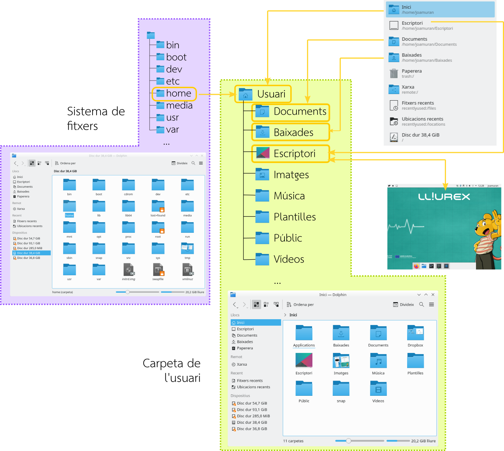{ width=500px }

# Gestión de software

Las aplicaciones se componen de varios ficheros, tanto ejecutables como de configuración o recursos, como puedan ser las imágenes, iconos, o documentos. Cuando instalamos una aplicación, todos estos recursos se ubican a su lugar respectivo dentro del sistema.

Las aplicaciones se componen de varios ficheros, tanto ejecutables como de configuración o recursos, como puedan ser las imágenes, iconos, o documentos. Cuando instalamos una aplicación, todos estos recursos se ubican a su lugar respectivo dentro del sistema.

La forma que tienen los sistemas GNU/Linux de distribuir y gestionar las aplicaciones es mediante lo que se conocen como paquetes. Un paquete es un fichero comprimido, que contiene, además de los ficheros necesarios información sobre este (versión, desarrollador, web, etc.).

El sistema de paquetes utilizados de forma natural en Ubuntu y por tanto en LliureX es del formato *Debian*, un fichero comprimido con extensión `.deb`, que contiene toda esta información y los ficheros.

En los últimos años, se han incorporado otros sistemas de distribución de paquetes, como el formato *Snap* o *Appimage*, que presentan menos problemas en cuanto a dependencias con otros paquetes, pero que pueden tener un peso considerablemente superior a los .*deb*.

## ¿Cómo obtenemos el software?

Si recordamos, una de las libertades del software era la libertad de distribuir y compartir el software. Esto posibilita la creación de grandes *almacenes* de software libre, a los cuales podemos acceder a través de una aplicación y buscar todo aquello que necesitamos. Estos almacenes reciben el nombre de *repositorios* o *Depósitos* de software.

En nuestro sistema tendremos varias herramientas para obtener software de los repositorios. Algunas de ellas por línea de órdenes y otras con interfaz gráfica. Vamos a ver las principales herramientas que tenemos disponibles con interfaz gráfica.

### Antes de empezar: LliureX Up

LliureX Up es el actualizador de LliureX, por el que no es en sí una herramienta para obtener software nuevo, sino para actualizar el que ya tenemos.

Cuando hay actualizaciones disponibles, LliureX Up nos lo indicará a la *bandeja del sistema*, y nos permitirá descargar e instalar todas las nuevas versiones del software que ya tenemos instalado.

Es una buena práctica mantener actualizado nuestro sistema, tanto por las actualizaciones de seguridad que resuelven problemas del software que tenemos instalado, como por nuevas funcionalidades.

Para acceder al LliureX Up, lo haremos a través del menú de *Inicio* > *Administración de LliureX* > *Actualizador de LliureX*:

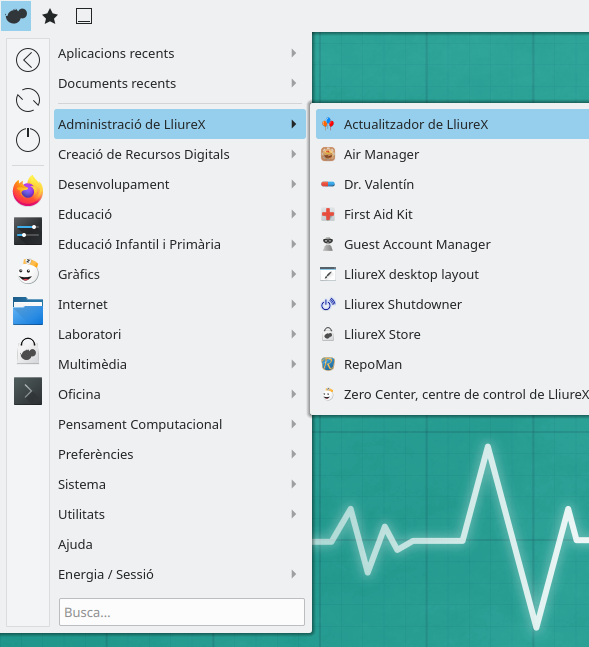{ width=250px }

Nada más lanzar el actualizador, se realizarán varias acciones para *refrescar* todas las listas de paquetes disponibles a los repositorios. El sistema de paquetes mantiene unas listas con todo el software disponible a los repositorios, y lo primero que hace LliureX Up al iniciarse es actualizar estas listas. Después compara las aplicaciones que tenemos instaladas con estas listas, para detectar si hay versiones nuevas para instalar. 

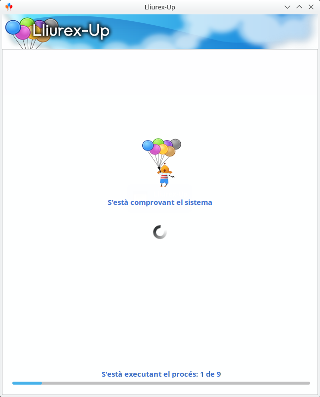{ width=250px }

En caso de que el sistema esté actualizado nos lo indicará:

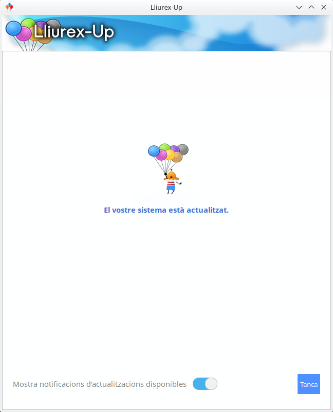{ width=250px }

Si tenemos alguna actualización disponible, el sistema nos mostrará la versión actual de LliureX (cada actualización de cualquier paquete a los repositorios de LliureX implica un cambio en la versión general). A la siguiente imagen podemos ver que tenemos la versión 19.200727, pero está disponible la 19.200731.1. También nos dice que tenemos 4 paquetes para actualizar (podemos ver cuáles son con el botón *Visualiza los paquetes*) y el tamaño de esta actualización. 

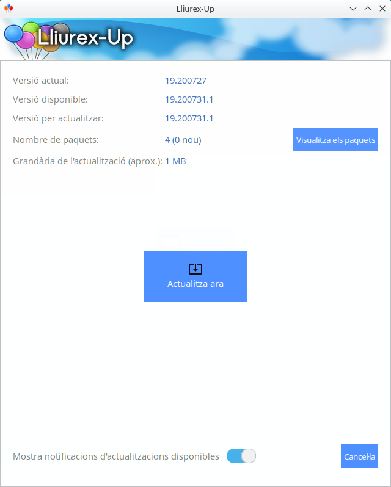{ width=250px }

Cuando hacemos clic al botón *Actualiza ahora*, empezará la actualización de los paquetes, y nos avisará cuando acabo:

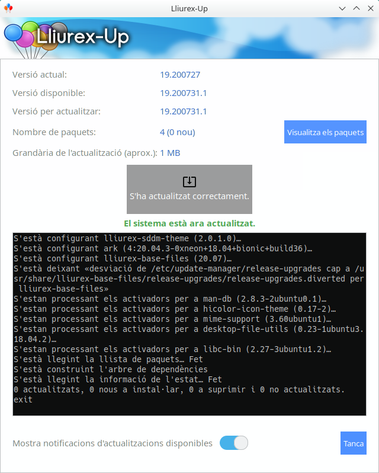{ width=250px }

Ahora ya solo nos queda cerrar la ventana y ya tendremos nuestro sistema y la lista de paquetes completamente actualizada.

Ahora sí, pasamos a continuación a ver las diferentes herramientas que tenemos para descargar software a LliureX.

### Synaptic

La herramienta Synaptic nos permite buscar e instalar paquetes en formato *.deb*, y ha sido una de las principales herramientas de instalación de software a LliureX desde los inicios.

Para iniciar el Synaptic, lo haremos a través del menú de *Inicio* > *Sistema* > *Gestor de Paquetes *Synaptic*.

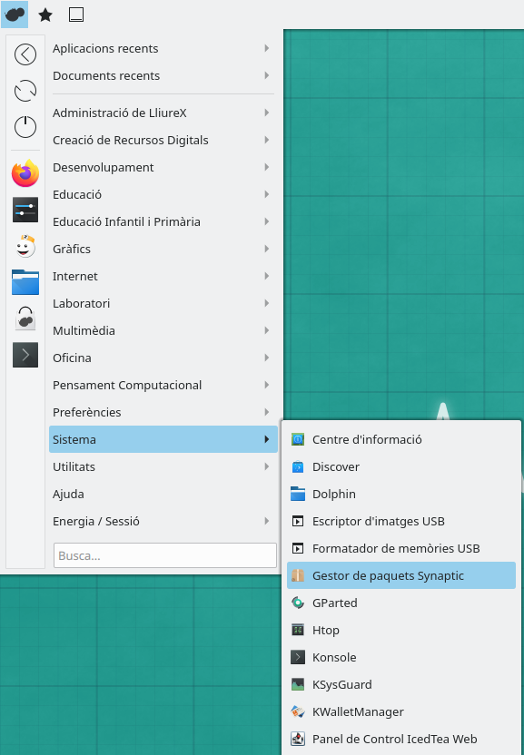{ width=250px }

Solo abrir la aplicación nos pedirá que introduzcamos nuestra contraseña, para asegurarse que somos un administrador del sistema (puesto que solo el administrador podrá instalar programas en el sistema):

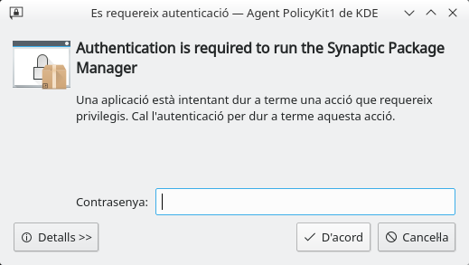{ width=300px }

Una vez introducimos nuestra contraseña, se nos mostrará la ventana principal de Synaptic:

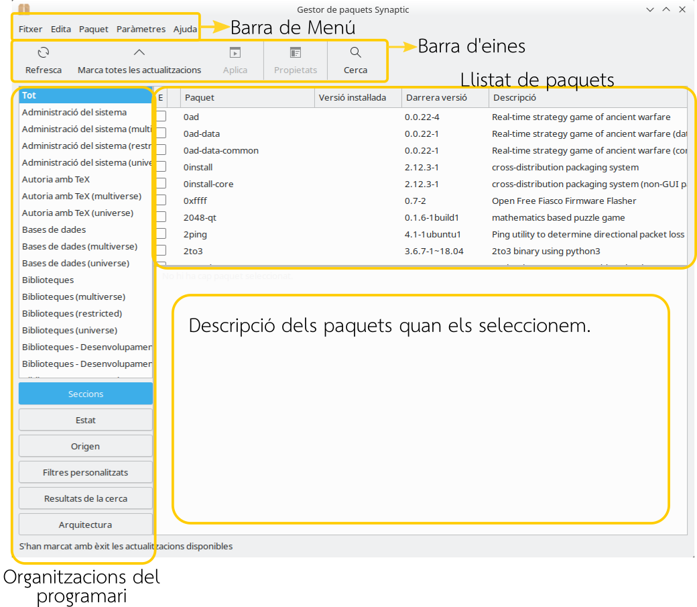{ width=500px }

Come se muestra a la imagen, disponemos de varias secciones en la aplicación. Las que más útiles nos serán será la *barra de herramientas* y la *lista de paquetes*.

Si nos fijamos en la *Barra de herramientas*, el primer botón que aparece es el de **Refresca**. Este botón realiza una operación que ya conocemos, y es que actualiza la lista de paquetes disponibles (lo primero de los pasos que hace el LliureX Up). 

Desde esta herramienta, podemos también actualizar las aplicaciones gestionadas en formato *.deb*. Si quisiéramos hacer una actualización, haríamos clic al botón *Marca las actualizaciones*, de forma que Synaptic marcará para actualizar todas las aplicaciones que estén desactualizadas. Si solo queremos actualizar desde el Synaptic, haremos clic *Aplica* y nuestro sistema se actualizará.

Finalmente, nos centramos en el botón *Busca* de la barra de herramientas. Si hagamos clic en él, se nos abrirá un diálogo donde podremos introducir el nombre o alguna palabra de la descripción del paquete que estamos buscando:

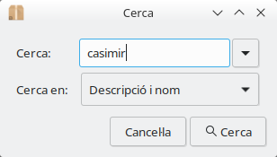{ width=300px }

A la imagen del ejemplo hemos escrito el texto "Casimir", para buscar el editor de texto *Casimir Editor*, para alumnos con problemas de dislexia (Veremos esta aplicación en la próxima unidad). 

Si hagamos clic en Busca, nos aparecerá la lista de paquetes que coinciden con los criterios indicados, y haciendo doble clic a la aplicación, nos permitirá marcarla para instalarla. 

Una vez marcadas todas las aplicaciones a instalar o actualizar, recordáis que hay que hacer clic *Aplica* para hacer la instalación y/o actualización.

### Discover

La herramienta Discover es el gestor de software por defecto del escritorio Plasma de KDE, y nos permite instalar las aplicaciones *catalogadas* en este escritorio.

Para abrir el Discover, lo hacemos también a través del menú de *Inicio* > *Sistema* > *Discover*

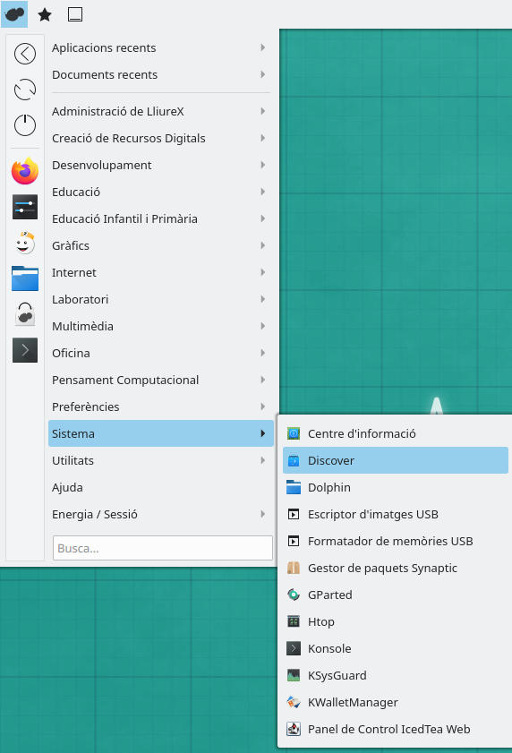{ width=300px }

La interfaz del Discover es un poquito más sencilla que la del Synaptic, y en ella podemos distinguir:

* Una **barra de busca** para introducir directamente el nombre o parte de la descripción para buscar una aplicación,
* Un **buscador de aplicaciones**, organizadas por categorías, donde también se nos permite buscar ***complementos de aplicaciones***, como puedan ser paquetes de personalización o temática de aplicaciones, o bien ***Complementos de Plasma***, como puedan ser nuevos enseres, temas, etc.

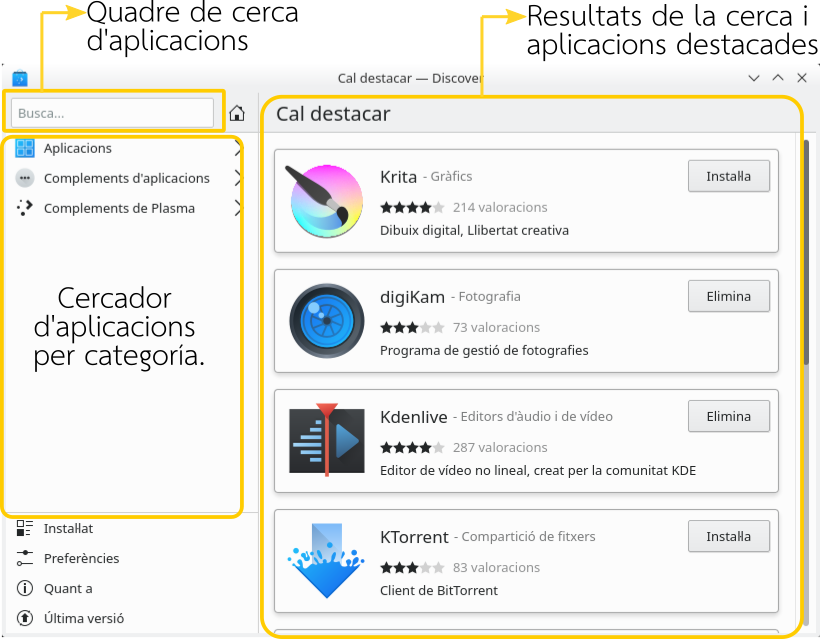{ width=400px }

Tengamos en cuenta que el Discover tiene acceso a los repositorios catalogados por el propio *Plasma*. Si buscamos, por ejemplo, *Casimir* en la barra de busca, veremos que ahora no nos encuentra la aplicación, puesto que esta no está catalogada por KDE.

Con el Discover, una vez hemos encontrado la aplicación que quemos, solo habrá que hacer clic en el botón *Instalar* para descargarla e instalarla en nuestro equipo.

### LliureX Store

La LliureX Store facilita la instalación de aplicaciones de diferentes orígenes y formatos (*.deb*, *Snap*, *Appimage*)

Para acceder a la LliureX Store lo haremos a través del Menú de *Inicio*, bien a través del acceso directo de la barra de favoritos de la izquierda, o bien a través del *submenú Administración de LliureX* > *LliureX Store*:

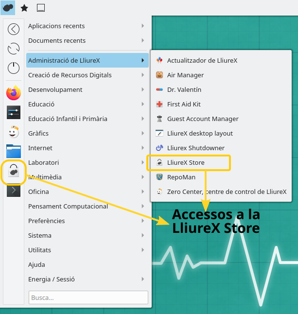{ width=300px }

En el siguiente gráfico vemos las diferentes vistas que se nos pueden presentar a la LliureX Store:

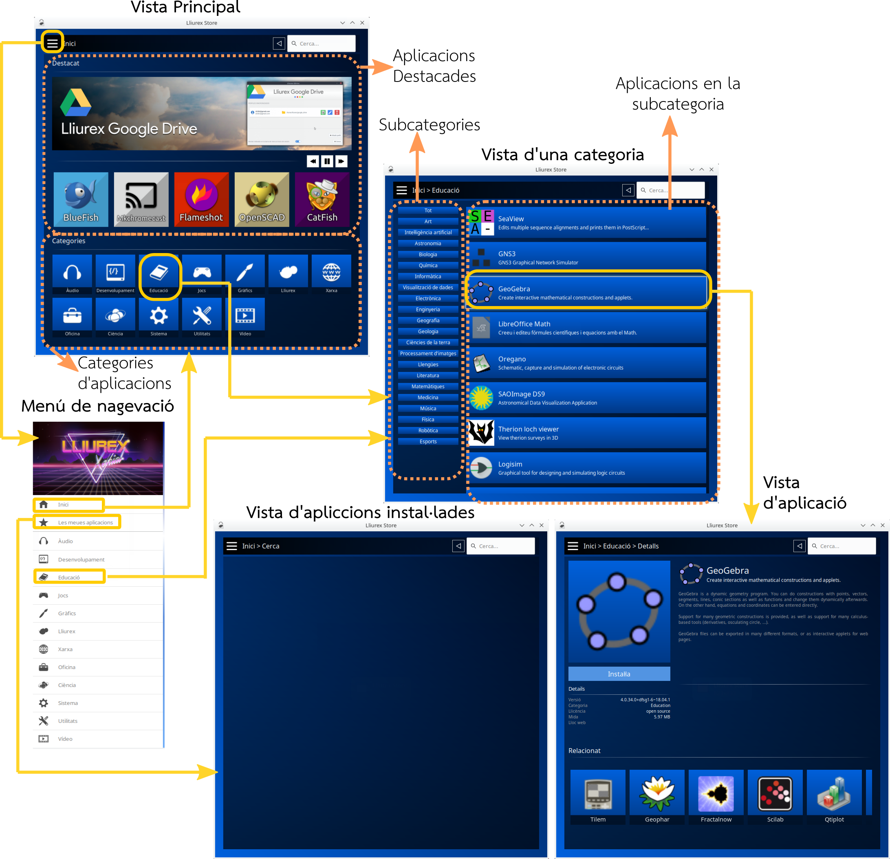{ width=500px }

* Disponemos de una **Vista Principal**, donde se nos muestra:

  * Una barra superior con el *menú desplegable de navegación*, y un cuadro para buscar aplicaciones, 
  * Una sección de **aplicaciones destacadas**, 
  * Una sección con las diferentes **Categorías** en que se encuentra organizado el software.

* Si hacemos clic al desplegable del **Menú de navegación**, se nos mostrará este menú, con accesos a la *Vista de Inicio*, por si estamos en otra ventana, a *Nuestras aplicaciones*, con las aplicaciones instaladas al sistema, y una lista con las *Categorías de software*, equivaliendo a las que nos aparecen a la vista principal.
* Cuando hacemos clic con el ratón sobre una categoría, tanto desde el *Menú de Navegación* como desde la vista principal, accederemos a la **Vista de la Categoría** en cuestión, la cual nos mostrará:
  * Un menú a la izquierda con las subcategorías, y
  * Una lista de aplicaciones correspondientes a la categoría.

* Cuando hacemos clic en una aplicación, se nos abrirá una *Vista de aplicación*, con una descripción de esta (a menudo en inglés), y los detalles de la instalación (versión, categoría, licencia y medida), así como, a la parte inferior una lista de aplicaciones relacionadas con ella. También veremos un botón para instalar la aplicación, previa autenticación como administradores. En caso de que se trate de una aplicación ya instalada se nos dará la opción de abrir la aplicación o desinstalarla.
 
En el apartado final *Más Información* disponéis de enlaces a la wiki con más detalles sobre la *LliureX *Store.

### Software en el zero-center

La aplicación zero-center es una herramienta qué nos permite configurar ciertos aspectos de LliureX, respecto a su configuración y funcionalidad. Se trata de una herramienta muy potente y con muchas funcionalidades, pero ahora nos centraremos solo en la posibilidad de instalación de software y recursos.

Para acceder al zero-center, podemos hacerlo a través del menú de inicio, tanto desde su acceso directo a la barra de *Favoritos* como desde el submenú *Administración de LliureX* > *zero-center*, centro de control de LliureX:

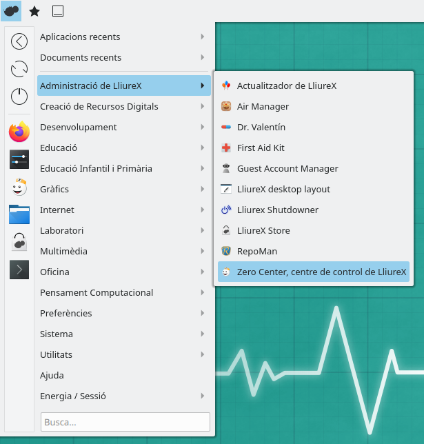{ width=300px }

Existen ciertas aplicaciones, que no se distribuyen de forma estándar, o que no se encuentran en ningún *repositorio* o *depósito de software*, sino que hay que acceder a su web y descargarla, o que requieren realizar ciertas adaptaciones del sistema para que funcionen correctamente.

De entre las diferentes categorías (Sistema, Configuración, Apoyo, Software, Internet y Recursos), la que nos interesa hoy por hoy es la de *Software*.

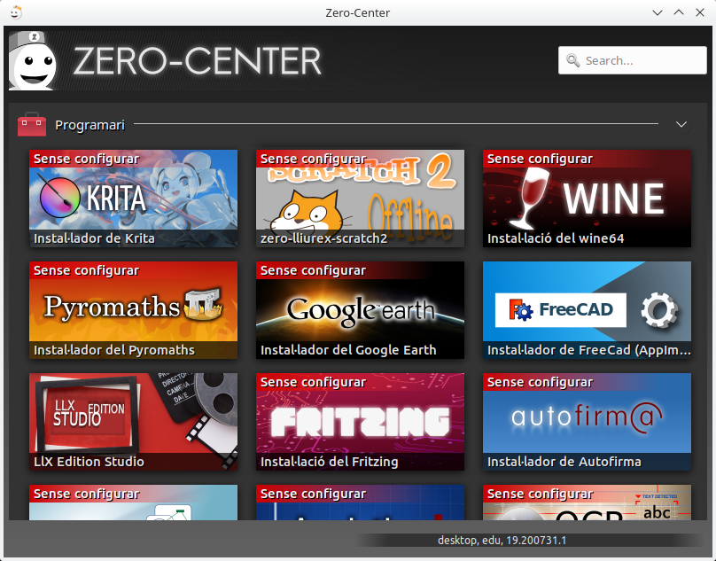{ width=400px }

En él podremos ver las diversas aplicaciones que es capaz de instalar. Entre ellas podemos encontrar aplicaciones como el instalador de Adobe Flash, Google Earth, o la que utilizaremos en unidades posteriores, la *AraSuite*.

Si nos fijamos, encima del *banner* de cada aplicación aparece un indicador diciendo si la aplicación está instalada (configurado) o no lo está (Sin configurar). Cuando pasamos el ratón por sobre cada aplicación, vemos también una breve descripción de esta:

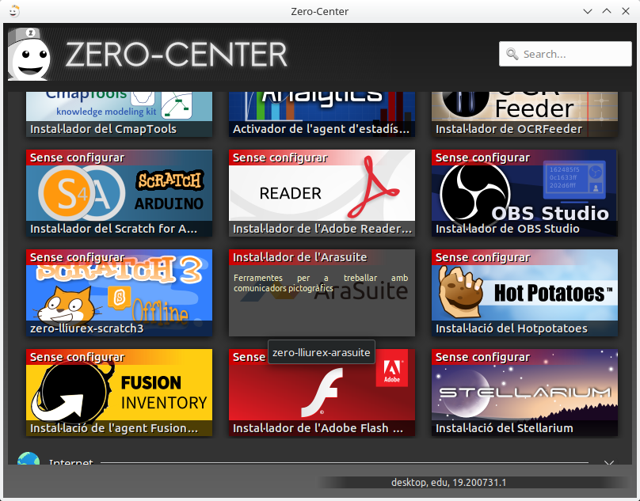{ width=400px }

Si queremos instalarla, solo habrá que hacer clic para abrir el instalador EPI (*Easy Package Installer*) que se encargará de la instalación:

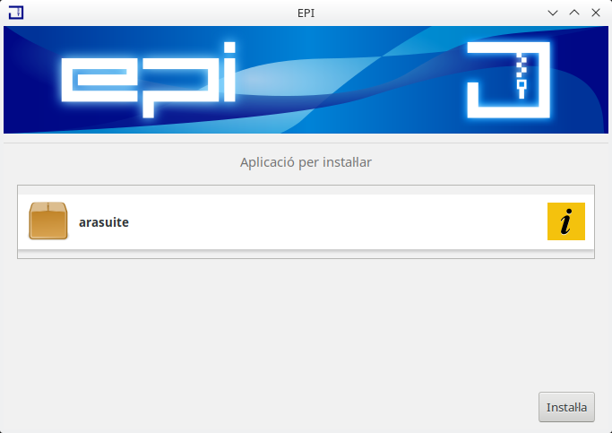{ width=300px }

### Gestión de los repositorios de APT: Repoman

Finalmente, vamos a ver la herramienta *Repoman* (**Repository Manager**). Esta no es una herramienta para instalar paquetes, sino para gestionar los diferentes repositorios o depósitos de software configurados a nuestro ordenador.

En nuestro sistema, podemos tener tantos repositorios configurados cómo deseamos. De manera predeterminada, en LliureX solo tendremos configurados los depósitos de software de LliureX, pero podemos configurar todos los qué deseamos.

Para acceder a la herramienta, lo hacemos a través del menú de *Inicio* > *Administración de LliureX* > *RepoMan*, o directamente buscándolo en la barra de busca del menú de inicio.

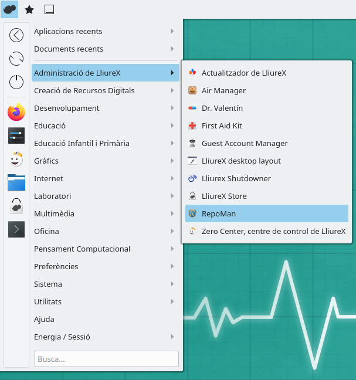{ width=300px }

La primera pantalla que nos muestra la herramienta es la de **Opciones**, con enlaces a las diferentes secciones, las cuales también se nos muestran al cuadro de la izquierda. Las diferentes opciones disponibles que tenemos son:

* Gestionar los **repositorios por defecto**, donde podremos:
  * Activar o desactivar los ***repositorios de LliureX desde Internet*** (de manera predeterminada en la versión de escritorio están activados)
  * Activar o desactivar los ***repositorios de LliureX desde uno Mirror*** o Réplica del centro. Si trabajamos en un modelo de centro y disponemos de una réplica de los repositorios de LliureX al servidor, esta sería la opción más adecuada.
  * Activar o desactivar los ***repositorios de Ubuntu***. De manera predeterminada están desactivados, y podemos activarlos si necesitamos software de Ubuntu que no esté a LliureX. **En caso de que un paquete esté tanto en los repositorios de Ubuntu como a los de LliureX, tendrá preferencia lo del repositorio de LliureX, aunque haya una versión más actualizada a Ubuntu.**

* **Gestionar repositorios personalizados**, donde podremos configurar otros repositorios externos en LliureX y en Ubuntu. Para añadir un nuevo repositorio haremos clic en el botón que hay encima del recuadro de los repositorios, y añadimos su dirección web, junto con el nombre y una descripción. En principio, no tendremos que añadir ningún repositorio externo, puesto que las aplicaciones con que trabajaremos se encuentran en los repositorios por defecto. De todas maneras, si lo necesitamos en algún momento, explicaríamos en detalle cómo hacerlo.

* **Herramientas del sistema**, desde donde podremos actualizar las listas de software, lanzar el actualizador LliureX Up o LliureX Store.

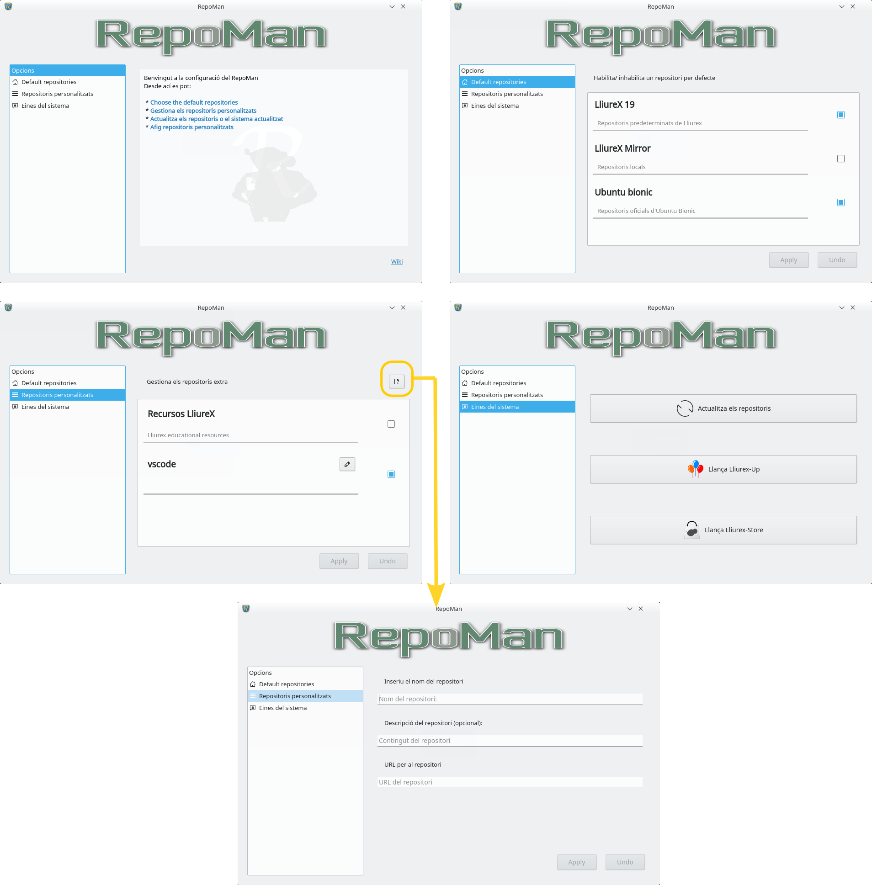{ width=500px }

### Más información

Cómo hemos comentado al principio, la Wiki es la mejor fuente de información que podemos encontrarnos sobre LliureX. Respecto a la instalación de software que hemos visto en este apartado, podéis consultar los siguientes artículos, que a pesar de basarse en versiones previas de LliureX, nos pueden ser de gran utilidad.

* [Busca y gestión de programas](https://wiki.edu.gva.es/lliurex/tiki-index.php?page=cerca%*2Bi%*2Bgesti%25C3%25B3%*2Bde%*2Bprogrames), para LliureX 15.05, pero totalmente válida la parte de Synaptic y la herramienta `apt` de línea de órdenes.
* [Gestión de Repositorios](https://wiki.edu.gva.es/lliurex/tiki-index.php?page=repoman).
* [Guía de LliureX Store](https://wiki.edu.gva.es/lliurex/tiki-index.php?page=lliurex%*2BStore_va&*highlight=*lliurex%*20store), para la versión 16.
* [Videotutorial de la LliureX Store](https://wiki.edu.gva.es/lliurex/tiki-index.php?page=lliurex+*Store_va+*videoguia&*highlight=*lliurex+*store), para LliureX 16.
* [Aplicaciones AppImage LliureX](https://wiki.edu.gva.es/lliurex/tiki-index.php?page=aplicacions-appimage-al-lliurex&highlight=lliurex+*store)
* [Zero Center](https://wiki.edu.gva.es/lliurex/tiki-index.php?page=zero%*2Bcenter_va&*highlight=cero%*20center)